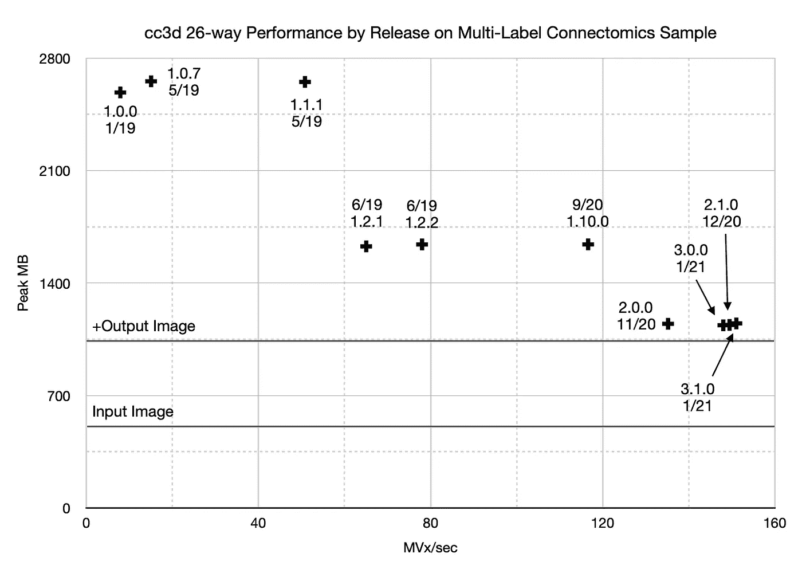
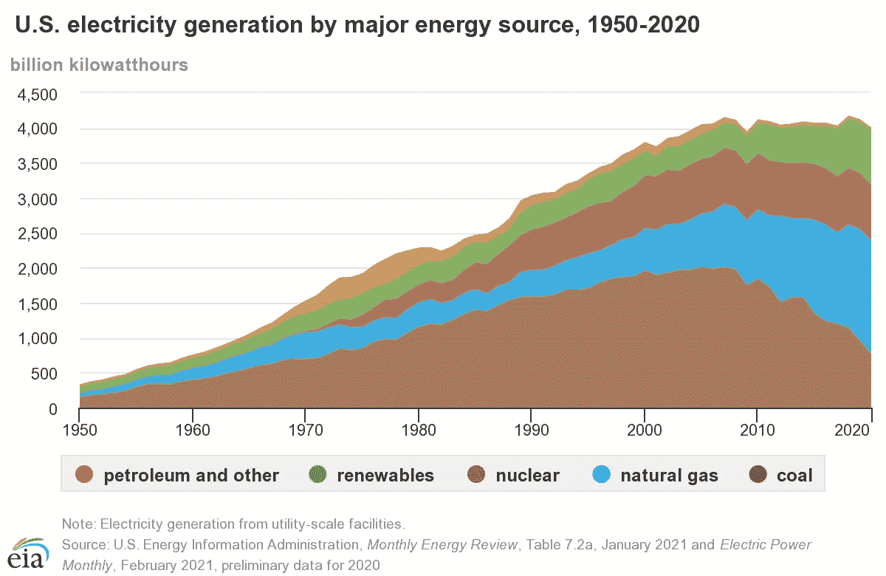

# 高性能代码带来回报

> 原文：<https://towardsdatascience.com/high-performance-code-pays-dividends-ce97768b5fa5?source=collection_archive---------29----------------------->

## 快速代码变得更快，成本变得更低，创造力被释放，自由之声响起。

我花了几年时间开发的 [connected components](https://github.com/seung-lab/connected-components-3d/) 库的性能随着版本和月份/年份的增加而增加。横轴是每秒数百万个 3d 像素(“体素”)。纵轴是测量的 RAM 使用峰值。有更快的算法可用，但据我所知，不是用于 3D 多标签图像。许可证:图片由作者提供

在公共领域，如果不是在每一扇紧闭的门后，软件社区会用 Donald Knuth 的一句无处不在且被误解的名言“过早优化是万恶之源”来阻止任何关注性能的建议虽然我和 Knuth 一样不喜欢投机性的微优化，但是对软件性能的认真关注带来了巨大的好处，并且受到反馈循环的影响，可以在几个层面上从根本上改进项目。

我自己的经验是在 3D 图像处理领域积累的，那里的数据非常大。一个典型的输入图像是一个 512 [体素](https://en.wikipedia.org/wiki/Voxel)无符号 64 位图像剪切块(~1 GB RAM)，它是一个更大的图像的一部分，该图像可以由成千上万的这些任务组成。如果不仔细关注每个算法的设计，单个任务的运行时间可能会长达几个小时，同时 RAM 的使用也会激增。

在高性能计算方面，肯定有比我更有经验的工程师。然而，在过去的几年里，我对加速和减少内存压力的好处有了一些小小的见解。也许你会发现它们很有用。

**阿姆达尔定律反面的正反馈**

用英语解释，阿姆达尔定律(Amdahl ' s Law)说，加速一段代码最多可以提高代码开始所用时间比例的整体速度。换句话说，如果一个程序在段 A 中花费 50%的时间，在段 B 中花费 50%的时间，段 B 的 100%加速将导致最多 2 倍的总运行时间改进，因为段 A 没有被改变。Amdahl 定律通常是关于串行和并行组件的代码并行化，但它同样适用于没有完全改进的单线程代码。

当我第一次遇到阿姆达尔定律时，它有点悲观。无论给定代码段的解决方案多么巧妙，它的最终潜力都受到周围一切的限制。在花时间改进算法并与剖析器一起迭代工作之后，我修改了这个视图。

一个领域的加速使得代码其他部分的加速更有价值。用前面的例子来说，如果 A 部分占用了 50%的时间，那么在这个等式的任何一边，我所做的任何改进最多是两倍。如果我将 A 部分的性能提高一倍，它现在占用了总时间的 33%。这意味着 B 段的贡献从 50%增加到 66%。如果我把 A 段加速 4 倍，B 段的贡献是 80%。这放大了程序其余部分的额外优化的效果，并使以前看似微不足道的贡献者突然值得攻击。

换句话说，你越是从根本上提高目标部门的绩效，潜在的新目标领域就变得越丰富。如果您仅将性能提高 2 倍而不是 10 倍，您的目标区域将继续掩盖其他贡献者。随着您改进的代码继续成为瓶颈，您提高性能的选择将显得更加混乱。

**你成为一名更好的工程师**

在高性能领域，算法知识和对系统的复杂理解变得至关重要。虽然日常工程的内容是让事物工作，但解决执行时间、内存容量或资源争用等物理问题迫使人们对基础科学原理进行更系统和实用的研究。

在工程学中，当你开始在你的工具和材料所能承受的极限范围内工作时，数学是非常有用的。当建造一个典型的乐高塔时，人们不需要知道塑料砖的弹性模量或拉伸强度，因为它们比施加的力要大得多。然而，如果你试图用它们建造一个可居住的结构，你需要更多地了解它们的属性和环境相互作用。

计算也是如此。当内存和计算负载开始达到物理极限或与系统的其他元素相互作用时，就需要进行规划和系统分析。这时，你不得不考虑文献，计算最坏情况下的负载，并调整算法。此外，如果你足够深入地研究一个问题，你可能会发现它的一些新的共性，并成为一名科学家。

高性能计算(HPC)远远不是提高技能的唯一主题领域。例如，自然语言处理、搜索、运动规划和计算机视觉与性能只有很小的关系。然而，HPC 对于实践中的工程师来说是非常容易理解的，它的含义涉及到每个项目。

**释放创造力，避免问题**

每个程序在开发者耐心、用户耐心、精力和成本方面都有隐含的时间预算。对于开发人员来说，更快的代码允许对周围的设计进行更快速的迭代。对最终用户来说，程序的等待时间减少了，因此程序有机会过渡到他们意愿的自然而灵活的扩展。

更高的效率还能增加原本难以想象的功能。如果一个库只改进到满足当前性能标准的程度，而不是更多，那么一旦问题发生变化，添加特性就变得很麻烦。性能曲线的任何显著下降都会立即将运行状态变为黄色或红色。尤其是在科学或其他开创性工作中，成功的第一种方法将让位于对更复杂方法的渴望。这些复杂的方法可能需要额外的空间来适应。

例如，我致力于改进大规模骨骼化，这是一种从神经元的 3D 标记图像中提取简笔画的方法。我估计，一个早期但严肃的尝试将需要在我们最大的数据集上租用大约 50 万美元的计算时间。经过大约两年断断续续地解决这个问题，纯粹基于改进的软件，成本降低到不到 1000 美元。这使得我们可以在任何时候运行这个算法，反复修正错误，并提高质量，而不会产生重大后果。

我在编写[连通分量 3d](https://github.com/seung-lab/connected-components-3d/) 算法时也有类似的经历，该算法比最常见的 3d 版本快[许多倍。突然间，人们可以愉快而轻松地使用这种算法，而不用仔细规划每个应用程序。开发者迭代速度提高。](https://github.com/seung-lab/connected-components-3d/tree/master/benchmarks)

从另一个角度来看，性能代码只是避免了问题。避免问题意味着计划没有障碍，没有会议，没有资源转移，并且可能在组织环境中减少压力。不幸的是，证明问题被避免比问题被解决更难。尽管如此，你可以表明你的解决方案明显优于一个可比较的解决方案，或者如果不是对所述代码相当有效，所选择的方法是不可能的。

**减少物理磨损**

虽然软件通常被认为是抽象的系统或数学对象，但它也是运行在物理系统上的电流的主动过程。有时，软件也操作简单的机械设备或引导复杂的机器人。

当考虑物理世界时，有效的软件可以被认为是最小化能量消耗的软件。在纯计算系统中，这通常意味着减少 CPU 或 GPU 的电力消耗。节能计算可以减少计算机组件的物理降级热循环，并减少移动设备的电池消耗。对于电池供电的设备，低功耗代码更好。通过首先减少电池的消耗，不仅延长了电池的当前充电时间，而且每次充电的运行时间的增加降低了电池的循环速率，增加了组件的总寿命。类似的论点也适用于闪存硬盘的写入耐久性和总存储容量。更少的书写意味着更大的空间和更长的耐力。

在机械领域，选择最短路线的软件(其他条件相同)可以降低燃料成本和机械零件的磨损。一个简单的例子是路线图，其中更短或更快的路线可以通过减少每次旅行的里程来减少燃料消耗并延长汽车的寿命，同时还使乘客平均更快乐(只要他们没有试图享受风景优美的路线或在目的地推迟一些可怕的遭遇)。

**适应狭小的空间**

某些优化，比如 [SIMD 内部函数](http://const.me/articles/simd/simd.pdf)并不总是可移植的。当我假设英特尔 x86_64 将永远占据主导地位，并在第二年购买了一台 ARM64 笔记本电脑时，我发现了这一点。然而，使用可移植方法编写的具有良好性能的库代码可以容纳比您所能预见的更多的空间。

如果你的代码有合理的内存效率，它可以适合一个嵌入式设备。然而，根据我的经验，更常见的情况是，当我的设计标准是数百兆像素时，我看到有人编写 Github 问题来解决在超过 10 千兆像素的巨大图像上运行我的库的问题。通常，我们可以让它工作(例如通过支持 64 位内存寻址)，然后我再也没有听到任何人的消息，因为现在它已经工作了。如果代码的单线程性能一开始就太慢，那么扩展到这样的规模会很痛苦。

另一方面，高性能代码也避免了基础设施灌注。在某一点上，一台机器有一个物理限制，即它可以处理多少请求，可以处理多少数量，可以存储多少数据。然而，这些限制通常有些灵活，因为工程师可以调整每个操作所需的工作量，并根据空间或时间进行权衡。

高效的代码减缓了机器的垂直增长需求(垂直意味着更多的 RAM、CPU、SSD、更快的网卡)，同时也减缓了水平增长(意味着更多的机器)。纵向增长成本高昂，并且不会永远扩展。水平增长的规模很大，但在许多不同的层面上很复杂。运营商希望保持最新的部署，避免机器遇到资源争用、构建数据中心的物理挑战(如布线、冷却和移动重物)以及相关的难题。臭名昭著的是，[SEC 描述了](https://www.sec.gov/litigation/admin/2013/34-70694.pdf)Knight Capital 未能正确更新所有机器是如何导致 2012 年股市闪电崩盘的。

虽然 Knight Capital 可能将他们的机器推到了极限，他们的问题更多地是沿着变更控制的路线，但是如果您的代码可以推动极限，您将在硬件上花费更少的钱，并且可能在协调由此产生的更少的机器方面有更少的问题。管理 1 台、2 台、20 台、200 台和 2000 台服务器的难度相差很大。当然，像 Knight 一样，无论每个组件的速度有多快，您仍然会遇到设计应用程序中不同服务之间的接口的问题。

**表演是解放**

高效的工具更简单，因为它们增加了单机计算的操作范围。一个有效的算法可以将一个程序从一个大型集群移动到一个较小的集群，或者从一个较小的集群移动到一台笔记本电脑。

如果程序是为商用硬件设计的，这可不是小事。厄普顿·辛克莱在《[史诗十二原则(结束加州贫困)](https://depts.washington.edu/epic34/docs/I_governor_1934.pdf)》中写道:“工具私有制，当工具简单时是自由的基础，当工具复杂时就成了奴役的基础。”

计算机是一个强大的计算引擎，是一种通常为个人所有的生产手段。由于需要其他人的设备和代码，变得过于复杂的计算成为其他人对你施加影响的一种方式。例如，如果您需要数百 GB 的 RAM、一个奇特的 GPU 或几十个 CPU 内核，突然之间您需要与一位实业家签订合同来完成这项工作。计算工作越大，关于该任务的决策(是否做、何时做、如何做以及成本如何)就越取决于那些拥有设备、资金、关系和劳动力资源来实现它的人的意愿。

高效的代码将更多的决策权放在个人和不太富裕的人群手中，这些人的动机可能与公司简单的积累动机不同。自由的一个方面是做出决定的能力，这种决定会对你的生活产生积极的影响。虽然软件性能远远不是这些事情的唯一决定因素，但与支持开源和自由软件许可的观点相比，它被忽略了，因为开源和自由软件许可让最终用户可以选择审计或更改软件。高性能的软件使得以你想要的方式运行你的代码成为可能。

在我的神经影像领域，我之前提到的简笔画骨架是分析中的一个基本结构。如果在有用的大型数据集上大量创建它们需要数万到数十万美元的成本，并且需要云合同，那么这项任务将被限制在资金最充足、人脉最广的玩家身上。即使是仁慈的科学家也只有有限的时间、注意力和金钱来帮助他人。通过将成本降低两到三个数量级，突然之间更小的实验室、研究生和好奇的局外人都可以自己完成。

环境影响呢？

气候危机在很大程度上威胁着人类文明，而电力经常由化石燃料产生。然后，电力被计算机代码的运行所消耗。根据其 [2020 年环境报告](https://www.gstatic.com/gumdrop/sustainability/google-2020-environmental-report.pdf)，仅谷歌一家在 2019 年就使用了 12.8 太拉瓦时，超过许多国家和[超过几个美国州](https://www.forbes.com/sites/robertbryce/2020/10/21/googles-dominance-is-fueled-by-zambia-size-amounts-of-electricity/?sh=7689ac9768c9)。提高代码效率应该会减少对环境的影响，这似乎很直观。是吗？

答案一点也不清楚，必须逐个系统地考虑。主要原因是诱导需求。

诱导需求甚至不是一个偶然的副作用。我们提高软件效率的一个主要原因是为了让它更适合在更多的环境中更频繁地运行。如果你把一个图书馆的速度提高了 10 倍，但它的运行频率却提高了 1000 倍，从环境的角度来看，你真的有所收获吗？如果代码提高了 100 倍，但运行频率只有 10 倍，这就是胜利。诱发需求与改善绩效的比率必须小于 1，才能对环境有利。有时，快速代码会使下游代码运行得更加奢侈，在这种情况下，即使是极低的比率也可能不会带来好处。

工程师和科学家应该设计出能够在大工业规模上运行的程序，以避免不必要的过度。然而，只要组织还在生存和发展，他们就会想方设法用尽空闲的数据中心容量，这是组织的本性。如果所有团队都编写高性能代码，它将调整增长轨迹，但我怀疑它通常不会走向萎缩。

因此，关于购买能力和消费者基础的规模和胃口的决定是环境影响的更强驱动力。如果只有有限的能力可用，一些代码将被改进，一些计划将被搁置，而其他的将被缩减。换句话说，总能耗不会受到单个工程师的强烈影响，除非在特殊情况下，例如在移动或嵌入式设备中频繁运行的程序。

尽管如此，如果使用的能源是 100%可再生的，我们应该担心吗？一些大公司如谷歌声称他们已经过渡到 100%的可再生能源，或者承诺这样做，如 T2 微软 T3。有趣的是，两者都承诺最终会变成负碳排放，大概是通过购买碳抵消。

缩小来看，美国整体能源生产的组合在几年或几十年内变化缓慢。有一些方法可以做到真正的绿色环保，比如开发一个闲置的资源，比如一个与电网断开或利用不足的水电站。另一种方法是在不干扰其他建设的情况下建设新的发电设施(例如，通过用尽有限的部件或劳动力)。不过，总的来说，馅饼在某一年是合理固定的。因此，在缺乏这些因素的情况下，任何声称运行可再生能源大型工业流程的组织都只是重新分配一块缓慢变化的馅饼，并迫使其他市场参与者使用肮脏的能源。

在下面由[美国能源信息署](https://www.eia.gov/energyexplained/electricity/electricity-in-the-us-generation-capacity-and-sales.php)提供的图表中，美国的能源结构变化非常缓慢，主要变化发生在大约十年的时间里。最大的变化是在过去十年里，天然气相对快速地取代了煤炭。从 2007 年开始，总发电量在稳定增长了至少 60 年后基本趋于平稳。可再生能源和核能在目前的组合中约占 40%，天然气约占 40%，煤+汽油约占 20%。

许可:美国政府出版物，公共领域

在某种程度上，购买可再生能源确实刺激了额外的可再生能源市场。然而，公司可以开始声称他们正在使用可再生能源的事实可能更证明了一个真正乐观的消息，即大量新的可再生能源发电即将上线。个别组织声称使用 100%可再生能源，主要是为了让员工、供应商、投资者和客户对他们所做的事情感觉良好，而没有看到更大的画面。

消费者的选择，甚至是企业的选择，在改善我们命运的能力上是有限的。我认为，要解决气候问题，需要在国家和国际层面开展一个集中协调的进程，将能源分配给不同的工业和消费部门，并代表整个社会管理能源生产组合。只有这样，我们才能用一种不依赖运气的理性方式来解决这个问题。

公平地说，软件公司不是电力公司，期望他们建立自己的一代有点可笑。我们能从他们那里得到的更多的期望是[支付](https://www.irishtimes.com/business/technology/google-used-double-irish-to-shift-75-4bn-in-profits-out-of-ireland-1.4540519) [税收](https://www.seattletimes.com/business/microsoft/how-microsoft-parks-profits-offshore-to-pare-its-tax-bill/)，[从持有证券的化石燃料公司中撤资](https://www.eenews.net/stories/1063535789)，并在社会尽快改变能源结构的同时，将他们的总能耗控制在监管机构设定的上限之下。

高性能代码带来的好处是相当可观的，无论是对开发它的人还是对使用和适应它的人来说都是如此。与直觉相反，开发高效的代码并不总是对环境有益，所以如果没有仔细的上下文相关的推理和测量，环境保护论就不应该被用作一个理由。