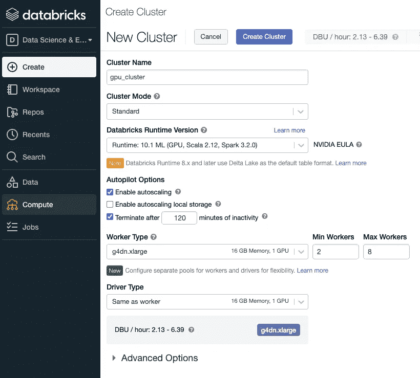
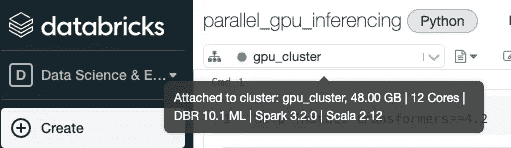
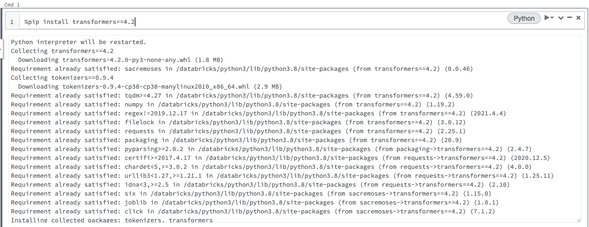
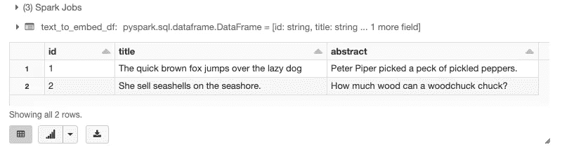
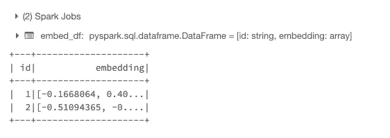

# Spark 上变压器模型的高性能推理

> 原文：<https://towardsdatascience.com/high-performance-inferencing-with-large-transformer-models-on-spark-beb82e71ecc9?source=collection_archive---------14----------------------->

## 使用 PySpark、Hugging Face 和 AWS GPU 实例的代码教程

想要通过拥抱脸或 Tensorflow 模型实现高达 100 倍的速度提升并节省 50%的成本吗？借助 GPU 实例和 Spark，我们可以同时在两个或数百个 GPU 上运行推理，从而毫不费力地获得更高的性能。


作者使用 Canva 的[许可内容制作的图片](https://www.canva.com/policies/enterprise-ssa/)

# 概观

*   设置驱动程序和工作实例
*   为并行化对数据进行分区
*   使用变压器模型进行推理
*   讨论

# 设置驱动程序和工作实例

对于本教程，我们将使用[数据块](https://databricks.com/)，如果你还没有一个[免费账户](https://databricks.com/try-databricks)，你可以注册一个。请注意，DataBricks 将需要连接到云托管提供商，如 [AWS](https://aws.amazon.com/) 、[谷歌云平台](https://cloud.google.com/)或[微软 Azure](https://azure.microsoft.com) 来运行 GPU 实例。

在本练习中，我们将使用" [g4dn.large](https://aws.amazon.com/ec2/instance-types/g4/) "类型的 AWS GPU 实例。如果您使用 Google Cloud 或 Microsoft Azure，并且从它们中选择了等效的 GPU 实例，您仍然可以遵循这些说明。

一旦您的 DataBricks 帐户设置完毕，登录并[创建一个集群](https://docs.databricks.com/getting-started/quick-start.html#step-2-create-a-cluster)，配置如下所示:



配置一个虚拟命名为“gpu_cluster”的 GPU 集群

接下来，[创建一个笔记本](https://docs.databricks.com/getting-started/quick-start.html#step-3-create-a-notebook)，通过在下拉菜单中选择它将其附加到集群:



设置笔记本的群集

现在，我们都开始编码了。

## 安装拥抱脸变压器

<https://huggingface.co/>  

首先，让我们将[支撑面](https://huggingface.co/)变压器安装到组合仪表上。

在笔记本的第一个单元格中运行:

```
%pip install transformers==4.2
```



拥抱脸变形金刚 Python 库安装在集群上

这样安装的库被称为[笔记本范围的 Python 库](https://docs.databricks.com/libraries/notebooks-python-libraries.html)。这很方便，而且必须在会话开始时在其他代码之前运行，因为它会重置 Python 解释器。

现在，我们从实际的 Python 代码开始。在下一个单元格中，运行:

如果上面一行运行没有任何错误，恭喜你，拥抱脸变形金刚安装成功。

# 为并行化对数据进行分区

在 Spark 中，创建可并行处理的数据的最简单方法是创建 Spark [数据帧](https://spark.apache.org/docs/latest/sql-programming-guide.html)。对于本练习，包含两行数据的数据帧就足够了:



显示创建的火花数据帧。

本练习的 Transformer 模型每行接受两个文本输入。我们在这里把它们分别命名为“**标题**和“**摘要**”。

出于好奇，这里有一篇 Laurent Leturgez 的精彩文章，深入探讨了 Spark 分区策略:

<https://medium.com/datalex/on-spark-performance-and-partitioning-strategies-72992bbbf150>  

# 使用变压器模型进行推理

我们将为 PySpark 使用奇妙的[熊猫 UDF 来处理内存高效分区中的 Spark 数据帧。数据帧中的每个分区都作为 Pandas 数据帧呈现给我们的代码，您将在下面看到，作为函数" **embed_func** 的参数，它被称为" **df** "Pandas 数据框架使得用 Python 处理数据变得很方便。](https://databricks.com/blog/2017/10/30/introducing-vectorized-udfs-for-pyspark.html)

定义 **embed_func(df)** 的代码

您可能已经从上面的代码中注意到了两件事:

*   代码进一步将 Pandas 数据帧中的输入文本分割成 20 个块，如变量" **batch_size** 所定义的那样
*   我们使用 AllenAI 的[Spectre](https://huggingface.co/allenai/specter)—一个预训练的语言模型来生成文档的文档级嵌入([此处预打印](https://arxiv.org/pdf/2004.07180.pdf))。)请注意；然而，我们可以很容易地把它换成另一个[拥抱脸模型，比如伯特](https://huggingface.co/bert-base-uncased)。

## 绕开 GPU 内存限制

当 GPU 被用于对这个拥抱面部变形器模型进行推理时，输入和输出被存储在 GPU 存储器中。GPU 内存是有限的，尤其是大型变压器模型需要大量的 GPU 内存来存储其参数。这留下了相对较少的内存来保存输入和输出。

因此，我们通过一次推理 20 行来控制内存使用。这 20 行完成后，我们将输出复制到驻留在 CPU 内存中的 NumPy 数组(CPU 内存更丰富)。这是在上面第 21 行用“**”完成的。cpu()。分离()。numpy()** ”。

## 最后，在 GPU 上进行实际变压器模型推理

如上所述，这就是为 PySpark 处决[熊猫 UDF 的地方。在这种情况下，熊猫 UDF 就是“ **embed_func** 本身。请仔细阅读上面的链接，了解关于这个强大的 PySpark 特性的更多信息。](https://databricks.com/blog/2017/10/30/introducing-vectorized-udfs-for-pyspark.html)



这个练习的结果输出——Spectre 给出了文档嵌入的 768 长的浮点数组。

# 讨论

我希望您能看到 Spark、DataBricks 和 GPU 实例如何使大型 transformer 模型的扩展推理变得相对简单。

这里展示的技术使得对数百万行进行推理成为可能，并在几个小时内完成，而不是几天或几周。这使得在更多的情况下对大量数据运行大型变压器模型变得可行。

## 成本节约

但是等等，还有更多。尽管成本是 CPU 实例的 5 到 20 倍，但由 GPU 实例完成的推理实际上更具成本效益，因为它的速度快 30 到 100 倍。

> 因为我们是按小时付费的，所以在这里时间就是金钱。

## 花在管道上的时间更少

数据可以很容易地导入到 DataBricks 中，并保存为 AWS S3 桶上的拼花文件，或者更好的是，[数据湖](https://docs.databricks.com/delta/delta-intro.html)表(又名类固醇蜂箱表)。之后，它们可以作为 Spark 数据帧进行操作，正如本文所见，对于转换和推理来说，并行化是微不足道的。

所有数据、代码和计算都可以在一个地方“云上”访问和管理，更不用说它在本质上是可扩展的，因为数据从千兆字节增长到千兆字节，这使得这种简洁的解决方案更加“经得起未来考验”

## 无缝协作

作为基于云的解决方案，意味着随着团队的发展，我们可以向项目中添加更多的人员，以安全地访问笔记本电脑上的数据和代码。我们只需点击几下鼠标，就可以为报告创建图表并与其他团队共享。

请继续关注 Tensorflow 的这篇文章以及我计划的更多文章。如果你觉得这有帮助，*请跟随我*，我是一个新的作家，我需要你的帮助。如果你有任何想法和问题，一定要发表出来。