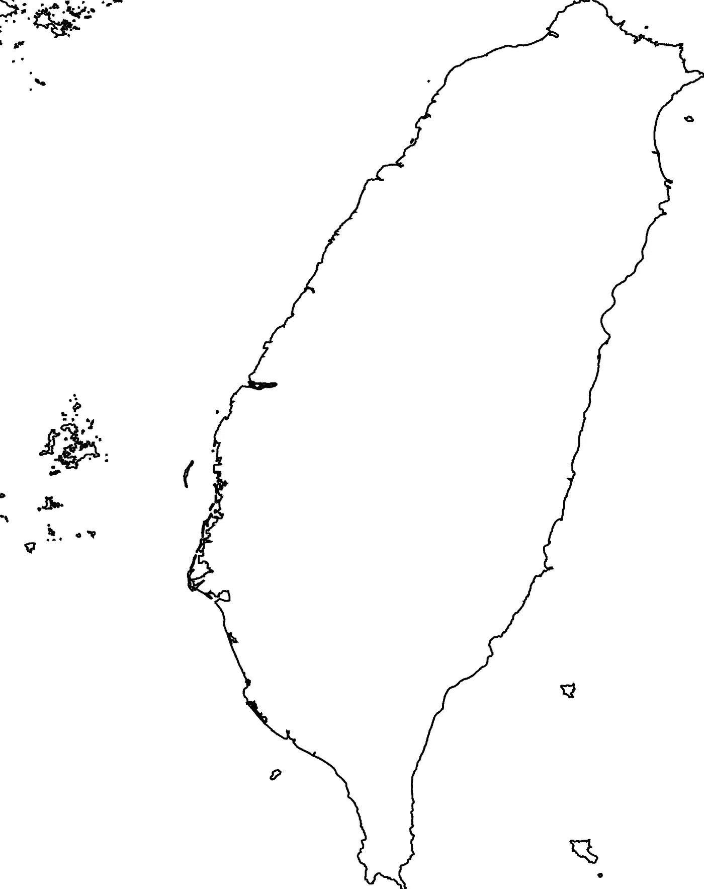
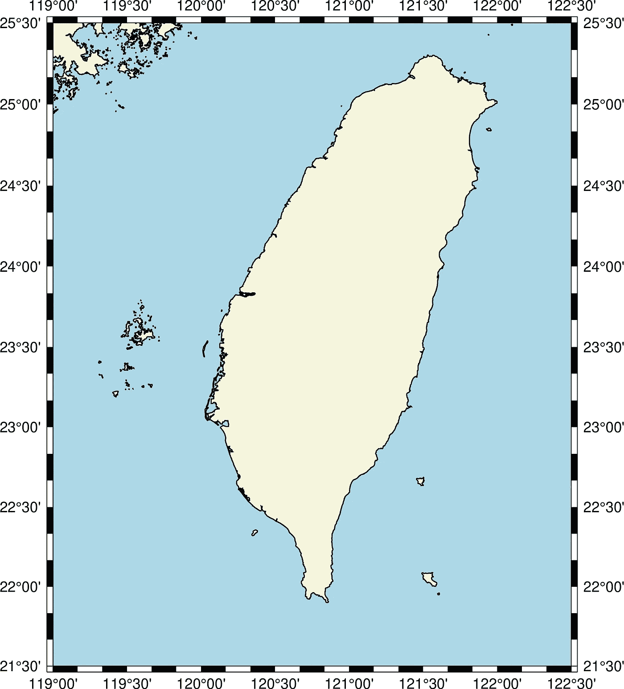
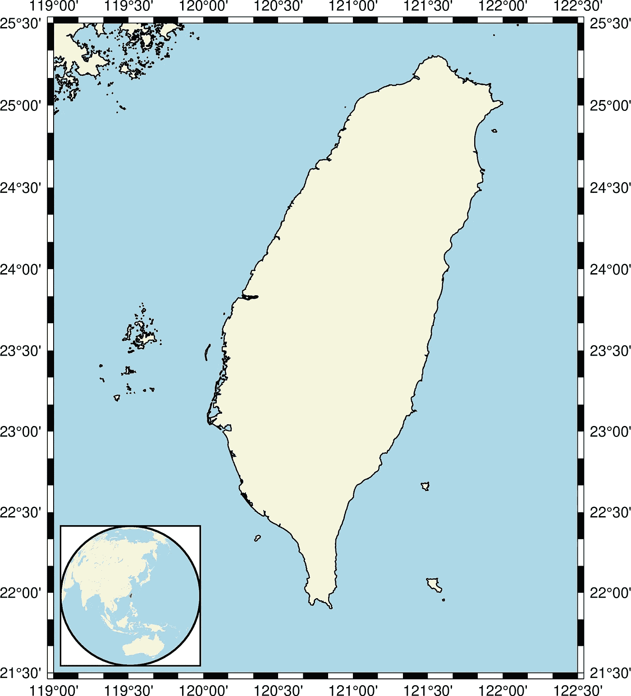
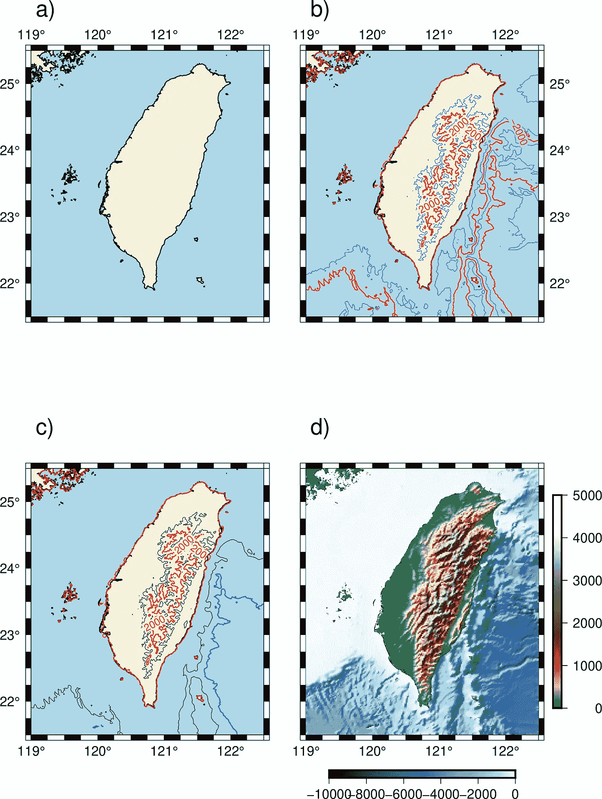

# 使用通用制图工具的现代界面制作高质量地图

> 原文：<https://towardsdatascience.com/high-quality-maps-using-the-modern-interface-to-the-generic-mapping-tools-a90a2969877f?source=collection_archive---------33----------------------->

毫无疑问，在地球物理学领域工作的最喜欢的部分之一就是创造惊人的可视化效果。可视化是将我们的发现有效传达给科学界的最佳工具。

GMT 或通用绘图工具已经成为绘制地球、海洋和行星科学地图的同义词。它可以用于处理数据，生成出版物质量的插图，自动化工作流程，甚至制作令人惊叹的动画。GMT 的另一个优点是，它支持许多地图投影和变换，并包括支持数据，如海岸线、河流和政治边界，以及可选的国家多边形。


在 [Unsplash](https://unsplash.com?utm_source=medium&utm_medium=referral) 上由[露丝](https://unsplash.com/@rrruthie?utm_source=medium&utm_medium=referral)拍摄的照片

我已经在多篇帖子中谈到了 GMT 5 以及如何使用它绘制高质量的地图。我还详细讨论了 GMT 6 的 Python 接口 PyGMT。侏儒在引擎盖下使用 GMT 6 完成所有任务。

 [## GMT 初学者教程

### 通用制图工具广泛应用于地球、行星和其他研究领域，以处理数据和…

www.earthinversion.com](https://www.earthinversion.com/utilities/GMT-tutorial-for-beginners/) 

在这篇文章中，我的目标是向你介绍使用 GMT 6 创建简单地图的基础知识，并让你熟悉语法。GMT 6 中的大多数风格几乎与 GMT 5 相同，除了编码语法有了显著的改进。它变得更有组织性，可以用更少的代码完成更多的工作。它增加了使用有意义的完整命令的选项，而不仅仅是别名。当我们用一些例子来讨论这个问题时，它会变得更加清楚。

[](https://www.earthinversion.com/utilities/GMT-advanced-II/) [## GMT 高级教程 II

### 对于基础教程，请访问这里。本教程由运行 GMT 的 Bash 脚本文件组成。数据文件…

www.earthinversion.com](https://www.earthinversion.com/utilities/GMT-advanced-II/) 

# 安装 GMT


照片由[西格蒙德](https://unsplash.com/@sigmund?utm_source=medium&utm_medium=referral)在 [Unsplash](https://unsplash.com?utm_source=medium&utm_medium=referral) 上拍摄

要安装 GMT，您可以遵循这里的步骤[安装所需的软件](https://www.earthinversion.com/utilities/High-quality-maps-using-the-modern-interface-to-the-Generic-Mapping-Tools/%5B%5D())。

我使用 Ubuntu(作为 Windows 子系统— WSL)，所以我可以简单地使用 conda 软件包管理器进行安装。参见[本](https://www.earthinversion.com/utilities/High-quality-maps-using-the-modern-interface-to-the-Generic-Mapping-Tools/%5B%5D())。对于任何 Linux 或 Unix 操作系统，步骤都是相似的。

我们的代码将被写入`bash`。我在这里假设你对`bash`有基本的了解。但是即使你对`bash`不太熟悉，你仍然可以跟着我做，因为我会试着让这个脚本“准备好生产”，这样你就不需要学习太多就可以完成本教程中的任务。

# 第一眼

GMT 6 的第一个不同之处是以下语法:

```
gmt begin [session-name] 
[graphics-formats] <LIST OF COMMANDS> 
gmt end [show]
```

上述语法仅适用于 GMT6，并且不向后兼容。因此，您不会意外地运行 GMT 版本< 6。GMT 时段以`gmt begin`开始，以`gmt end`结束。可选地，如果输出格式为`graphics-formats`，您可以提供将用于输出的会话名称。如果您不提供`session-name`或`graphics-formats`，那么将使用默认值。如果您在`gmt end`处选择了`show`，该图将不会被保存，而是仅被显示。

如果您想快速浏览文档，可以通过键入

这将打开本地 GMT 文件，所以你不需要互联网。

# 第一个情节

```
gmt begin taiwan pdf,png 
gmt coast -RTW -Wthin 
gmt end
```

上面的脚本绘制了一张台湾的海岸线地图，并以 pdf 和 png 格式保存。png 是光栅图像格式，期刊要求出版。如果你想要一个矢量图像，`pdf`给出了矢量格式。也支持其他矢量格式，如`ps`或`eps`等。



使用 GMT6 的台湾底图(图片由作者提供)

我们可以使用`-B`选项将默认框架添加到绘图中。我们可能还想将图形从框架边界偏移一点。我们可以通过简单地将`+r0.5`指定给`-RTW`来告诉 GMT 将台湾地图偏移`0.5`度来实现快速偏移。


使用 GMT6 的带框台湾底图(图片由作者提供)

我们可以通过简单地指定地图边界而不是使用`TW`作为区域来得到上面的图。这给了我们更多的绘图控制。

```
gmt begin taiwan pdf,png 
gmt coast -R119/122.5/21.5/25.5 -Wthin -B 
gmt end
```

在这里，您可能已经注意到，我们没有指定地图的任何投影。上面的图使用默认投影进行绘制。在科学中，出于大多数实际目的，我们使用墨卡托投影。要使用墨卡托投影，我们可以在`-JM`之前告诉 GMT 我们想要它，然后我们可以指定地图的宽度，`-JM15c`例如，对于 15 厘米的地图。

# 给土地和水填充颜色

接下来，我们可以填充一些颜色到地图上，使它更有吸引力。

```
gmt begin taiwan png 
gmt coast -R119/122.5/21.5/25.5 -Wthin -B -JM15c -Gbeige -Slightblue 
gmt end
```

我们用`-G`指定土地的颜色，用`-S`指定水彩。您可以在“获取颜色”列表中查找更多颜色。简单地运行命令`gmt docs gmt colors`。



带有陆地和海洋颜色的台湾底图(图片由作者提供)

# 地图的插图

现在，让我们试着在上面的图上画另一张地图作为插图。我想把插图放在地图的左上角，宽度为 4 厘米。在插图中，我想在世界地图上展示台湾。

```
gmt begin taiwan png 
gmt coast -R119/122.5/21.5/25.5 -Wthin -B -JM15c -Gbeige -Slightblue 
gmt inset begin -DjBL+w4c+o0.2c -M0 -F+gwhite+pthick 
    gmt coast -Rg -JG120.5/23.5/4c -Gbeige -Slightblue -B -ETW+gred 
gmt inset end 
gmt end
```

让我们看一下上面代码的每一部分。我们通过使用“上下文管理器”`gmt inset begin`开始插图，并在脚本的插图子部分结束插图。我们使用`-Dj`指定我们想要使用对齐方法来指定插入的位置，并将位置设置为“左下角”(`BL`)。我们想要宽度为 4 厘米、偏移量为 0.2 厘米的地图。此外，我们指定，我们不想要空白(`M0`)和框架的背景是白色的，框架边界与粗线。

我们用和以前一样的方法在插图中绘制海岸线地图。此外，我们告诉 GMT 用红色突出显示台湾(`-ETW+gred`)。



嵌入世界地图的台湾彩色地图(图片由作者提供)

# GMT 中的支线剧情

现在，让我们看看如何使用 GMT 来制作带有多个支线剧情的图形。

```
gmt begin subplotMap png 
gmt subplot begin 2x2 -Ff16c/25c -M0 -A 
    #figure a
    gmt coast -R119/122.5/21.5/25.5 -BNWse -Wthin -Gbeige -Slightblue #figure b 
    gmt coast -R119/122.5/21.5/25.5 -BswNE -Wthin -Gbeige -Slightblue -c 
    gmt grdcontour @earth_relief_01m -Wared -Wcthinnest,blue -C1000 -A2000 #figure c 
    gmt coast -R119/122.5/21.5/25.5 -BnWSe -Wthin -Gbeige -Slightblue -c 
    gmt grdcontour @earth_relief_01m -LP -Wared -C1000 -A2000 
gmt grdcontour @earth_relief_01m -Ln -Wablue -C2000 -A4000    #figure d 
    gmt coast -R119/122.5/21.5/25.5 -BSwne -Wthin -Gbeige -Slightblue -c 
    gmt makecpt -Cabyss -T-10000/0 gmt coast -Sc #clip out the land part 
    gmt grdimage @earth_relief_01m -C -I+d 
    gmt coast -Q 
    gmt colorbar -DJBC -B2000 
    gmt makecpt -Cgeo -T0/5000 
    gmt coast -Gc 
    gmt grdimage @earth_relief_01m -C -I+d 
    gmt coast -Q 
    gmt colorbar -DJRR -B1000 
    gmt subplot end 
gmt end
```



四人台湾支线剧情图。(a)台湾彩色底图(b)带等高线的台湾地图带等高线的台湾地图-陆地和海洋分别绘制(d)台湾地形图(图片由作者提供)

现在让我们看一下上面的脚本。

我用 4 个支线剧情(2 x 2)绘制了支线剧情。我可以通过简单地输入`2x2`来指定。每个子情节的尺寸由参数`-Ff16c/25c`指定。我们要求每个支线剧情宽 16 厘米，长 25 厘米。通过参数`-A`，我们要求 GMT 自动注释支线剧情。可以使用`-c`参数指定到下一个子情节的导航。

接下来，我在支线剧情里做了四个数字。

图(a)只是我们在上一节中所做的，但是这里我们只在顶部和左侧放置了刻度线。

在图(b)中，我们绘制了分辨率为 1m 的地形等高线。我们用红色绘制了带注释的等高线，用蓝色绘制了常规等高线。规则等高线以最细的线宽绘制。每隔 1000 米绘制一次等高线，每隔 2000 米进行一次标注。

在图中，我们分离了陆地和海洋部分的等高线。这可以简单地用参数`-L`后跟`P`或`N`来指定。`P`代表阳性，`N`代表阴性。大写字母包含 0，反之亦然。因此，我们用红色绘制了正的标注等高线，用蓝色绘制了负的标注等高线。

在图(d)中，我们用两个色带绘制地形图。对于该图，我们也从海岸线开始(注意，这不是必需的，您可以简单地跳到下一步)。然后我们基于`abyss`标准色图创建了我们的自定义色图，但是指定了`-10000`到`0`之间的范围。然后我们剪下陆地部分，并为海洋部分绘图。接下来，我们做了同样的事情，剪去了海的部分，我们用不同的颜色绘制了陆地的部分。最后，我们分别为陆地和海洋部分绘制色带，一个在`bottom-center`处，另一个在右角。

# 结论

人们可以用 GMT 做更多的事情。我会在以后的文章中尝试解决这个问题。更多 GMT 相关的例子，可以看看我博客里的其他帖子。我希望这篇教程能在你的努力中派上用场。

[](https://www.earthinversion.com/utilities/High-quality-maps-using-the-modern-interface-to-the-Generic-Mapping-Tools/) [## 使用通用制图工具的现代界面制作高质量地图

### GMT 或通用绘图工具已经成为绘制地球、海洋和行星科学地图的同义词。它可以…

www.earthinversion.com](https://www.earthinversion.com/utilities/High-quality-maps-using-the-modern-interface-to-the-Generic-Mapping-Tools/) 

# 参考

1.  [GMT 网站](https://www.generic-mapping-tools.org/about/)
2.  [2020 大地测量学通用制图工具(GMT)短期课程](https://www.earthinversion.com/utilities/High-quality-maps-using-the-modern-interface-to-the-Generic-Mapping-Tools/%5B%5D())
3.  [大地测量通用制图工具](https://www.earthinversion.com/utilities/High-quality-maps-using-the-modern-interface-to-the-Generic-Mapping-Tools/%5B%5D())

*原载于 2021 年 4 月 2 日*[*【https://www.earthinversion.com】*](https://www.earthinversion.com/utilities/High-quality-maps-using-the-modern-interface-to-the-Generic-Mapping-Tools/)*。*