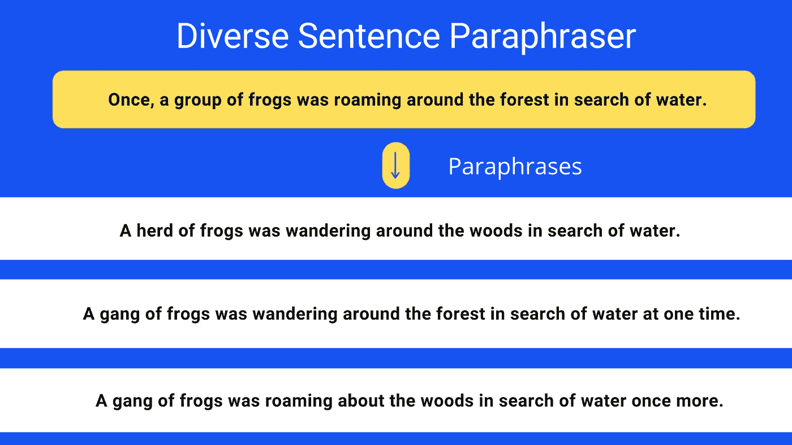

# 自然语言处理中使用变形器的高质量句子解释器

> 原文：<https://towardsdatascience.com/high-quality-sentence-paraphraser-using-transformers-in-nlp-c33f4482856f?source=collection_archive---------6----------------------->

## 在定制数据集和 T5 大型模型上训练的开源解释工具



作者图片

> 注意:这个解释器被训练来解释简短的英语句子，最适合这些输入。

## 投入

我们程序的输入将是任何英语句子

```
**Four private astronauts launched to orbit by Elon Musk’s SpaceX returned to Earth Saturday evening, splashing down into the ocean off the east coast of Florida after a three-day mission.**
```

## 输出

输出将是**转述**版本的同一句话。解释一个句子意味着，你创造一个新的句子，用一个不同的词语选择来表达与 T4 相同的意思。

```
**After a three-day mission, four private astronauts sent by Elon Musk's SpaceX returned to Earth on Saturday evening, splashing down into the ocean off the east coast of Florida.**
```

# 实际使用案例

从重写你以前的社交媒体文章到大学论文，当你没有很多文本分类模型的例子时，有几个解释器的用例。

# 资料组

作为构建 [Questgen.ai](https://questgen.ai/) 的一部分，我们创建了一个在 [ParaNMT](https://github.com/jwieting/para-nmt-50m) 之上过滤的自定义数据集，以仅保留多样化的高质量释义。

这里的多样性意味着句子对的选择使得在词序上有显著的差异，或者至少转述输出由于多个单词变化而不同。

# 怎么用？

如果你喜欢易于使用的**谷歌 Colab 笔记本**，可以在 [Questgen 的 Github Repo](https://github.com/ramsrigouthamg/Questgen.ai/tree/master/NewModels/T5LargeParaphraser) 找到。

## 1.装置

```
**!pip install transformers==4.10.2
!pip install sentencepiece==0.1.96**
```

## 2.运行代码

我们将使用上传到 HuggingFace Transformers 库中心的预训练模型来运行解释器。我们将使用不同的波束搜索解码策略，为释义输出提供最佳结果。

更多的例子可以在上面提到的 Google Colab 演示中找到。

```
from transformers import AutoTokenizer, AutoModelForSeq2SeqLMmodel = AutoModelForSeq2SeqLM.from_pretrained("**ramsrigouthamg/t5-large-paraphraser-diverse-high-quality**")
tokenizer = AutoTokenizer.from_pretrained("**ramsrigouthamg/t5-large-paraphraser-diverse-high-quality**")import torch
device = torch.device("cuda" if torch.cuda.is_available() else "cpu")
print ("device ",device)
model = model.to(device)**# Diverse Beam search**context = "**Once, a group of frogs was roaming around the forest in search of water.**"
text = "paraphrase: "+context + " </s>"encoding = tokenizer.encode_plus(text,max_length =128, padding=True, return_tensors="pt")
input_ids,attention_mask  = encoding["input_ids"].to(device), encoding["attention_mask"].to(device)model.eval()
diverse_beam_outputs = model.generate(
    input_ids=input_ids,attention_mask=attention_mask,
    max_length=128,
    early_stopping=True,
    num_beams=5,
    num_beam_groups = 5,
    num_return_sequences=5,
    diversity_penalty = 0.70)print ("\n\n")
print ("Original: ",context)
for beam_output in diverse_beam_outputs:
    sent = tokenizer.decode(beam_output, skip_special_tokens=True,clean_up_tokenization_spaces=True)
    print (sent)
```

上述代码的输出是:

**原文**:有一次，一群青蛙在森林里四处游荡寻找水源。一群青蛙在森林里四处游荡寻找水源。一群青蛙在森林里四处游荡寻找水源。一次，一群青蛙在森林里四处游荡寻找水源。一群青蛙在森林里游荡寻找水源。一群青蛙在森林里四处游荡，再次寻找水源。

就是这样！你有一个高质量的最先进的句子解释器，你可以在你的项目中使用。需要注意的是，转述者的输出并不总是完美的，因此人在回路中的系统可能是必要的。

祝 NLP 探索愉快，如果你喜欢它的内容，请随时在 Twitter 上找到我。

如果你想学习使用变形金刚的现代自然语言处理，看看我的课程[使用自然语言处理的问题生成](https://www.udemy.com/course/question-generation-using-natural-language-processing/?referralCode=C8EA86A28F5398CBF763)