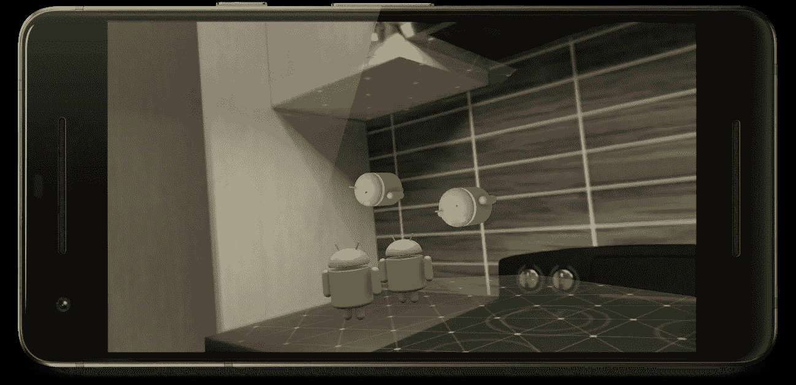
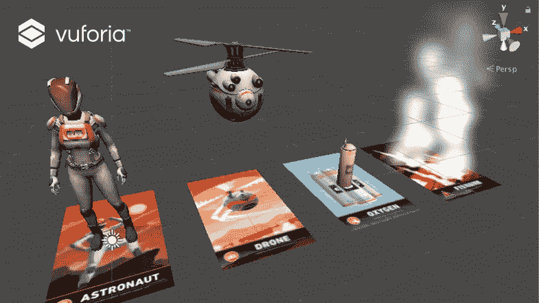
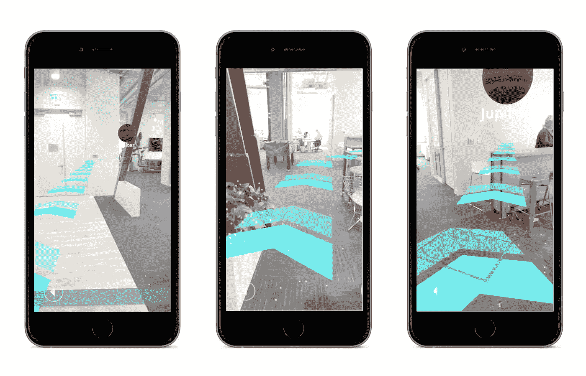
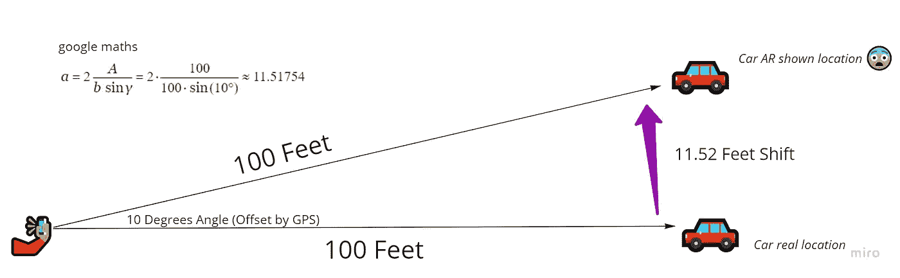
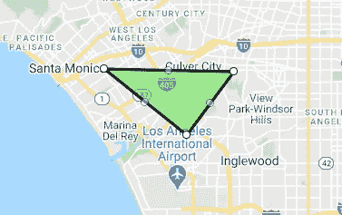
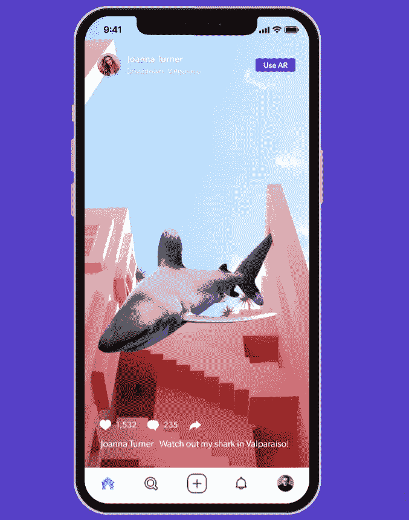

# 高质量的世界范围的增强现实越来越近了——部分是因为机器学习

> 原文：<https://towardsdatascience.com/high-quality-world-scale-augmented-reality-is-getting-closer-partially-because-of-machine-975a68fa6fe5?source=collection_archive---------25----------------------->

美国宇航局在 [Unsplash](https://unsplash.com/s/photos/technology?utm_source=unsplash&utm_medium=referral&utm_content=creditCopyText) 拍摄的照片

## 由于 GPS 的不精确和定位，在我们的物理世界上覆盖一个数字世界一直是很困难的。

# 增强现实介绍

广义而言，日常消费者创建并随后使用了两种类型的增强现实(AR)。

第一种类型是 AR，它检测你附近的物体，从中产生数字物体/世界。这可以是从平面检测到图像目标的任何东西，其中您已经设置了在满足检测标准后如何产生游戏对象的参数。

在[谷歌 ARCore 教程](https://developers.google.com/ar/develop/unity/tutorials/hello-ar-sample) (CC BY 4.0)中的平面检测(绿色和紫色网格)和从 HelloAR 衍生的 Android

在这里你可以看到图片和模型被放置在 Unity 游戏引擎中。当你的手机检测到图像时，这些模型就会产生

最受欢迎的是，这第一种 AR 使用面部识别来给你提供你在 Snapchat、Instagram 甚至 Zoom 上看到的众多滤镜。Spark AR 是一个很棒的库，可以用你的 PC/Mac 相机来玩这个。你可以在这里看到用于 [Snapchat AR 滤镜的面部网格](https://lensstudio.snapchat.com/guides/face/face-effects/face-mesh/)，类似于它在 Instagram 或任何其他具有过滤功能的平台上的使用方式。

第二种形式的 AR 检测你的物理位置，并在其上覆盖一个缩放的、预先构建的数字世界。这通常被称为**世界规模的 AR** 。这方面最好的直接例子是 Pokemon GO，其中特殊事件、pokestops 和健身房将显示在特定的地理坐标上。你去那里，调出第一人称视角，然后做你的事。但是，世界规模的 AR 计划并不局限于游戏，它们包括室内导航和多人单次 AR 活动的圣杯等用例。

[通过地图框进行室内导航](https://blog.mapbox.com/indoor-navigation-in-ar-with-unity-6078afe9d958)，图片来自媒体文章

尚未发布的 Niantic 多人 AR 游戏 Neon 的测试片段

# 世界规模的 AR 有什么难的？

如果你有敏锐的眼光，我相信你已经注意到最后两帧中的某些东西似乎有点不对劲。物品的放置和标记并没有完全符合它们应该达到的水平——这就让我们想到了为什么 AR 还没有完全达到它应该达到的水平:**数字和物理世界的一致。**

假设我在洛杉矶，正在寻找我停车的地方。我有一个应用程序 FindMyCar，当我打开相机时，它会指向我最初停车时放下书签的地方。信号可能不太好，所以**我的全球定位系统显示我正朝向我实际朝向的东方 10 度。**现在在应用程序中，我面前的数字汽车标记现在将移动 10 度，并且物体越远，情况越糟。

作者图片，谷歌数学

所以，如果我在找我停车的地方，那就没什么用了。这也是其他两个应用程序在早期照片中似乎关闭的原因。对于一些像 Pokemon GO 这样的世界范围的应用程序，位置可以稍微偏一点，因为如果 Charizard 稍微偏左或偏右，不会影响你的沉浸感。沉浸感对用户体验和应用程序的有用性都非常重要。

如果你想看看 Matthew Halberg 如何在 2017 年试图建立一个基于户外导航/文本的 AR 应用程序，并对遇到的问题进行更深入的解释，请在这里查看他的旧视频。回购是不赞成现在，所以不要费心尝试启动它。

世界规模的 AR 的第二大问题是本地化——或者通俗地说，检测你周围的世界，并与你在数字世界中的位置同步(想想 x 和 y 位置)。在上面的例子中，这相当于距离我实际所在的位置大约 200 英尺，使失调误差更大。这通常也需要时间，你必须将手机指向你周围的不同方向，以帮助检测足够多的表面来催生数字世界。

对我们来说幸运的是，多年来聪明的工程师和产品团队解决这个问题已经带来了很多有趣的解决方案。

# 变大还是变小

正如生活、商业和技术中的许多问题一样，人们要么试图一次解决所有问题，要么从整体中分离出一部分。这个问题的处理方式没有什么不同。

我们的第一个方法是“让我们以 1:1 的比例开始建造这个房间”的方法，本质上是创建这个房间中所有物品的完美克隆，以创建一个不受地理位置限制的无缝体验。第二种方法是“世界数字克隆”方法，它专注于将数字体验从地理上映射到现实世界。

让我们更深入地研究这两种方法:

## 重建您的房间，体验您的房间

比方说，我正在为新生计划一次寻宝游戏，以帮助他们更好地适应校园主楼。如果我有十组学生，我可以隐藏十组物品或找到一百个隐藏点——或者我可以在 AR 中建立一个更有趣和可扩展的体验！

在室内寻宝游戏中，为了获得准确的体验，我们需要的不仅仅是一个云锚。那么，如果我们先把所有的提示和隐藏物品放在建筑物的数字模型中，会怎么样呢？

你可以走进 Blender，手动精心制作每个房间(和里面的家具)的模型——或者我们可以将物体扫描成点云/数字网格。几年前，6D.ai 的团队使用手机在 3 分钟内扫描了他们的办公室，生成了以下网格:

看原视频[这里](https://www.youtube.com/watch?v=I4PtoGGZXRg)

显然，它并不完美，物体的边缘越粗糙或越细致，就越难扫描。幸运的是，用户永远不会看到这个扫描——它只是用于本地化。假设我们为校园建筑做了这些，当学生在任何房间内启动应用程序时，应用程序将尝试扫描周围环境，并将自己放置在数字模型中。通过人工智能和激光雷达等景深传感器的结合，手机将快速扫描周围环境，并“识别”学生站在哪里。然后，无论我们把寻宝游戏的提示和物品放在哪里，它们都会出现在屏幕上——没有杂乱的扫描网。

2020 年发布的 iPad Pro 配备了激光雷达，为更快的平面检测和 AR + ML 应用的定位打开了大门。

实时扫描[内摄像机范围内的一切](https://www.youtube.com/watch?v=ipcq02PEX5c)。

因此，现在我们有了建立数字模型以及在该模型中定位用户的解决方案，但我们需要一个平台来建立完整的寻宝游戏(放置物品、提示和各种交互)。Unity 是一个强大的游戏引擎，最近专注于建立一套跨机器学习和 VR/AR 的更多样化的应用程序。最近推出的一个功能叫做 [Unity AR Mars](https://unity.com/products/unity-mars) ，专为特定空间的活动打造，比如我们已经详述的寻宝游戏。

[在这里](https://unity.com/products/unity-mars)我们看到了房间的数字模型和在顶部放置的互动对象。当用户打开应用程序时，只会看到该对象。

但是如果我想在整个校园里创建一个寻宝游戏呢？扫描包括户外在内的所有东西是不可行的，而且有些房间看起来可能非常相似。我们需要在应用程序中融入地理信息。

## 最好用别针别住它，快点

您是否曾针对您所在的特定事件或地点使用过 Snapchat 过滤器？这些基本上是作为一个可用的地理区域来实现的，也称为“栅栏”。

这是 Snapchat 网站上的一个截图，你可以自己试试[这里](https://www.snapchat.com/create/submit.html?utm_source=snapchat&utm_medium=site&utm_campaign=community#targeting)

然而，对于需要精确定位的 AR 应用程序来说，绘制围栏不起作用——在停车场上设置围栏并不能帮助我找到我的车。在这种情况下，我们需要使用云锚来代替。

老实说，云锚设置起来还是有点笨拙，因为文档和好的例子都很分散。然而，旧主播只能持续一天，而现在新主播可以持续一年！本质上，您正在扫描一个区域(比如一个雕像)，然后将它附加到一个地理点(在纬度和经度坐标中)。对于一个更微妙的实现，查看谷歌的解释者[这里](https://developers.google.com/ar/develop/java/cloud-anchors/overview-android)。

为了帮助放置锚点，特别是如果像 Pokemon GO 那样由算法驱动，可以通过管理适当位置的数据集来找到合理的放置。Niantic 已经利用来自 [wayfarer](https://nianticlabs.com/blog/niantic-wayfarer/) 等应用和倡议的数据做到了这一点，最终形成了一个“*最全面的数据集，包含数百万个世界上最有趣、最容易玩游戏的地方，这些地方几乎都是用户生成的(* [*来源*](https://nianticlabs.com/blog/nrwp-update/) *)。*

## 两全其美

虽然这些方法解决了不同的问题，但最终它们会在构建像寻宝游戏这样的新 AR 应用程序时结合使用。让我们快速看一下实现中的两个例子:

口袋妖怪 GO 前面已经提到过了，尽管这主要是一种共享游戏状态的单人 AR 体验。Niantic 即将推出的游戏*代号:城市传说*确实包含了多人游戏(可能是从前面提到的 Neon 开发的)。

*Superworld* 是区块链(以太坊)上的一款房地产应用，每块土地都可以在上面建立 AR 体验。这意味着每个地块都将有自己的云锚，从视频和海报到 3D 动画模型的一切都可以由地块所有者放置在它周围的数字覆盖中。

作者截图来自超世界[手机 app](https://www.superworldapp.com/mobile-app/)

构建这一切的合理堆栈可以是 Unity 作为游戏引擎，Mapbox 用于地理数据/模型，AR Core 用于云锚 API，6D.ai(现在是 Niantic 的一部分)用于扫描。本地化在很大程度上取决于硬件(你的手机有景深能力吗，它能处理 5G 吗，量化模型与完整模型的优化，因为云端点会太慢)。

# 我们将何去何从？

最终，我们希望准确快速地覆盖数字世界。这确实是一个艰难的要求，但回报将是值得的努力和等待。随着 GPS、5G 和电话硬件以及 AR 工程工具的未来改进，我绝对迫不及待地想在未来体验和构建世界规模的 AR 应用。