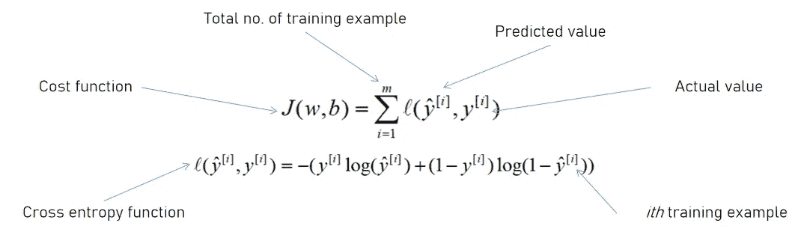
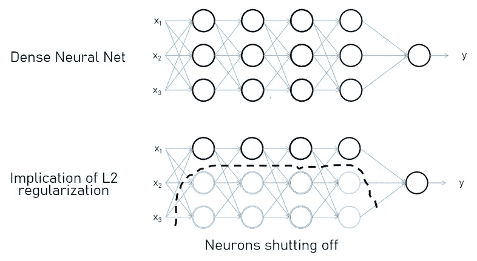

# 通过“完美”从高方差到高偏差

> 原文：<https://towardsdatascience.com/high-variance-to-high-bias-via-perfection-fd69de3a1237?source=collection_archive---------21----------------------->

## 过拟合和欠拟合是非常常见的问题，我们已经指定了处理它们的方法和工具。虽然，所有方法背后的基础科学是相同的，也值得一提。

伊莎贝拉和路易莎·菲舍尔的照片在 [Unsplash](https://unsplash.com/s/photos/apples?utm_source=unsplash&utm_medium=referral&utm_content=creditCopyText)

数据科学社区获得了许多托管大量预测建模问题的平台。这简化了初学者在这一领域超越和达到熟练程度的途径。我们不打算谈论这些平台，而是谈论一些让我们结束训练“**最优**模型之旅的东西。术语“最佳”在这里意味着模型的精度类似于基础精度。

我们在训练模型时面临的最常见问题是数据的过拟合和欠拟合。在某种程度上，我们有能力控制它，但深度学习中的这些能力没有被我们大多数人发现。然而，这篇文章不仅仅是关于处理数据问题的方法，而是关于为什么这些技术如此强大以及它们在后台做什么。

为了顺利开始，让我们定义一些用于从一组图像中对狗进行分类的预测建模问题的术语。

模型性能类型的不同术语(由作者出版)

我们假设基本误差为零，因为人类可以识别误差为 0%的狗。或者在它的附近。要理解这篇文章，有必要熟悉这些术语(先决条件！！).

要深入了解这些术语，让我们看看这些模型所映射的决策边界或函数因为: ***要解决任何问题，都需要先了解它。***

> *有一个小假设，我们只有两个特征，这将有助于我们在 2-D 平面中绘制数据点。*

描述数据拟合不同问题的三种不同模型的决策边界(由作者发布)

# 最佳模型

该模型精确地拟合了给定的数据点，并且还包含了数据中的噪声。这个模型所映射的函数既不复杂也不简单。让我们假设它相当于一个**抛物线函数，**其中训练和测试集误差也相当于基本误差。

# 欠拟合

当训练集误差和测试集误差远离基本误差时，就说模型对数据拟合不足。由该模型映射的函数作为**线性函数相当简单，**因此没有抛物线函数复杂。

# 过度拟合

当测试集误差远离基本误差，而训练集误差远离基本误差时，则该模型被认为过拟合了数据。这个模型映射了一个比抛物线更复杂的函数。

这些对映射函数的观察对于理解数据问题至关重要。在深度神经网络中，我们有几个超参数要调整。一些超参数，例如隐藏层的数量和隐藏层中隐藏单元的数量，决定了模型在给定数据点上映射的函数的复杂性。

让我们假设我们已经训练了一个非常深的神经网络，并且我们有过拟合数据的条件，并且正在使用 L2 正则化技术来达到最佳拟合。

# L2 正则化

我们的价值成本函数如下

二元分类问题的梯度下降中定义的代价函数(由作者发表)

其中 J 是成本函数，带上限的 y 是预测值，y 是第*个*训练示例的目标特性的实际值。在 L2 正则化中，我们在代价函数中增加了一个正则项。所以，J 变成了-

带有正则项的成本函数(由作者发表)

其中λ被称为**正则化参数**，因此是另一个超参数，求和项是权重矩阵的 L2 范数的平方。上图给出了 L2 范数的定义。

为了理解这个正则项的影响，让我们计算梯度，这是在反向传播过程中计算的。

反向传播步骤中计算的权重梯度(由作者发表)

“**反向投影项**对应于成本函数相对于权重矩阵的导数。我们可以假设，对于梯度下降的特定迭代，它将保持不变。添加正则项的含义是在关于**λ**和**m**的 **dW** 的定义中添加新项。现在，如果我们更新参数，我们将具有以下含义:

更新权重(由作者发布)

可以直接推断出，当我们应用 L2 正则化时，我们正在减少或最小化 w 中的元素。在大多数处理高方差等问题的方法中，我们正在减少权重。这就是为什么它也被称为“重量控制”过程。

如果我们有一个非常深的神经网络，有许多隐藏层和隐藏单元，那么它将倾向于过度拟合数据。一旦我们应用 L2 正则化，我们就间接地将一些隐藏单元的权重降低到接近零，但不完全为零。

现在假设我们有一个如下的密集神经网络，我们应用 L2 正则化，几乎关闭了一些隐藏单元。

在成本函数中添加正则项后关闭的神经元(由作者发表)

这是一个完全关闭一些神经元的极端条件，但将有助于我们理解 L2 正则化的含义。现在剩下的神经网络可以组合如下-

多个连续的神经单元可以由单个神经单元代替。(作者发布)

这是可能的，因为每个神经元随着权重和偏差线性变化，如果我们在另一个线性函数中输入一个线性函数，那么得到的函数也是线性的。最终，我们只是改变了线性函数的常数。

这种极端情况意味着，当我们应用 L2 正则化技术时，从一个非常复杂的函数(由密集的神经网络生成),我们得到了一个非常不复杂的线性函数。换句话说，从一个模型**过拟合**数据到一个模型**欠拟合**数据，或者从一个具有**高** **方差**的模型到一个具有**高偏差**的模型。

另一个观察结果是，我们问题的最佳解决方案位于我们从过度拟合到欠拟合数据的路径之间。这个目标可以通过调整超参数 lambda 轻松实现(不那么容易，因为调整超参数需要耐心)。

通过“完美”(由作者发表)从高方差到高偏差

还有其他正则化技术，如**反向丢弃**(或简单丢弃)**正则化**，它们随机关闭神经单元。所有这些正则化技术都在做同样的工作，即最小化成本函数或映射函数的复杂度。

# “提前停止”方法述评

“**早** **停**”是另一种常用的避免数据过拟合的方法。在这种方法中，我们定义了一个训练集和一个测试或开发集，并观察了这两个集上的成本函数在迭代次数方面的变化。

随着迭代次数的增加，训练集中的错误会减少，但是测试集中的变化是显著的。它首先下降，显示成本值的增加，表明数据过度拟合的开始。

训练和测试集的成本随迭代次数的变化(由作者发布)

这种方法可能不太准确，因为我们有两个不同的任务，一是优化成本函数 J，二是防止过拟合。这两项任务必须分开解决。“提前停止”同时完成了这两个任务，因此它有效地优化了成本函数。

通过使用其他技术作为正则化，您将能够更加自信和准确地优化您的成本函数。

# 常见的解决方案

解决这两个问题的常用方法是提供更多的训练数据集。有时候，获取更多的训练数据可能代价很高。但是，有一些方法，如**数据扩充**，可以生成更多的训练数据集。

例如，我们可以通过随机缩放、裁剪或翻转图像，从预先存在的图像生成新图像。

数据扩充(原始照片由[维克多·格拉巴奇克](https://unsplash.com/@qrupt?utm_source=unsplash&utm_medium=referral&utm_content=creditCopyText)在 [Unsplash](https://unsplash.com/s/photos/dog?utm_source=unsplash&utm_medium=referral&utm_content=creditCopyText) 上拍摄)

# 总结

我们已经看到了如何在从高方差到高偏差模型的过程中达到最优模型。

然而，我们应该注意，L2 正则化将权重衰减到接近零，但不完全为零，而在丢弃正则化中，我们随机关闭一些单元。

除正则化之外，还有各种技术，如归一化、梯度检查等，可帮助您优化成本函数并防止数据过度拟合，但所有这些方法都在同一个框中，即它们都降低了成本函数或模型在数据点上映射的函数的复杂性。一旦复杂度降低到一定限度，就可以找到最优解。