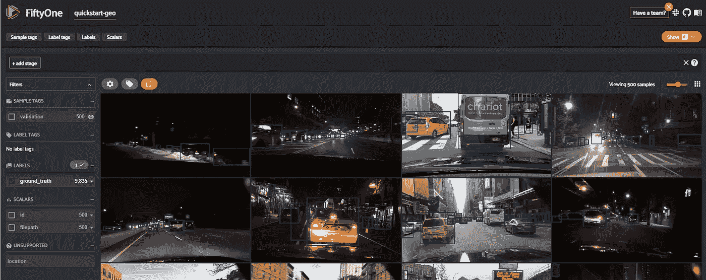
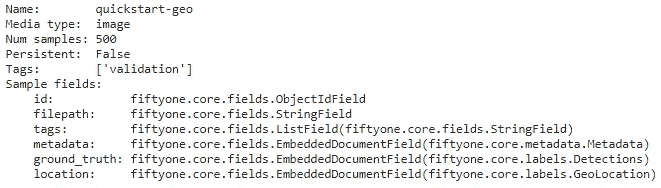
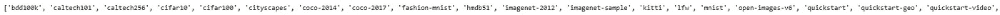
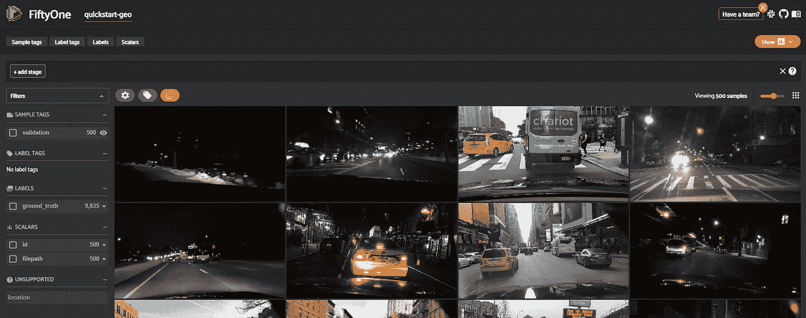
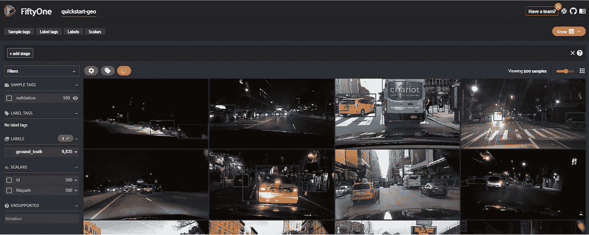

# 用于可视化数据集和解释模型的高度交互式仪表板

> 原文：<https://towardsdatascience.com/highly-interactive-dashboards-for-visualizing-dataset-and-interpret-model-ce6311ea57ca?source=collection_archive---------33----------------------->

## 使用 FiftyOne 创建仪表板，帮助构建高质量的数据和计算机视觉模型



来源:作者

可视化图像数据集从来没有那么容易，直到我们引入了 51。它是完美的工具，不仅有助于可视化数据集，而且有助于理解数据集的不同方面，解释模型，评估模型预测等。它具有多种多样的特征，并被强烈推荐用于评估对象检测模型、对象分类模型、寻找图像唯一性等。

FiftyOne 可以与 PyTorch、Tensorflow、Google AI、Jupyter、Colab 等多种工具集成。它的核心功能包括管理数据集、评估模型、查找注释错误等等。我可以写多篇文章涵盖 51 的不同方面，但我们不能涵盖所有的功能。

FiftyOne 是一个开源 python 工具，用于创建高度交互式的图像可视化和模型解释应用程序。在本文中，我们将探讨如何使用 FiftyOne 可视化数据集。

让我们开始吧…

# 安装所需的库

我们将从使用 pip 安装 51 开始。下面给出的命令可以做到这一点。

```
!pip install fiftyone
```

# 导入所需的库

在这一步中，我们将导入创建第五十一个应用程序所需的库。

```
import fiftyone as fo
import fiftyone.zoo as foz
```

# 加载数据集

五十一应用程序已经有很多预定义的数据集，他们称之为动物园，你可以使用这个动物园中的任何数据集。在本文中，我们使用快速入门地理数据集。让我们从加载数据集开始。

```
dataset = foz.load_zoo_dataset("quickstart-geo")
print(dataset)
```



来源:作者

您可以使用下面的命令检查所有数据集的名称。

```
print(foz.list_zoo_datasets())
```



来源:作者

# 可视化数据集

这是最精彩的部分。在这里，我们将在一个应用程序中可视化数据集，FiftyOne 只用一行代码就创建了这个应用程序。

```
session = fo.launch_app(dataset)
```



来源:作者

这是由 FiftyOne 创建的应用程序。在左侧，您可以看到标签。同样，您也可以在一个网格中可视化所有图像。如果我们选择 ground__truth 标签，它将向我们显示图像中的所有对象，如下所示。



来源:作者

同样，您也可以选择缩放器，即 Id，以及将在图像网格中显示的文件路径。您还可以更改网格的大小来相应地调整图像。

这只是我们已经开始的视觉化。有更多的事情，你可以使用 51 轻松探索，因为它是高度互动的，易于理解。

继续尝试不同的数据集，并可视化这些数据集。如果您发现任何困难，请在回复部分告诉我。

本文是与 [Piyush Ingale](https://medium.com/u/40808d551f5a?source=post_page-----ce6311ea57ca--------------------------------) 合作完成的。

# 在你走之前

***感谢*** *的阅读！如果你想与我取得联系，请随时通过 hmix13@gmail.com 联系我或我的* [***LinkedIn 个人资料***](http://www.linkedin.com/in/himanshusharmads) *。可以查看我的*[***Github***](https://github.com/hmix13)**简介针对不同的数据科学项目和包教程。还有，随意探索* [***我的简介***](https://medium.com/@hmix13) *，阅读我写过的与数据科学相关的不同文章。**