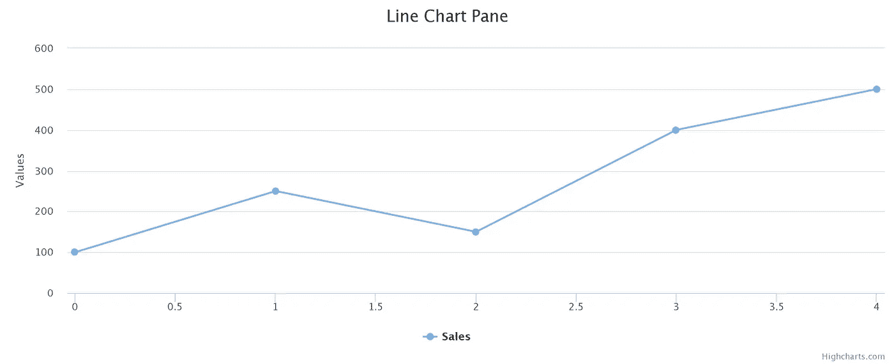
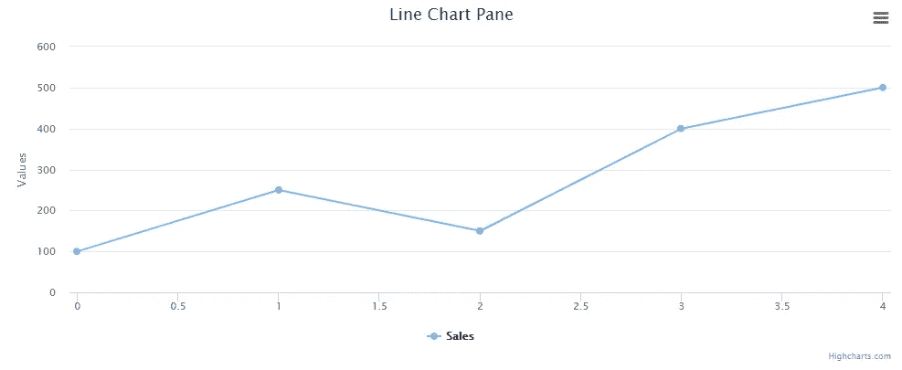
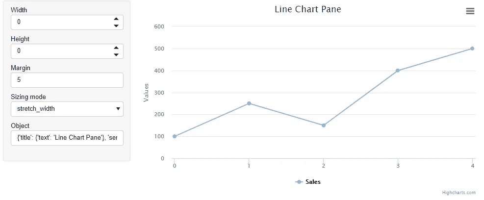
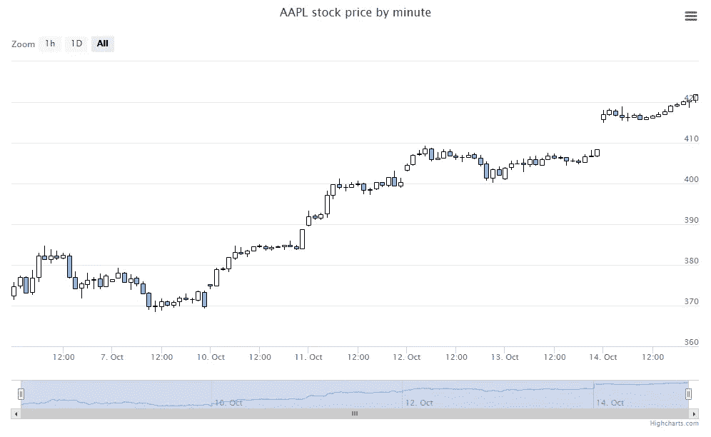
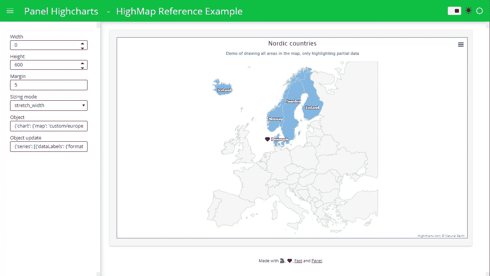

# 高度交互式数据可视化

> 原文：<https://towardsdatascience.com/highly-interactive-data-visualization-cd3a9b082370?source=collection_archive---------25----------------------->

## 使用 Panel-Highcharts 在 Python 中创建高图表



(来源:[作者](https://www.linkedin.com/in/himanshusharmads/))

数据可视化影响你讲故事，因为它帮助用户更清楚地了解你想说什么，并且用户可以实际可视化模式、见解等。你想告诉我的。可视化有配色方案，图案，不同类型的图表，如果展示得漂亮，会让用户着迷。

创建可视化有不同的方法，python 也有不同的库，可以创建视觉上吸引人的可视化。 [Panel-Highcharts](https://github.com/MarcSkovMadsen/panel-highcharts) 是一个 python 库，使得在 python 中使用 Highcharts 进行探索性数据分析变得很容易。我们可以用它来使用 Highcharts 创建可视化效果，或者使用 Panel 创建仪表板。

在本文中，我们将探索可以使用 Panel-Highcharts 创建的不同类型的图表。

让我们开始吧…

# 安装所需的库

像任何其他 python 库一样，我们将使用 pip 安装 Panel-Highcharts。下面给出的命令将安装所需的库及其依赖项。

```
pip install panel-highcharts
```

# 导入所需的库

安装后，现在我们将导入创建可视化、加载数据等所需的库。

```
import panel_highcharts as ph
import panel as pn
pn.extension('highchart')
```

# 创建图表和绘图

现在，我们将开始可视化使用 Panel-Highcharts 创建的不同图表和绘图。

1.  **折线图**

我们将首先创建一个基本的折线图，然后创建一个小部件来处理该图表。

```
#Define the configuration and the data to be used in chart 
configuration = {
    "title": {"text": "Line Chart Pane"},
    "series": [
        {
            "name": "Sales",
            "data": [100, 250, 150, 400, 500],
        }
    ]
}ph.HighChart(object=configuration, sizing_mode="stretch_width")
```



折线图(来源:[作者](https://www.linkedin.com/in/himanshusharmads/))

在这里，我们可以看到使用 Highcharts 创建的折线图。在给出的图像中，右侧有一个切换按钮，允许用户下载不同格式的图表和数据。

现在让我们创建一个小部件框，它可以用来处理这个图表。

```
chart = ph.HighChart(object=configuration, sizing_mode= "stretch_width")settings = pn.WidgetBox(
    pn.Param(
        chart,
        parameters=["height", "width", "sizing_mode", "margin", "object", "event", ],
                widgets={"object": pn.widgets.LiteralInput, "event": pn.widgets.StaticText},
        sizing_mode="fixed", show_name=False, width=250,
    )
)
pn.Row(settings, chart, sizing_mode="stretch_both")
```



带有小部件的折线图(来源:[作者](https://www.linkedin.com/in/himanshusharmads/))

在这里，我们可以看到一个小部件框，我们可以调整这些值，并在折线图中查看结果。这有助于向观众展示特性的变化如何导致价值观的变化。

2.**股票走势图**

我们还可以使用这个库创建图表来表示股票数据。我们将导入 request 和 json 来下载股票数据，并使用 highstock 扩展。

```
pn.extension('highstock')
import requests, json#Downloading Data
data = requests.get('[https://cdn.jsdelivr.net/gh/highcharts/highcharts@v7.0.0/samples/data/new-intraday.json').json()](https://cdn.jsdelivr.net/gh/highcharts/highcharts@v7.0.0/samples/data/new-intraday.json').json())#Creating Configuration
configuration = {
    "title": {"text": "AAPL stock price by minute"},
    "rangeSelector": {
        "buttons": [
            {"type": "hour", "count": 1, "text": "1h"},
            {"type": "day", "count": 1, "text": "1D"},
            {"type": "all", "count": 1, "text": "All"},
        ],
        "selected": 1,
        "inputEnabled": False,
    },
    "series": [
        {"name": "AAPL", "type": "candlestick", "data": data, "tooltip": {"valueDecimals": 2}}
    ],
}#Visualizing the chart
chart = ph.HighStock(object=configuration,  sizing_mode= "stretch_width", height=600)
chart
```



股票图表(来源:[作者](https://www.linkedin.com/in/himanshusharmads/)

在这里，我们可以使用 Highstock 扩展来可视化股票数据，该扩展创建了一个蜡烛图。类似于折线图，您也可以在此绘制小部件框。

3.**地理图**

我们也可以使用高图表来创建一个地理图。为此，我们将加载扩展 highmap 并从在线源加载数据。我们将创建一个情节，然后将其作为一个应用程序与部件框渲染。

```
pn.extension('highmap')**#Creating configuration**
configuration = {
    "chart": {"map": "custom/europe", "borderWidth": 1},
    "title": {"text": "Nordic countries"},
    "subtitle": {"text": "Demo of drawing all areas in the map, only highlighting partial data"},
    "legend": {"enabled": False},
    "series": [
        {
            "name": "Country",
            "data": [["is", 1], ["no", 1], ["se", 1], ["dk", 1], ["fi", 1]],
            "dataLabels": {
                "enabled": True,
                "color": "#FFFFFF",
                "formatter": """function () {
                if (this.point.value) {
                    return this.point.name;
                }
            }""",
            },
            "tooltip": {"headerFormat": "", "pointFormat": "{point.name}"},
        }
    ],
}**#Creating Visualization**
chart = ph.HighMap(object=configuration, sizing_mode= "stretch_width", height=600)#Adding widget box
settings = pn.WidgetBox(
    pn.Param(
        chart,
        parameters=["height", "width", "sizing_mode", "margin", "object", "object_update", "event", ],
                widgets={"object": pn.widgets.LiteralInput, "object_update": pn.widgets.LiteralInput, "event": pn.widgets.StaticText},
        sizing_mode="fixed", show_name=False, width=250,
    )
)
pn.Row(settings, chart, sizing_mode="stretch_both")**#Creating Events**
event_update = {
    "series": [
        {
            "allowPointSelect": "true",
            "point": {
                "events": {
                    "click": "@click;}",
                    "mouseOver": "@mouseOverFun",
                    "select": "@select",
                    "unselect": "@unselect",
                }
            },
            "events": {
                "mouseOut": "@mouseOutFun",
            }
        }
    ]
}
chart.object_update=event_update
```

在这之后，我们都创建应用程序并呈现它。

```
chart.object =configuration = {
    "chart": {"map": "custom/europe", "borderWidth": 1},
    "title": {"text": "Nordic countries"},
    "subtitle": {"text": "Demo of drawing all areas in the map, only highlighting partial data"},
    "legend": {"enabled": **False**},
    "series": [
        {
            "name": "Country",
            "data": [["is", 1], ["no", 1], ["se", 1], ["dk", 1], ["fi", 1]],
            "dataLabels": {
                "enabled": **True**,
                "color": "#FFFFFF",
                "formatter": """function () {
                if (this.point.value) {
                    if (this.point.name=="Denmark"){
                        return "❤️ " + this.point.name;
                    } else {
                        return this.point.name;
                    }
                }
            }""",
            },
            "tooltip": {"headerFormat": "", "pointFormat": "**{point.name}**"},
            "allowPointSelect": "true",
            "point": {
                "events": {
                    "click": "@click;}",
                    "mouseOver": "@mouseOverFun",
                    "select": "@select",
                    "unselect": "@unselect",
                }
            },
            "events": {
                "mouseOut": "@mouseOutFun",
            }
        }
    ],
}#Rendering Application
app = pn.template.FastListTemplate(
    site="Panel Highcharts",
    title="HighMap Reference Example", 
    sidebar=[settings], 
    main=[chart]
).servable()
```



HighMap 地理图(来源:www.github.com)

这就是我们如何使用 Panel-highcharts 创建不同的图。还有很多其他的剧情可以尝试。

在这篇文章中，我们已经经历了某些情节以及如何创建它们，这些情节是高度交互和可下载的。继续尝试不同的数据集，并让我知道您在回复部分的评论。

本文是与[皮尤什·英格尔](https://medium.com/u/40808d551f5a?source=post_page-----cd3a9b082370--------------------------------)合作完成的

# 在你走之前

***感谢*** *的阅读！如果你想与我取得联系，请随时通过 hmix13@gmail.com 联系我或我的* [***LinkedIn 个人资料***](http://www.linkedin.com/in/himanshusharmads) *。可以查看我的*[***Github***](https://github.com/hmix13)**简介针对不同的数据科学项目和包教程。还有，随意探索* [***我的简介***](https://medium.com/@hmix13) *，阅读我写过的与数据科学相关的不同文章。**