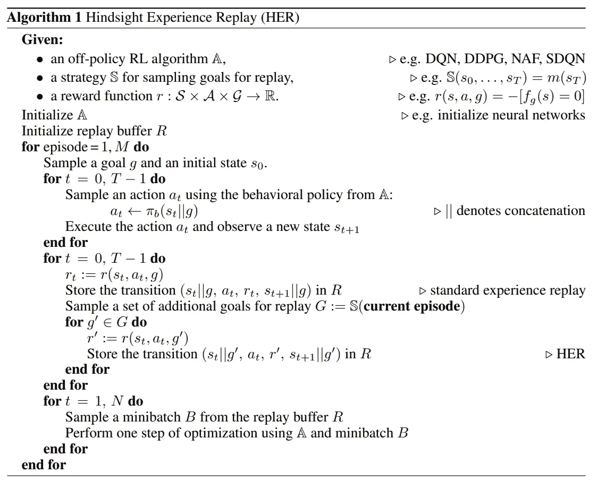

# 事后经验回放(HER)实现

> 原文：<https://towardsdatascience.com/hindsight-experience-replay-her-implementation-92eebab6f653?source=collection_archive---------16----------------------->

## [提示和技巧](https://towardsdatascience.com/tagged/tips-and-tricks)

## 算法和代码的解释

由[布雷特·乔丹](https://unsplash.com/@brett_jordan?utm_source=medium&utm_medium=referral)在 [Unsplash](https://unsplash.com?utm_source=medium&utm_medium=referral) 上拍摄的照片

我最近为我的研究强化学习库实现了 HER 算法: [**Pearl**](https://github.com/LondonNode/Pearl) 。在这样做的时候，我发现虽然有文章讨论算法的理论，但是没有任何文章讨论如何用代码实现它。就这样吧，这就是我来的原因！在本文中，我将讨论如何用 Python 实现 HER 缓冲区😊

# 快速算法概述

提醒一下，这是原始论文中的算法:

来源:[https://arxiv.org/abs/1707.01495](https://arxiv.org/abs/1707.01495)

总之，在二元且稀疏的奖励环境中(在该环境中，当代理获胜时实现唯一的非负奖励)，如果代理从未接收到任何奖励变化，则它可能很难适当地探索环境并学习实现期望目标所需的步骤序列。HER buffer 试图通过复制每个经历的轨迹，并用假设目标是轨迹结束时实现的步骤计算的奖励代替实际奖励来克服这一点。这个想法是，这将帮助代理更好地探索，并学习中间目标，最终达到实际的期望目标。在本文中，我将新的采样目标称为**她的目标**，而结果轨迹将是**她的轨迹**，其中包含计算的**她的奖励**。

# 实现和代码

该实现将稍微偏离本文中的理论算法。主要区别如下:

1.  我们不会在添加每个轨迹后立即对目标进行采样并计算她的奖励，而是等到采样时，我们可以一次性进行矢量化计算，这在 Python ⚡中要快得多
2.  我们还将使用一个技巧，只使用一个缓冲区来存储观测值和下一个观测值，以将观测值存储的内存需求减少近一半！这可以通过假设存储的观察值是连续的来实现；也就是说，索引 i+1 处的观察值是索引 I 处的下一个观察值💾

## 初始化

反直觉地，让我们从第 2 点开始，因为这是在下面的类初始化中定义的，注意没有定义`self.next_observations`。

她的 init

这里需要注意的一点是，这个缓冲区只接受`GoalEnv`环境！！这让我们能够轻松跟踪剧集目标。请看下面来自 OpenAI 的原始描述:

目标环境描述

在轨迹的末端，下一个观察将是结束状态，并且期望的目标在整个情节中应该是恒定的。因此，我们只需要跟踪观察结果`desired_goal`和下一次观察结果`achieved_goal`，就可以计算她的奖励。同样值得注意的是`self.episode_end_indices`和`self.index_episode_map`缓冲器:

*   `self.episode_end_indices`:跟踪轨迹缓冲器中的剧集结束索引。
*   `self.index_episode_map`:跟踪哪些过渡属于哪些剧集。

最后，`her_ratio`变量指示用新的 HER 奖励与标准重放缓冲器轨迹进行采样的轨迹的分数。

## 添加轨迹

如前所述，在添加轨迹时，我们不会对她的目标和回报进行采样，因此这种方法并不复杂。

将轨迹添加到缓冲区

注意添加`next_observation["observation"]`在算法上有点复杂，因为我们像`observation["observation"]`一样将它存储在`self.observations`中。

## 抽样

这是真正的处理过程，我们批量计算她的目标和相应的奖励。让我们从定义我们想要从轨迹缓冲区返回哪些索引的高级方法开始:

她的高级抽样方法

这里要注意的关键是，我们想要从完整的剧集中采样索引，这就是为什么我们需要将`end_idx`定义为轨迹缓冲区中最后一个完整剧集的索引。

接下来，让我们看看返回轨迹的方法。这会以`self.her_ratio`定义的比率获得标准回放和她的轨迹:

幸运的是，`GoalEnv`有一个方法`compute_reward(achieved_goal, desired_goal, info)`,这意味着我们不必担心自己计算她的回报。在这种方法中，我们本质上分离了我们需要计算她的回报和目标的指数，然后在最后重新组合一切以获得回报。所有观察值也与算法中指定的期望目标相联系。请再次注意`next_observations`的采样稍微复杂一些，因为我们从同一个`self.observations`缓冲区获得这些数据。

最后，还有一个问题是让她的目标本身来计算她的奖励。这定义如下:

尝试她的目标

还记得在算法回顾时，我说过她的目标被假定为轨迹终点观察吗？这只是部分正确，实际上有许多不同的方式来取样她的目标，我已经做了其中的两个以上。最简单的方法是获得最后的观察结果，但这篇论文显示，当你在同一集但在当前过渡之后，以随机状态对她的目标进行采样时，实际上获得了最佳结果。在这个策略中，有一个失败模式。如果采样的情节与缓冲区“重叠”；也就是说，当缓冲区溢出时，剧集在缓冲区的末尾开始，在开头结束，可以在缓冲区的末尾选取该剧集中的轨迹。因此，当调用`np.random.randint()`时，低值将是缓冲区结尾的索引，而高值将是剧集开头的结尾索引，从而导致错误。因为如果缓冲区大小相对较大(通常应该是 1e6 的量级)，这种情况很少发生，所以作为快速解决方案，我们可以求助于更简单的 HER 目标策略，即在这种情况发生时选取剧集结束索引。

唷！坚持到了最后🎉🎉

如果您觉得这篇文章有用，请考虑:

*   跟踪我🙌
*   [**订阅我的电子邮件通知**](https://medium.com/subscribe/@rohan.tangri) 永不错过上传📧
*   使用我的媒介 [**推荐链接**](https://medium.com/@rohan.tangri/membership) 直接支持我并获得无限量的优质文章🤗

晋升的方式，让我知道你对这个话题的想法和快乐学习！！