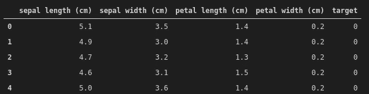
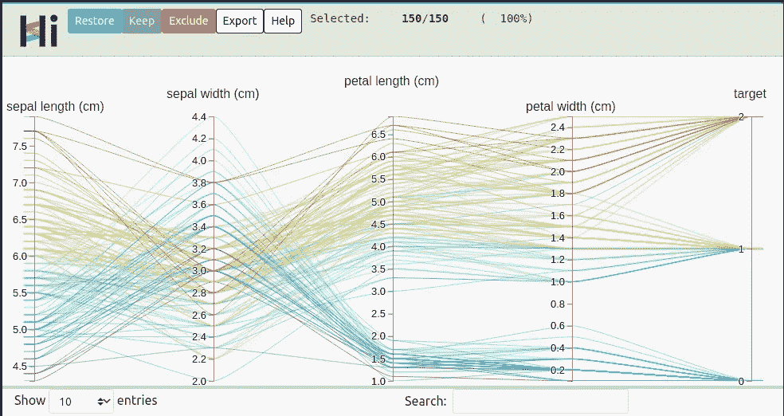
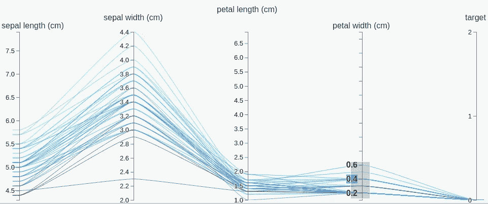
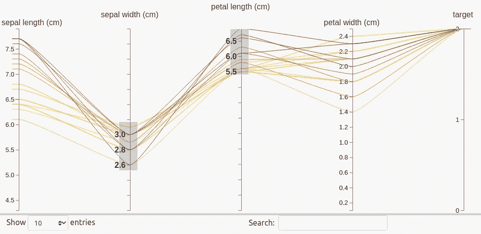
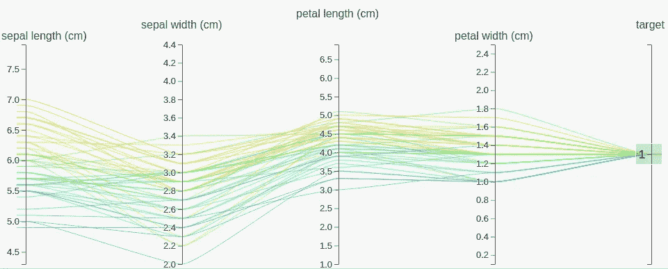
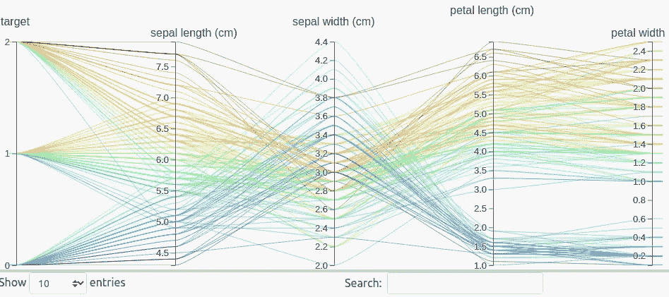
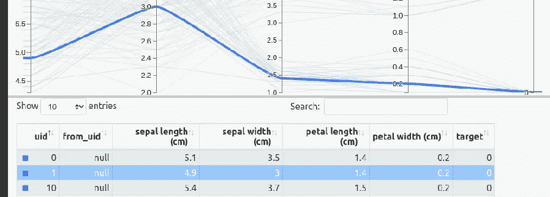

# HiPlot:脸书的交互式可视化工具

> 原文：<https://towardsdatascience.com/hiplot-interactive-visualization-tool-by-facebook-f83aea1b639a?source=collection_archive---------27----------------------->

## 一个非常方便的探索性数据分析工具


照片由 [Unsplash](https://unsplash.com/s/photos/parallel?utm_source=unsplash&utm_medium=referral&utm_content=creditCopyText) 上的 [Stesson Bezuidenhout](https://unsplash.com/@stesson?utm_source=unsplash&utm_medium=referral&utm_content=creditCopyText) 拍摄

数据可视化技术对于探索数据集非常有用。数据科学生态系统中使用了各种各样的可视化类型。什么最适合给定的任务取决于数据和变量的特征。

在本文中，我们将介绍一个由脸书创建的交互式可视化工具。它本质上是一个平行坐标图。因此，每行(即数据点)用一条线表示。线上的坐标是变量(即列)。

平行坐标图提供了数据集中可能的组(或簇)的图形表示。它们还揭示了某些有助于区分数据点的模式。

平行坐标图也是一种探索高维数据的便捷方式，对于这些数据，传统的可视化技术可能无法提供合适的解决方案。

脸书为神经网络的超参数调整创建了 HiPlot。然而，我们可以在几乎任何数据集上实现它。最终目标是一样的:好好探索数据。我们将使用著名的 iris 数据集来演示如何使用 HiPlot。

第一步是安装 HiPlot。[文档](https://facebookresearch.github.io/hiplot/getting_started.html)详细解释了如何在各种环境下安装它。我正在用 pip 安装它。

```
pip install -U hiplot
```

我们现在可以导入所有的依赖项，并将数据集读入 pandas 数据帧。

```
import hiplot as hip
import pandas as pd
from sklearn.datasets import load_irisiris = load_iris(as_frame=True)['frame']iris.head()
```



虹膜数据框(图片由作者提供)

使用 Hiplot 创建交互式可视化非常简单。下面一行代码将创建我们将在整篇文章中尝试的内容。

```
hip.Experiment.from_dataframe(iris).display()
```

Hiplot 还接受一个 iterable(例如 dictionary)作为输入数据。在这种情况下，我们使用 from_iterable 函数而不是 from_dataframe 函数。

下面是生成的图的截图。我们仅仅通过观察就能注意到一些模式。



(图片由作者提供)

iris 数据集包含 4 个独立变量和一个目标变量。根据独立变量值，目标取三个值中的一个。

Hiplot 与众不同的地方在于交互界面。例如，我们可以选择图表上任何变量的取值范围。



(图片由作者提供)

我们在花瓣宽度栏中选择一个数值范围。仅显示花瓣宽度在选定范围内的数据点。我们立即注意到所选范围与目标值 0 不同。

可以在多个列上选择一个值范围，这样我们就可以创建更具体的模式。



(图片由作者提供)

我们还可以从目标变量中选择一个值，并查看属于该类的数据点的模式。



(图片由作者提供)

Hiplot 允许重新排列图上的列。例如，我们可以移动目标变量并把它放在最左边。如果您想将分类变量放在一边，将数值变量放在另一边，这个特性就很方便了。



(图片由作者提供)

Hiplot 还生成一个表格作为交互界面的一部分。我们可以使用此表来选择数据点并在图表上查看它们。



(图片由作者提供)

## 结论

我们已经介绍了一个简单的案例，展示了 Hiplot 如何用于探索性数据分析。

随着数据维度的增加(即列数增加)，使用数据可视化来探索数据变得更加困难。在这种情况下，Hiplot 是一个方便的工具。

感谢您的阅读。如果您有任何反馈，请告诉我。