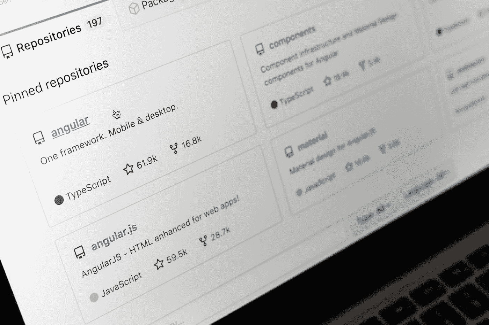

# 被聘为贵公司首位数据科学家？第一天你应该知道的 3 件事

> 原文：<https://towardsdatascience.com/hired-as-your-companys-first-data-scientist-3-things-you-should-know-on-day-1-e75e7b32b5d0?source=collection_archive---------15----------------------->

## [办公时间](https://towardsdatascience.com/tagged/office-hours)

## 发起文化变革&避免常见的陷阱

由[艾萨克·史密斯](https://unsplash.com/@isaacmsmith?utm_source=medium&utm_medium=referral)在 [Unsplash](https://unsplash.com?utm_source=medium&utm_medium=referral) 上拍摄的照片

2020 年 10 月我加入 [**accuRx**](https://www.accurx.com/) 成为公司第一位数据科学家。在加入时，accuRx 是一个由 60 多名员工组成的团队，他们依靠直觉和一流的用户研究团队创造出 GPs 需要和喜爱的产品，完成了令人难以置信的工作。这一点，加上 2020 年医疗保健行业对良好技术解决方案的需求增加，导致我们的业务范围呈指数级扩展。突然间，我们几乎出现在英国所有的全科医生诊所。

我们发现自己处于一个有趣的位置:我们现在有几个每天都被 GPs 广泛使用的产品，以及另一组我们刚刚赋予生命的新生产品想法。我们知道，在这一点上，我们需要开始更多地依靠来自定量数据的洞察力来检验我们的假设，并将我们的产品套件推向正确的方向。

在这一点上，我们不需要先进的 ML 解决方案或最新的大数据处理工具。我们真正需要的是大规模验证我们的假设的能力，了解一个非常庞大和多样化的用户群体的需求，并培养一种决策文化，在这种文化中，依赖定量数据是第二天性。这就是我被带进来的原因，也不是没有挑战。以下是我到目前为止学到的一些东西:

# 1.新角色创造新对话。

向团队中添加新成员会带来一系列不可避免的挑战:团队动态变化，入职的初始成本很高，现在在决策时房间里又多了一个声音。当你不仅给团队增加一个新成员，而且给团队增加一个新角色时，这种影响会被大大放大。

在我加入之前，数据科学并不是产品开发流程的核心部分。突然，团队被引入了大量以前不需要考虑的新问题、流程和技术要求，解决这些问题通常需要整个团队工作方式的重大转变。

***这方面的几个例子有:***

*   软件工程师不得不花费更多的时间向功能发布添加分析，并确保产生这些分析的管道是可靠的。
*   有时，AB 测试结果需要一段时间才能慢慢显现出来。鉴于这些结果(希望)会告知产品下一步的发展方向，产品经理、设计师和工程师经常发现自己在如何最好地——以及多快地——重复功能和想法方面面临相当程度的模糊不清。
*   有一组额外的信息需要考虑，这通常意味着我们要花更长的时间来决定产品的发展方向。我们现在不得不将我们的直觉与数据告诉我们的东西相协调，并打电话询问我们认为这两者有多可靠！

这需要一点试错，但重要的是找到一种工作方式，让产品经理、设计师和工程师能够自由地快速发布和迭代，而不牺牲您对分析严谨性的承诺。在我们的案例中，这看起来像是找出哪些产品变化值得测试，什么样的细节值得跟踪，以及在产品开发过程的不同阶段什么样的分析最有用。

照片由[莱昂](https://unsplash.com/@myleon?utm_source=medium&utm_medium=referral)在 [Unsplash](https://unsplash.com?utm_source=medium&utm_medium=referral) 上拍摄

# 2.有效的沟通是成功的一半以上。

你认为你的分析有多有用并不重要——如果人们不知道或不理解它们，它们不太可能产生长期影响。此外，你传达发现的*方式*将决定你的分析最终会产生多大的影响。

***广泛而频繁地交流。***

重要的是，仅向团队领导传达您的发现是不够的，整个团队投入了大量时间和精力来适应支持分析的新工作方式，他们希望能够看到这些调整产生了什么影响。交流这些变化如何对决策产生积极影响，将有助于创建一种积极的反馈循环，激励您的团队继续依赖您介绍的流程和技术。

一旦你让你的团队参与进来，真正困难的部分是确保最初围绕使用数据做决策的兴奋持续下去。我犯的一个错误(不止一次！)假设围绕分析的沟通是一张您可以标记为完成的入场券。如果你想推动文化变革，你需要不断提醒人们为什么他们应该像你一样关心这件事。随着人们听到越来越多的关于团队在数据洞察的背后取得积极进展的消息，依靠数据来支持产品决策应该开始变得预期和更加自动化。

***始终以洞察力呈现数据。***

只要有可能，试着就这将如何影响决策以及人们最终应该做什么来交流你的发现。分析结果越不抽象越好。让你的结果不那么抽象的一个简单方法是清楚地量化你认为变化会产生多大的影响。

例如，如果你已经运行了一个 AB 测试来确定一个新特性是否增加了你的转化率，不要说“这个变化在统计上是显著的”，而是尝试“如果我们向所有用户推出这个新变化，我们的转化率可能会从 5%增加到 7%，这相当于每周增加 200 个活跃用户”。

类似地，当与团队分享数据可视化时，尽量明确图表显示了什么和没有显示什么。请记住，你已经花了很多时间来思考这个观想，但是用新的眼光看待它的人可能没有你那么多的背景知识。使可视化清晰的简单方法是确保您用来定义指标的确切数据得到理解，并在图表旁边提供对趋势或发现的解释。如果可以的话，试着解释你设想的趋势对你团队目标的影响，这样他们就可以根据你分享的观点采取行动。

***速度不错，但准确性更好。***

没有比养成传达不正确或部分正确结果的习惯更能确保你的工作影响较小的方法了。如果你是团队中第一个或唯一的数据科学家，你就是构成好的或充分的证据的权威，因此，讽刺的是，你几乎没有犯错的余地。

您经常会发现自己不得不在快速向团队提供结果和确保产生这些结果的分析是可靠的之间进行权衡，特别是如果您正在使用新的、次优的或不熟悉的工具。在大多数情况下，我发现通常有一个你可以达成的妥协——但这需要你非常清楚你用来得出特定结论的数据的局限性。如有疑问，请注意！

人们会很快知道他们是否能信任你，而一旦信任被打破，想要恢复就很难了。这并不是说你不会犯错误，但当这些错误发生时，及早发现并得到广泛认可，并建立健全的流程以避免将来出现类似错误，这一点非常重要。

照片由[马库斯·温克勒](https://unsplash.com/@markuswinkler?utm_source=medium&utm_medium=referral)在 [Unsplash](https://unsplash.com?utm_source=medium&utm_medium=referral) 拍摄

# 3.良好的数据基础设施是良好的数据科学的先决条件。

当谈到准确和有用的分析时，可以肯定的结论是，它们是由可访问和可靠的数据实现的。无论您的基础设施有多好，在运行您的分析之前花费大量时间清理数据都是合理的。因此，如果您的数据基础架构没有针对分析进行优化，那么花费在清理数据和将数据转换成可用格式上的额外时间将很快成为主要障碍。到目前为止，我们还没有优先考虑获得同类最佳的分析工具，这是一项艰巨的工作，也是我们仍在努力的方向。

**千刀万剐……**

这种影响是双重的。首先，它在你的工作流程中增加了足够的摩擦，以至于你可能会放弃使用可能有价值的信息，因为你必须权衡信息的有用性和获取信息的成本。当一个组织行动相当迅速时，所需的时间和精力往往令人望而却步。

其次，每次在不同平台之间转移和转换数据时，出错的可能性都会增加。数据的每一次重新定位或调整都与出错的可能性相关，当然，您做的越多，实际运行分析时数据越不可靠的可能性就越大。这两个障碍一起强烈地抑制了分析角色创造性地解决问题的积极性，并增加了足够的摩擦，以至于您的分析方法可能会变得更加僵化和工具化——这有什么乐趣可言！

***你成为瓶颈。***

与此相关的是更广泛团队的可访问性问题。如果数据科学家正在努力可靠地访问数据，你可以打赌，其他人可能会更糟！这样做的结果是，简单信息的查询被外包给了你——当人们意识到你能够并愿意涉过这个特殊的泥潭时，讽刺的是，你开始成为数据驱动决策的瓶颈。

在这一点上，你的角色开始变得更加被动——你将花费大部分时间来处理高强度、边际价值的任务，并发现你用于主动思考问题的时间和空间少了很多。

为了避免这些陷阱，你需要确保你在早期就为你需要的工具而努力，你尽可能多地自动化你自己的工作流程，你提供足够的价值，让人们可以看到如果你能够更有效地工作，他们会从你那里得到更多。

**成为一家公司的第一位数据科学家很难，**但这为你提供了一个独特的机会，让你决定如何在整个组织中使用数据。要做到这一点，首先要优先考虑良好的沟通。这将让人们相信你的愿景，这反过来会帮助你更快地清除基础设施障碍。当你这样做的时候，你需要学会进行有效的权衡，并成为一名专家，以一种能让团队领导对他们的决定有信心的方式展示发现。这将是一个缓慢的过程，但是一旦你证明了一个团队依靠可靠数据的洞察力所能产生的积极影响，你会发现大多数人都有强烈的欲望用证据来支持他们的论点，因此很乐意帮助你保持文化变革！