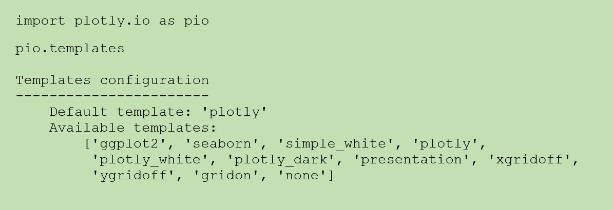
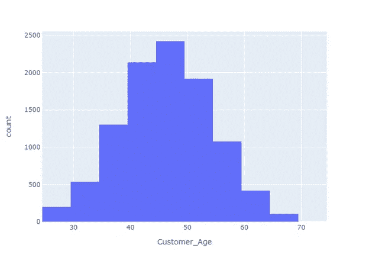
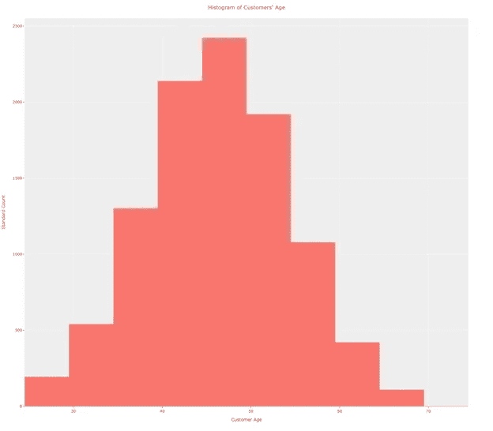
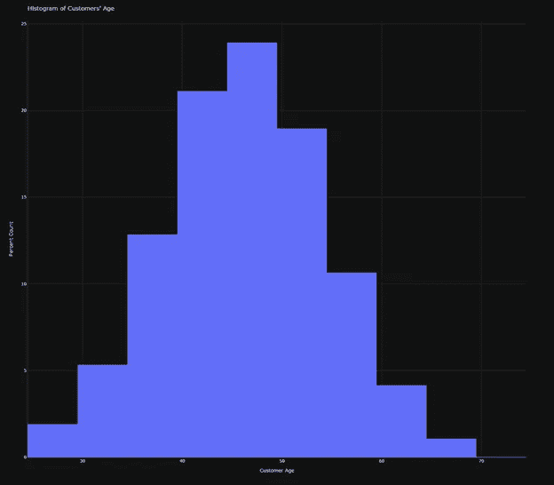
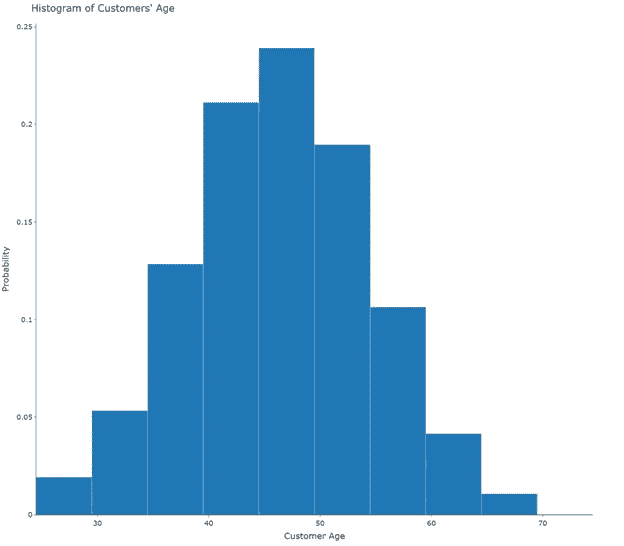
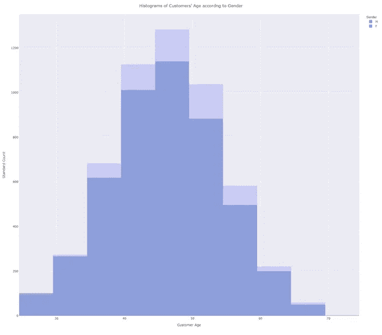
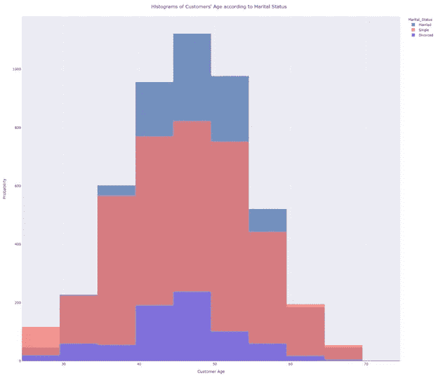
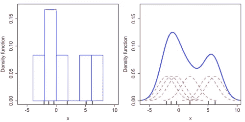

# 用 Plotly 表示的直方图

> 原文：<https://towardsdatascience.com/histograms-with-plotly-express-e9e134ae37ad?source=collection_archive---------37----------------------->

## **主题&模板**


图片来自 Unsplash 的 Jayson Hinrichsen

# **阴谋地表达**

**Plotly Express (PE)是 Plotly.py 的高级包装器，与 Plotly 生态系统的其余部分完全兼容**。基于 JavaScript 库 [D3.js](https://d3js.org/) 。，它也有 R、Julia 和许多其他编程语言的 API 包装器。它是免费的，可以用于商业应用和产品。该库包括绘制标准图表和地图的函数，以及通过单个函数调用执行刻面和动画的函数。使用 Plotly Express，您可以在线制作交互式图形，也可以离线保存。

Plotly Express 适用于快速生成探索图。此外，可以通过使用预定义的**主题或模板**快速设计图表。根据 Plotly 主网站，“主题化通常是指为视觉元素定义默认样式的过程。plotly 中的主题是使用称为模板的对象实现的。模板比传统的主题更通用，因为除了定义默认样式，模板还可以用视觉元素(如注释、形状、图像等)预先填充图形。”[1].

内置主题可以通过以下语句查看:



共有 11 个模板: `ggplot2, seaborn, plotly, plotly_white, plotly_dark, simple_white, gridon, xgridoff, ygridoff, presentation, and none.` `*ggplot2*`*主题灵感来自 R 数据可视化包 [ggplot2、](https://www.r-graph-gallery.com/ggplot2-package.html)而`*seaborn*` 主题灵感来自 Python 数据可视化库 [Seaborn](https://seaborn.pydata.org/) 。`plotly, plotly_white, and plotly_dark`均为原创 *plotly.express* 主题。如上所述，`plotly`是默认模板，而`plotly_dark`的灵感来自于 [JupyterLab](https://jupyter.org/) 的黑暗主题。以下三个主题与网格的有无有关:`gridon, xgridoff, ygridoff`。是一个清晰整洁的图表的极简模板。`presentation` 主题增加了字体、标记和线条宽度的大小，以便从更远的距离观看。这个主题可以与任何其他主题相结合(见图 6)。*

*以上每一个主题都可以作为任何`*plotly.express*`函数的模板参数。所以，一个聪明的策略是反复测试这 11 个主题，直到你找到最适合你讲故事的主题。*

# ***直方图***

*直方图是数据集分布的图形表示。虽然它的外观类似于标准条形图，但直方图不是在不同项目或类别之间进行比较，也不是显示一段时间内的趋势，而是一种图表，它让您显示潜在的频率分布或单个**连续数值变量的**概率分布**。***

*直方图是具有两个轴的二维图；垂直轴是频率轴，而水平轴被分成一系列数值(间隔或**箱**)或时间间隔。每个仓的频率由垂直矩形条的面积表示。每个柱覆盖了所研究变量的连续数值范围。**纵轴** **显示从每个箱的计数中得出的频率值。***

***讲故事**:柱状图是对连续变量进行初步探索的合适图表。通过一组竖条，它显示了该变量的数值是如何分布的。直方图允许我们计算所研究的连续变量的任何值的表示概率，如果我们想从我们的**样本**的结果中进行推断和估计**总体**值，这是非常重要的。*

# ***用 Plotly 表示的直方图***

*我们使用了从 Kaggle [2]下载的数据集。该数据集由 10，000 名银行客户组成，涉及他们的年龄、工资、婚姻状况、信用卡限额、信用卡类别、教育水平和其他特征。银行经理想知道他的客户的年龄分布。下面的代码可以让我们回答他的问题。*

*首先，我们导入`*plotly.express* as *px*`，并将 pandas 库命名为`*pd*`。我们将数据集作为 pandas dataframe ( `df`)加载，并选择列 `Customer_Age` 作为我们想要知道其频率分布的数值变量。使用默认模板`plotly,`用`px.histogram`画图。最后，我们将图表导出为静态的 *PNG* 格式。*

*PE 允许您**选择箱子的数量**。尽管对于间隔的大小和数量没有严格定义的规则，但是您必须尝试一些不同数量的容器。永远记住:很少的间隔不允许我们阐明数据分布的精细结构；许多区间重视抽样误差。*

```
*import pandas as pd
import plotly.express as pxpath = 'your path'
df = pd.read_csv(path + 'CreditCardCustomersCols.csv', index_col =   False, header = 0, sep = ';', engine='python')fig1 = px.histogram(df, x="Customer_Age", nbins = 10)fig1.write_image(path + "fighist1.png")
fig1.show()*
```

*图 1 显示了银行客户在五年内的年龄分布。很明显，百岁人很少，千禧一代也很少。婴儿潮一代和 x 一代是这一代消费者的代表。*

**

*图 1:使用默认模板用 Plotly Express 制作的直方图。图片作者。*

*在图 2 中，我们将主题改为`ggplot2`，并用`update.layout:`设置标题来更新图表；x 轴的名称和 y 轴的名称；用`width`和`height`设定外形尺寸。*

```
*fig2 = px.histogram(df, x="Customer_Age", nbins = 10, template =     'ggplot2')fig2.update_layout(title = "Histogram of Customers' Age ",  xaxis_title = 'Customer Age', yaxis_title = 'Standard Count', width = 1600, height = 1400)fig2.write_image(path + "fighist2.png")
fig2.show()*
```

**

*图 2:使用 ggplot2 模板用 Plotly Express 制作的直方图。图片作者。*

*默认情况下，PE 在纵轴中显示落入每个仓中的数据的频率(计数)。您可以使用`histnorm`参数更改此模式。该参数可以采用以下值:`percent, probability, density, or probability density.`*

*在图 3 中，我们使用`histnorm`参数将主题更改为`plotly_dark`，并将表示模式从样本的标准计数更改为`percent`。*

*在图 4 中，我们将主题改为`simple_white`，将模式改为`probabilty.`*

```
*fig3 = px.histogram(df, x="Customer_Age", nbins = 10, template = 'plotly_dark', histnorm = 'percent')fig3.update_layout(title = "Histogram of Customers' Age ",xaxis_title = 'Customer Age', yaxis_title = 'Percent Count', width = 1600, height = 1400)fig3.write_image(path + "fighist3.png")
fig3.show()fig4 = px.histogram(df, x=”Customer_Age”, nbins = 10, template = ‘simple_white’, histnorm = ‘probability’)fig4.update_layout(title = “Histogram of Customers’ Age “,xaxis_title = ‘Customer Age’, yaxis_title = ‘Probability ‘, width = 1600, height = 1400)fig4.write_image(path + “fighist4.png”)
fig4.show()*
```

**

*图 3:使用 plotly_dark 模板用 Plotly Express 制作的直方图。图片作者。*

**

*图 4:使用 simple_white 模板用 Plotly Express 制作的直方图。图片作者。*

*在图 5 中，我们使用`xgridoff`模板移除了 x 网格线。选择概率密度作为表示方式。在图 6 中，我们回到概率模式，将主题改为`simple_white+presentation`。很明显，字体、标记和线宽都有所增加。*

```
*fig5 = px.histogram(df, x=”Customer_Age”, nbins = 10, template = xgridoff’, histnorm = ‘probability density’)fig5.update_layout(title = “Histogram of Customers’ Age “, xaxis_title = ‘Customer Age’, yaxis_title = ‘Probability Density’, width = 1600, height = 1400)fig5.write_image(path + “fighist5.png”)
fig5.show()fig6 = px.histogram(df, x=”Customer_Age”, nbins = 10, template = ‘simple_white+presentation’, histnorm = ‘probability’)fig6.update_layout(title = “Histogram of Customers’ Age “, xaxis_title = ‘Customer Age’, yaxis_title = ‘Probability ‘, width = 1600, height = 1400)fig6.write_image(path + “fighist6.png”)
fig6.show()*
```

**

*图 5:使用 xgridoff 模板用 Plotly Express 制作的直方图。图片作者。*

**

*图 6:用 Plotly Express 和 simple+演示模板制作的直方图。图片作者。*

***重叠直方图**用于比较两个或多个类别中连续变量的频率分布。尽管 PE 网站指出可以使用参数`color`为一列的不同值绘制几个直方图，但我没有得到合适的图表。因此，我过滤了分类变量“`Gender`”的两个不同值的数据帧，使用了两次`px.histogram` 函数，并用`add_trace`方法“合并”了两个数字。由于`px.histogram` 函数没有文本属性，我们使用参数`color` **只是为了标记**。我们使用不同的主题来识别每个图形，并使用 `barmode = ‘overlay’` 参数来获得重叠。图 7 显示，客户的性别分布没有差异。*

```
*df7a = df[df[‘Gender’] == ‘M’]
df7b = df[df[‘Gender’] == ‘F’]fig7a = px.histogram(df7a, x=”Customer_Age”, nbins = 10, template=‘seaborn’, barmode = ‘overlay’, color = “Gender”)fig7b = px.histogram(df7b, x=”Customer_Age”, nbins = 10, 
template = ‘ggplot2’, opacity = 0.25, color = ‘Gender’)fig7a.update_layout(title = “Histogram of Customers’ Age & Gender”,xaxis_title = ‘Customer Age’, yaxis_title = ‘Standard Count‘, width = 1600, height = 1400)fig7a.add_trace(fig7b.data[0])fig7a.write_image(path + “fighist7.png”)
fig7a.show()*
```

**

*图 7:用 Plotly Express 和 seaborn 和 plotly_dark 模板制作的重叠直方图。图片作者。*

*图 8 示出了根据已婚、单身或离婚条件的分类变量`Marital_Status`的重叠直方图。我们使用了三种不同的模板和颜色参数来识别每个图形。条形模式和不透明度分别用`update_layout`和`update_traces` 表示。*

```
*df8a = df[df[‘Marital_Status’] == ‘Married’]
df8b = df[df[‘Marital_Status’] == ‘Single’]
df8c = df[df[‘Marital_Status’] == ‘Divorced’]fig8a = px.histogram(df8a, x=”Customer_Age”, nbins = 10, template = ‘seaborn’, color = ‘Marital_Status’ )fig8b = px.histogram(df8b, x=”Customer_Age”, nbins = 10, template = ‘ggplot2’, color = ‘Marital_Status’)fig8c = px.histogram(df8c, x=”Customer_Age”, nbins = 10, template = ‘plotly_dark’, color = ‘Marital_Status’)fig8a.update_layout(title = “Histogram of Customers’ Age & Marital Status”,xaxis_title = ‘Customer Age’, yaxis_title = ‘Probability ‘, width = 1600, height = 1400)fig8a.add_trace(fig8b.data[0])
fig8a.add_trace(fig8c.data[0])fig8a.update_layout(barmode=’overlay’)
fig8a.update_traces(opacity = 0.75)fig8a.write_image(path + “fighist8.png”)
fig8a.show()*
```

**

*图 8:使用 seaborn、ggplot2 和 plotly_dark 模板用 Plotly Express 制作的重叠直方图。图片作者。*

# ***一些警告***

*你可以看到(甚至在 PE 网站上)**分类直方图**和**日期直方图**。*

*分类直方图指的是离散变量类别的计数。我不认为它们可以被定义为直方图**，而是柱状图** (BC)。请记住，标准条形图用于在类别之间进行数字比较，而直方图用于**显示数字变量的频率分布**。此外，直方图的条形之间没有“间隙”或空格，但在 BC 上的条形之间必须留有一些空格，以清楚地表明它指的是离散的(互斥的)组。*

*日期直方图也有类似的情况:作为日期范围创建的条块相当于特定年份的平均值，因此条形图或折线图比直方图更适合显示一段时间内的趋势。*

*PE 允许旋转直方图，因此计数在水平轴上，而数值变量的区间或箱在垂直轴上。我没有为这样的安排找到任何技术上的理由，并且它应该被避免，因为它与所有现有的直方图定义相反。*

*最后但同样重要的是，使用带有密度或概率密度值的`histnorm`参数不会转换成密度图。**密度图**试图通过连续曲线显示数据集的概率密度函数。考虑到这个目标，密度图应用了一个统计程序(**内核密度估计**)，其思路是平滑表征直方图的矩形条。结果，获得了平滑的曲线，其允许更好地可视化分布的形状(图 9)。*

**

*图 9:使用相同数据构建的直方图(左)和核密度估计(右)的比较。6 个单独的内核是红色虚线；蓝色曲线是核密度估计。数据点是水平轴上的地毯图。来源:[3]。*

# ***总结一下:***

*Plotly Express 是一个用户友好的数据可视化工具，包括 11 个预定义的主题或模板，以加快工作速度并避免延迟。*

*你可以用一行代码画一个直方图。*

*由于直方图被认为是一些最常用的图表，您必须非常清楚什么时候应该使用直方图，以及直方图和条形图之间的区别。*

# ***参考文献***

*[1]:【https://plotly.com/python/templates/ *

*【2】:[https://www.kaggle.com/sakshigoyal7/credit-card-customers](https://www.kaggle.com/sakshigoyal7/credit-card-customers)*

*【3】:[https://en.wikipedia.org/wiki/Kernel_density_estimation](https://en.wikipedia.org/wiki/Kernel_density_estimation)*