# HITS 算法:从零开始的链接分析解释和 Python 实现

> 原文：<https://towardsdatascience.com/hits-algorithm-link-analysis-explanation-and-python-implementation-61f0762fd7cf?source=collection_archive---------8----------------------->

## 搜索引擎中的枢纽和权威


纳斯蒂亚·杜尔希尔在 [Unsplash](https://unsplash.com?utm_source=medium&utm_medium=referral) 上的照片

# 介绍

我们在日常生活中使用搜索引擎，但你有没有想过搜索引擎是如何找到你正在寻找的理想网站的？这比简单的文本搜索要复杂得多。例如，如果我们正在寻找一个关于苹果的网站，一个充满“苹果”字样的网站会出现在谷歌搜索结果的顶部吗？

**超链接诱导话题搜索** (HITS)是一种用于链接分析的算法。它可以发现和排名与特定搜索相关的网页。这种算法的想法源于这样一个事实，即一个理想的网站应该链接到其他相关的网站，同时也被其他重要的网站所链接。在本文中，我们将简要介绍该算法，并演练 Python 代码的实现。

# 算法

请随意查看评论良好的源代码。这真的有助于理解整个算法。

<https://github.com/chonyy/PageRank-HITS-SimRank>  

首先，我们要解释什么是权威和枢纽。HITS 使用中心和权限来定义网页之间的递归关系。

*   权威:一个节点是高质量的，如果许多高质量的节点链接到它
*   集线器:如果一个节点链接到许多高质量的节点，那么它就是高质量的

## 算法步骤

*   用值 1 初始化每个节点的中心和授权
*   对于每次迭代，更新图中每个节点的中心和权限
*   新的权限是其父权限的总和
*   新的中枢是其子节点的权威总和
*   规范新的权威和枢纽

# Python 实现

## 初始化中心和授权

我们在节点构造函数中初始化 hub 和 authority。auth 和 hub 的初始值是 1。

## 命中一次迭代

这是 HITS 算法的主要功能。如你所见，它真的很好，很短。其中的逻辑遵循我上面提到的算法。

1.  对于图中的每个节点
2.  更新权限
3.  更新中心
4.  标准化更新的值

## 计算新的权限和中心

*   New auth =其所有父中心的总和
*   新中心=其所有子中心的授权总和

## 规范新的权威和枢纽

*   用图中所有节点的 auth 之和来归一化权限
*   用图中所有节点的中心总和来归一化中心

# 结果分析

让我们在回购中的 [***数据集***](https://github.com/chonyy/PageRank-HITS-SimRank/tree/master/dataset) 上测试我们的实现。

## graph_1.txt


图片由 Chonyy 提供。

> ***结果***

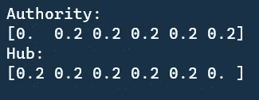

结果按照节点值的顺序，也就是`1, 2, 3, 4, 5, 6`。回想一下上面的解释，权限取决于**有多少节点链接到它**，集线器取决于**有多少节点链接到**。

从结果中，我们可以看出这条规则是成立的。节点 1 的权限为 0，因为没有到它的节点链接。节点 6 的集线器是 0，因为它没有链接到任何节点。

## graph_2.txt


图片由 Chonyy 提供。

> ***结果***

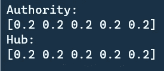

同样，这个回答完全有道理。节点形成一个循环。他们都有一个父母和一个孩子，并且彼此相连。从链接的角度来看，它们基本上都是一样的。这就是为什么他们都有相同的权威和中心价值。

## graph_3.txt


图片由 Chonyy 提供。

> ***结果***

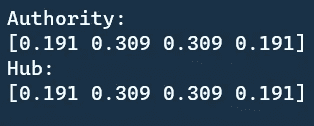

```
Node2, Node3
  - How many nodes link to it: 2
  - How many nodes it links to: 2Node1, Node4
  - How many nodes link to it: 1
  - How many nodes it links to: 1
```

这也是 node2 和 node3 拥有更高权限和枢纽价值的原因。

## graph_4.txt


图片由 Chonyy 提供。

> ***结果***

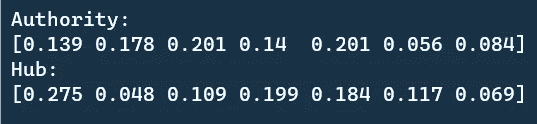

这里有一个有趣的观察。我们来看看 node3 和 node5 的权限。都是`0.201`。有四个节点链接到节点 5，只有三个节点链接到节点 3。但是他们有同样的权力！为什么会这样？

这是因为节点 5 比节点 6 和节点 7 具有更高的集线器。因此，节点 3 只需要节点 5 通过节点 6 和节点 7 获得相同的链接值。

## IBM.txt


图片由 Chonyy 提供。

> ***结果***

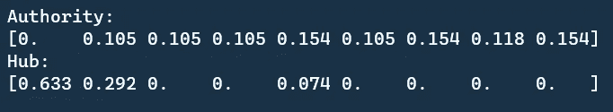

结果遵循节点值顺序`2076, 2564, 4785, 5016, 5793, 6338, 6395, 9484, 9994`。

我们来看看 node4785，node5016，node6338 的权限。它们都有相同的 auth 值 0.105。这是因为它们都有一个共同的父节点 2076。

现在观察轮毂值。节点 2076 具有最高的集线器。这是因为它已经链接到图中的每个节点。节点 4785、节点 5016 和节点 6338 的 hub 值为 0，因为它们绝对没有要链接的子节点。

# 讨论

让我们做一个有趣的实验。假设我们要**增加**每个图中 **node1** 的枢纽和权限。怎么才能做到呢？

## graph_1.txt

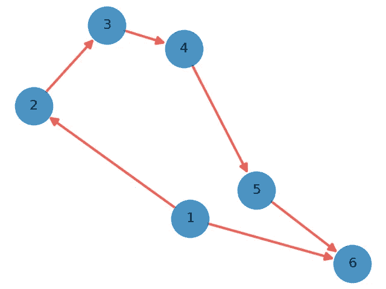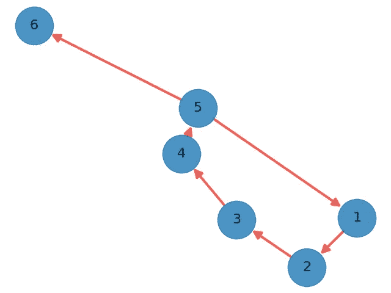

左:增加轮毂。右:增加权威。

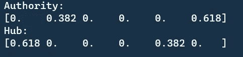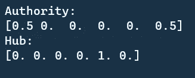

左:增加轮毂。右:增加权威。

Hub 就像是链接到其他节点的力量。因此，我们只需让 node1 链接到另一个节点，以增加它的集线器。通过加入 edge (node1，node6)，hub 值大大增加了 0.2 -> 0.618。

权威就像被链接的力量。我们加上边(node5，node1)，权限值大大增加了 0 -> 0.5。

## graph_2.txt

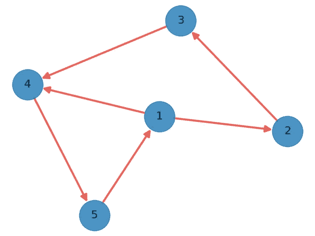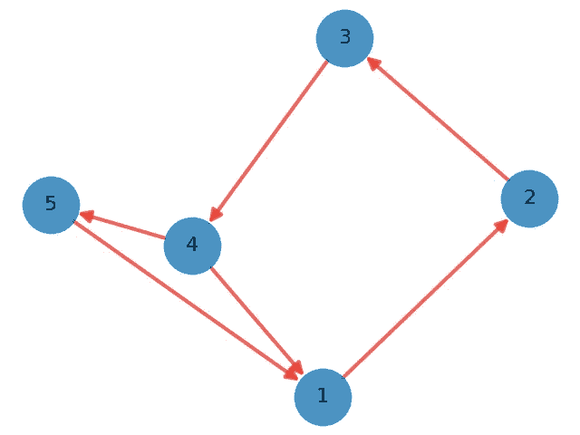

左:增加轮毂。右:增加权威。

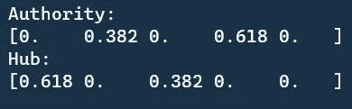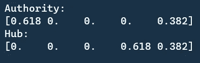

左:增加轮毂。右:增加权威。

原图是一个循环，具有所有同等的权限和枢纽。通过添加额外的边(节点 1、节点 4)，我们增加了节点 1 链接到其他节点的能力。因此，中心值增加了。

类似地，我们通过添加额外的边(node4，node1)增加了 node1 的链接能力。现在，节点 1 有两个父节点。因此，它的权威增加了。

## graph_3.txt

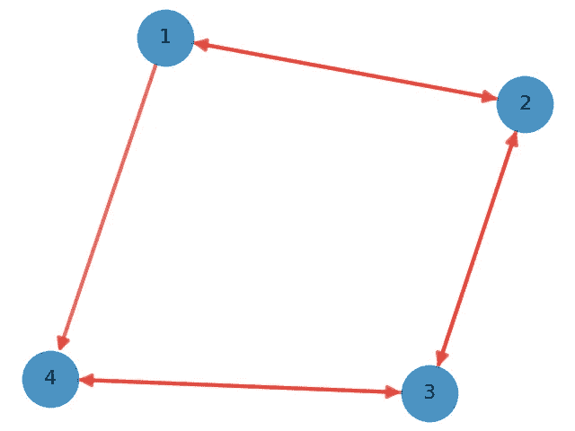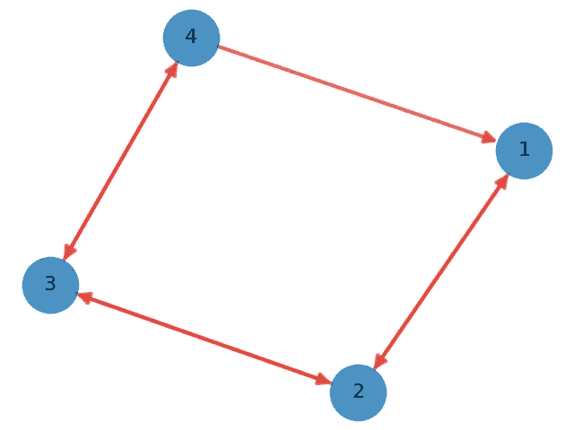

左:增加轮毂。右:增加权威。

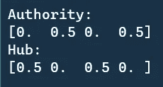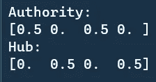

左:增加轮毂。右:增加权威。

与原始图表相比。我们在左图中添加了一条边(节点 1，节点 4 ),在右图中添加了一条边(节点 4，节点 1)。就像我们在上面的图中实现的逻辑一样，我们添加这两条边来分别增加中心和权威。

# **计算性能分析**

## 趋同；聚集

现在，我们都知道，经过足够的迭代，枢纽和权威总是会收敛到一个特定的值。为什么我们不画出来看看它收敛的有多快？

> ***在 graph_4.txt 上测试收敛***

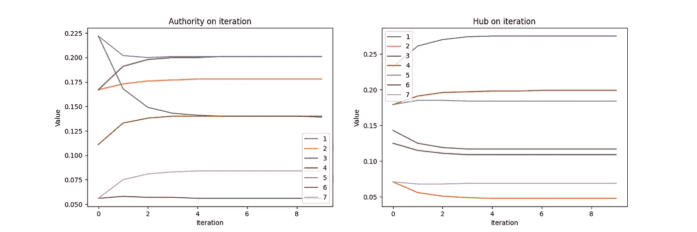

图片由 Chonyy 提供。

从图中，我们可以看到权威和枢纽在迭代 5 时开始收敛。对于一个不那么简单的图形来说，这个计算时间已经足够了。然而，当图中有更多的节点和边时，所需的迭代会大大增加。

例如，对于 graph_6.txt，500 次迭代仍然不够，它有 1228 个节点，5220 条边。并且由于大量的边，计算时间永远很长。

## 边数

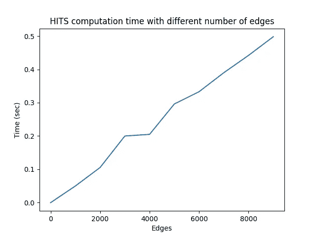

图片由 Chonyy 提供。

我们用不同数量的总边运行 100 次迭代，以便发现总边和计算时间之间的关系。正如你所看到的，边数对计算时间的推断几乎是线性的，这是非常好的。

请注意，它不是完全线性的原因是边彼此链接的方式也会稍微影响计算时间。

# 缺点

HITS 算法的主要缺点是它依赖于查询。从原始论文开始，链接分析是从从一些传统的基于文本的搜索算法中检索的根集合开始的。然后展开根集链接到的站点，这是基础集。

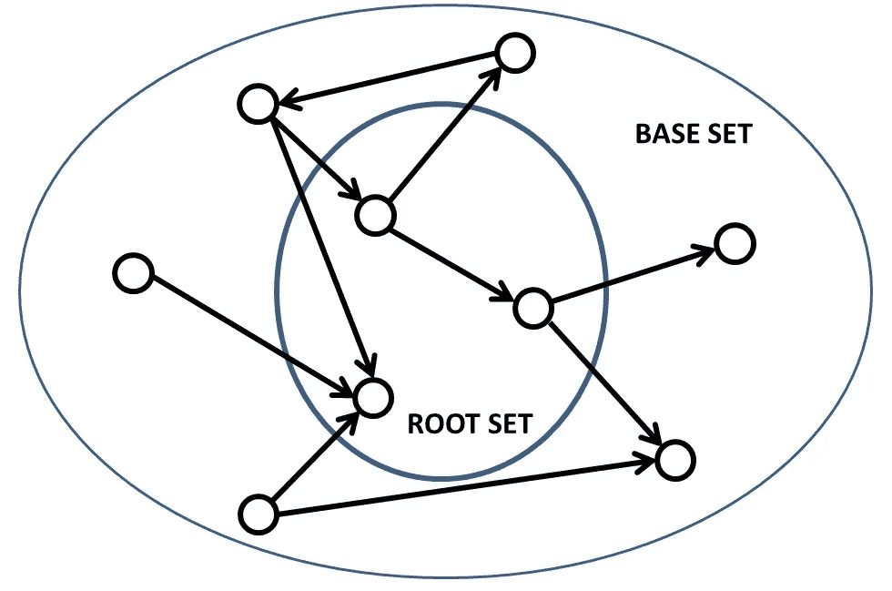

来源:[https://en.wikipedia.org/wiki/HITS_algorithm](https://en.wikipedia.org/wiki/HITS_algorithm)

这可能会很麻烦，因为链接分析的结果可能会受到初始搜索算法的影响。并且基于文本的搜索的评估时间非常昂贵。

因此，我想介绍另一个独立于查询的链接分析算法，PageRank 算法。请随意查看！

<https://chonyy.medium.com/pagerank-3c568a7d2332>  

另外，如果你对链接分析中的相似性度量感兴趣。

<https://chonyy.medium.com/simrank-similarity-analysis-1d8d5a18766a>  

# 源代码

<https://github.com/chonyy/PageRank-HITS-SimRank> 