# HOG(梯度方向直方图):概述

> 原文：<https://towardsdatascience.com/hog-histogram-of-oriented-gradients-67ecd887675f?source=collection_archive---------1----------------------->

## 数学，论文解释和代码从零开始为初学者

# **什么事？**

梯度方向直方图，也称为 HOG，是一种类似 Canny 边缘检测器、SIFT(尺度不变和特征变换)的特征描述符。它在计算机视觉和图像处理中用于目标检测。该技术对图像的局部部分中梯度方向的出现进行计数。这种方法非常类似于边缘方向直方图和尺度不变特征变换(SIFT)。HOG 描述符侧重于对象的结构或形状。它比任何边缘描述符都好，因为它使用梯度的大小和角度来计算特征。对于图像的区域，它使用梯度的大小和方向生成直方图。

# **计算猪特征的步骤**

1.  获取要计算其 HOG 特征的输入图像。将图像大小调整为 128x64 像素(高 128 像素，宽 64 像素)。作者在论文中使用了这个维度，因为他们使用这种类型的检测的主要目的是在行人检测任务中获得更好的结果。由于这篇论文的作者在麻省理工学院行人数据库上获得了异常完美的结果，他们决定制作一个新的、更具挑战性的数据集，称为“INRIA”数据集(http://Pascal . inrialpes . fr/data/human/)，其中包含从一组不同的个人照片中裁剪出来的 1805 张(128x64)人类图像。

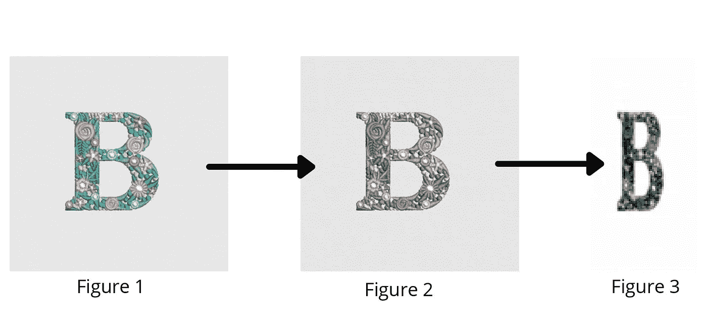

图 1:为获取 HOG 特征而导入的图像。图 2:流程的导入图像灰度。图 3:导入图像的调整大小和灰度图像。(图片由作者提供)

2.计算图像的梯度。通过结合来自图像的幅度和角度来获得梯度。考虑 3x3 像素的块，首先为每个像素计算 Gx 和 Gy。首先，使用下面的公式为每个像素值计算 Gx 和 Gy。

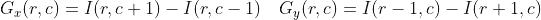

其中 r、c 分别指行和列。(图片由作者提供)

在计算 Gx 和之后，使用下面提到的公式计算每个像素的大小和角度。

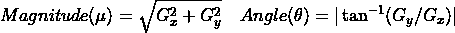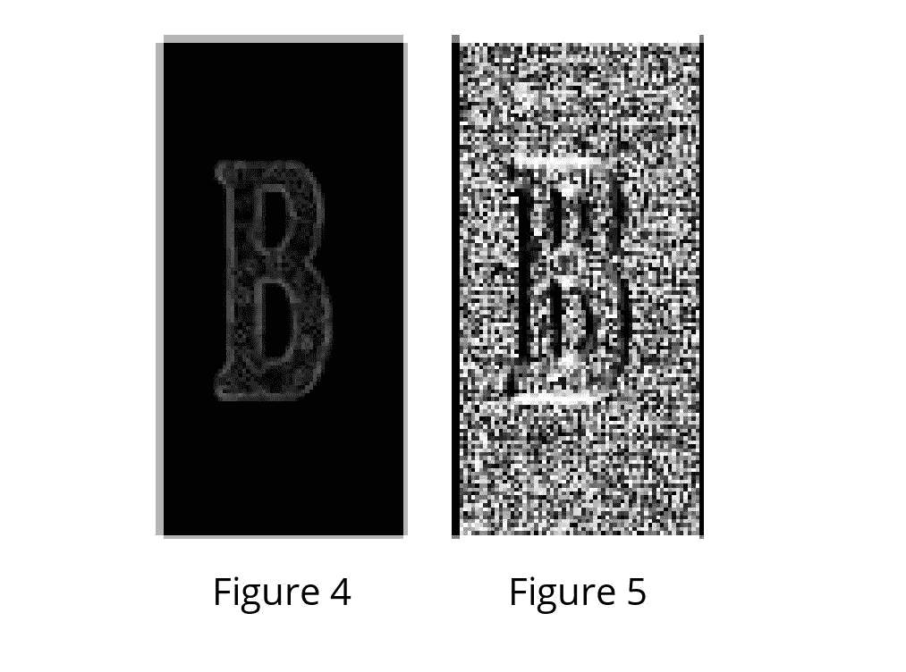

图 4:图像大小的可视化。图 5:图像角度的可视化。(图片由作者提供)

3.在获得每个像素的梯度之后，梯度矩阵(幅度和角度矩阵)被分成 8×8 的单元以形成块。对于每个块，计算 9 点直方图。9 点直方图开发了具有 9 个仓的直方图，并且每个仓具有 20 度的角度范围。图 8 表示一个 9 仓直方图，其中的值是在计算后分配的。这些 9 点直方图中的每一个都可以被绘制成直方图，其中柱输出该柱中梯度的强度。由于一个块包含 64 个不同的值，对于所有 64 个量值和梯度值，执行以下计算。由于我们使用 9 点直方图，因此:

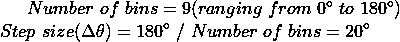

(图片由作者提供)

每个第 j 个面元，面元将具有来自以下的边界:

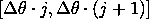

(图片由作者提供)

每个箱的中心值为:

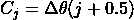

(图片由作者提供)

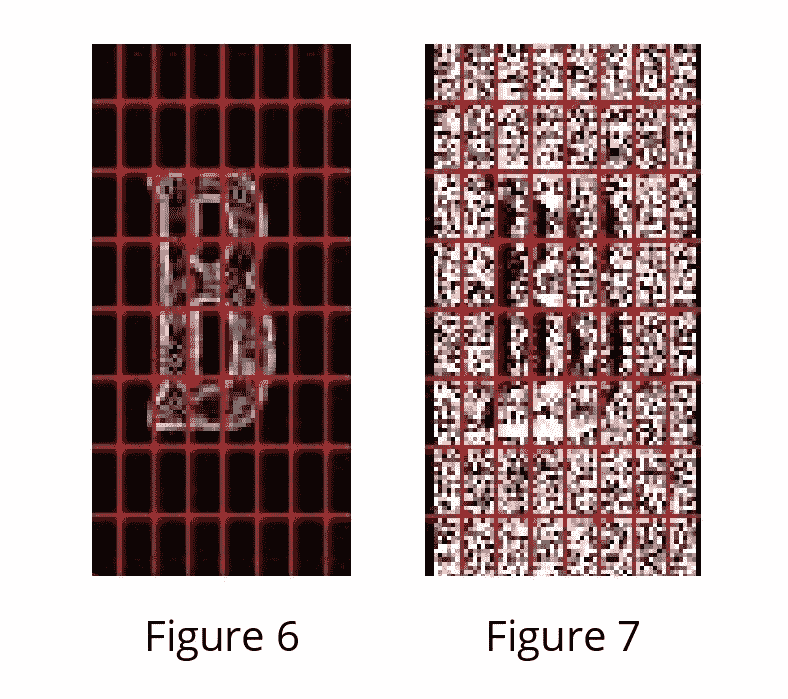

图 6:星等图像上的 8×8 块。图 7:角度图像上的 8×8 块。(图片由作者提供)

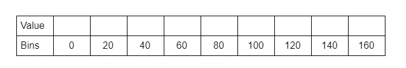

图 8:9 格直方图的表示。对于一个由 64 个单元组成的 8×8 块来说，这一个直方图是唯一的。所有 64 个单元将分别把它们的 Vj 和 Vj+1 值加到数组的第 j 和第(j+1)个索引上。(图片由作者提供)

4.对于块中的每个单元，我们将首先计算第 j 个容器，然后计算将分别提供给第 j 个和第(j+1)个容器的值。该值由以下公式给出:

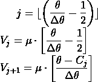

(图片由作者提供)

5.将一个数组作为一个块的二进制数，并将 Vj 和 Vj+1 的值附加到数组中为每个像素计算的第 j 和第(j+1)二进制数的索引处。

6.上述计算后的结果矩阵将具有 16x8x9 的形状。

7.一旦所有块的直方图计算结束，来自 9 点直方图矩阵的 4 个块被组合在一起以形成新的块(2x2)。这种杵状运动以重叠的方式进行，步幅为 8 个像素。对于块中的所有 4 个单元，我们连接每个组成单元的所有 9 个点直方图以形成 36 个特征向量。

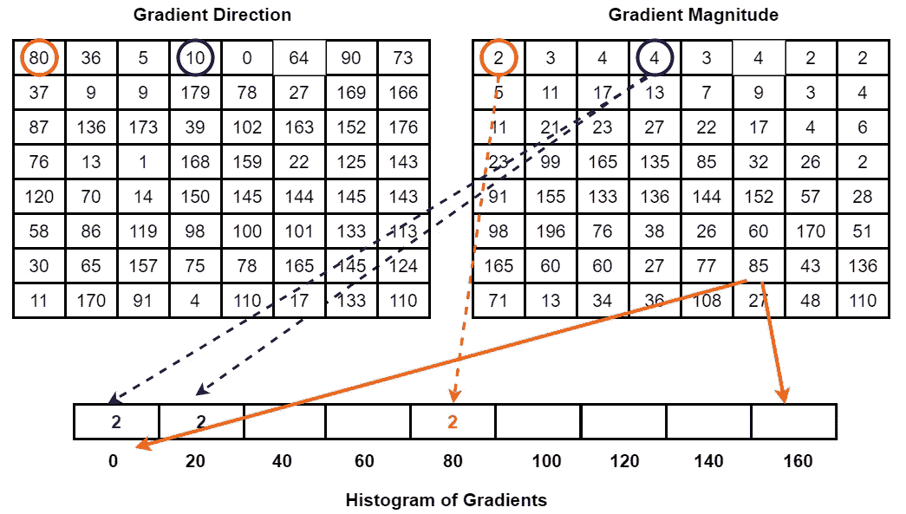

上图显示了计算 9 个柱直方图的方法。(图片由作者提供)灵感来自[[https://www.programmersought.com/article/42554276349/](https://www.programmersought.com/article/42554276349/)

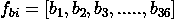

(图片由作者提供)

围绕图像遍历 2x2 网格框，以便从 4 个块中生成一个组合的 fbi。(图片由作者提供)

8.每个块的 fb 值通过 L2 范数归一化:

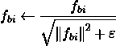

其中，ε是为避免零分频误差而加到 fb 平方上的一个小值。在规范中，取值为 1e-05。(图片由作者提供)

9.为了标准化，首先通过以下公式计算 k 值:

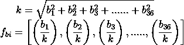

(图片由作者提供)

10.进行这种标准化是为了减少同一物体的图像之间的对比度变化的影响。从每个街区。收集 36 点特征向量。在水平方向有 7 个块，在垂直方向有 15 个块。因此，HOG 特征的总长度将为:7 x 15 x 36 = 3780。获得所选图像的 HOG 特征。

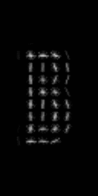

使用 skimage 库在同一图像上可视化 HOG 特征。(图片由作者提供)

# **在 Python 中从头开始使用特性**

# 在 Python 中使用 skimage 库的 HOG 特征

# 代码文件

链接到包含用 python 从头开始编写的 HOG 特征检测器全部代码的 Colab 文件:[https://Colab . research . Google . com/drive/1 _ ydbx 68 ucxejk 448 y0 byoacuzzw 5 hwr？usp =共享](https://colab.research.google.com/drive/1_yDbX68uCxejK448Y0ByOACQUUZw5hWR?usp=sharing)

# **参考文献**

1.  人体检测的方向梯度直方图:[http://lear . inrialpes . fr/people/triggs/pubs/Dalal-cvpr 05 . pdf](http://lear.inrialpes.fr/people/triggs/pubs/Dalal-cvpr05.pdf)
2.  撇除文件:[https://scikit-image.org/docs/dev/api/skimage.feature.html?highlight = hog # skimage . feature . hog](https://scikit-image.org/docs/dev/api/skimage.feature.html?highlight=hog#skimage.feature.hog)
3.  HOG(梯度方向直方图)特征(使用 MATLAB 和 Python 的理论和实现):[https://www.youtube.com/watch?v=QmYJCxJWdEs](https://www.youtube.com/watch?v=QmYJCxJWdEs)

敬请关注像这样的新的研究论文解释！

请随时联系并给出您的建议:[https://www.linkedin.com/in/mrinal-tyagi-02a1351b1/](https://www.linkedin.com/in/mrinal-tyagi-02a1351b1/)

[https://github.com/MrinalTyagi](https://github.com/MrinalTyagi)