# 使用 Alexa 实现家庭自动化

> 原文：<https://towardsdatascience.com/home-automation-with-alexa-69f71524f164?source=collection_archive---------4----------------------->

## 物联网仿真设备的语音命令，使用 Arduino 库 Espalexa。

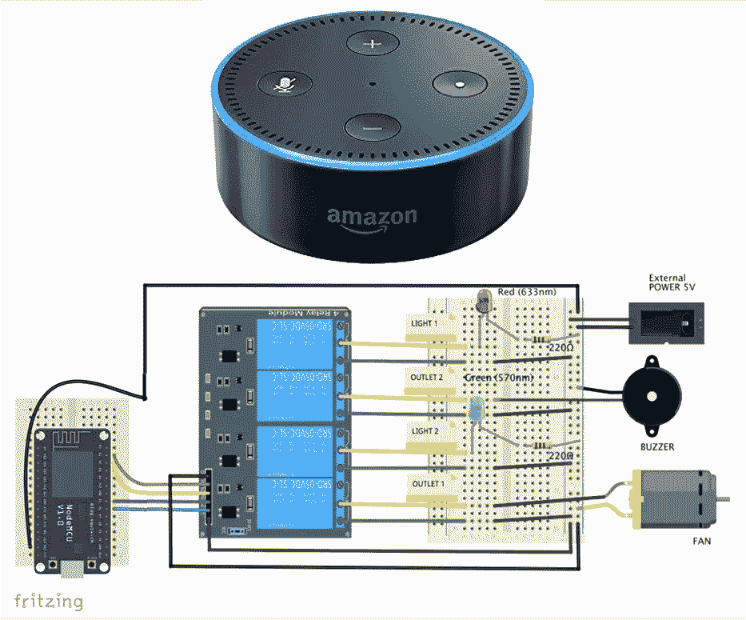

上图:亚马逊第二代 Echo-Dot——下图:作者的最终电路

# 1.介绍

几年前，我探索了如何在家庭自动化项目中使用因亚马逊 Echo 和 Echo-Dot 而流行的智能个人助理 *Alexa，*:

[当物联网遇上人工智能:采用 Alexa 和 NodeMCU 的家庭自动化](https://www.hackster.io/mjrobot/when-iot-meets-ai-home-automation-with-alexa-and-nodemcu-56e5cd)和

[Alexa — NodeMCU: WeMo 仿真变得简单](https://www.hackster.io/mjrobot/alexa-nodemcu-wemo-emulation-made-simple-c6c1f2)

Alexa 能够进行语音交互，播放音乐，制作待办事项列表，设置闹钟，播放播客，播放有声读物，并提供天气，交通和其他实时信息。Alexa 还可以将自己作为家庭自动化中心来控制几个智能设备。我们将在这个项目中使用“回声点”，它允许用户使用唤醒词来激活设备，如“Alexa”或“计算机”，如“星际迷航！。

在家庭自动化领域，Alexa 可以与 Philips Hue、Belkin Wemo、Sonoff 等几种不同的设备进行交互。我们在以前的项目中使用 fauxmoESP 库模拟了 WeMo 设备，这似乎已经过时了，而且现在也没有得到足够的维护。这里我们将使用 [Espalexa](https://github.com/Aircoookie/Espalexa) ，这是一个易于使用的 Arduino 库，与 ESP8266 和 ESP32 都兼容。

下面的框图显示了我们的项目将会开发什么:

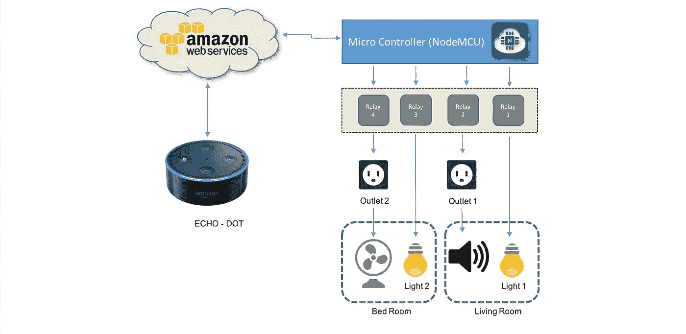

框图—作者提供的图片

下面的视频展示了项目结束时的样子:

# 2.安装 ESP 板

在 Arduino IDE 首选项→附加电路板管理器 URL 中输入:

```
https://dl.espressif.com/dl/package_esp32_index.json, [http://arduino.esp8266.com/stable/package_esp8266com_index.json](http://arduino.esp8266.com/stable/package_esp8266com_index.json)
```

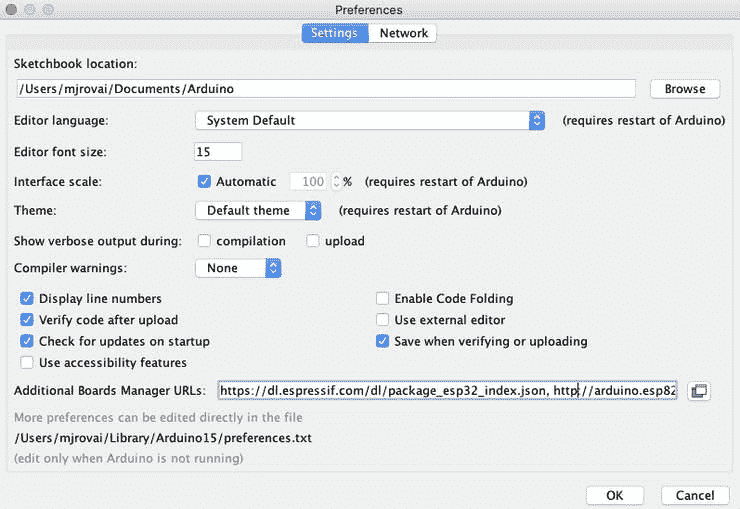

Arduino IDE 首选项—打印屏幕

接下来，在 Arduino IDE 工具/板管理器中，安装板:

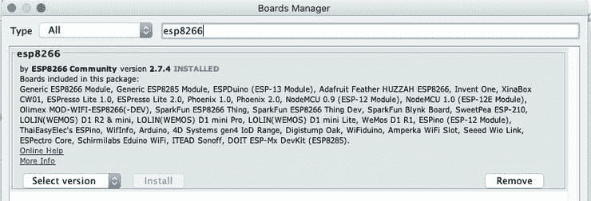

Arduino IDE 板管理器—打印屏幕

在这个项目中，我们将使用 NodeMCU，但是代码也可以很容易地适应 ESP32。那么，让我们也安装它:

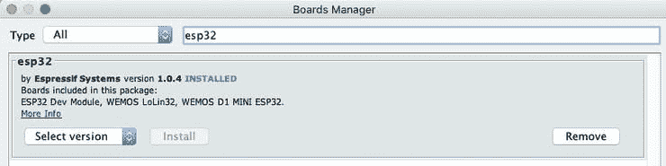

Arduino IDE 板管理器—打印屏幕

**esp 8266 node MCU 引脚排列:**

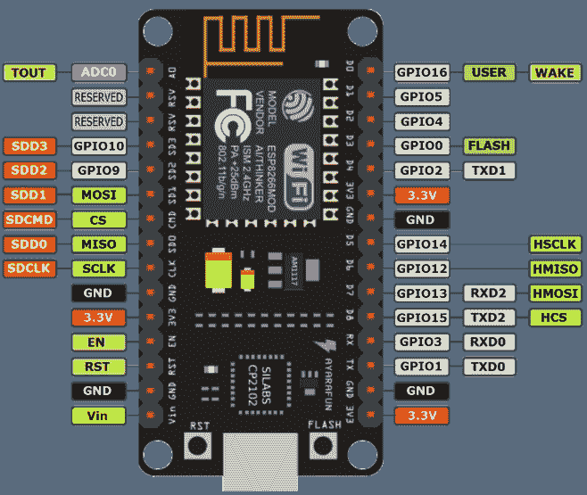

ESP8266 节点 MCU 引脚排列—图片由 Amazon.com 提供

# 3.埃斯帕莱克萨图书馆

除了标准的开/关控制之外，Espalexa 还允许您设置一系列值(例如，亮度、温度)和可选的颜色。比如你可以说————*“Alexa，把灯光调到 75%”。*

Espalexa 模拟了 SSDP 协议和 [Philips hue API 的部分内容，](https://www.burgestrand.se/hue-api/)刚好足以被 alexa 发现和控制。

默认情况下，最多可以添加 10 个设备，因为每个设备“插槽”都占用内存，即使没有设备被初始化。您可以通过添加来更改设备的最大数量，例如:

```
#define ESPALEXA_MAXDEVICES 20
```

在调用库之前:

```
#include <Espalexa.h>
```

> *建议将 MAXDEVICES 设置为您想要添加的设备的确切数量，以优化内存使用。*

要安装库，请转到 Arduino IDE 工具/管理库，并使用 espalexa 进入:

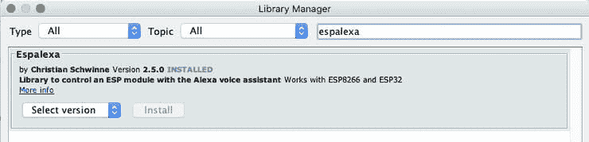

Arduino IDE 库管理器—打印屏幕

# 4.家庭自动化原型

我们的家庭自动化项目将创建四个智能设备工作，可以单独远程控制。但是，假设我们想要将设备分组，以便在家中使用。应该怎么做？

例如，假设我们家有两个房间:

*   卧室
*   客厅

现在，假设您希望每个房间都有一盏灯和一个插座。因此，让我们将四个设备分组，如框图所示(见本文简介):

**床房**

*   灯 2
*   出口 1(风扇)

**客厅**

*   灯光 1
*   出口 2(蜂鸣器)

欧的家庭自动化项目或多或少会是这样:

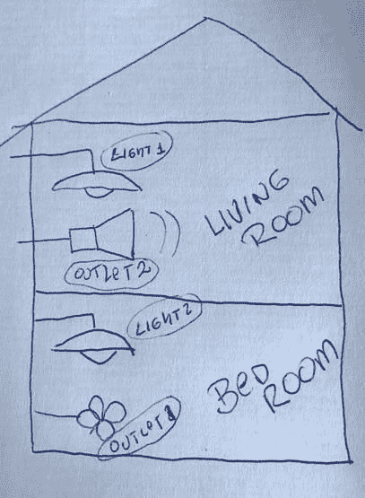

房屋原型及其物联网设备—图片由作者提供

# 5.组装硬件进行测试

出于测试目的，四种颜色的 led 将用作“物联网设备”。它们应如图所示安装，如下所列:

== >红色 LED(灯 1) == >节点 MCU D1 (GPIO5) —客厅

== >绿色 LED (Outlet1) == >节点 MCU D2 (GPIO4) —客厅

== >蓝色 LED(灯 2) == >节点 MCU D5 (GPIO14) —卧室

== >黄色 LED(输出 2) == >节点 MCU D6 (GPIO12) —卧室

红色和绿色的 led 将模拟安装在“起居室”的设备，蓝色和黄色的 led 将模拟安装在“卧室”的设备

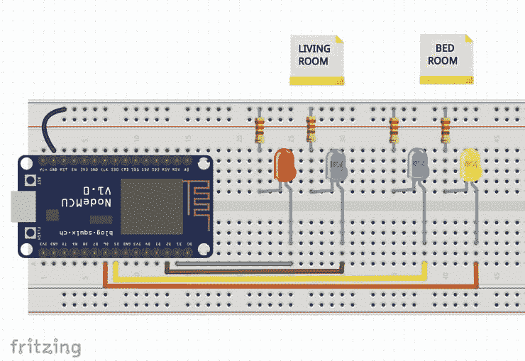

电路图—图片由作者提供

# 6.在 Arduino IDE 上创建我们的物联网设备

首先，我们必须调用库:

```
#include <ESP8266WiFi.h>
#include <Espalexa.h>
```

要连接到设备的 NodeMCU 引脚定义如下(在测试阶段为 led，在最终项目阶段为继电器输入):

```
#define RelayPin1 5  //D1
#define RelayPin2 4  //D2
#define RelayPin3 14 //D5
#define RelayPin4 12 //D6
```

一旦我们有了 4 个设备，至少应该定义 4 个直接回调函数:

```
void device1Changed(uint8_t brightness);
void device2Changed(uint8_t brightness);
void device3Changed(uint8_t brightness);
void device4Changed(uint8_t brightness);
```

> *亮度*参数包含新的设备状态(0:关，255:开，1–254:暗),当调用回调函数时，Alexa 将发送该状态。**

*但是回调函数可以是在 Alexa 命令下执行的任何函数，因此我们将在这里定义三个要调用的附加特殊函数，这些函数将处理多个物联网设备:*

```
*void devFunc1Changed(uint8_t brightness);
void devFunc2Changed(uint8_t brightness);
void devFunc3Changed(uint8_t brightness);*
```

*上述回调函数将与以下内容相关联:*

*   *所有家用设备(照明 1、照明 2、输出 1 和输出 2)*
*   *客厅(照明 1 和出口 1)*
*   *卧室(灯 2 和出口 2)*

*因此，Alexa 事实上将处理七个“物联网设备”。对于它们中的每一个，我们必须定义一个独特的名称，由 Alexa 调用:*

```
*// device names
String Device_1_Name = "Red light";
String Device_2_Name = "Green light";
String Device_3_Name = "Blue light";
String Device_4_Name = "Yellow light";// device_function names
String Dev_Func_1_Name = "Living Room";
String Dev_Func_2_Name = "Bed Room";
String Dev_Func_3_Name = "All Home Devices";*
```

> **在测试阶段，我们将用“{其颜色}光”来称呼 led。在我们的最终项目中，我们可以通过变量的最终名称来改变这些变量(“Light 1”、“Outlet2”等)。**

*最后但同样重要的是，我们应该声明 espalexa 要使用的变量:*

```
*Espalexa espalexa;*
```

*对于交流:*

```
*boolean connectWifi();
boolean wifiConnected = false;
const char* ssid = "YOUR SSID HERE";
const char* password = "YOUR PASSWORD HERE";*
```

*在设置阶段，除了通常的 pin 和串行秃率定义以及通信启动程序之外，您还应该正确关联每个物联网设备及其名称，并启动 espalexa:*

```
*// Define your devices here.
espalexa.addDevice(Device_1_Name, device1Changed);
espalexa.addDevice(Device_2_Name, device2Changed);
espalexa.addDevice(Device_3_Name, device3Changed);
espalexa.addDevice(Device_4_Name, device4Changed);// Define your devices functions here.
espalexa.addDevice(Dev_Func_1_Name, devFunc1Changed);
espalexa.addDevice(Dev_Func_2_Name, devFunc2Changed);
espalexa.addDevice(Dev_Func_3_Name, devFunc3Changed);espalexa.begin();*
```

*循环函数应该非常简单:*

```
*void loop()
{
  espalexa.loop();
  delay(1);
}*
```

*最后一个程序将是创建回调函数，或者更好，当 Alexa 发送命令时必须做什么。*

*以下回调函数可适用于所有四种物联网设备:*

```
*void deviceNChanged(uint8_t brightness)
{
  //Control the device 
  if (brightness == 255)
    {
      digitalWrite(RelayPinN, HIGH);
      Serial.println("DeviceN ON");
    }
  else
  {
    digitalWrite(RelayPinN, LOW);
    Serial.println("DeviceN OFF");
  }
}*
```

*将上面代码中的“N”更改为 1、2、3 和 4 将会有四个直接回调函数。请记住，Alexa 发送的亮度参数包含新的设备状态，它将是:*

*   *0 == >关；*
*   *255 == >开*
*   *1 到 254 == >“暗灯”。*

*我们可以将上述简单的开关功能扩展为一种特殊的功能，在这种功能中可以控制光的强度。我们将为设备 1(红色 LED)执行此操作:*

```
*void device1Changed(uint8_t brightness)
{
  //Control the device
  if (brightness == 255)
  {
    digitalWrite(RelayPin1, HIGH);
    Serial.println("Device1 ON");
  }
  else if (brightness == 0)
  {
    digitalWrite(RelayPin1, LOW);
    Serial.println("Device1 OFF");
  }
  else
  {
    int brigh_perc = (brightness/255.)*100;
    analogWrite(RelayPin1, brightness);
    Serial.print("Device1 Brightness: ");
    Serial.print(brigh_perc);
    Serial.println("%");
  }
}*
```

> **请记住，NodeMCU 具有 PWM 输出，可用于 Arduino analogWrite()函数。如果使用 ESP32，则当 analogWrite()不可用时，应创建 PWM 功能。**

*完整的代码可以从我的 GitHub 下载:[Alexa _ node MCU _ Home _ Automation](https://github.com/Mjrovai/Alexa_NodeMCU_Home_Automation)*

> **不要忘记用你自己的证书来更改虚拟 wifi 证书。**

*在 Arduino IDE 上编译代码并上传到 NodeMCU 后，您可以在串行监视器上看到交换的消息。一旦 NodeMCU 连接到您的 wifi，应该会出现类似的消息(包含您的网络数据):*

*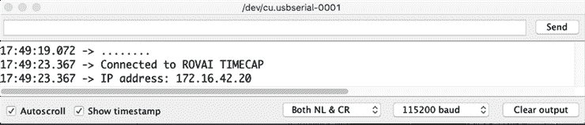*

*Arduino IDE 串行监视器打印屏幕*

> **我们认为您已经在与 NodeMcu 连接的* ***相同的网络上充分安装了 Alexa。****

*现在，让我们请 Alexa 找到您的设备。有两种方法可以做到:*

*   *使用智能手机中的 Alexa 应用程序*
*   *要求 Alexa 使用语音命令直接完成，比如:“ *Alexa、* *发现设备*”。*

*45 秒后，您应该会收到 Alexa 确认信息，确认发现了**七个设备**。你可以在应用程序“灯光标签”上看到如下内容:*

*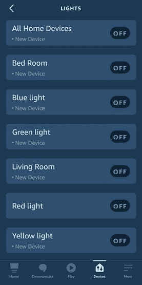*

*Alexa 应用程序(设备选项卡)—打印屏幕*

*一旦 Alexa 发现了你的设备，你可以给她语音命令，如下所示:*

*下面的屏幕截图显示了串行监视器的响应。*

*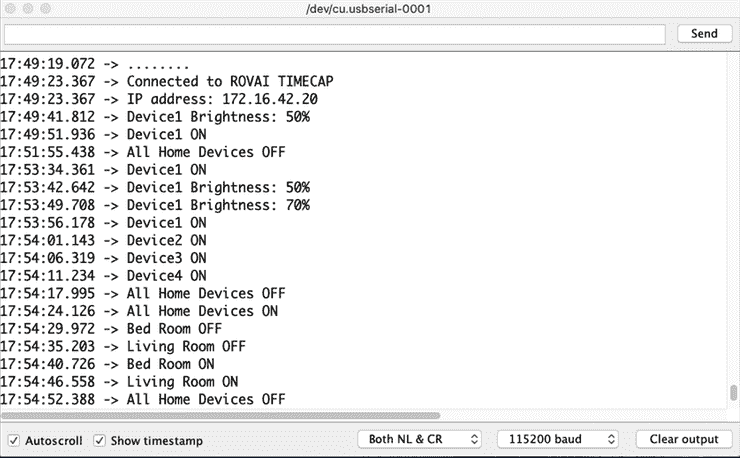*

*Arduino IDE 串行监视器打印屏幕*

# *7.组装完整的硬件*

*输出 GPIOs 应连接到 4 通道继电器模型，而不是 led 和电阻，如下所示:*

*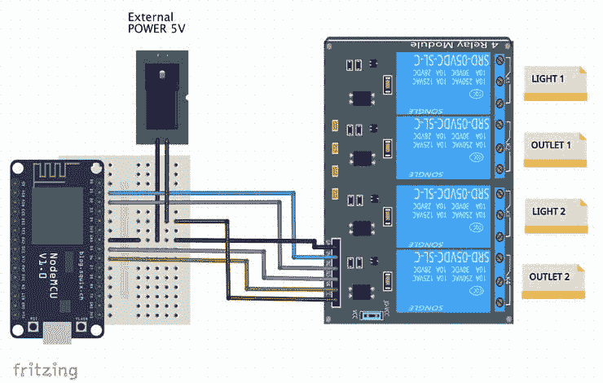*

*电路图—图片由作者提供*

> **不要直接从 NodeMcu 5V 输出引脚给继电器模块供电。请改用外部电源。一个 1A 电源应该足够了。如果使用其他版本，请与继电器模块制造商确认。不要忘记将所有的 gnd 连接在一起。**

*原则上，可以使用为测试开发的相同代码，但是您必须确认继电器模块的逻辑。例如，在上述模块中，您应该保持输入“打开”或高电平，变为低电平以激活继电器输出。因此，代码必须相应地改变。*

*   *在 setup()阶段，将 GPIOs 输出定义为高电平*
*   *回调函数从高变低，反之亦然*

*您可以通过输出继电器关闭的声音和模块中的红色 led 来确认继电器是否正常工作。*

*一旦一切正常，就可以完成我们的“智能设备”的安装了，它们是两个固定的“灯”和两个“通用插座”，让我们对它们进行适当的重命名:*

*   *点燃一个*
*   *轻二*
*   *一号出口*
*   *二号出口*

```
*// device names
String Device_1_Name = "Light One"; 
String Device_2_Name = "Light Two";
String Device_3_Name = "Outlet One";
String Device_4_Name = "Outlet Two";*
```

*如本教程开头的视频所示，为了完成我们的项目，请连接一些由继电器控制的设备。在我的例子中，我使用两个 led 作为灯，并在插座 1 上连接一个风扇，在插座 2 上连接一个蜂鸣器(例如，模拟像收音机这样的设备)。下图显示了安装的设备。*

*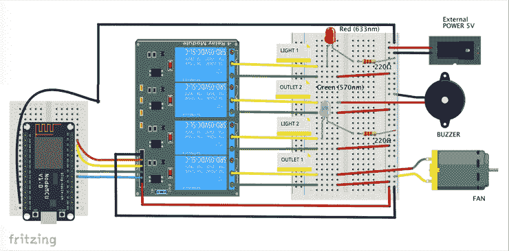*

*电路图—图片由作者提供*

> **请注意，一旦继电器能够处理它们，您就可以安装真正的交流灯和电器来使用 Alexa 进行控制。**

# *8.关于“设备功能”的最后考虑*

*从模拟简单物联网设备的概念开始，如 WeMo 或飞利浦 Hue，我们还使用 Alexa“触发”更复杂的功能，“设备功能”。在这些功能上，多个输出被用作按房间划分的一组设备。*

*在我的教程中，[电脑，发射所有武器，](https://www.hackster.io/mjrobot/computer-firing-all-weapons-cc962e)星际迷航企业的一些武器，比如光子鱼雷和相位炮，就是用这样的函数模拟的。*

*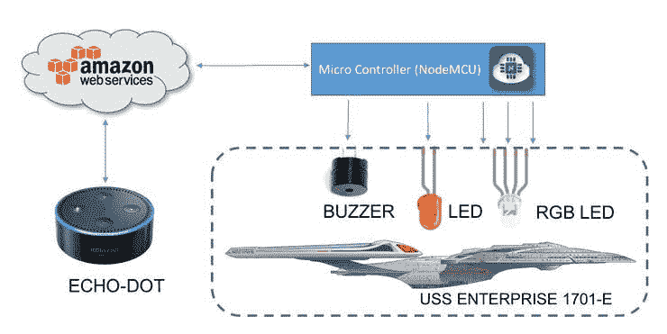*

*框图—作者提供的图片*

*这是物联网领域有待探索的强大工具，在这里，一个简单的语音命令可以触发使用微控制器的更复杂的过程，正如可以在下面的视频中看到的那样(这里使用了“计算机”wake-word 而不是“Alexa”):*

# *结论*

**

*一如既往，我希望这个项目可以帮助其他人在激动人心的电子和物联网世界中找到自己的路！*

*更新文件请访问我的 GitHub:[Alexa _ node MCU _ Home _ Automation](https://github.com/Mjrovai/Alexa_NodeMCU_Home_Automation)*

*更多项目，请访问我的博客:[MJRoBot.org](https://mjrobot.org/)*

*来自世界南部的 Saludos！*

*我的下一篇文章再见！*

*谢谢你*

*马塞洛*