# 主场优势:没有粉丝还存在吗？

> 原文：<https://towardsdatascience.com/home-field-advantage-does-it-exist-without-fans-a0778c5a6a29?source=collection_archive---------14----------------------->

## [实践教程](https://towardsdatascience.com/tagged/hands-on-tutorials)

## 疫情时代之前和期间的数据和统计


照片由[马太·亨利](https://burst.shopify.com/@matthew_henry?utm_campaign=photo_credit&utm_content=Free+Fan+With+Sign+At+Soccer+Game+Photo+%E2%80%94+High+Res+Pictures&utm_medium=referral&utm_source=credit)从[爆出](https://burst.shopify.com/api-fitness-sports?utm_campaign=photo_credit&utm_content=Free+Fan+With+Sign+At+Soccer+Game+Photo+%E2%80%94+High+Res+Pictures&utm_medium=referral&utm_source=credit)

在大多数运动项目中，人们普遍认为主队对客队有显著优势，俗称主场优势。这可能是由多种因素造成的，但两个最受欢迎的原因是**粉丝的出现**和**玩家对环境的熟悉和舒适**。后者的一个标志性例子是波士顿红袜队在芬威公园的“绿色怪物”墙。然而，一些研究和数据表明，球员熟悉度是主场优势效应的一个令人惊讶的微弱预测因素。

因此，还有一个最受支持的原因，那就是粉丝的存在。有趣的是，在疫情冠状病毒爆发时，大多数体育场都不对公众开放，主场优势似乎也逐渐消失了。这为分析这个自然实验创造了一个理想的场景。

我想回答的问题很简单:我能使用数据分析和统计推断来衡量球迷在足球比赛中对主队的影响吗？我会那样做的。而我会重点关注英格兰的英超数据。

# 为什么是足球？为什么是英超？

在选择要调查的运动之前，我考虑了世界顶级联赛中的一些主要运动，每个运动都有一些缺点:

*   **篮球**——鉴于漫长的赛季和室内体育场吸引了喧闹而充满活力的球迷，NBA 起初似乎是一个不错的选择。然而，在他们 19-20 赛季的重新开始阶段，所有的比赛都是在奥兰多泡泡里进行的，所以没有真正的“主场”。
*   **棒球**——疫情开始的时候，MLB 赛季还没有开始，相对于其他运动，主场优势通常并不高。
*   **美式足球** —相对于其他运动，NFL 赛季非常短，不会为我们提供大量实验数据。

足球似乎是最值得研究的运动，特别是因为它的主场优势在大多数运动中是最强的，而且闭门比赛的次数也足够多。我会选择英超联赛，因为它往往有更多平衡的球队，这意味着更多的球队可以在特定的日子里击败另一支球队，并在特定的赛季中位居联赛榜首。在其他大联盟，如德甲或西甲，每年似乎都有 2-3 支球队占据主导地位。你知道我指的是哪些团队。

# 最初的假设或期望

在收集我需要的数据之前，我对在没有球迷的比赛中看到的数据有一些猜测:

*   主场优势减少，意味着进球和得分减少
*   一场更加平衡的比赛，对客队的犯规更少，因为裁判不会受到吵闹或心烦意乱的球迷的压力
*   主队付出的努力越少，导致比赛最后几分钟射门次数和进球次数越少

# 数据:Python 中的集合

**数据**:2019-2021 年的比赛(2019 年 8 月 9 日-2021 年 3 月 15 日)

我将使用由[奥特维奥·西莫斯·西尔维拉](https://medium.com/u/1092aaeb5b32?source=post_page-----a0778c5a6a29--------------------------------)创建的 Python & Selenium scraper，并在此基础上构建以满足我的特定需求。

具体来说，我希望收集每场比赛主客场球队的以下数据:

*   决赛和半场比分
*   比赛数据(控球、黄牌、投篮等。)
*   指示进球得分时间的特定分钟标记

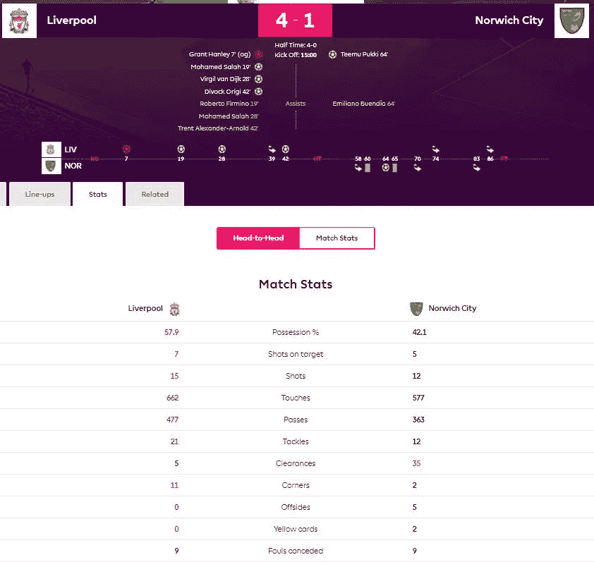

为每个匹配抓取的页面详细信息的示例截图。 ***注:*** [*英超*](https://www.premierleague.com/) *允许提取数据用于非商业用途* [*条款&条件*](https://www.premierleague.com/terms-and-conditions)

你可以在这里找到我用的刮刀[。](https://github.com/bicachu/EPL-fans-presence-experiment/blob/main/premier_league_scraper.py)

# 数据:R 中的预处理

我想做的第一件事是在 R 中进行预处理，并进行一些数据辩论，这将允许我进行所需的分析和实验。

让我们装入必要的包和我们的[数据](https://github.com/bicachu/EPL-fans-presence-experiment/tree/main/data)，确保每场比赛的日期都被正确读取。

```
library(dplyr)
library(ggplot2)
library(ggpubr)
library(lubridate)
library(stringr)
library(zoo)df <- read.csv('data/premier_league_matches.csv') %>% mutate(date = lubridate::as_date(date))
```

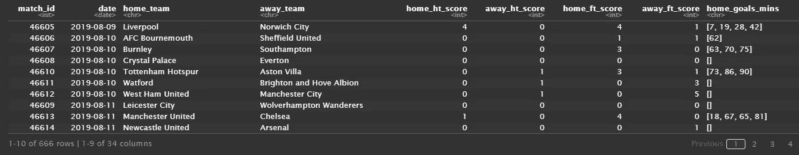

接下来，我们将删除 20-21 赛季期间任何球迷人数有限的比赛。只有少数比赛是在 2020 年 12 月的进行的，当时联赛允许在某些体育场最多容纳 2000 名观众，然后再次恢复完全封闭。这些是具有未知影响的异常值，所以最好不要考虑它们。

```
# matches with limited attendance (2,000 fans) in December 2020
limited_fans_matches <- c(59005, 58999,  59003, 59000, 58997, 59008, 59014, 59007, 59009, 59006, 59024, 59033, 59030, 59026, 59041)df <- df %>% subset(!match_id %in% limited_fans_matches)
```

让我们也创建新的列来跟踪每个队的犯规、得分和结果。

```
df <- df %>% 
  mutate(home_yellow_cards_pct = home_yellow_cards / (home_yellow_cards + away_yellow_cards),
         away_yellow_cards_pct = away_yellow_cards / (home_yellow_cards + away_yellow_cards),
         home_fouls_conceded_pct = home_fouls_conceded / (home_fouls_conceded + away_fouls_conceded),
         away_fouls_conceded_pct = away_fouls_conceded / (home_fouls_conceded + away_fouls_conceded),
         home_points_won = ifelse(home_ft_score > away_ft_score, 3, ifelse(home_ft_score == away_ft_score, 1, 0)),
         away_points_won = ifelse(away_ft_score > home_ft_score, 3, ifelse(away_ft_score == home_ft_score, 1, 0)),
         home_result = ifelse(home_ft_score > away_ft_score, 'W', ifelse(home_ft_score == away_ft_score, 'D', 'L')),
         away_result = ifelse(away_ft_score > home_ft_score, 'W', ifelse(away_ft_score == home_ft_score, 'D', 'L')))
```

为了跟踪进球得分的不同分钟间隔，我们需要转换`home_goal_mins`和`away_goal_mins`中的分钟格式，以便每个值都用逗号分隔。

```
df <- 
df %>% 
mutate(home_possession = home_possession/100,
       away_possession = away_possession/100,
       home_goals_mins = c(str_replace_all(str_sub(home_goals_mins,  
                           2, -2), fixed(" "), "")),
       away_goals_mins = c(str_replace_all(str_sub(away_goals_mins, 
                           2, -2), fixed(" "), ""))) %>%
mutate(across(c('home_goals_mins', 'away_goals_mins'),  
       ~ifelse(.=="", NA, as.character(.))))
```

最后，我们将为我们的实验创建两个相等的数据集(每个数据集 288 场比赛),假设联盟在 2020 年 6 月 17 日开始在没有球迷的情况下比赛:

*   **控制设置:**仅匹配风扇
*   **测试集:**仅匹配无风扇

```
no_fans_df <- df %>% 
  filter(date >= '2020-06-17') %>% arrange(date) %>% head(288) 
no_fans_df['fans_present'] <- 'N'fans_df <- df %>%                           
  filter(date <= '2020-03-09') 
fans_df['fans_present'] <- 'Y'matches_df <- rbind(fans_df, no_fans_df)
```

现在我们有了一个最终的数据帧，它带有我们实验中匹配类型的标签。这样就容易比较两者了！

# 探索性数据分析

我们首先要看的是主客场两队在比赛中的进球分布。进球似乎出现在半场的前几分钟或最后几分钟，原因是注意力不集中、疲劳，以及为了赢得比赛而承担更多风险。在比赛的不同阶段，球迷的能量也可能很高。

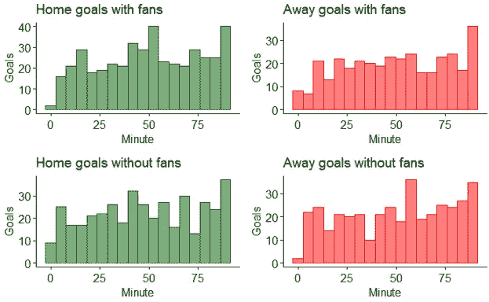

不幸的是，这两种匹配类型之间似乎没有任何真正的区别。大多数进球都是在比赛进行到一半和结束时打进的，这可能是由于加时赛的缘故。

接下来，我们将查看两个数据集之间匹配结果的差异。

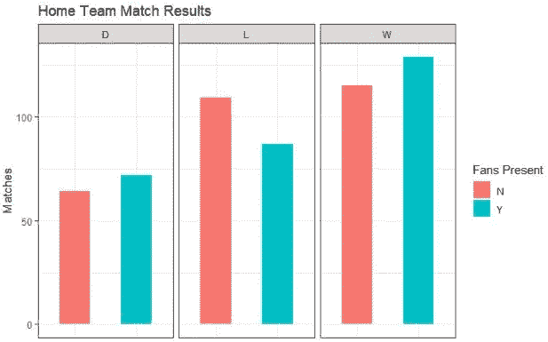

正如猜测的那样，当球迷不在场时，主队赢得的比赛更少，输掉的比赛更多。抽签的次数大致相同。乍一看，这似乎表明观众对主队有积极的影响。

让我们以不同的方式来看待主场胜利，看看获胜分数占总可能分数的比率。我们称之为**主场优势**并按月汇总。

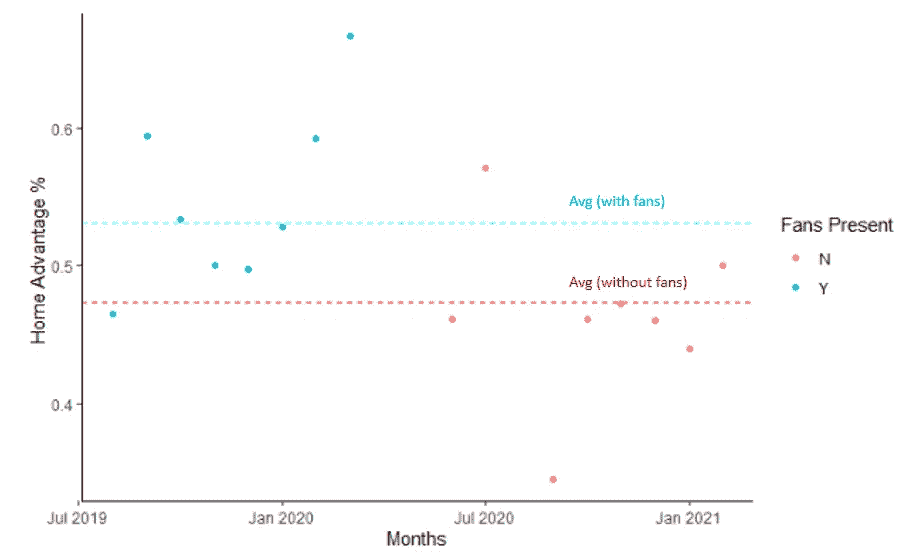

每月赢得的主场积分/可能的总积分比率

再一次，这个图像支持了我们上面的观点，主场优势随着体育场的关闭而逐渐减少。

如果我们在一段时间内用类似的图表绘制一场比赛中客场队的黄牌分布，我们会看到在比赛数据集之间客场队的黄牌数量有更大的差异。当球迷不在的时候，客队似乎要轻松得多！

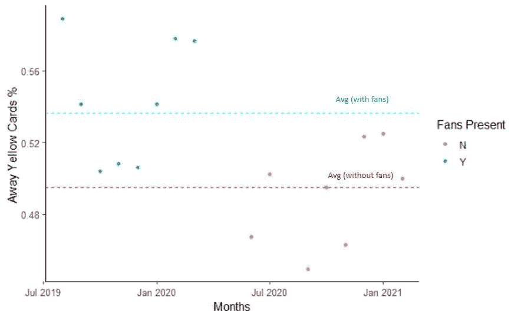

每月发放客场黄牌

我们想看的最后一个方面是主队的总射门次数。

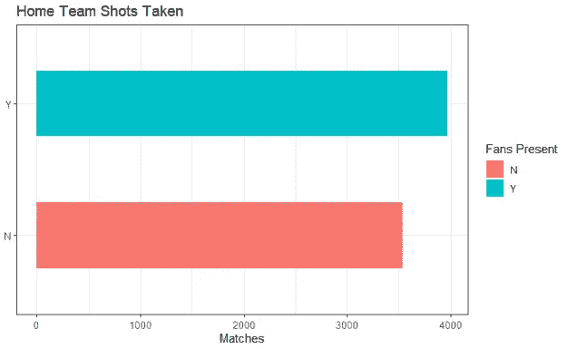

当球迷在场时，主队拍摄的照片大约有 500 张之差。但是有多少镜头是真的对准目标的呢？让我们检查一下。

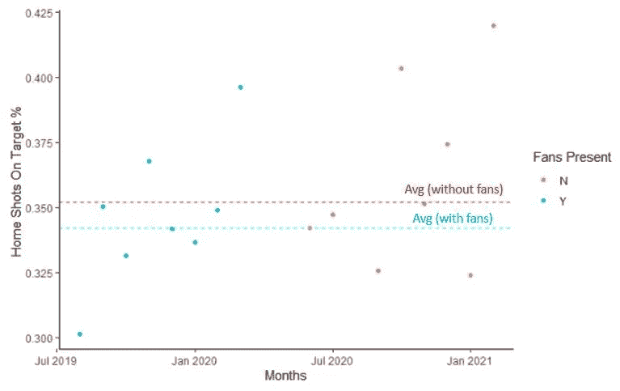

每月的目标命中率

# 假设检验

虽然很容易理解数据可视化，但我们不能仅仅依靠它们来确定粉丝存在与否的意义。为此，我们需要对我们的实验进行统计推断测试。

**统计推断**让我们更加确信，我们在样本数据之间看到的任何差异在一定程度上都是显著的，并且观察到的结果不仅仅是由于偶然。

我们将运行四个测试来观察以下情况:

*   主队得分差异*(主试)*
*   主队犯规次数的差异
*   客队承认的黄牌数量的差异
*   主队射门方式的不同

对于每个测试，我们将首先计算测试的**统计功效**，这将给出当这种差异实际存在于总体中时，测试将发现统计显著差异的概率。换句话说，能力是你应该拒绝零假设的概率。然后，我们将使用学生的 t 检验进行实际的假设检验。我们将对每一个使用 90%的置信区间。

## 功率测试

首先，让我们使用 r 中的`pwr`库计算主测试的功效。我们需要计算每个样本的平均值、总标准偏差和一个称为效应大小的值，该值定义为:

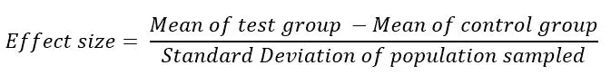

测试的工作方式是，您*必须只设置一个参数*与`NULL`相等，这是在给定其他数据点的情况下您想要计算的参数。

```
library(pwr)meanF <- mean(fans_df$home_points_won)
meanNF <- mean(no_fans_df$home_points_won)
sd <- sd(matches_df$home_points_won)
effect_size <- (meanF — meanNF) / sd
pwr.t.test(n = 288, d = effect_size, sig.level = 0.1, power = NULL, type = “two.sample”)#######OUTPUT########Two-sample t test power calculationn = 288
d = 0.130097
sig.level = 0.1
power = 0.4665975
alternative = two.sidedNOTE: n is number in *each* group
```

我们将对剩余的测试进行同样的操作，并整合结果。

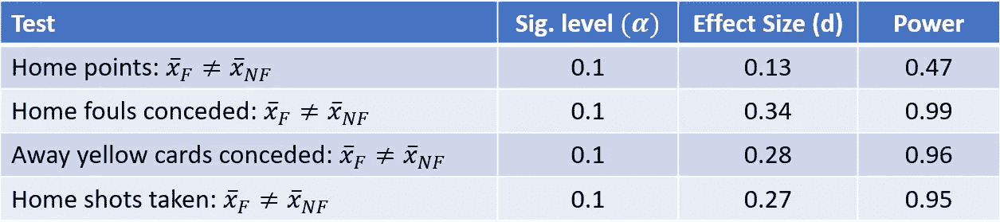

我们如何解读这种力量？一般认为功率应该等于或大于 80%。对于我们与主场得分相关的主要测试，这意味着我们有 47%的机会发现统计上的显著差异。这不是一个好兆头。但是其他测试的功率是 95%或更多，这是有希望的。

## 统计 T 检验

接下来，我们将进行 t 检验，以确定有球迷和没有球迷的主场平均得分是否存在显著差异。

*   **零假设:**两个样本的均值差为 0
*   **备择假设:**均值之差不等于 0。

```
t.test(fans_df$home_points_won, y=no_fans_df$home_points_won, alternative = 'two.sided', conf.level=0.90)#######OUTPUT#######
Welch Two Sample t-testdata:  fans_df$home_points_won and no_fans_df$home_points_won
t = 1.5631, df = 573.85, p-value = 0.1186
alternative hypothesis: true difference in means is not equal to 0
90 percent confidence interval:
 -0.009373031  0.356595254
sample estimates:
mean of x mean of y 
 1.593750  1.420139
```

再一次，我们将对我们所有的假设进行测试。

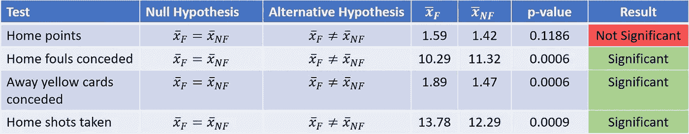

为了达到显著性，计算的 p 值必须小于使用的显著性水平，在本例中为`0.10`，这允许我们拒绝零假设。对于我们与有球迷和没有球迷的主队得分差异相关的主要测试，p 值为`0.1186`,表明没有统计学意义。然而，其余的测试都非常显著，p 值接近 0！

# 总结:主要发现和要点

总的来说，这个实验表明，当球迷缺席时，通常观察到的足球主场优势在某些方面被最小化了。

*   主队往往得分更少(因此得分也更少)，但观察到的数据没有统计学意义来支持这一点。
*   然而，数据确实支持这样的观察，即没有球迷的主场球队会收到更多的犯规，而与之相关的是，客场球队承认的黄牌更少。这是有道理的，因为比赛结果的另一个关键因素是裁判，他受到来自球迷的压力，要判还是不判犯规。
*   此外，在没有球迷压力的情况下，主队的投篮次数要少得多，但这并不一定会导致目标或进球的投篮次数有很大差异。

这些因素都有助于比赛更加平衡，从而减少主场优势。

除了风扇的存在，许多因素也可能影响观察到的结果。例如，两个数据集之间匹配结果的差异可能是不平衡的。如果高质量的球队在一组样本中有更多的客场比赛，这可能会引入更多的偏见。许多人可能会认为球员/教练的技能比比赛是主场还是客场更能决定比赛结果。

建立解决这些偏见的模型，并收集更多关于体育界这种罕见现象的数据，可能有助于提供更多答案。在那之前，球迷似乎会影响足球的主场优势，但不是以我们所期望的最纯粹的方式。

希望你喜欢这个项目。如果对类似的文章感兴趣，可以看看我的另一篇文章。

</the-impact-of-the-fans-on-premier-league-teams-3423f8d8ebae>  

感谢[肯·吉](https://medium.com/u/6ee1f7466557?source=post_page-----a0778c5a6a29--------------------------------)在追求一个体育分析项目中的灵感。如果您有任何问题，请随时在下面评论或通过 [LinkedIn](https://www.linkedin.com/in/bicaj/) 联系我。

# 参考

1.  n .巴尔默、a .内维尔和 s .沃尔森(编辑。).(2005).主场优势【特刊】。体育科学杂志，23 卷 4 期。
2.  卢海德，托德&卡伦，艾伯特&布雷，史蒂文&金，李北。(2003).职业运动中的设施熟悉度和主场优势。国际运动和锻炼心理学杂志。1.264–274.10.1080/1612197X
3.  索尔.麦克劳德。"效果大小。"*单纯心理学*，单纯心理学，2019 年 7 月 10 日，【www.simplypsychology.org/effect-size.html.】T2
4.  奥特维奥·西莫斯·西尔韦拉。"如何建立一个足球数据集与网页抓取."*中*，向上编码，2020 年 10 月 20 日[python . plain English . io/how-to-build-a-football-dataset-with-web-scraping-D4 deffcaa 9 ca](https://python.plainenglish.io/how-to-build-a-football-dataset-with-web-scraping-d4deffcaa9ca)