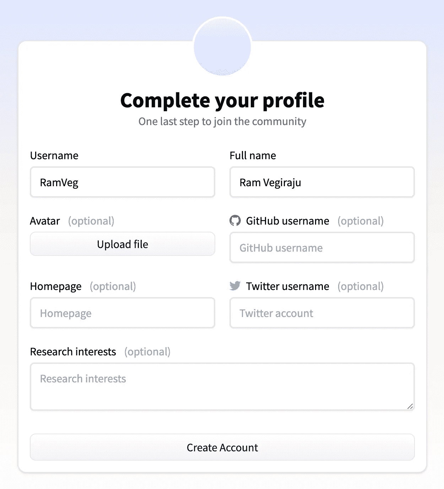
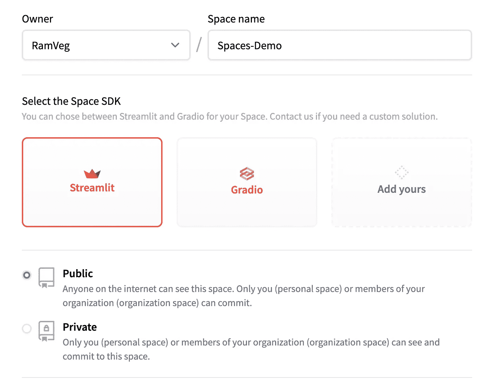
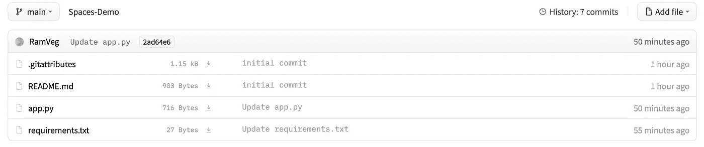
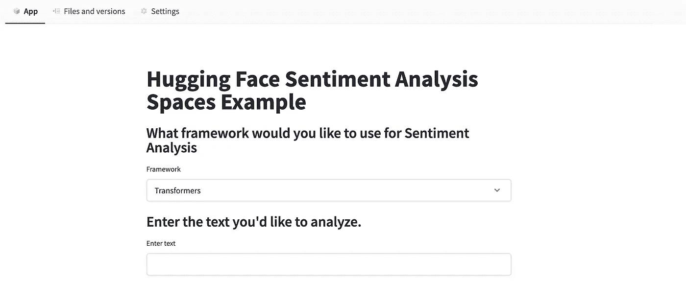
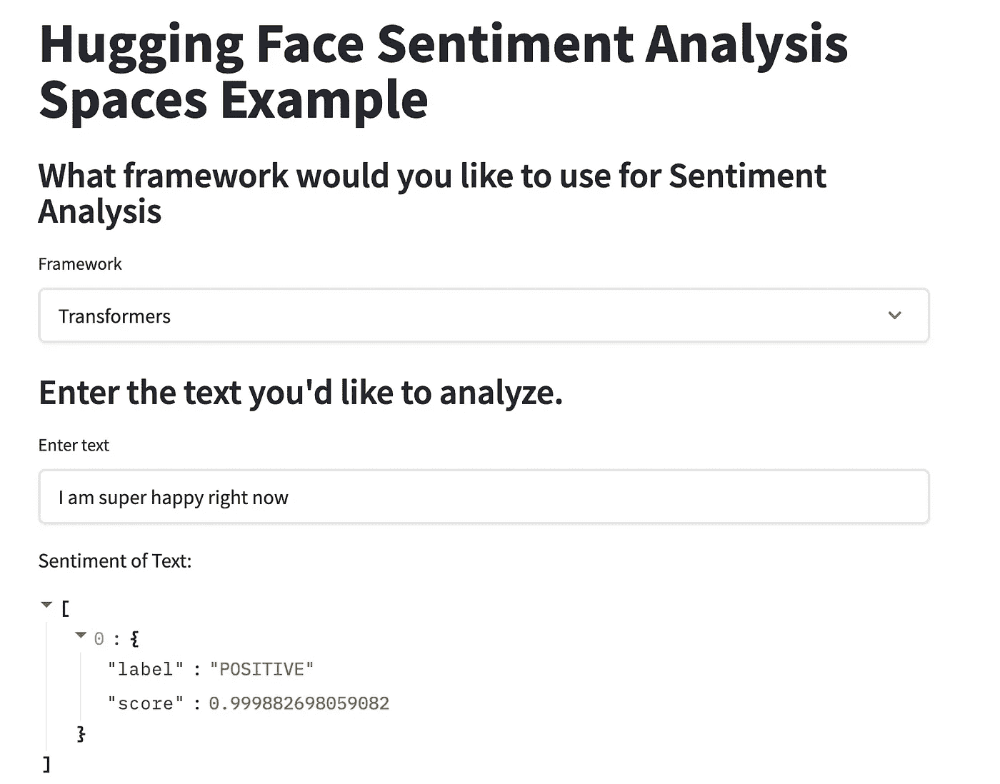
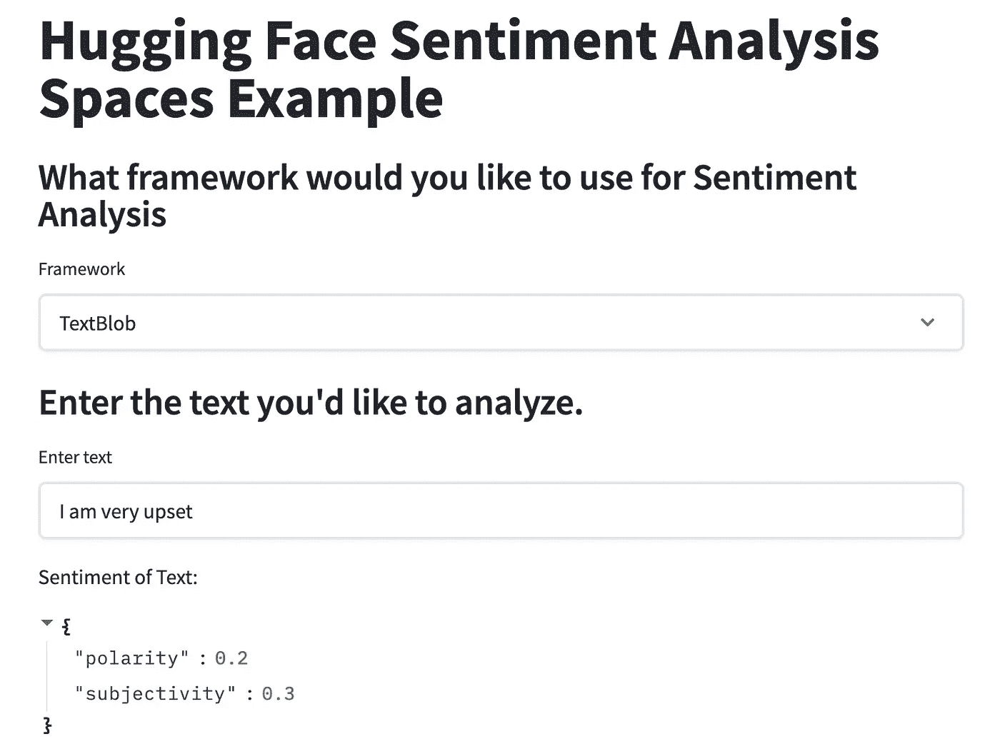

# 使用 HuggingFace Spaces 托管 ML 应用程序

> 原文：<https://towardsdatascience.com/host-ml-apps-with-huggingface-spaces-7d5eef00e781?source=collection_archive---------14----------------------->

## 探索新的 HuggingFace 版本

图片来自[阿玛多·洛雷罗](https://unsplash.com/@amadorloureiroblanco)的 [Unsplash](https://unsplash.com/photos/BVyNlchWqzs)

我一直是 NLP 的超级粉丝，因此也是一个超级[拥抱脸](https://huggingface.co/)粉丝。虽然 HuggingFace 以其强大的 NLP 背景而闻名，但他们最近发布了一个名为 [Spaces](https://huggingface.co/docs/hub/spaces) 的新功能，可以帮助你在你的个人资料上快速**托管 ML 演示应用**。Spaces 支持两个可以快速构建 Python 应用的框架:Streamlit 和 [Gradio](https://gradio.app/) 。我也是 Streamlit 的忠实粉丝，所以我们将使用该框架为今天的文章构建一个示例空间应用程序。如果你想要更多的灵活性和对你的前端的控制，你可以使用一个定制的框架或者使用你自己的 HTML 代码。

**注意**:在这篇文章中，我们不会真正关注任何模型构建包，它将集中在展示空间特性的功能上。

# 目录

1.  设置
2.  构建应用程序和测试
3.  结论和附加资源

# 1.设置

要开始使用共享空间，您需要在以下[链接](https://huggingface.co/spaces/launch)创建一个 HuggingFace 个人资料帐户。

作者截图(创建拥抱脸个人资料)

如果你想和其他成员合作，你可以在这里添加额外的功能，比如 Github 或者 Twitter 用户名。之后，点击“创建新空间”，你就可以设置你的项目了。

作者截图

在本例中，我们将使用 Streamlit 并创建一个公共工作区。对于自定义 SDK，请通过“添加您的”链接与 HuggingFace 联系。

创建完共享空间后，我们可以导航到“文件和版本”来管理我们的目录。**首先** **创建**一个 **requirements.txt** 文件，其中包含任何额外的依赖项，这就是 Spaces 将如何在您正在使用的框架中使用的方式。Spaces 附带了以下**预装库** : **huggingface_hub** 、**请求**和**数据集**。在 requirements.txt 中，我们将**添加**用于情感分析的**变形金刚**和**文本块**库。

申请要求

接下来创建一个“app.py”文件，这是我们的应用程序代码将被创建的地方。文件结构应该如下图所示。

作者截图

# 2.构建应用程序和测试

现在我们可以编辑 app.py 文件来构建我们的应用程序。我们将制作一个**简单的应用程序，它提供了使用两种不同框架对一些样本文本**进行情感分析的选项。创建文件时，您可以在共享空间左上角的应用程序选项卡上预览文件的外观。

App 预览(作者截图)

现在我们可以添加一些基本的逻辑来使用任何一个可用的框架。

情感分析

我们现在可以用两种不同的框架来测试我们的应用程序。

变形金刚情绪分析(作者截图)

Textblob 情感分析(作者截图)

在 10 分钟内，我们成功部署了一个简单而强大的演示应用程序，可以公开共享。要调整应用程序的任何旋钮，您也可以进入**设置选项卡**将**空间设为私有**或**将其删除**。

# 3.结论和附加资源

演示应用程序的完整代码

如果您没有自己的基础设施设置，Spaces 是一个非常有用的新特性，可以快速测试和演示 ML 应用程序。我很好奇 HuggingFace 在为您的应用程序带来自己的前端堆栈/框架方面提供的未来灵活性。如果你想看视频演示，看看下面的[教程](https://www.youtube.com/watch?v=3bSVKNKb_PY&t=2s) HuggingFace 发布。对于不同的接触面管道和任务，查看以下[文档](https://huggingface.co/transformers/main_classes/pipelines.html#transformers.TextGenerationPipeline)。

*如果你喜欢这篇文章，请在* [*LinkedIn*](https://www.linkedin.com/in/ram-vegiraju-81272b162/) *上与我联系，并订阅我的媒体* [*简讯*](https://ram-vegiraju.medium.com/subscribe) *。如果你是新手，使用我的* [*会员推荐*](https://ram-vegiraju.medium.com/membership) *报名。*