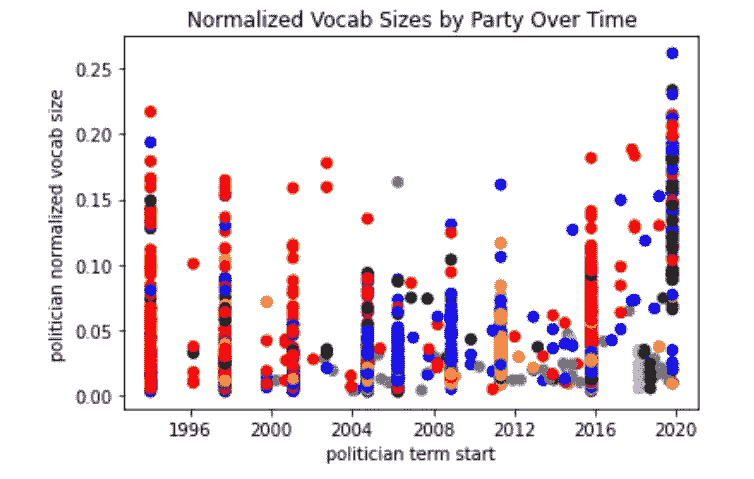
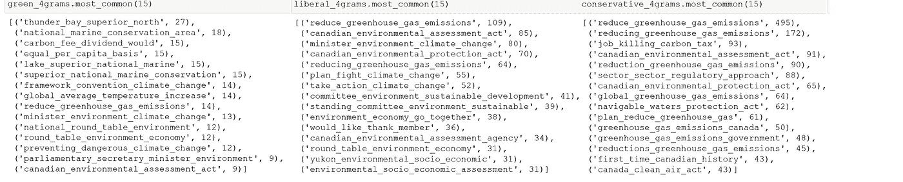
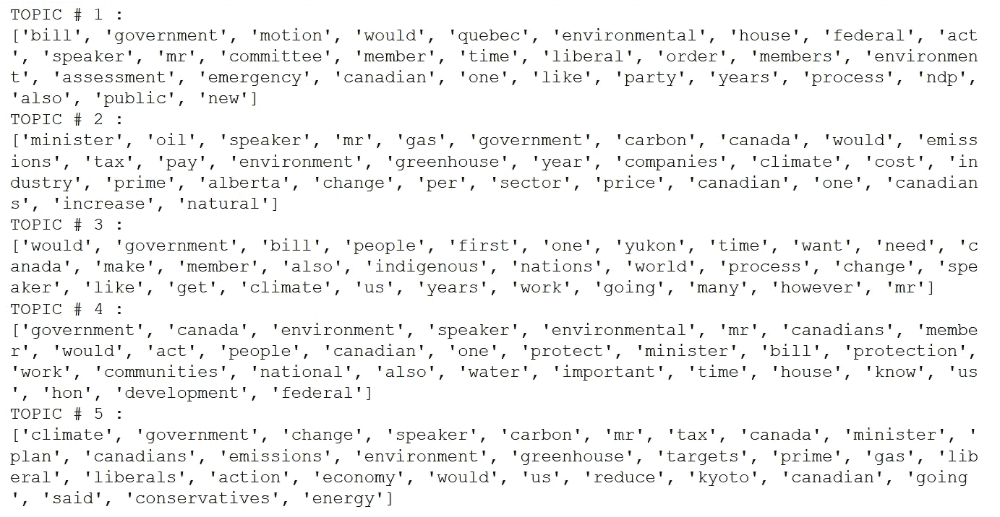
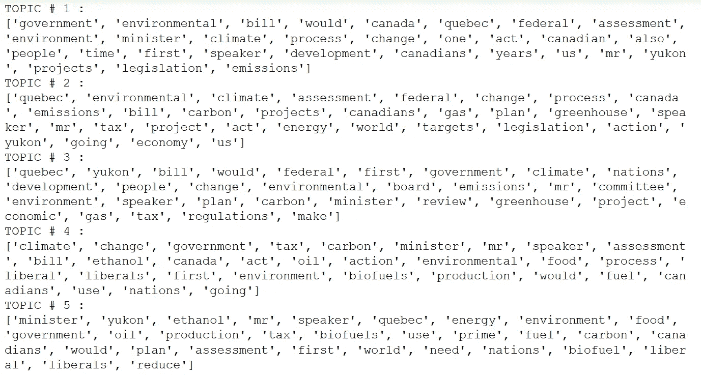

# 空话:政治中的话语

> 原文：<https://towardsdatascience.com/hot-air-words-in-politics-d23ef112cb7?source=collection_archive---------50----------------------->

应对气候危机是当前决定性的生存挑战，2018 年诺贝尔经济学奖由威廉·诺德豪斯和保罗·罗默(美国)获得，他们证明了碳定价将是应对气候危机的有效策略。因为有政府程序的公开记录，而我是 NLP 的专家，我看到了我能看到的政府和政治数据。这是我发现的非常敷衍的初步看法。我在这里使用的数据来自 openparliament.ca，它使跟踪政府通过法案的进展变得容易，并提供了众议院会议的议事录。

*英国议会议事录是对加拿大、英国、新西兰和其他威斯敏斯特体系政府的下议院会议记录进行轻微编辑的公开信息记录，以一名在报纸上发表英国议会会议记录的英国议员命名。(美国人:假装我说的是国会。我没有，现在也没有，但这就足够了。)

为此，我使用了 2000 年 1 月 1 日至 2020 年 8 月间的会议记录。由于加拿大议会有两种官方语言的声明，我将英文声明分离出来。演讲者以演讲者的身份所做的陈述往往是非常标准化的，并且只是程序的一部分，所以我删除了它们。

[https://www.lingo-ninja.com/RepsVsDems](https://www.lingo-ninja.com/RepsVsDems)

这是一篇有趣的文章，它展示了在做出任何结论之前实际查看数据的重要性。他们声称，与你的预期相反，对于美国政客来说，共和党人倾向于使用更大的词汇量，莎拉·佩林是所有人中词汇量最大的，特朗普的词汇量比乔·拜登大。尽管我愿意接受统计数据，但退一步说，我发现这些结论非常令人惊讶。粗略地看一下他们的方法，他们不做任何形式的词汇化、拼写纠正、标点符号或停用词删除，他们只是使用一个记号化器。这意味着特朗普有可能通过 hamberders 和可变大小的省略号拥有大量词汇…..

为了避免指责列出街道名称的议员词汇量太大，我使用了 spaCy 的 en-core-web-sm POS tagger，并删除了停用词、标点符号和专有名词。那些年有 1000 多名议员坐过，这些议员讲了大约 86 万次。

由于单个议员说的单词数量可能相差很大(更准确地说，是 7 到 2615448 个)，原始词汇比较几乎是不公平的。由于停用词的使用和标点符号的出现或多或少是一个常数，我将它们有意义的词的范围按照它们发出的总标记来划分。这种调整是标准化步骤。因为我很好奇词汇是否会随着时间的推移而改变，所以我绘制了归一化词汇大小与在职议员开始日期的关系图。

作者图片

Flesch 阅读难易程度评分:

Flesch 阅读难易程度评分是一个由句子长度和所用词汇组合而成的指标。下图让我有点吃惊，但经过研究后，还是有意义的。关于 Flesch 分数，需要注意的一点是，分数越高，越容易阅读。如下图所示，最难读懂的议员来自由魁北克集团和新民主党成员组成的民主力量党。由于 Forces 是由受过高等教育的前议员(其中一名创始成员是大学教授)组成的，因此他们的语言水平高于自由党或保守党也就不足为奇了，因为这些政党拥有非常广泛的基础。Flesch-Kincaid 年级水平是一个将 Flesch 阅读难易程度评分(基于句子长度和词汇量)与 Kincaid 年级水平指标相结合的指标。为此，我使用了 textstat，这是一个内置了所有这些功能的 Python 包。

# 查找常用短语:

对于更大的统计数据，如估计的相对词汇和阅读方便性，我从 2000 年 1 月 1 日起在每份法案上使用陈述，但由于这个想法是为了找出政治家如何谈论气候政策，我提取了在“碳”或“环境”的法案上的陈述。

我在这里采用了两种方法来统计主要短语。其中一个是手动计算使用的 4gm，另一个是使用 TextBlob，这是一个 Python 库，可以进行名词短语分块。我使用了 nltk 标记器，并消除了停用词，我发现每一方的二元模型基本上都是无用的。在所有政党中，最常见的连词是“碳税”、“首相”、“环境部长”、“温室气体”和“自由政府”。对人类的眼睛来说，那里没有任何东西表明特定的极性。这是有道理的，在环境/气候背景下，这些是最常见的二元模型，不管你对它们的感觉如何。当你看四个单词的短语时，一个更有趣的画面出现了。

作者图片

绿色、自由和保守的 4 个字母

在这里，你可以看到更多证据，证明不同政党在谈论碳税时使用的口号。保守派真的喜欢称碳定价为“扼杀就业的碳税”，而自由派通常喜欢说“环境和经济齐头并进”的变体。绿党必须包括在内，因为他们是一个全国性的政党，主要关注气候和环境，但由于他们目前有史以来最高的 3 名议员，他们的声明经常反映出绿色参与具体的法案，如育空环境社会经济评估法案。

# 基于启发式的主题模型

这些是最需要人工提取的短语，通常的主题模型表现如何？以下是 LDA 发现的与 5 个主题相关的单词:

作者图片

LSI 发现了 5 个主题:

作者图片

评估无监督的主题模型是一个挑战，但由于这是人类语言，并且只有 5 个主题被选择，对这一点的判断纯粹是主观的。

在我看来，LDA 的主题稍微好一点，但它们基本上只是表明议员们讨论了环境、气候、碳、育空、魁北克和艾伯塔。由于育空地区位于北部，有很多采矿和资源开采活动，艾伯塔省和育空地区都有重油和天然气开采活动，因此它们经常出现在议会讨论中是有道理的。魁北克是最大的省份，拥有丰富的自然资源，所以它会出现在环境问题的讨论中——但它在政府中也有很高的代表性，是一个常见的参考点。

在很大程度上，我称之为“热空气”是因为缺乏一个真正好的双关语，但也是因为在用最常见和最容易获得的技术查看数据后，很难客观地发现不同政党之间的区别，即使他们的投票记录表明他们在那里。Suhas Pai(基岩公司首席技术官。AI 和 NLP guru)认为，由于下议院中任何长于感叹词的演讲都是由他们的团队精心制定的，因此议会演讲不是文本信息的良好来源。我倾向于这一结论，因为除了“扼杀就业的碳税”等众所周知的保守派词汇和“环境和经济齐头并进”等自由派词汇，还没有太多分析表明政党话语中有意义的差异。