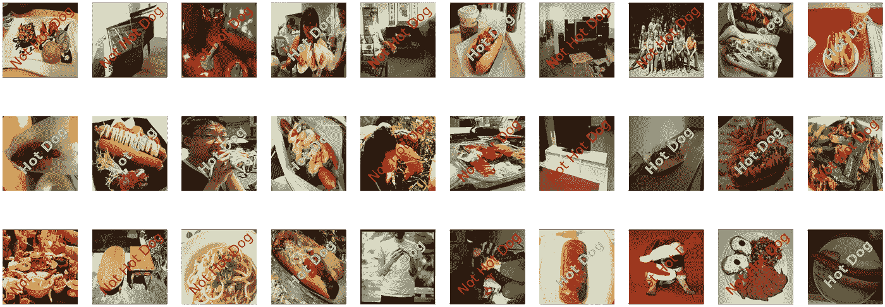
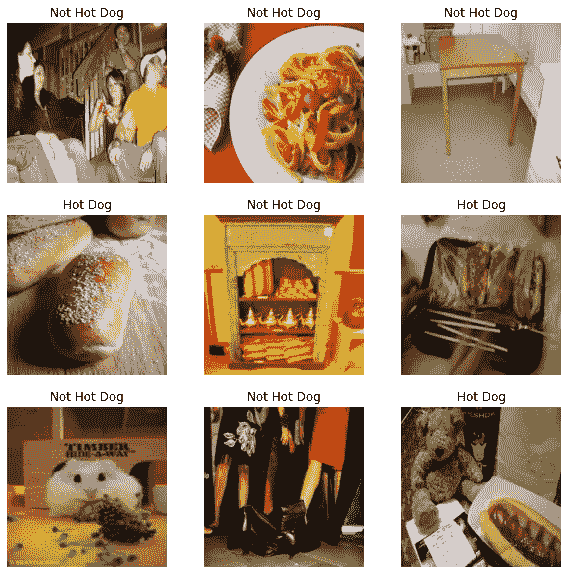
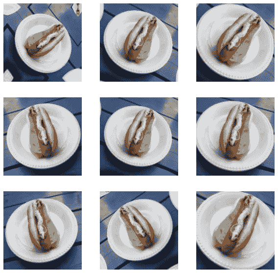
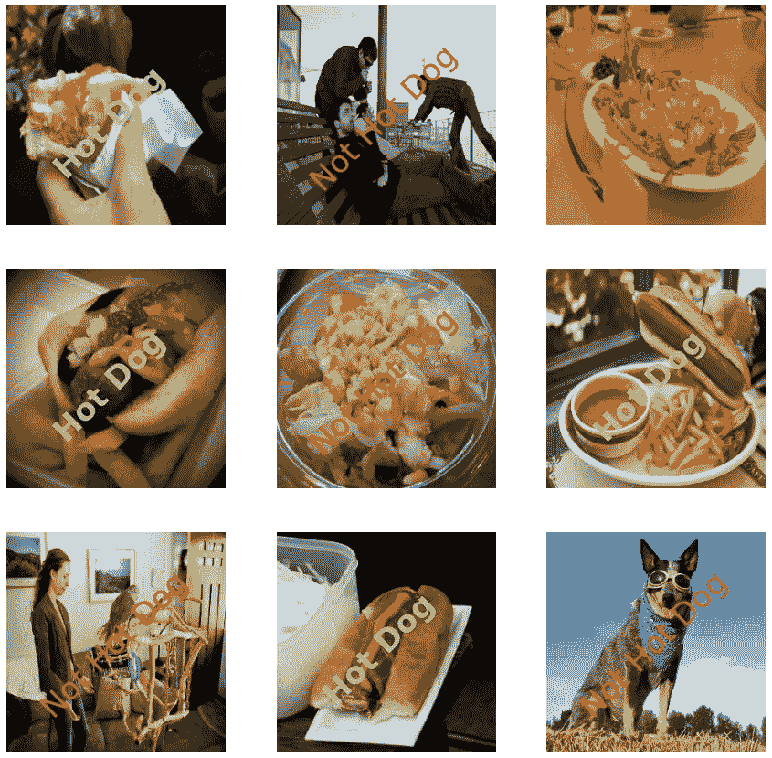

# 热狗还是不是热狗

> 原文：<https://towardsdatascience.com/hot-dog-or-not-hot-dog-ab9d67f20674?source=collection_archive---------16----------------------->

## 用 Tensorflow 2 尝试著名的 CNN 模型来帮助杨坚

输出图像

# 介绍

你看过 HBO 的《硅谷》喜剧系列吗？如果是这样，我打赌你还记得杨坚开发的[非热狗应用](https://apps.apple.com/app/not-hotdog/id1212457521)。这里有一个片段可以提醒你。

所以基本上这个应用程序识别某样东西是不是热狗。嗯，我们也可以用其他类型的物体来训练识别它们。

当我了解到 CNN(卷积神经网络)的时候，我很渴望在这个问题上尝试一些流行的 CNN 模型，只是为了好玩。所以我选择了一些最好的 CNN 模型来尝试。

对于这个问题，我使用了以下模型，

1.  AlexNet 的变体
2.  使用 VGG19 进行迁移学习
3.  使用 ResNet50 迁移学习
4.  使用 Inception V3 进行迁移学习
5.  借助 Inception ResNet V2 迁移学习

你可以在 [NBViewer](https://nbviewer.jupyter.org/github/scsanjay/case-studies/blob/main/02.%20Not%20Hotdog/Not-HotDog.ipynb) 上查看笔记本，也可以在 GitHub 上找到，

<https://github.com/scsanjay/case-studies/tree/main/02.%20Not%20Hotdog>  

# 数据

没有高质量的数据，就没有机器学习。谢天谢地，我在 ka ggle[【1】](https://www.kaggle.com/yashvrdnjain/hotdognothotdog/metadata)上找到了一个数据集。

总共有 **3000 张**图片可用于训练。
其中 **1500** 是热狗图像， **1500** 不是热狗(它们是食物、家具、人或宠物)。
**训练数据的 20%** 将用于验证，这意味着 **600 张**图像将用于验证。
测试集有来自热狗类别的 **322** 图像和来自热狗类别的 **322** 图像。

在加载的时候，我已经将所有图片的尺寸调整为 256x256。另外，我已经将它们分成 **32** 的批量。

让我们看一些图片，

数据样本

# 预处理

## 调整大小

将所有图像转换为相同大小的预处理步骤已经完成。

## 数据扩充

数据扩充是非常有用的一步。这有助于使模型更好地泛化。此外，它从给定的图像生成新的图像，这增加了我们的数据集的大小。

怎么会？它可以执行各种操作，如翻转、旋转、剪切、缩放等，以创建增强的数据。请注意，TensorFlow 是动态完成的，这意味着我们不必保存图像，但它们将在训练时生成。

我已经执行了以下数据扩充操作，
a)水平翻转
b)旋转
c)缩放

在数据扩充之后，我们可以期待如下所示的图像，

扩充数据

## 改比例

我们应该将像素从[0，255]重新调整到[0，1]。我将只应用于 AlexNet。

**在使用预训练模型进行迁移学习的情况下，我们将仅使用相应模型的预处理。**

# 模型结构

## AlexNet

AlexNet 用了三大概念，
1。数据扩充—增加数据的方差。
2。辍学——应对过度适应。
3。ReLU 激活单元——处理消失梯度问题。

我已经创建了一个 AlexNet 架构的变体，并在这里和那里进行了退出和批处理规范化。总共有 58，286，465 个可训练参数。最后一层有 1 个乙状结肠活化单位。

我将使用基于二进制交叉熵的 Adam 优化器进行优化。我们也会保持准确性。

我已经运行了 10 个纪元。我还添加了一个提前停止的回调函数来监控 val_loss。我们通过验证数据得到了 **69.00%** 的准确度，通过测试数据得到了 **68.47%** 的准确度。这并不令人鼓舞。如果我们进行调整或拥有更多数据，我们可以取得更大的成就。

## 使用预训练的 VGG19 进行迁移学习

**迁移学习**

迁移学习是一种非常酷的技术。在迁移学习中，我们加载一个预先训练好的模型。我们移除模型的顶部(最后几个致密层)。然后我们冻结预训练模型的卷积基。现在我们可以使用这个预先训练的模型作为特征提取器。

在迁移学习中，有时我们也可以使用预训练模型进行权重初始化，然后训练整个模型。这通常发生在我们有大量数据和/或预训练模型没有在类似数据上训练的时候。

**VGG19**

VGG19 来自视觉几何组。它有 19 层。它有一个新的想法，当我们使用多个小内核而不是较小的大内核时，可训练参数的数量会减少。此外，它到处使用相同的 3x3 大小的内核和 2x2 最大池，这简化了架构。

我已经用 ImageNet 权重加载了 TensorFlow Keras 预训练的 VGG19 模型，没有顶层。

然后我将这个基础模型设置为不可训练。

在模型架构中，

I)我首先添加了输入层。
ii)然后是数据扩充层。Tensorflow 将自动管理扩增仅用于训练。
iii)然后我用了 VGG19 模型的预处理。
iv)之后，我使用了基础模型，即预训练的 VGG19 模型。这是不能按照迁移学习来训练的。
v)然后我使用了全球平均池 2D 层。
vi)然后是一个展平层。
vii)然后是具有 1000 个 Relu 激活单元的全连接致密层。为了正规化，我也加入了退学。然后我添加了一个线性激活单元。因为我将在二进制交叉熵中使用` from_logits=True **`** 来获得概率。

它有 514，001 个可训练参数和 20，024，384 个不可训练参数。

和前面一样，我们使用了 Adam 优化器和二元交叉熵。

这次我们用验证数据得到了 **93.17%** 的准确率，用测试数据得到了 **93.47%** 的准确率。这是一个很大的进步。

## 使用预先培训的 ResNet50 进行迁移学习

ResNet50 由[何等人](https://arxiv.org/pdf/1512.03385.pdf)创造。它有 50 层。它引入了剩余块的概念。它有助于建立深度大的模型。剩余的块具有跳过连接，所以如果一个块是无用的，那么它就被忽略。

我们按照与上面相同的步骤来创建相同的结构。唯一的区别是基础模型现在是 ResNet50，预处理是 ResNet50。

它有 2，050，001 个可训练参数和 23，587，712 个不可训练参数。

编译和拟合阶段与上面类似。而这次，我们用验证数据得到了 **94.33%** 的准确率，用测试数据得到了 **94.56%** 的准确率。比以前有了一点点进步。

## 通过预先培训的 Inception V3 进行迁移学习

Inception v3 是第三个版本。它是由谷歌开发的。它有 48 层。初始网络不是一次使用一个卷积，而是同时使用所有 1x1、3x3、5x5 和 MaxPool。这个想法是，较小的内核将获得本地信息，而较大的内核将获得全局信息。它还有一个叫做瓶颈层的技巧，可以显著减少计算量。

同样，我们已经将基本模型更改为 Inception V3 以及预处理步骤。

它有 2，050，001 个可训练参数，与 ResNet50 相同，还有 21，802，784 个不可训练参数。

编译和拟合阶段与上面类似。通过验证数据，我们得到了 **92.67%** 的准确率，通过测试数据，我们得到了 **94.40%** 的准确率。比我们用 ResNet50 得到的要少。

## 通过预先培训的 Inception ResNet V2 迁移学习

盗梦空间 ResNet V2 由谷歌开发。他们在盗梦空间中增加了 ResNet 的跳过连接。它允许创建一个更深的 164 层网络。

我做了和上面类似的改动。

它有 1，538，001 个可训练参数和 54，336，736 个不可训练参数。

编译和拟合阶段类似于我们到目前为止所看到的。通过验证数据，我们得到了 95.33% 的准确度，通过测试数据，我们得到了 96.42% 的准确度。迄今为止最好的一个。

# 测试输出

所有四种迁移学习模式的表现都很相似，而且相当不错。

然而，**盗梦空间 ResNet V2** 在我们的案例中具有最高的准确性。因此，我们将使用它来显示一些带有测试图像的输出。

测试输出

# 最后的想法

如果你看到我们只为模型做了几件事，数据扩充，预处理，加载基础模型，并在顶部添加几层。我们能够达到 96.30%的准确率。这是因为迁移学习。我们可以在基础模型中增加更多的可训练层。这可以提高精确度。

参与这个项目非常有趣。也是一次很棒的学习经历，因为这是我的第一个深度学习项目。

深度学习发展非常快。每天都有新的研究论文发表。只有少数人制作了这些作品。深度学习就是要聪明。在所有的模型中，我们在上面看到，他们引入了一些新的聪明的技术。

# 参考

1.  张量流[https://www.tensorflow.org/]
2.  数据集:Jain，Yashvardhan。2019 .热狗-不是热狗。
    版本 1。许可证 CC0:公共领域。可从以下网址获得:[https://www . ka ggle . com/yashvrdnjain/hotdognotdog/metadata](https://www.kaggle.com/yashvrdnjain/hotdognothotdog/metadata)
3.  应用根[[https://www.appliedroots.com/](https://www.appliedroots.com/)

**感谢阅读博客！**你可以通过我的 [LinkedIn 个人资料](https://www.linkedin.com/in/scchouhansanjay/)联系到我。也👏如果你喜欢的话。