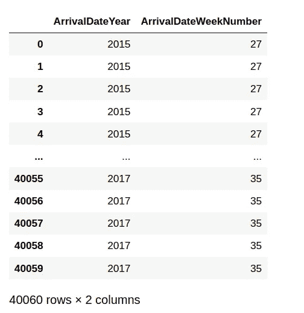
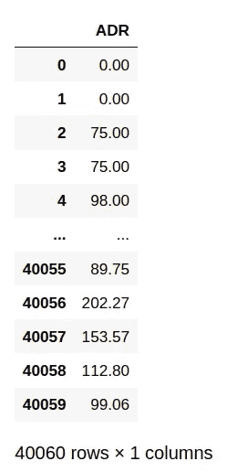
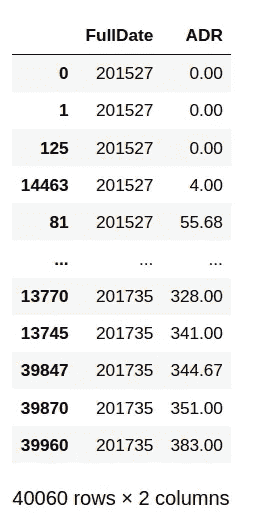
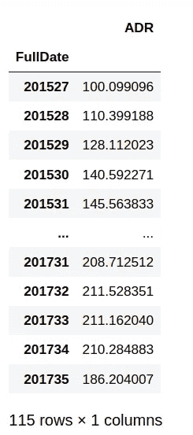
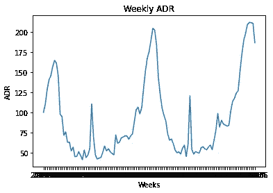
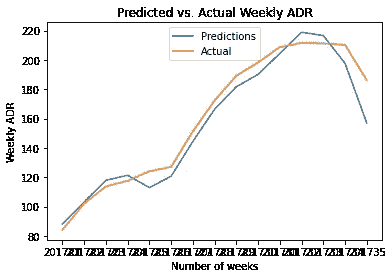

# 酒店收入预测:用 ARIMA 预测 ADR 波动

> 原文：<https://towardsdatascience.com/hotel-revenue-forecasting-predicting-adr-fluctuations-with-arima-5e60370b5de9?source=collection_archive---------51----------------------->

## 使用 ARIMA 预测日平均利率


来源:图片由 [nattanan23](https://pixabay.com/users/nattanan23-6312362/) 来自 [Pixabay](https://pixabay.com/photos/money-profit-finance-business-2696219/)

平均每日房价(以下简称为 ADR)代表入住酒店的顾客每天支付的平均房价。

这是一个酒店的重要指标，因为它代表了每个客户的整体盈利能力。

在本例中，每个客户的平均日费率是每周的平均值，然后使用 ARIMA 模型进行预测。

以下分析基于来自 [Antonio、Almeida 和 Nunes (2019)的数据:酒店预订需求数据集](https://www.sciencedirect.com/science/article/pii/S2352340918315191)。

# 数据操作

在这个特定的数据集中，每个客户的年数和周数(以及每个客户记录的 ADR 值)是单独提供的。

以下是日期栏:



来源:Jupyter 笔记本输出

以下是 ADR 栏:



来源:Jupyter 笔记本输出

首先，年份和周数被组合成一个字符串:

```
df1 = df['ArrivalDateYear'].map(str) + df['ArrivalDateWeekNumber'].map(str)
print (df1)
df1=pd.DataFrame(df1)
```

然后，使用 pandas 将新列与 ADR 列连接起来:

```
df2 = DataFrame(c, columns= ['ADR']) 
df2df3=pd.concat([df1, df2], axis = 1)
df3
df3.columns = ['FullDate', 'ADR']
```

这些值随后按日期排序:

```
df3
df3.sort_values(['FullDate','ADR'], ascending=True)
```



来源:Jupyter 笔记本输出

下一步是获得每周的平均 ADR 值，例如，对于条目 201527(2015 年第 27 周)，对所有 ADR 值进行平均，以此类推每个后续周。

```
df4 = df3.groupby('FullDate').agg("mean")
df4
df4.sort_values(['FullDate'], ascending=True)
```



来源:Jupyter 笔记本输出

# ARIMA

使用这个新形成的时间序列，ARIMA 模型现在可以用来预测 ADR。

对于该模型，前 **100** 周的数据用作训练数据，而后 **15** 周的数据用作测试数据，与模型做出的预测进行比较。

这是新形成的时间序列图:



来源:Jupyter 笔记本输出

从图表的初始视图来看，季节性似乎确实存在。然而，在训练数据上生成自相关函数来验证这一点。

```
plot_acf(train_df, lags=60, zero=False);
```


来源:Jupyter 笔记本输出

我们可以看到相关性(大约在第 10 周到第 45 周之间有所下降)，自相关在第 52 周再次达到峰值，这意味着每年的季节性。这实质上意味着每 52 周记录的 ADR 值之间有很强的相关性。

使用该信息， **m=52** 被设置为 ARIMA 模型中的季节分量，并且 [pmdarima](https://github.com/alkaline-ml/pmdarima) 被用于自动选择模型的 **p，d，q** 参数。

```
>>> Arima_model=pm.auto_arima(train_df, start_p=0, start_q=0, max_p=10, max_q=10, start_P=0, start_Q=0, max_P=10, max_Q=10, m=52, stepwise=True, seasonal=True, information_criterion='aic', trace=True, d=1, D=1, error_action='warn', suppress_warnings=True, random_state = 20, n_fits=30)Performing stepwise search to minimize aic
 ARIMA(0,1,0)(0,1,0)[52]             : AIC=422.399, Time=0.32 sec
 ARIMA(1,1,0)(1,1,0)[52]             : AIC=inf, Time=21.87 sec
 ARIMA(0,1,1)(0,1,1)[52]             : AIC=inf, Time=48.20 sec
 ARIMA(0,1,0)(1,1,0)[52]             : AIC=inf, Time=40.99 sec
 ARIMA(0,1,0)(0,1,1)[52]             : AIC=inf, Time=38.19 sec
 ARIMA(0,1,0)(1,1,1)[52]             : AIC=inf, Time=39.33 sec
 ARIMA(1,1,0)(0,1,0)[52]             : AIC=414.708, Time=0.95 sec
 ARIMA(1,1,0)(0,1,1)[52]             : AIC=inf, Time=47.51 sec
 ARIMA(1,1,0)(1,1,1)[52]             : AIC=inf, Time=59.30 sec
 ARIMA(2,1,0)(0,1,0)[52]             : AIC=413.878, Time=1.86 sec
 ARIMA(2,1,0)(1,1,0)[52]             : AIC=inf, Time=59.96 sec
 ARIMA(2,1,0)(0,1,1)[52]             : AIC=inf, Time=60.34 sec
 ARIMA(2,1,0)(1,1,1)[52]             : AIC=inf, Time=77.60 sec
 ARIMA(3,1,0)(0,1,0)[52]             : AIC=414.514, Time=2.05 sec
 ARIMA(2,1,1)(0,1,0)[52]             : AIC=415.165, Time=3.74 sec
 ARIMA(1,1,1)(0,1,0)[52]             : AIC=413.365, Time=1.91 sec
 ARIMA(1,1,1)(1,1,0)[52]             : AIC=415.351, Time=66.38 sec
 ARIMA(1,1,1)(0,1,1)[52]             : AIC=inf, Time=57.54 sec
 ARIMA(1,1,1)(1,1,1)[52]             : AIC=inf, Time=76.00 sec
 ARIMA(0,1,1)(0,1,0)[52]             : AIC=411.433, Time=1.08 sec
 ARIMA(0,1,1)(1,1,0)[52]             : AIC=413.422, Time=29.17 sec
 ARIMA(0,1,1)(1,1,1)[52]             : AIC=inf, Time=67.32 sec
 ARIMA(0,1,2)(0,1,0)[52]             : AIC=413.343, Time=1.76 sec
 ARIMA(1,1,2)(0,1,0)[52]             : AIC=415.196, Time=3.69 sec
 ARIMA(0,1,1)(0,1,0)[52] intercept   : AIC=413.377, Time=2.05 sec

Best model:  ARIMA(0,1,1)(0,1,0)[52]          
Total fit time: 809.281 seconds
```

根据最低的 AIC 值， **ARIMA(0，1，1)(0，1，0)[52]** 的 ARIMA 模型配置被指示为最佳拟合的模型。

现在，该模型可用于预测未来 15 周，并将这些预测与测试集进行比较:

```
predictions=pd.DataFrame(Arima_model.predict(n_periods=15), index=test_df)
predictions=np.array(predictions)
```

在将预测值与测试集的值进行比较之前，预测值将被重新整形，以便与测试集的格式相同:

```
>>> predictions=predictions.reshape(15,-1)
>>> predictionsarray([[ 88.0971519 ],
       [103.18056307],
       [117.93678827],
       [121.38546969],
       [112.9812769 ],
       [120.69309927],
       [144.4014371 ],
       [166.36546077],
       [181.69684755],
       [190.12507961],
       [204.36831063],
       [218.85150166],
       [216.59090879],
       [197.74194692],
       [156.98273524]])
```

现在，可以将测试值与基于均方根误差(RMSE)的预测值进行比较，数值越低表示误差越小。

```
>>> mse = mean_squared_error(test_df, predictions)
>>> rmse = math.sqrt(mse)
>>> print('RMSE: %f' % rmse)
RMSE: 10.093574>>> np.mean(test_df)
160.492142162915
```

与平均值 160 相比，RMSE 为 10。这表示误差略高于平均值的 6%，表明该模型预测 ADR 趋势的准确度相当高。

这是预测值与实际值的对比图。



来源:Jupyter 笔记本输出

# 结论

非常感谢您的宝贵时间，非常感谢您的任何问题或反馈。

你可以在这里找到这个例子[的 Jupyter 笔记本。](https://github.com/MGCodesandStats/hotel-cancellations)

*免责声明:本文是在“原样”的基础上编写的，没有担保。本文旨在提供数据科学概念的概述，不应被解释为任何形式的专业建议。作者与本文提及的任何第三方无任何关系。*