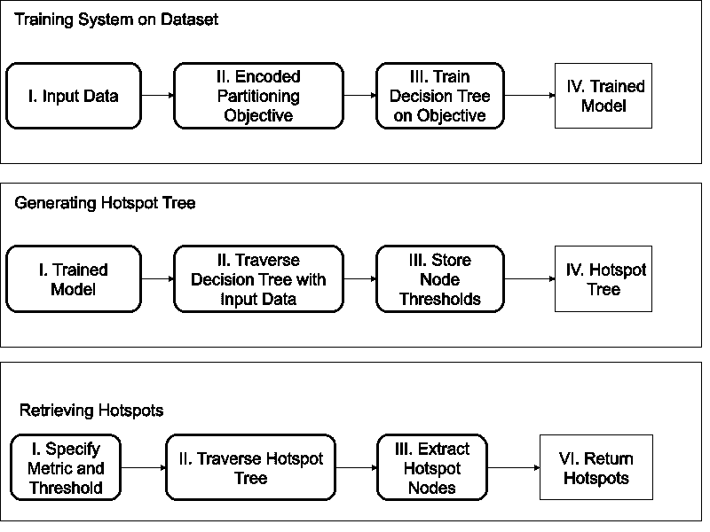
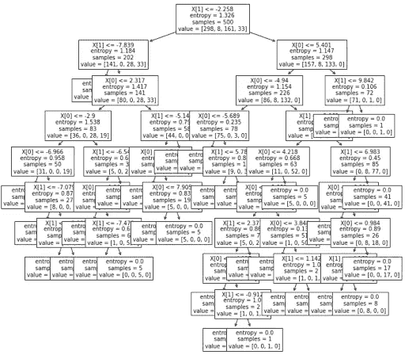

# 热点:机器学习系统中表现不佳区域的自动化

> 原文：<https://towardsdatascience.com/hotspots-automating-underperformance-regions-surfacing-in-machine-learning-systems-89cc4a18ec27?source=collection_archive---------25----------------------->

## 隔离有问题的数据以进行补救和重新训练 ML 模型

[粘土银行](https://unsplash.com/@claybanks?utm_source=medium&utm_medium=referral)在 [Unsplash](https://unsplash.com?utm_source=medium&utm_medium=referral) 拍摄的照片

当系统具有高维数据时，对正确的数据输入区域进行故障排除就成为一个难题。热点自动识别与较差的 ML 性能相关的区域，以显著减少寻找这些区域的时间和错误。

# 概观

我们可能在生产中部署了一个 ML 模型，并在适当的位置部署了一些监控。我们可能会注意到，从经典的性能度量或者从结合可解释性技术的[漂移监控](/automating-data-drift-thresholding-in-machine-learning-systems-524e6259f59f)来看，性能正在下降。我们已经确定我们的模型失败了，下一步是确定我们的模型失败的原因。

这个过程将涉及到分割和切块导致模型退化的输入数据。也就是说，我们希望看到哪些特定的输入区域与较差的性能相关联，并在此基础上制定解决方案，例如找到管道中断或在这些区域上重新训练我们的模型。

这基本上可以归结为一个耗时的大海捞针的任务。如果我们可以对流程进行逆向工程，并直接向用户展示所有的针，即与低性能相关的输入区域，会怎么样？

我们可以！我们将采取的步骤是

(1)在适当的划分目标上训练决策树。

(2)创建和存储热点树工件。

(3)在查询时从热点树中检索热点。

图 1:训练数据集并使用它创建热点树的通用框架，然后查询热点树以检索热点。每个阶段都输出下一行的第一部分中使用的工件。(图片由作者提供)

在下面的玩具例子中，我们将在整个帖子中使用，我们有两个由抛物线函数分隔的地面真实区域，抛物线上方是蓝色，下方是红色。数据点的颜色代表预测。我们希望隔离预测颜色与区域颜色不匹配的热点区域，我们在两个不同精度阈值的浅色框中这样做。

图 2:基于两个输入的热点检索示例。方框是热点，其中红色区域中的蓝点和蓝色区域中的红点是不正确的分类。随着阈值(在这种情况下是准确度)的降低，该算法以具有更多不正确分类的候选节点为目标，并且热点区域变得更窄/更纯。(图片由作者提供)

# (1)在适当的划分目标上训练决策树

## 决策图表

当我们考虑将数据划分到感兴趣的区域时，我们应该考虑树模型，特别是决策树。请记住，我们的任务最终是一个推理任务，而不是预测任务，因此没有必要使用像随机森林或 XGBoost 这样的树集合模型，因为(a)我们没有试图执行预测，以及(b)集合引入了噪声和不确定的决策路径来分割我们的数据。

回想一下，决策树拆分的前提是基于在输入特征及其可能值的枚举中选择一个特征和拆分值，从而最小化[杂质](https://quantdare.com/decision-trees-gini-vs-entropy/)以基于输出标签创建更纯的子代。

简单地说，假设输出是彩色，我们有蓝色和红色的弹珠。所有的弹珠在两组中都有不同的直径，但是蓝色弹珠是有纹理的，而红色弹珠是光滑的。如果我们必须在直径大小或纹理之间选择来划分我们的弹珠，我们会选择基于纹理来划分弹珠，即纹理或平滑，因为这将完美地将蓝色弹珠分成一组，将红色弹珠分成另一组，在这种情况下，有效地将每组中的杂质减少到 0。

实际上，数据集需要多次分裂，以便将叶节点中的杂质减少到 0。

## 分割目标

那么，上面的蓝色和红色弹珠的等效物到底是什么呢？我们最终想要将坏的预测与好的预测分开，并且需要一些度量作为输出，即在我们的决策树中的划分目标。

对于分类，我们可以将正确的分类编码为 1，不正确的分类编码为 0。如果我们在划分时需要更多的粒度，我们也可以将分类编码为 1、2、3 或 4，分别表示真阳性、假阳性、真阴性和假阴性。

对于回归，我们实际上需要编码回归输出，即地面事实和预测之间的 RMSE，作为分类输出，例如，如果 RMSE 大于 RMSE 的中值+RMSE 的中值平均偏差，则数据点编码为 1，否则编码为 0。我们也可以使用百分比规则，例如，RMSE 超过 80%百分比的数据点为 1 或 0。我们不使用均值和标准差的原因是因为这些值会被高 RMSE 异常值扭曲，而重点是划分与平均值相比具有高 RMSE 的数据点。这模拟了我们在分类案例中想要的行为，在解释了分类案例的方法之后，我们将更深入地研究为什么我们不能使用回归输出。

# (2)创建和存储热点树工件

如果我们将玩具示例中的 500 个数据点输入到决策树中，使用上面讨论的四个类的编码方法，该树看起来像这样:

图 3:例子[四。在两个输入 X[0]和 X[1]上训练决策树]。这些框是节点，其中每个节点具有一组相关联的度量(即准确度、精确度、召回率、F1 分数)，这些度量可以用作查询热点的阈值。每个结点代表一组数据点，这些数据点通过从顶部根结点到特定结点的路径上输入要素的累积范围进行过滤。热点是违反用户指定的阈值的节点。提取热点节点]步骤。热点可以是树中的任何节点，而不仅仅是树底部的末端叶节点。(图片由作者提供)

在这里，我们只有两个特征:X[0]和 X[1]。在决策树的每个节点上，数据根据特征和临界值被分成两个子节点。例如，在根节点处，500 个数据点被分成两组，左子组和右子组，其中 X[1] ≤ -2.258 和 X[1] >-2.258。我们可以沿着从根节点到任何子节点的任何特定路径积累规则。

我们还可以计算节点中数据的准确性、精确度、召回率和 F1 等性能指标。

# (3)在查询时从热点树中检索热点

现在我们有了热点树，让我们挑选一些热点！请注意，在图 2 中，我们有 0.3 和 0.5 的精度阈值。在后一种情况下，热点区域更宽，会意外捕获更多正确分类的点。随着阈值的降低，我们对偶然捕获正确分类的更大区域的容忍度降低。通常，我们可能认为我们总是想要较低的阈值来仅捕获错误分类的数据点，但是这确实冒了风险:( a)使区域变得非常小并且不可解释;( b)隔离许多可能不包含许多数据点的区域，需要大量的人工工作来调查。

那么这些热点是如何恢复的呢？

当在查询中发送准确性阈值以从热点树中提取热点时，我们从根节点开始遍历所有可能的路径。在遍历中的任何节点，如果一个节点违反了阈值，则该节点被定义为热点，并且该节点中的所有信息被附加到返回给用户的热点列表中。

具体来说，在我们的例子中，准确性是我们的衡量标准。在任何特定节点，如果该节点的精度低于阈值，我们知道该节点中的数据点共同违反了阈值，并且该节点是热点。每当一个节点被识别为热点时，沿该路径的遍历停止，因为下游节点会更纯，而性能差的节点甚至更极端地违反用户提供的度量和阈值。

当然，在查询时定义指标和阈值的好处在于，用户可以根据问题和阈值的容忍度，使用不同的指标和阈值组合进行重新查询。

# 发现热点！

使用阈值为. 5 的示例，我们的三个热点是

热点包含输入数据区域上的过滤器，这些过滤器可应用于获取整个数据集以进行进一步检查、研究和模型开发。

# 深潜

如承诺的那样，回答上面关于回归的悬而未决的问题，再加上一些更深层次的问题！

# 深入研究:(1)根据适当的划分目标训练决策树

## 那么为什么不回归呢？

天真的设置是在我们的回归任务中采用基础事实和预测之间的 RMSE，并将它们用作我们的划分目标。然而，分割节点中的数据的[回归标准](https://scikit-learn.org/stable/modules/tree.html#regression-criteria)是基于到该节点的数据的平均输出值的某种距离度量，例如 MSE，在这种情况下是 RMSE 值本身。当我们遍历热点树时，我们会将 MSE 高于某个阈值的节点标记为热点。

假设我们有大部分的 RMSE 价值观。05 和大约 0.10 的一些 RMSE 值，我们希望标记和隔离后者。回归树完全有可能将更多的. 10 RMSE 数据点分组在树的较低位置，一旦检测到热点，我们将永远无法根据停止角色找到它们。例如，一个路径可能是 0.06 毫秒、0.09 毫秒、0.04 毫秒。给定 0.06 和 0.09 毫秒之间的用户阈值，在这种情况下，我们将永远不会到达第三个节点，因为 0.09 > . 04，并且第三个节点可能包含许多 0.10 RMSE 数据点(较低的 0.04 值来自于这样一个事实，即有许多 0.10 RMSE 数据点，只有几个 09 MSE 点，因此在 RMSE 值非常接近的意义上，该节点是“纯的”)。

我们可以使用自定义回归标准来解决这一问题，该标准使用相对于 0 的距离，即原始 RMSE 值，而不是相对于节点中平均 RMSE 的 MSE 距离，但这引入了跨模型和数据汇总的标准化问题。如果 0.10 的 RMSE 值对一个模型来说并不坏，但对另一个模型来说却是坏的，那该怎么办呢？因此，将回归设置转换为分类设置更可靠。

## 数据汇总

如果我们有一个流(或批处理)模型，我们一次在创建热点树时要放多少数据？如果我们在上周(或之前批次的)数据上创建了一个热点树，现在看到了传入的数据，我们是追加这些数据点并重新训练之前的树，还是为本周(或当前批次的)数据创建一个新的热点树？

实现这一点当然没有错误的方法，但在 Arthur AI，我们采用后一种方法。如果我们有一棵桔子树，现在有一些苹果装在一个盒子里，我们可能会对产生这些苹果的苹果树感兴趣，以找出为什么我们会收到一些腐烂的苹果，而不是我们上周已经检查过的桔子树(或批次)。

## 元数据丰富！

请注意决策树的输入实际上可以是任何东西，包括没有用作创建原始预测的模型的输入的元数据！这意味着通过热点展现洞察力不仅限于模型输入，如果我们跟踪模型中敏感的非输入属性，如种族或性别，这可能会有好处。

# 深入研究:(2)创建和存储热点树工件

## 为什么所有的指标？

准确性不是王道，用户需要不同的度量标准，这取决于他们的 ML 模型正在解决的任务。[这个](https://en.wikipedia.org/wiki/Precision_and_recall)很好地介绍了精度和召回率等其他性能指标。读完之后，这里有两个实际的例子，在我第一次学习精确和回忆的时候帮助了我。

(1)考虑用于从财务报告中抓取财务数据的机器人的异常检测系统。如果我们有许多来自 ML 模型的假阳性，这将是可怕的，这意味着该模型将预测错误的信息(阳性)存在于许多实际上是正确的(假的)文档中，导致补救团队在没有错误的任务上浪费时间(如果一些假阴性从裂缝中溜走，这真的不会是很大的问题)。在这种情况下，高精度很重要。

(2)考虑癌症检测模型。如果我们从 ML 模型中得到许多假阴性，这将是可怕的，这意味着该模型将预测许多确实患有癌症(假)的人没有癌症(阴性)，导致缺乏推荐的治疗和这些人的进一步健康并发症。在这种情况下，高召回率很重要。

## 多分类和微矩阵

我们如何推广到多分类任务？准确性仍然是一样的，我们可以在下面的玩具示例中的全球指标下使用[加权的准确性、召回率和 F1 分数](https://spark.apache.org/docs/latest/mllib-evaluation-metrics.html#label-based-metrics)。请注意，我们现在不仅可以定义宏观指标，还可以定义精确度、召回率和 F1 分数的微观指标，这与每个基础事实类别有关。这可能是强大的，因为现在可以在特定类上遍历热点树，例如，如果鸟类导致对象检测模型的许多模型失败，并且我们希望弄清楚特别是鸟图像发生了什么。

图 4:一个多分类的例子(作者的图片)

# 结论

今天到此为止！希望您获得了一些关于如何为您的特定用例实现热点浮现的见解！我们在 Arthur AI 实施这些类型的系统，自动化是 ML 监控中客户体验的一个重要产品类别。

快乐监控！

设计生态学家在 [Unsplash](https://unsplash.com?utm_source=medium&utm_medium=referral) 上拍摄的照片