# 基于 Zillow 经济学数据集的房价预测

> 原文：<https://towardsdatascience.com/house-price-forecasting-using-zillow-economics-dataset-2b58e6cd1c03?source=collection_archive---------25----------------------->

## 现实世界中的 DS

## 基于 SARIMA 模型的房价时间序列预测

作者图片

在[之前的博客](/house-price-prediction-with-zillow-economics-dataset-18709abff896)中，我们讨论了使用机器学习算法的房价预测模型。在这篇博客中，我们将讨论使用统计建模方法对 Zillow economics 数据进行时间序列预测。该项目于 2019 年 9 月实施，并对下一年即 2020 年的房价进行了预测。通过改变预测的跨度，即预测的年份或预测的持续时间，可以重用代码。本博客中讨论的结果是 2020 年的。

该项目通过使用 ARIMA 2020 年的统计模型预测房价，并显示全国和州房价的总体趋势，从而帮助客户、房地产代理商、房屋交易公司和其他投资者。2008/2009 年的大衰退给美国房地产市场带来了巨大损失。然而，房地产市场已经反弹，经历了房地产市场房价下跌后的快速上涨。投资房子是重大决策，需要慎重考虑。

房地产市场的上升趋势使得整个行业相当不稳定。因此，建议潜在买家在房产调查时多花些功夫，考虑他们的预算、财产税和其他各种因素。因此，对于潜在的买家和卖家来说，在采取大的或小的步骤之前，咨询房地产和房屋市场专家变得不仅仅是必要的。这个房屋预测数据科学项目将帮助买家、卖家、房地产顾问和其他利益相关者进行决策。[1]

本项目中使用的数据集是

1) Zillow 经济学数据集-县时间序列和县人行横道

数据来源:【https://www.kaggle.com/zillow/zecon 

Zillow 的经济研究团队从各种公共和私有来源收集、整理和发布住房和经济数据。向当地市政府归档的公共财产记录数据，包括契约、财产事实、地块信息和交易历史，构成了我们数据产品的主干，并通过 Zillow 上的财产清单和用户行为衍生的专有数据得到充实。

Zillow 汇总的大部分房地产市场和经济数据都可以在 zillow.com/data.免费下载

可用的数据文件有:cities_crosswalk.csv、City_time_series.csv、County_time_series.csv、CountyCrossWalk_Zillow.csv、DataDictionary.csv、Metro_time_series.csv、Neighborhood_time_series.csv、Neighborhood_time_series.csv、State_time_series.csv、Zip_time_series.csv [2]

我用的是 County_time_series.csv，CountyCrossWalk_Zillow.csv [2]

时间序列数据依赖于时间；以恒定的时间间隔进行采样。Zillow 每个月底都会收集数据。时间序列会有某种形式的季节性趋势。平稳时间序列的统计特性如均值、方差、自相关等。都是不变的。大多数统计预测方法都是基于这样一种假设，即通过使用数学变换，时间序列可以呈现为近似平稳的(即“平稳化”)。一个平稳化的序列相对容易预测:你简单地预测它的统计特性在未来将会和过去一样！

试图使时间序列平稳化的另一个原因是为了能够获得有意义的样本统计数据，如均值、方差以及与其他变量的相关性。如果序列是稳定的，这种统计作为未来行为的描述符*仅*是有用的。例如，如果序列随着时间的推移不断增加，样本均值和方差将随着样本的大小而增加，并且他们将总是低估未来期间的均值和方差。

使用 plolty 绘制的“所有房屋的销售价格中值”如下所示。

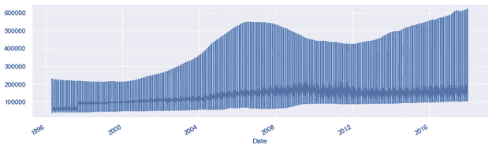

**按月重采样后**

下图是按月重新采样后的视图。

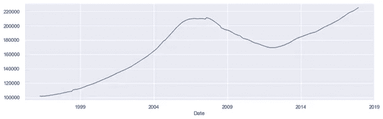

**用迪基富勒测试检查平稳性**

扩展的 Dickey-Fuller 测试是一个众所周知的统计测试，可以帮助确定您的时间序列是否是平稳的。[4]

**静止与非静止**

在平稳的时间序列中，均值和方差等统计属性在一段时间内保持不变。在非平稳序列中，这些属性依赖于时间。

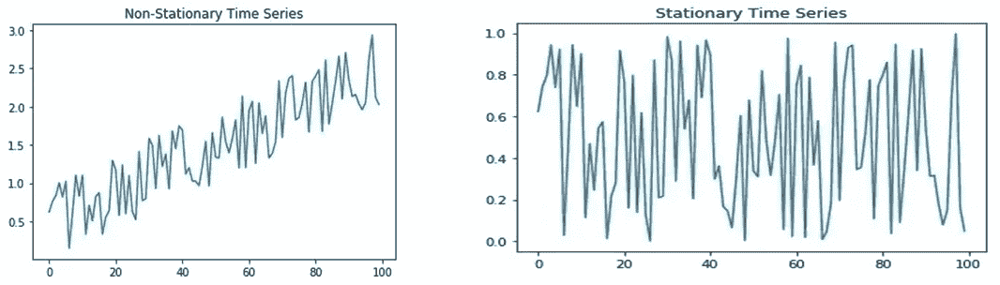

为了确定一个时间序列是否平稳，我们将使用 ADF 检验，一种单位根检验。单位根是不稳定的一个原因，ADF 测试将测试单位根是否存在。[7]

如果时间上的单次移动不改变时间序列的统计特性，则时间序列是平稳的，在这种情况下，单位根不存在。

扩充的 Dickey-Fuller 检验的无效假设和替代假设定义如下:

零假设表明存在单位根。

另一种假设认为没有单位根。换句话说，平稳性是存在的。

如果 P 值小于定义的显著性水平，我们拒绝时间序列包含单位根的零假设。换句话说，通过拒绝零假设，我们可以得出结论，时间序列是平稳的。

如果 P 值非常接近您的显著性水平，您可以使用临界值来帮助您得出关于时间序列平稳性的结论。我为这个测试所做的实现在 Python Jupyter 的笔记本中，可以根据需要获得。

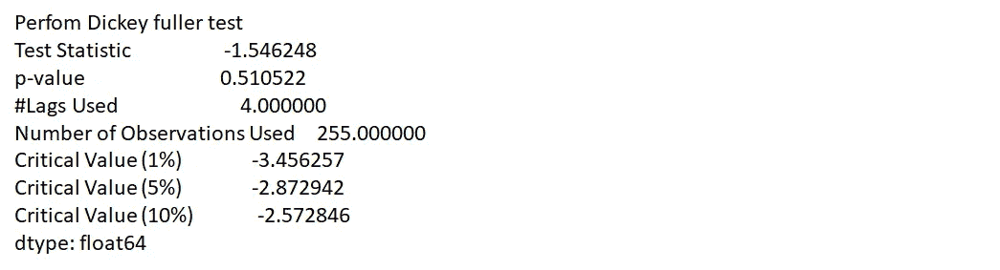

**对时间序列执行 Adfuller 函数后的初始值**

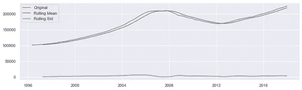

这里的滚动平均值不断增加，因此时间序列是非平稳的。在上图中，我们可以看到，检验统计量(p 值) >临界值为 5%，所以该时间序列是非平稳的。

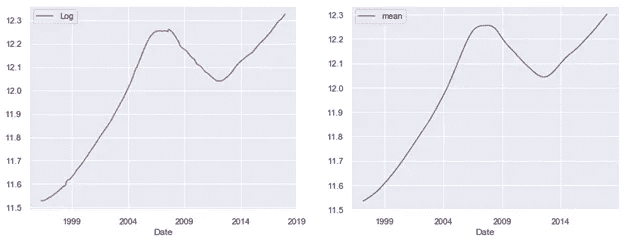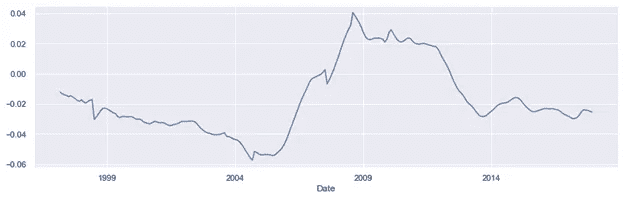

**消除趋势和季节性**

差分就是用一个特定的时间间隔来计算差值。分解是对趋势和季节性建模，并将它们从模型中移除。

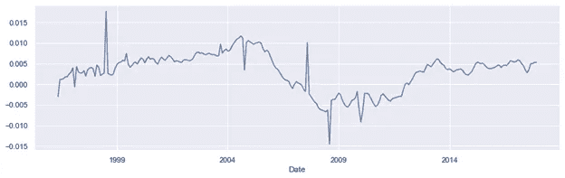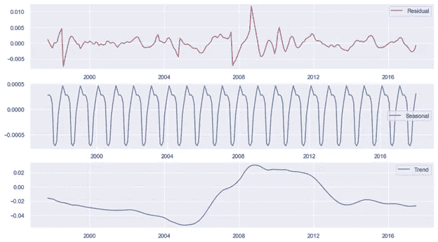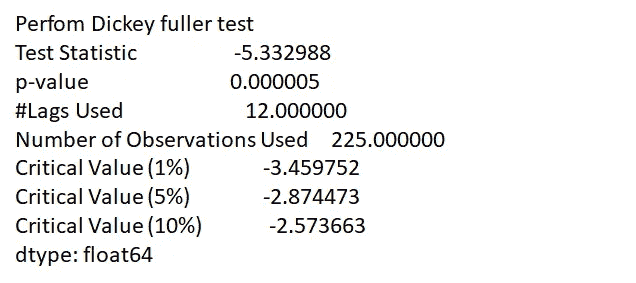

**消除趋势和季节性**

差异:在特定的时间间隔内取差异，分解:建模趋势和季节性，并从模型中移除它们

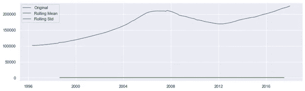

测试统计< critical value & p-value is 0.000005\. We are getting constant mean and standard deviation. So now we got stationary time series.

**ARIMA**

ARIMA 算法是一类捕捉时间序列数据中时间结构的模型。然而，仅使用 ARIMA 模型，很难对变量之间的非线性关系进行建模。

自回归综合移动平均模型(ARIMA)是自回归移动平均(ARMA)的广义模型，它结合了自回归(AR)过程和移动平均(MA)过程，建立了时间序列的复合模型。

AR:自回归。一种回归模型，使用一个观察值和多个滞后观察值之间的相关性。

**一:集成**。通过测量不同时间观察值的差异使时间序列平稳。

**移动平均线**。当移动平均模型用于滞后观测值(q)时，考虑观测值和剩余误差项之间相关性的一种方法。p 阶 AR 模型的简单形式，即 AR (p ),可以写成线性过程，由下式给出:

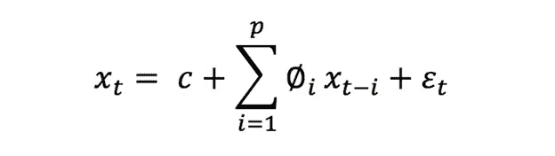

这里 Xt 代表平稳变量， **c** 为常数， *∅t* 中的项为滞后 1，2，…，p 处的自相关系数， ***ξt，*** 为残差，为均值为零且方差为 **σt** 的高斯白噪声序列。

ARIMA 模型的一般形式被表示为 ARIMA (p，q，d)。对于季节性时间序列数据，短期非季节性成分可能会对模型产生影响。ARIMA 模型通常表示为 ARIMA (p，q，d)，其中:—

*   p 是用于训练模型的滞后观测值的数量(即滞后阶数)。
*   d 是应用差分的次数(即差分的程度)。
*   q 是移动平均窗口的大小(即移动平均的阶数)。

例如，ARIMA (5，1，0)表示自回归的滞后值设置为 5。它使用差序 1 使时间序列平稳，最终不考虑任何移动平均窗口(即大小为零的窗口)。RMSE 可用作误差度量来评估模型的性能、评估预测的准确性以及评估预报。

因此，我们需要估计季节性 ARIMA 模型，它在一个乘法模型中包含了非季节性和季节性因素。季节性 ARIMA 模型的一般形式表示为(P，Q，d) X (P，Q，D)S，其中 P 是非季节性 AR 订单，D 是非季节性差异，Q 是非季节性 MA 订单，P 是季节性 AR 订单，D 是季节性差异，Q 是季节性 MA 订单，S 是重复季节性模式的时间跨度。估计季节性 ARIMA 模型最重要的一步是确定(P，Q，D)和(P，Q，D)的值。

然后，使用自相关函数(ACF)来测量由滞后 P 分隔的时间序列中的观测值之间的线性相关量，使用偏自相关函数(PACF)来确定需要多少个自回归项 q，使用反自相关函数(IACF)来检测过差分，我们可以识别自回归阶 P、差分阶 D、移动平均阶 q 的初始值以及它们相应的季节参数 P、D 和 q。参数 D 是从非平稳时间序列到平稳时间序列的差频变化的阶。

在针对单个时间序列数据的流行的单变量方法“自回归移动平均(arMA)”中，自回归(AR)和移动平均(MA)模型被结合起来。单变量“自回归综合移动平均(ARIMA)”是一种特殊类型的 ARMA，其中模型中考虑了差异。

多变量 ARIMA 模型和向量自回归(VAR)模型是其他最流行的预测模型，这些模型又通过允许一个以上的演变变量来推广单变量 ARIMA 模型和单变量自回归(AR)模型。

ARIMA 是一种基于线性回归的预测方法，最适合预测一步样本外预测。这里，所开发的算法执行具有重新估计的多步样本外预测，即，每次模型被重新拟合以建立最佳估计模型。该算法处理输入的“时间序列”数据集，建立预测模型，并报告预测的均方根误差。它存储两个数据结构来保存每次迭代中累积添加的训练数据集“历史”，以及测试数据集的连续预测值“预测”

# 萨里玛

ARIMA 是用于单变量时间序列数据预测的最广泛使用的预测方法之一，但是它不支持具有季节成分的时间序列。扩展了 ARIMA 模型(SARIMA ),以支持该系列的季节性部分。SARIMA(季节性自回归综合移动平均)是一种时间序列预测方法，用于包含趋势和季节性的单变量数据。SARIMA 由该系列的趋势和季节元素组成。[8]

与 ARIMA 模型相同的一些参数是:

*   **p** :趋势自回归顺序。
*   **d** :趋势差序。
*   **q** :趋势移动平均订单

不属于 ARIMA 的四个季节要素是:

*   **P** :季节性自回归顺序。
*   **D** :季节差价订单。
*   **Q** :季节性移动平均订单。
*   **m** :单个季节周期的时间步数。

因此，SARIMA 模型可以指定为:

***萨里玛(P，D，q) (P，D，Q)米***

如果 m 是 12，它指定每月数据表示每年的季节性周期。

SARIMA 时间序列模型还可以与空间和基于事件的模型相结合，以产生解决多维 ML 问题的集成模型。这样的 ML 模型可以被设计来预测一年中一天中不同时间的蜂窝网络中的小区负载，如下面的示例图所示

*来自时间序列分析的自相关、趋势和季节性(工作日、周末效应)可用于解释时间影响。*

**调整 SARIMA 超参数**

配置 SARIMA 需要为序列的趋势和季节元素选择超参数。

# **实施细节**

我使用 SARIMA 为时间序列预测编写的 python 代码(Jupyter notebook)可以按需获得。

用于预测时间序列数据的一个常用模型是 ARIMA 模型。它代表自回归综合移动平均线。如您所知，数据具有季节性，因此让我们使用季节性 ARIMA，SARIMAX 来预测模型。

Python 中可用于建模和预测时间序列未来点的方法之一称为 SARIMAX，它代表带有外生回归量的季节性自回归综合移动平均。

使用的 API 是-stats models . TSA . statespace . sarimax . sarimax[5]

**使用的指标**

**R**

r 表示项(数据点)与曲线或直线的拟合程度。

**MSE —** 均方误差

**RMSE** —均方根误差。它是 MSE 的平方根。

# 使用 Zillow Economics 数据集中的 County_time_series 进行县级房价中位数预测

每个 Zillow 房屋价值指数(ZHVI)是一个时间序列，跟踪特定地理区域的每月房屋价值中位数。一般来说，每个 ZHVI 时间序列始于 1996 年 4 月。Zillow 生成了七个地理级别的 ZHVI:街区、邮政编码、城市、国会选区、县、大都市地区、州和国家。我们用一个县的房价中值来做预测。我们先来看趋势。

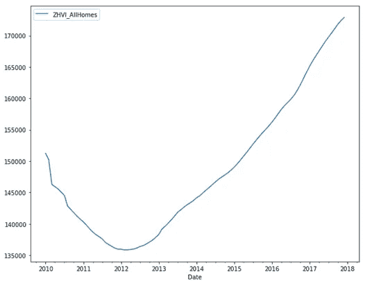

在上图中，你可以看到一个清晰的趋势，但趋势中也有季节性。时间序列的预测应该是稳定的，否则预测将是不正确的。

# 预测模型(县序列 ZHVI _ 所有家庭)

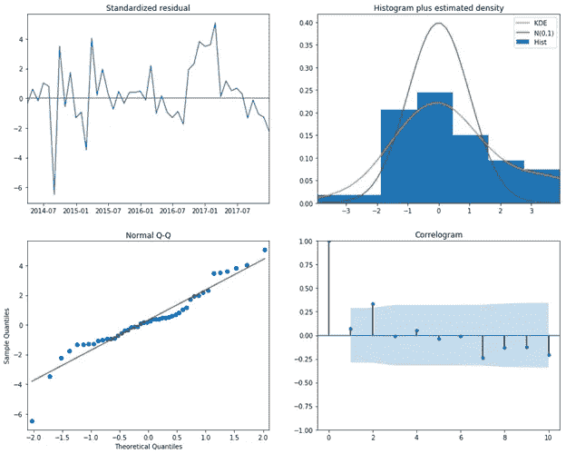

从上面的图表中，我们可以看到-

直方图与 KDE 略有不同。线性回归是可以改进的。

**验证模型**

让我们通过列车测试和分离来验证该模型。[80, 20]

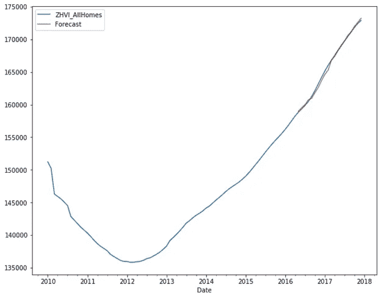

上面的预测并不完美，但与其他参数相比仍然是更好的。让我们看看模型的均方误差。

得到的均方误差为 95146.11

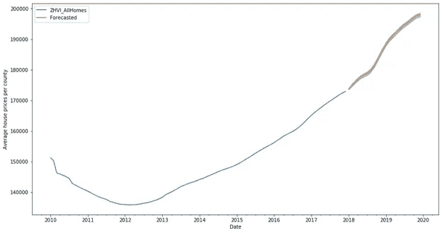

在上图中，您可以看到对未来 24 个月的预测，置信区间也更好，并且没有看到太大的差异。

预测清楚地表明，与 2019 年相比，2020 年的房价将会上涨。

# 后续步骤

作为下一步，我想使用亚马逊预测 API 来预测房价，并检查它是否会给出更好的结果。

# 承认

我真诚地感谢我的数据科学导师 Ramakrishna Soma 博士对我完成这个项目的指导和鼓励。

# 参考

1.  [https://www . Washington post . com/business/2019/01/07/experts-weigh-what-housing-market-will-bring/](https://www.washingtonpost.com/business/2019/01/07/experts-weigh-what-housing-market-will-bring/)
2.  Zillow 经济学数据集【https://www.kaggle.com/zillow/zecon 
3.  [https://people.duke.edu/~rnau/411diff.htm](https://people.duke.edu/~rnau/411diff.htm)
4.  Dickey Fuller 测试 stats models . TSA . stat tools . ad Fuller—stats models
5.  ARIMA 模型 SARIMAX API[http://www . stats models . org/dev/generated/stats models . TSA . statespace . SARIMAX . SARIMAX . html](http://www.statsmodels.org/dev/generated/statsmodels.tsa.statespace.sarimax.SARIMAX.html)
6.  用 Zillow Economics 数据集进行房价预测[https://towards data science . com/house-price-Prediction-with-Zillow-Economics-Dataset-18709 abff 896](/house-price-prediction-with-zillow-economics-dataset-18709abff896)
7.  如何用 Python 检查时间序列数据是否平稳[https://machine learning mastery . com/Time-Series-Data-Stationary-Python/](https://machinelearningmastery.com/time-series-data-stationary-python/)
8.  关于用 Python 进行时间序列预测的 SARIMA 的简单介绍[https://machinelementmastery . com/sa Rima-for-Time-Series-Forecasting-in-Python/](https://machinelearningmastery.com/sarima-for-time-series-forecasting-in-python/)