# 类固醇上的房价预测

> 原文：<https://towardsdatascience.com/housing-price-prediction-on-steroids-83daccc84d6d?source=collection_archive---------34----------------------->

## 通过使用 Python 从外部数据生成要素来提升性能。

西雅图风景；图片来自[pixabay.com](https://pixabay.com/fr/illustrations/seattle-washington-ville-%C3%A9tat-3465797/)

# 介绍

在本文中，我们将创建一个预测模型来**预测西雅图**的房价。我们将首先使用房产的属性制作一个模型**，比如平方英尺、房间、卧室、浴室、风景等等。**

然后，我们将**通过从外部数据**生成**特征，如文化空间、公园、公共艺术场所、高尔夫球场、游泳海滩、野餐桌等的邻近度，来** **显著改进**该模型..衡量每个新增功能的改进。

# 我们要做什么

*   步骤 1: **探索**西雅图房价数据
*   第二步:创建**价格预测模型**
*   步骤 3: **从外部数据添加特征**
*   第四步:比较和分析**结果**

# 第一步。探索西雅图房价数据

为了制作这个模型，我们将使用来自这个[房屋预测项目](https://github.com/Shreyas3108/house-price-prediction)的“西雅图房价”。它包含 21613 份 2015 年以来的价格记录，其中有几个来自房屋的特征。

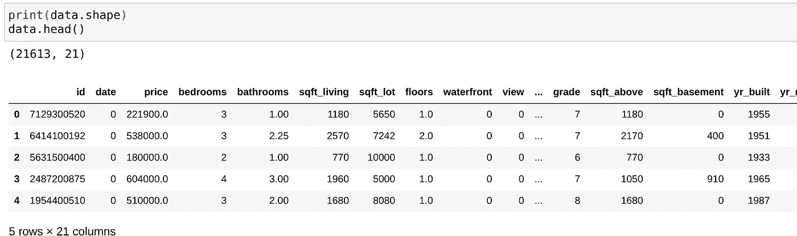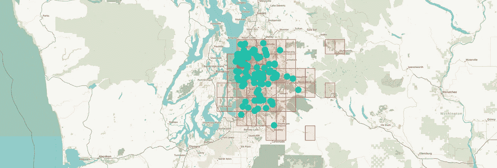

100 次观察的随机样本

“价格”列将是我们预测的目标变量。

让我们来看看**价格**与其他价格的关联热图。

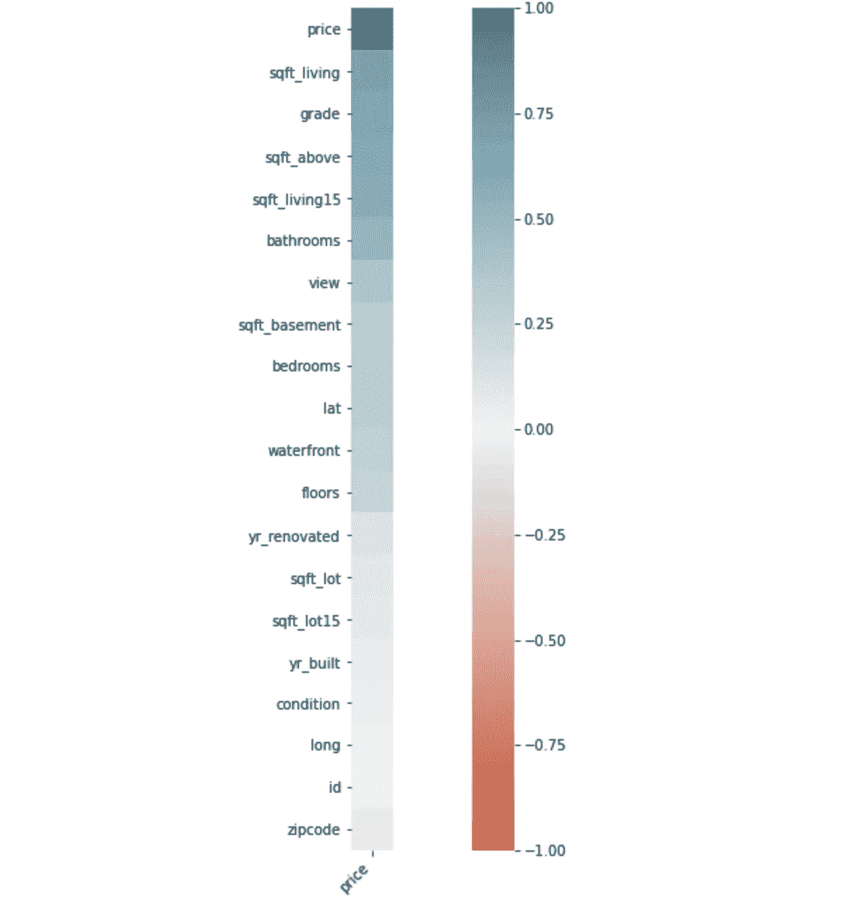

**价格**对所有的关联图

值得一提的是，源代码并没有提供每个特性的描述，有些特性还不太清楚。出于本教程的考虑，我假设‘sqft _ living 15’是‘sqft _ living’的某种变体，以此类推。此外，他们如何量化“条件”、“景观”或“滨水区”有点神秘，但这并不困扰我，因为它们都没有根本的相关性。

# 第二步。创建价格预测模型

让我们创建一个标准模型来获得预测分数、训练(90%)和测试(剩下的 10%)。

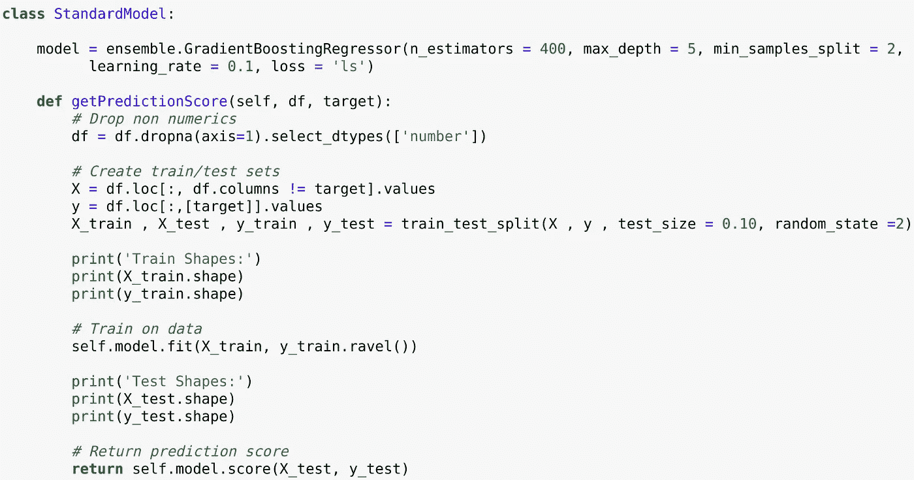

**StandardModel** 类获得**分数**

引用文章的作者通过使用**GradientBoostingRegressor**获得了最佳结果，因此让我们用完全相同的参数保持**完全相同的实验**，以便能够知道这些特性带来了多少孤立的改进。

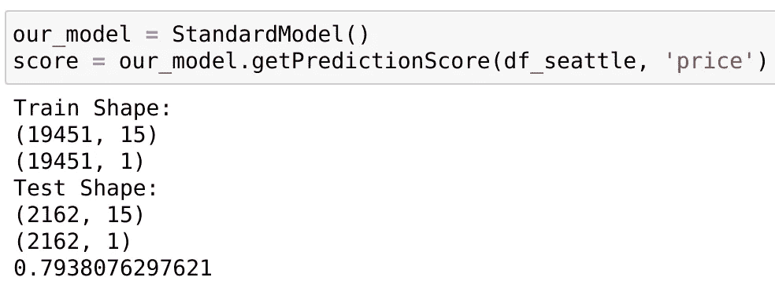

分数是 0.79(在 0-1 的范围内)。

我们想了解**每个特性给表**带来了多少改进。让我们做一个实验。让我们从一个随机选择的变量开始预测，然后一次增加一个变量，看看分数如何达到 0.79 的整个过程。

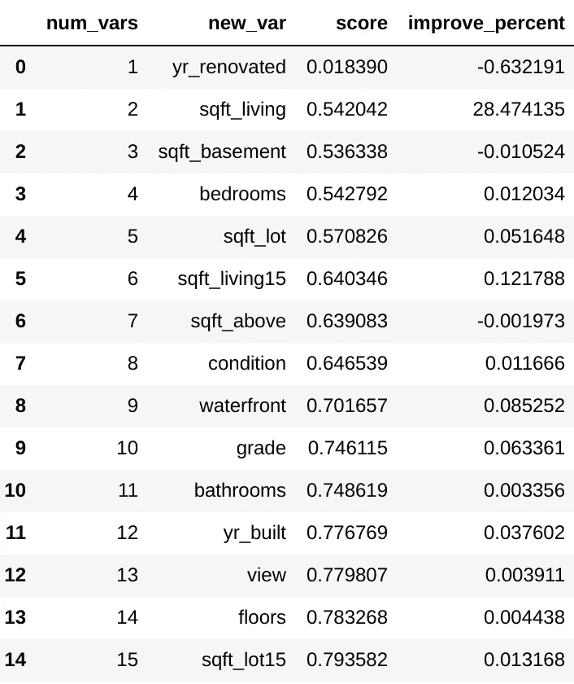

需要说明的是，第一行是模型只通过**使用‘yr _ renewed’**得到的分数，第二行是模型同时使用**的‘yr _ renewed’和‘sqft _ living’**得到的分数，以此类推。

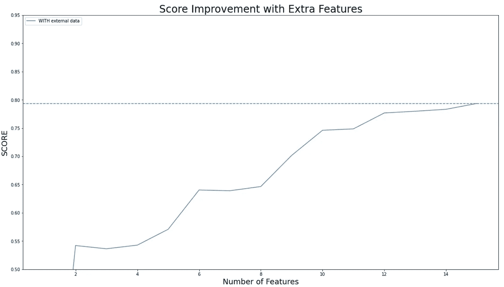

这是每个新特性如何改进这个特定实验的模型的路线图。当然，**并不是所有的功能都带来价值**(有些功能甚至会减去价值)，有些功能**非常相关**。

然而，这并不意味着如果以不同的顺序选择，这些特性会以相同的方式提供帮助，所以让我们**将这个实验运行 30 次**并收集数据以获得对特性重要性的更真实的了解。

让我们来看看 30 次实验后按特性计算的平均改进。

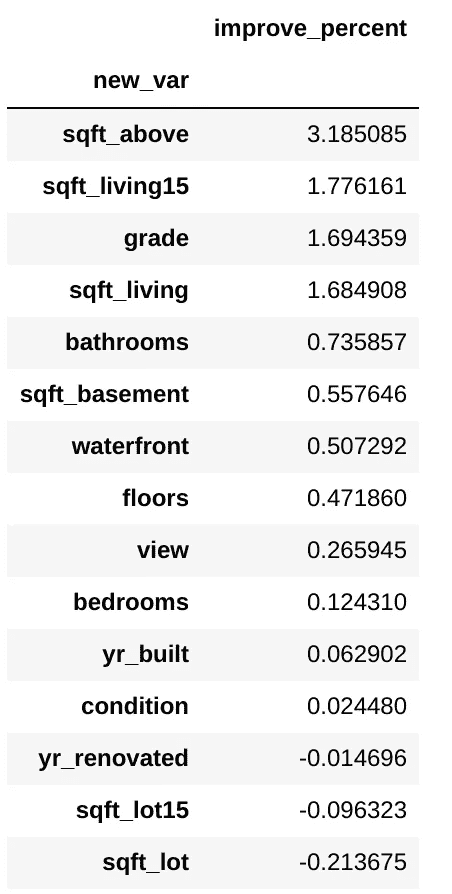

虽然探究为什么 *sqft_lot* 似乎会破坏模型会很有趣，但是这些结果并没有什么特别显著的地方。

# 第三步。从外部数据添加要素

现在，我们希望**通过按位置添加相关数据来生成有用的特征**。

首先，让我们使用这个来自 data.seattle.gov 的[“西雅图野餐桌”](https://www.openblender.io/#/dataset/explore/5ff4c4e9951629568a45d0f0/or/45)，它(令人震惊地)列出了西雅图所有野餐桌的位置。

假设是野餐桌的距离与房价有着有意义的关系(如果附近有公园，房产会更有价值)。

为了生成有用的数字特征并将其添加到我们的数据集中，我们使用了**位置混合算法**。其工作原理是，我们将原始数据(西雅图房价)作为起点，并在限定的半径范围内添加来自“外部”数据集(野餐桌)的附近观察值的数量。

位置混合算法

**“半径 1 公里范围内的野餐桌数量”**作为一个新列添加到我们的西雅图住房数据集中，如下所示:

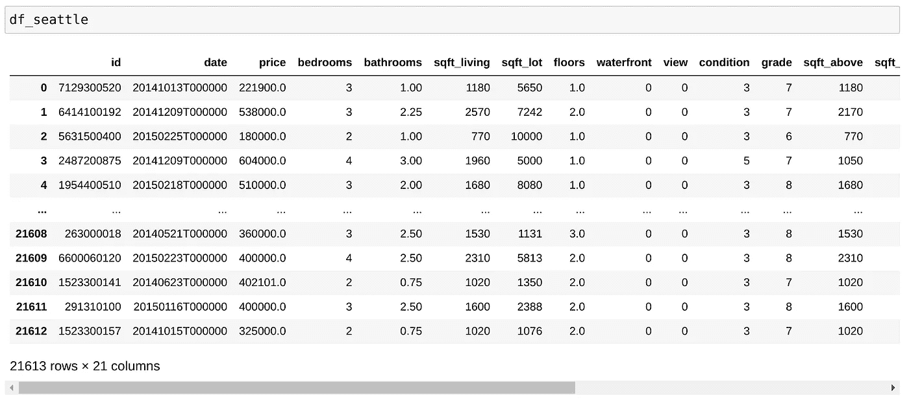

混合外部数据之前的数据帧

我们使用 OpenBlender API 在我们的数据帧上定位混合 1 公里半径上的野餐桌的“计数”,作为一个新特性。

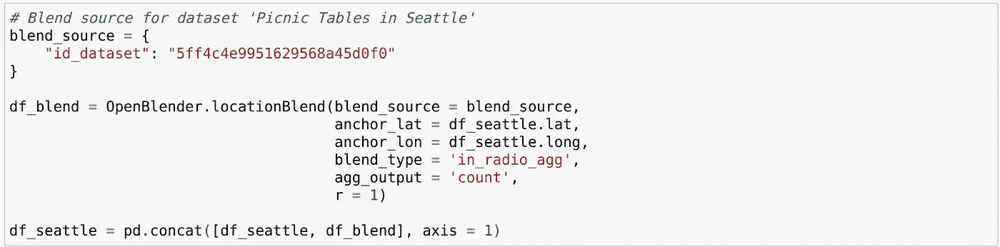

现在，我们的西雅图住房数据框架有了一个新的数值特征，即在 1 公里的半径范围内计算野餐桌的数量。

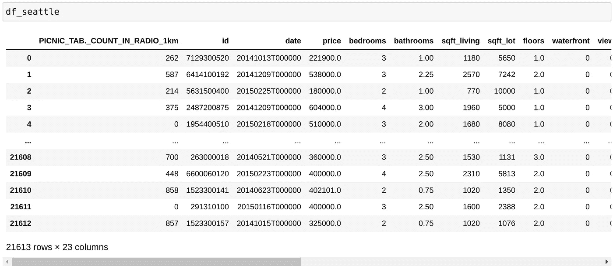

混合后的数据帧

现在，让我们添加许多其他功能:

[文化空间](https://www.openblender.io/#/dataset/explore/5ff4af6f951629568a457003/or/45)

[足球场](https://www.openblender.io/#/dataset/explore/5ff4c70695162956893e4e58/or/45)

[游玩区域](https://www.openblender.io/#/dataset/explore/5ff4c3a2951629568a45d03b/or/45)

[浅水池](https://www.openblender.io/#/dataset/explore/5ff4c213951629568a45d008/or/45)

[饮水机](https://www.openblender.io/#/dataset/explore/5ff4b995951629568a45c5a2/or/45)

[绿色区域](https://www.openblender.io/#/dataset/explore/5ff4b7f095162956893e4463/or/45)

[篮球场](https://www.openblender.io/#/dataset/explore/5ff4be7b951629568a45ce85/or/45)

[公共艺术](https://www.openblender.io/#/dataset/explore/5ff4b134951629568a4578b8/or/45)

[野餐地点](https://www.openblender.io/#/dataset/explore/5ff4c2ad95162956893e4b35/or/45)

[高尔夫球场](https://www.openblender.io/#/dataset/explore/5ff4bad095162956893e4942/or/45)

让我们为 300 米**半径和 1 公里**半径创建特征。

现在我们有一个 47 列的数据框架，带有数字特征。

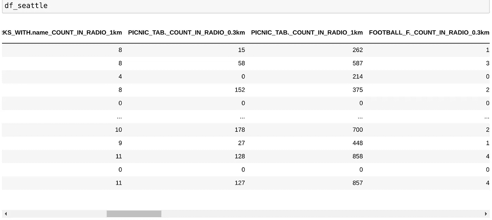

21613 行× 47 列

# 第四步。分析结果

现在让我们再次通过我们的模型运行新数据。

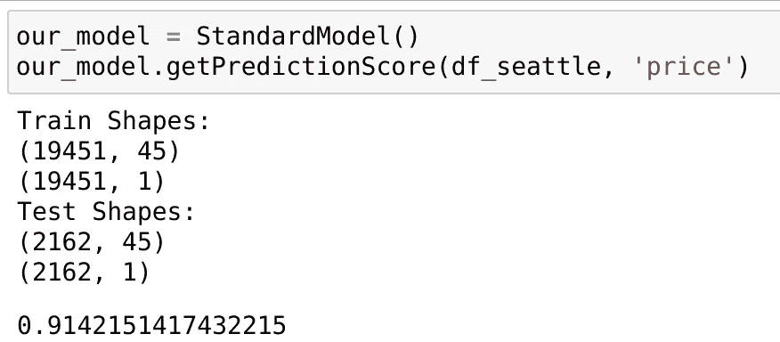

分数是 **0.914！！**

让我们再次随机添加变量，并与之前没有外部数据的模型进行比较，查看特性路线图。

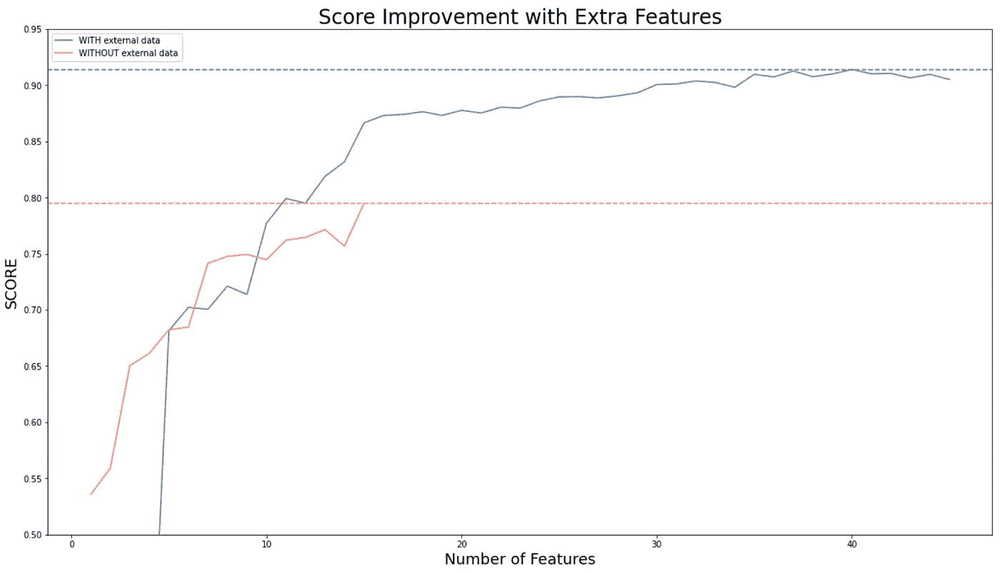

没有外部数据的最大分数**为 **0.79** ，而有**新数据的新分数为 0.91** ，在两种情况下使用相同的测试集和相同的模型。**

这是一个**巨大的改进**，我们只增加了一些功能！有一个几乎无限的功能宇宙可以添加，以进一步提高分数。

让我们再次运行实验 30 次，以了解每个特性的相关性。

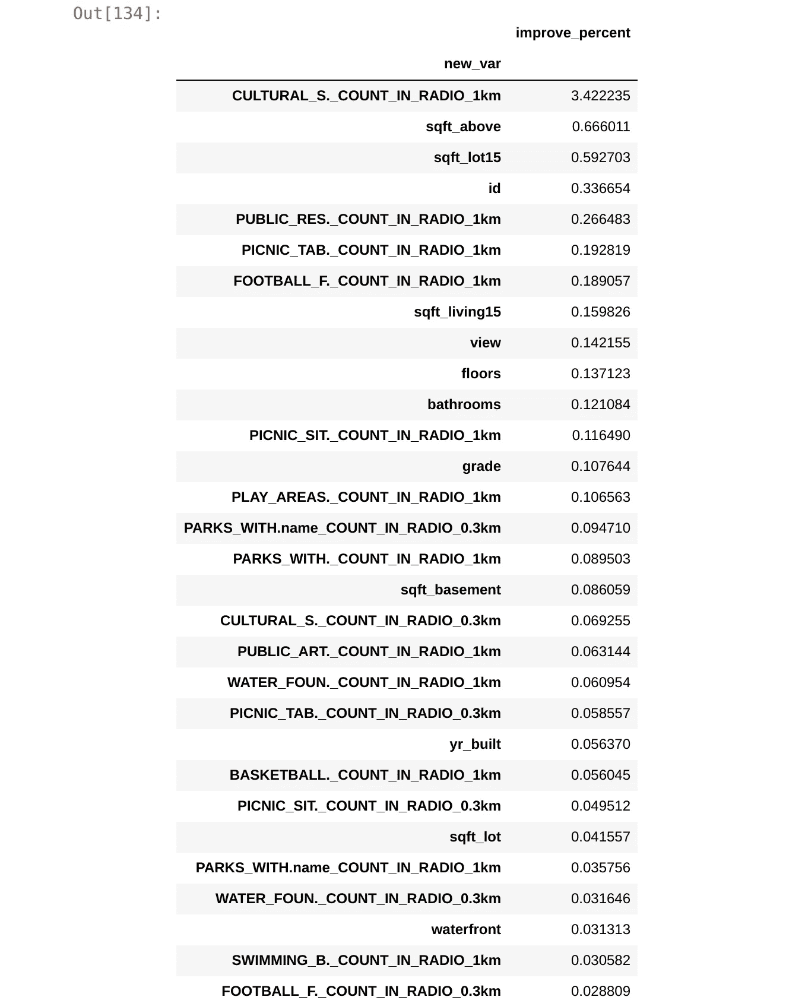

文化空间似乎发挥了特别重要的作用。许多新功能提供了显著的改进。

这是 Github 到这个回购的链接。