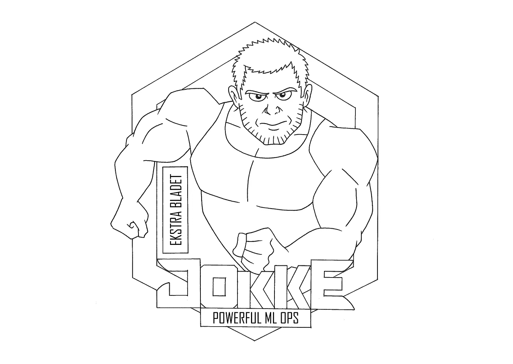
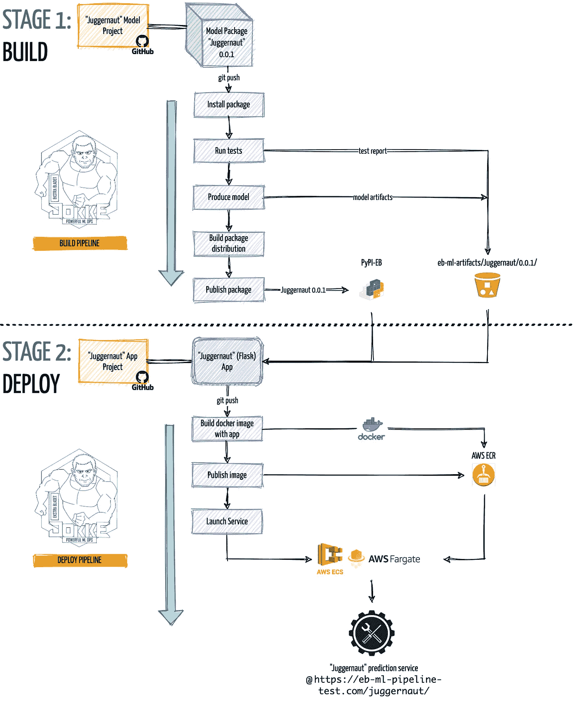

# 如何在两周内构建基于云的 ML Ops 框架

> 原文：<https://towardsdatascience.com/how-2-build-a-cloud-based-ml-ops-framework-in-2-weeks-ae67e7a179fe?source=collection_archive---------20----------------------->

## [行业笔记](https://towardsdatascience.com/tagged/notes-from-industry)

## 在本帖中，我们将详细介绍我们如何依靠软件工程中的 DevOps 最佳实践，在两周内构建一个完整的 ML Ops 框架。

我们对 ML Ops @ Ekstra Bladet 的实现名为“Jokke”。资料来源:Ekstra Bladet。

许多组织已经投资开发基于机器学习的服务，但仍在努力寻找将机器学习模型从开发过渡到生产的最佳方式。

时至今日，这种方法通常是严格的，并且意味着各种各样的手动过程(以及这种手动过程所带来的所有操作风险)。从组织和模型开发人员的角度来看，这是非常低效和反生产的。

# **解决方案:ML Ops**

当你开发一个现实生活中的机器学习服务时，你实际上是在开发一个软件。因此，在传统软件开发的世界中寻找解决方案是显而易见的。

正如在[之前的文章](/ml-ops-machine-learning-as-an-engineering-discipline-b86ca4874a3f)中所详细描述的，来自软件工程的 DevOps 最佳实践使得软件可以(持续地)立即交付生产，并保持其可靠运行。

这些 DevOps 原则可以应用于开发和部署机器学习服务(新版本)的迭代过程。当这样做时，这有时被称为*机器学习操作* (=ML Ops) *。*

与 DevOps 类似，ML Ops 依赖于工具、自动化和工作流，这些工具、自动化和工作流抽象出意外的复杂性，让模型开发人员专注于他们应该做的事情和他们擅长的事情:开发机器学习模型。

# 建还是买？

存在多个云机器学习平台，包括 AWS Sagemaker、BentoML 和 ML Flow。它们当然不坏，但它们可能很贵，有时感觉像用大锤砸坚果。

当我们考虑如何接近 ML Ops 时，我们知道我们将很快不得不将许多机器学习模型投入生产，特别是推荐系统和自然语言处理系统。

此外，我们知道我们需要一个标准化和可扩展的设置。这种设置必须为几个模型构建者指定清晰简单的规则，同时保持训练方法的自由度。最后，我们的解决方案必须支持多种多样的 ML 模型，并能够轻松实现不断涌现的新机器学习方法。

这让我们选择建造而不是购买。

# 遇见“Jokke”

在我们的组织 Ekstra Bladet 中，我们使用 Amazon Web Services 堆栈中的一套相关服务，在两周内构建了一个简单(但功能强大)的基于云的 ML Ops 实现。我们把这个框架命名为“Jokke”。

其核心“Jokke”由两条[连续集成](https://en.wikipedia.org/wiki/Continuous_integration) / [连续输送](https://en.wikipedia.org/wiki/Continuous_delivery)管道组成。管道是动作序列，每次模型开发人员向 git 提交新版本的机器学习模型时都会自动运行:

1.  构建和发布模型的**构建**管道
2.  一个 **DEPLOY** 管道将模型部署为一个微服务，通过 HTTP 请求计算预测

下面我们举例说明了两个管道的工作流程(的简化版本),以及它们是如何相互链接的。

“Jokke”构建和部署 CI/CD 管道的工作流程。资料来源:Ekstra Bladet

接下来，我们将带您更详细地了解每个管道的工作原理。

# 阶段 1:构建

为了让机器学习模型与我们的框架兼容，模型的代码必须只满足几个要求。

我们已经尝试设计需求，这样它们强制执行我们为我们的模型开发代码的方式的最小标准化，而不限制模型开发人员对他们的分析方法和工具的选择的不必要的限制(实际上这是最重要的原因之一，为什么我们首先决定开发我们自己的框架)。

首先，我们要求模型的代码必须包装成 python 包。这是我们的框架与大多数可用解决方案之间的主要区别，后者专注于将笔记本电脑转变为服务。

我们还要求，模型本身必须作为自己的 python 类`Model`来实现，并有两个强制方法:

1.  `produce_model()`:产生模型的方法。
2.  `predict()`:通过调用(1)得到的训练模型预测新观测值的方法。

当模型开发人员向 git 提交模型的新版本时，它会触发“Jokke”**BUILD**管道来启动一个适当维度的虚拟实例，该实例:

*   安装软件包
*   运行由模型开发人员编写的测试(例如，单元、集成和验收测试(包括模型性能测试))
*   训练并生产模型工件(使用`produce_model()`方法)
*   在我们自己的 Python 包索引上发布模型包
*   将模型工件和测试报告写入 AWS S3 存储桶

如果管道中的一个步骤失败，所有后续步骤都将中止。

如果流水线是成功的，则机器学习模型的新版本通过 python 模型包的新版本与训练好的模型工件的结合来发布。

如果你想知道代码中的构建管道是什么样子，我们已经发布了开源人工智能模型项目 [NERDA](https://github.com/ebanalyse/NERDA/blob/main/.github/workflows/build.yml) 的简化版本:

一个用 Github 动作实现的我们的人工智能项目“NERDA”的简化“构建”管道的例子。

# 阶段 2:部署

如果“Jokke”**构建**管道成功，我们现在就有了自己的机器学习模型的新版本。如果我们想将模型部署为服务，即实时预测服务，我们的 Jokke **DEPLOY** 管道将完成这项工作。

我们所需要的是，模型开发人员构建一个最小的应用程序(默认为 python Flask 应用程序)，该应用程序(1)加载由**构建**管道产生的模型包和模型工件，以及(2)利用`predict()`方法预测“预测”端点中的新观察。

当模型开发人员向 git 提交应用程序的新版本时，它会触发“Jokke”**DEPLOY**管道，即:

1.  收集由**构建**管道产生的模型包和模型工件
2.  将应用程序封装并发布为 Docker 映像
3.  从(2)中内置的 Docker 映像启动一个 web 服务，该服务提供实时预测

与第一阶段一样，如果管道的任何步骤失败，所有后续步骤都将中止。

如果流水线成功，机器学习模型现在在*测试*环境中运行，在那里它通过 RESTFUL API(默认)实时提供预测。

如果我们对我们的新服务感到满意，剩下要做的就是单击一下就批准它，这将触发我们的服务部署到*生产*。耶！

# 还有吗？

“Jokke”不仅仅是管道。例如，我们已经使用出色的 [cookiecutter](https://pypi.org/project/cookiecutter/) 包为“Jokke”模型和服务设计了自己的项目模板。

此外，我们还开发了云基础设施，这使得为新项目启用管道以及在测试和生产中实时监控模型服务的仪表板变得更加容易。

# 我们取得了什么成就？

“Jokke”管道的优势在于，每当模型开发人员想要发布一个新版本的模型时，它们会自动执行原本必须由他/她手工完成的操作和工作。这使得可以(连续地)立即将新模型交付生产，并保持它们可靠地运行。

此外，“Jokke”使我们的模型开发人员能够专注于模型开发，从而利用他们的生产力。

# **快捷键**

如果你想为你的机器学习项目尝试 CI/CD，你可以考虑开源框架 [CML(连续机器学习)](https://cml.dev/)，那看起来真的很有前途。

如果您像我们一样选择开发自己的框架，我们建议您利用您的云平台上的相关服务。例如，我们使用 AWS CodeBuild 和 AWS Code Pipeline 来编排我们的管道。其他成熟的云平台上也有类似的服务。使用这些服务当然有助于大大加快我们的开发过程。

# 退关货物

“Jokke”是由三个人组成的团队在两周内开发的:[亚历山大·詹森](https://www.linkedin.com/in/alexander-jensen-67674075/)、[西蒙·科肯多夫](https://www.linkedin.com/in/simon-kokkendorff-2aa488a0/)和你真正的。它现在被 Ekstra Bladet 的数据科学团队和 Ekstra Bladet 的 ML 创新团队用于构建和部署大规模模型，后者是新闻平台智能项目的一部分，由丹麦创新基金慷慨赞助。

# 资源

</ml-ops-machine-learning-as-an-engineering-discipline-b86ca4874a3f>  <https://cml.dev/>  <https://pypi.org/project/cookiecutter/> 