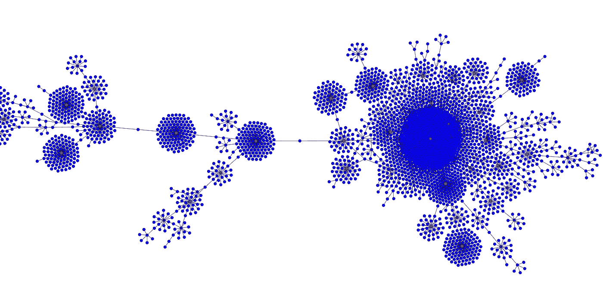
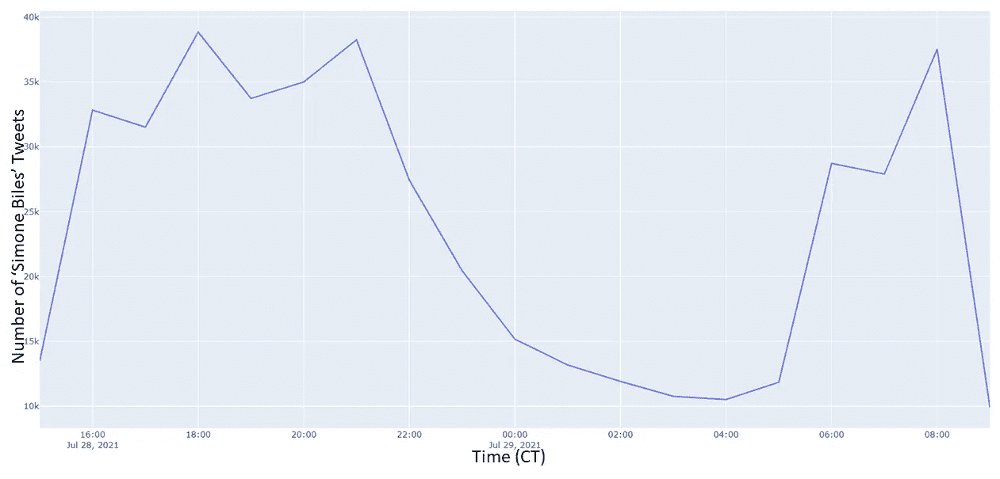
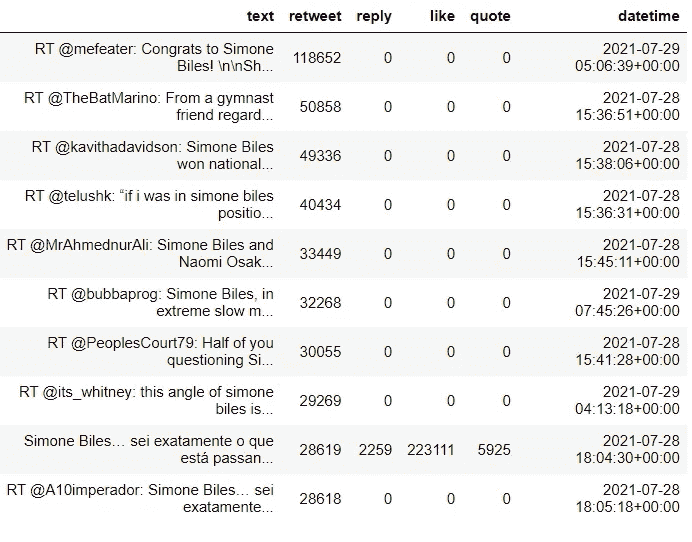
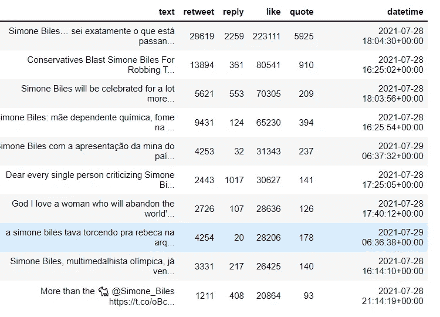
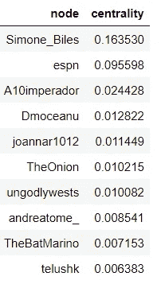
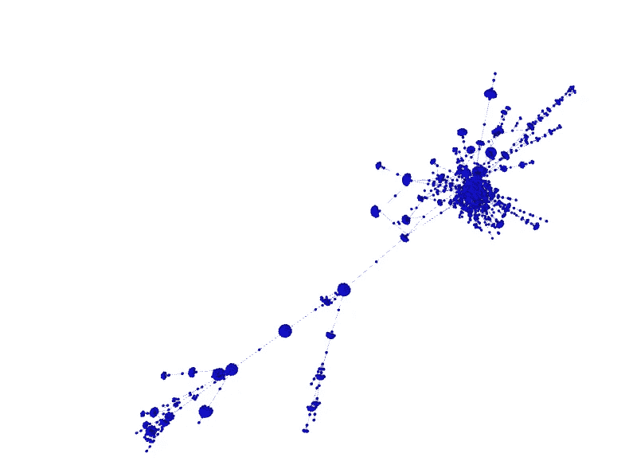
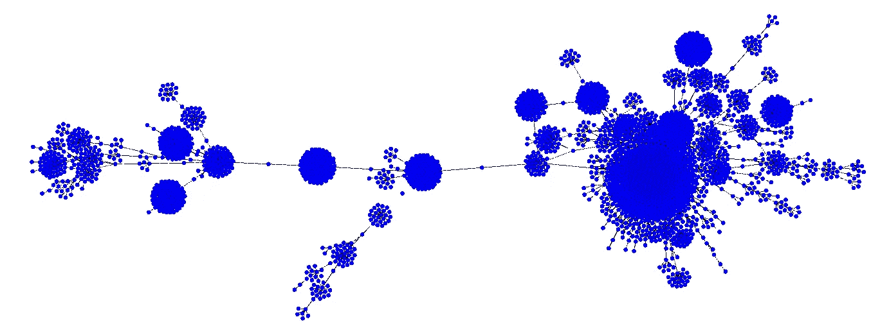
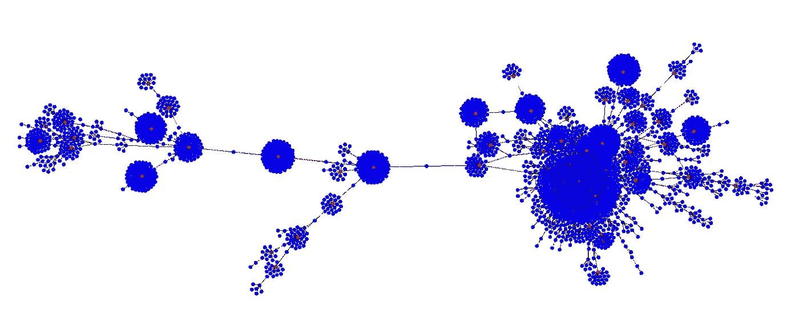
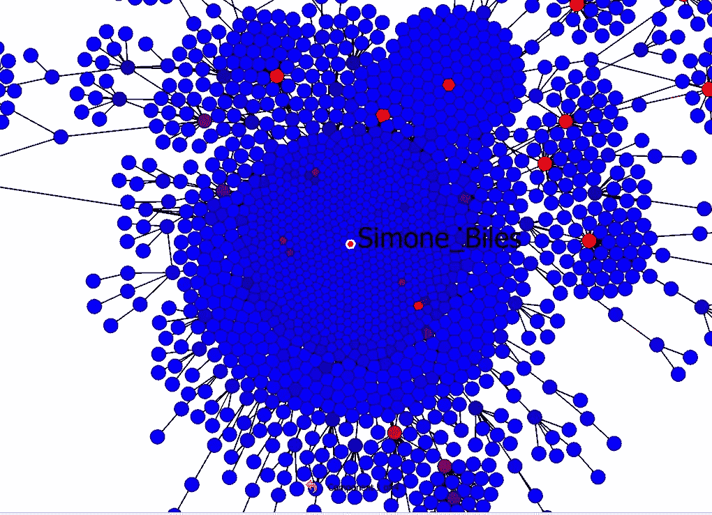

# 400，000+Tweets 如何显示 Simone Biles 获胜

> 原文：<https://towardsdatascience.com/how-400k-tweets-show-that-simone-biles-wins-ee941bdb13e2?source=collection_archive---------22----------------------->

## 奥运会是世界聚集的地方。Twitter 是全世界分享观点的地方。让我们使用 Graphia 和 NetworkX 来看看 Twitter 是如何对 Simone Biles 的决定做出反应的

围绕“西蒙·比尔斯”的推文网络在 Graphia |塞犍陀·维韦克中可视化

西蒙·比尔斯的所作所为非常勇敢。或者至少，这是一种观点——我同意。我也热切地相信，她所做的将大大有助于推动我们的社会走向更少的偏见和更多的平等。我们的社会中存在着某些错误的期望和偏见；无论是在种族、性别方面，还是在这种情况下，顶级运动员应该或不应该做什么。我们慢慢开始意识到，这些孤立的观点并不能说明问题的全部，而且会造成巨大的压力。Simone Biles 为自己挺身而出，向世界展示，通过实现梦想和保持健康，你可以过上最好的生活。不必非此即彼。

但是世界对此作何反应呢？毕竟，奥运会最终是让全世界的人们聚集在一起进行友好的竞争。Twitter 是全球人民讨论的地方。所以推特是一个很好的信息来源，可以知道西蒙妮·比尔斯的决定是否被正面看待。这个问题的答案我们来看看 Twitter 的数据。

# 抓取 Twitter 数据

对于数据集，我在不到一天的短时间内收集了所有引用“西蒙妮”+“比尔斯”的推文。这可以是包含单词“Simone”和“Biles”的任何引用，包括“Simone Biles”或“#simonebiles”(不区分大小写)、“simone_biles”等。因此非常全面地代表了引用 Simone Biles 的所有 tweets。我使用 Twitter API v2 学术研究轨道，使用 Python 搜集 Twitter 数据。代码如下:

**以下是每小时“西蒙·比尔斯”的推文数量与时间的关系:**

每小时提到“西蒙·比尔斯”|塞犍陀·维维克的推特数量

**以下是转发量最高的 10 条推文。**

引用“西蒙·比尔斯”|塞犍陀·维维克的转发量最高的推文

> 转发量排名前 10 的推文都是支持西蒙妮·比尔斯的！

以下是最受欢迎的 10 条推文。

前 10 名喜欢引用“西蒙·比尔斯”|塞犍陀·维维克的推文

> 在这种情况下也是一样——所有前 10 名喜欢的推文都是西蒙·比尔斯的！

# 推特网

与我在#GameStop 上的文章类似，我建立了推文网络——其中节点是用户名，有向边表示用户通过@引用其他人。为此我使用了 python NetworkX 包。代码如下:

为了找到最重要的节点，我使用了 PageRank 算法。谷歌使用 PageRank 算法对网页进行排名，这也是它成为著名搜索引擎的原因。

在提到“西蒙·比尔斯”|塞犍陀·维维克的推文中，排名靠前的 10 个用户名

> 在关于西蒙妮·比尔斯的讨论中，所有被引用最多的推特人都是西蒙妮·比尔斯的支持者！

# **图形分析**

Graphia 是一个网络可视化包，它本身可能值得一篇教程文章。我发现它比流行的图形可视化软件 Gephi 反应更快，视觉更清晰。然而，Graphia 拥有极其[最少的文档](https://graphia.app/)。

我无法在 Graphia 中可视化 40 万个节点，我将数据随机采样到 5000 条边中。(注:[图中采样其实挺复杂的](https://cs.stanford.edu/~jure/pubs/sampling-kdd06.pdf)，但普遍使用的是随机采样)。

在 Graphia 中，很容易加载我生成的包含 5000 个随机采样边的边文件。最初，图表看起来像这样:

“西蒙·比尔斯”推特网的图解探索|塞犍陀·维韦克

Graphia 使用强制定向布局算法。该算法模拟所有图形节点之间的排斥力，以及连接的节点之间的吸引力，从而产生美丽的可视化效果。外围的节点并不都连接到中心的单个组件。因此，我们在不影响我们感兴趣的基本图形结构的情况下删除了这些节点。双击最大组件中图形的任何部分，放大该组件。

放大图片中最大的 twitter 网络组件|塞犍陀·维维克

然后我想象 2D 的图表

2D 推特网络可视化|塞犍陀·维维克

接下来，我添加一个 PageRank 中心性可视化，将节点从蓝色(低等级)着色为红色(高等级)。

Graphia 2D twitter 网络可视化(颜色表示页面排名中心)|塞犍陀·维韦克

在最大的蓝色圆圈的中心有一个鲜红色的节点，上面覆盖着多个节点。

放大可以看到，核心是 Simone Biles 的推特手柄@Simone_Biles:

放大网络的心脏|塞犍陀·维维克

于是，围绕 Simone Biles 的对话就围绕着@Simone_Biles 展开了。这是有道理的，但这也表明西蒙妮·比尔斯能够控制自己的叙事。很有可能人们在负面谈论西蒙妮·比尔斯，在这种情况下，他们可能不会提到西蒙妮·比尔斯，而是她的诽谤者。看到她周围所有的支持是令人振奋的。

# 结论:

多个指标显示，围绕西蒙妮·比尔斯的推特对话对她的行动表示支持。也许通过选择不参加奥运会，并保持与她优先考虑的事情的联系，她赢得了比她以前无数次仅仅参加比赛更多的心。那不是会让她成为更大的赢家吗？

[*关注我*](https://skanda-vivek.medium.com/) *如果你喜欢这篇文章。*

如果你对技术和现代社会之间的相互联系有全面的认识，请订阅我的时事通讯。

 [## 网络物理

### 在日益互联的世界中，基于数据的现代社会问题透视

skandavivek.substack.com](https://skandavivek.substack.com)