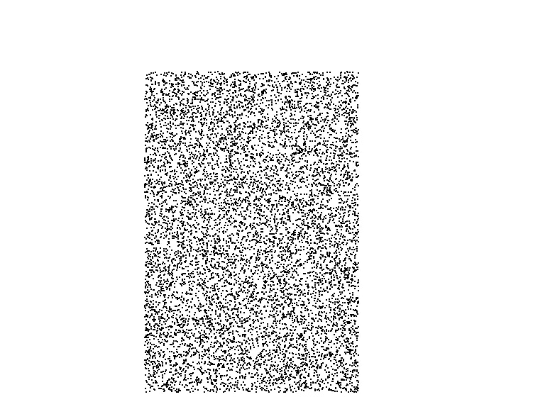
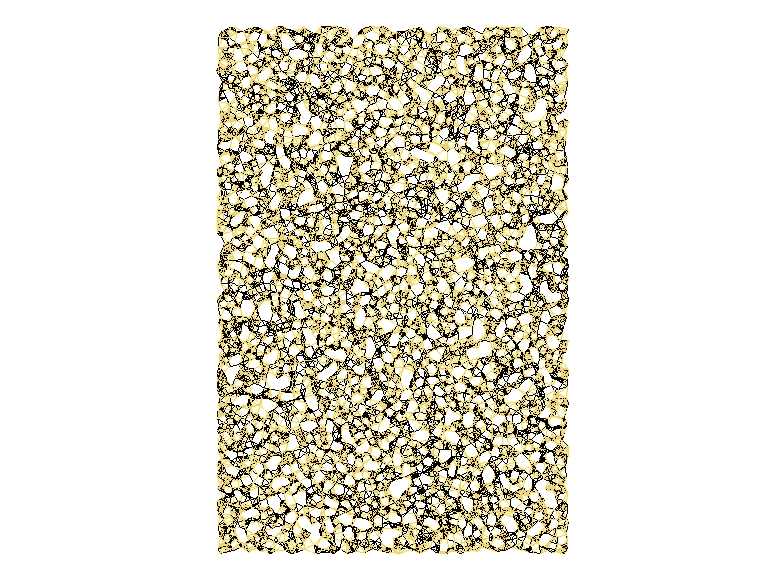
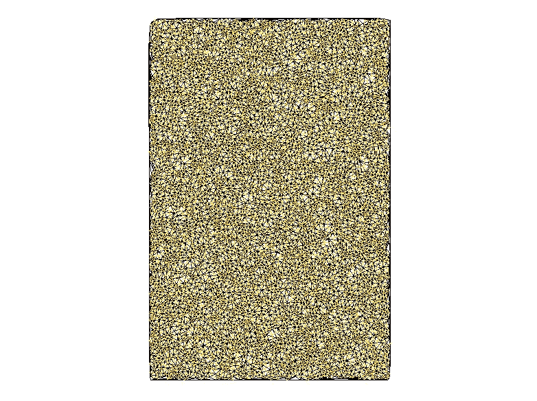
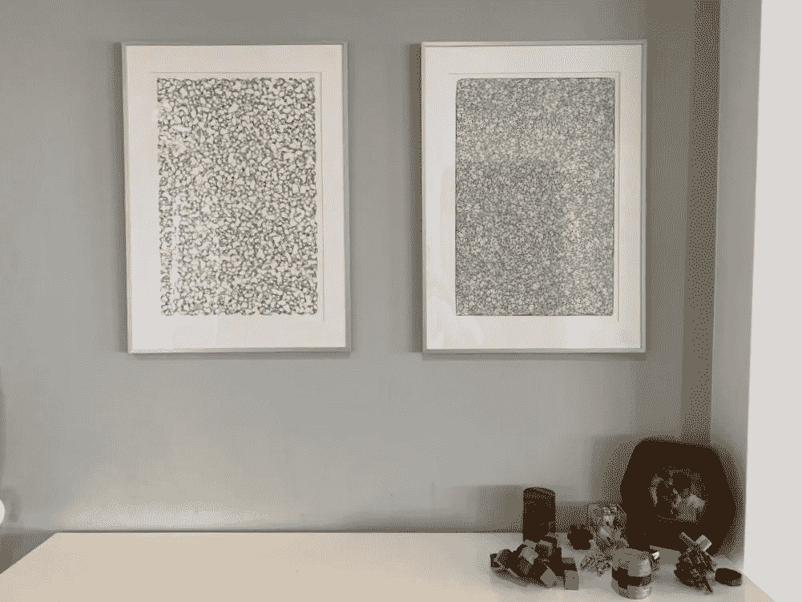

# 数据科学家如何…装饰他的客厅？

> 原文：<https://towardsdatascience.com/how-a-data-scientist-decorates-his-living-room-c5026f490c2b?source=collection_archive---------39----------------------->

## 数据驱动的方法:第二集

我为我的客厅找了一段时间的插图，但没有成功。因此，我想起了我在儿子的房间做的事情。那很有趣。😂

这样，我开始想办法用我的数学知识和技能来制作自己的插图。在网上搜索了几分钟后，我偶然发现了这个关于生殖艺术的马库斯·沃尔茨惊人的 [GitHub repo](https://github.com/marcusvolz/mathart)

立刻，我变得非常兴奋，开始写我的第一行代码。

资料来源:Giphy.com

我的方法如下:

**插图#1**

我知道我的家庭办公室里有几个框架积了很多年的灰尘。所以我试着复制马库斯·沃尔茨的最近邻居图，但加入了个人风格。

我稍微修改了上面提到的 repo 的代码，以便为我的插图构建一个矩形。

作者图片

这很酷，但我需要更多。如果不是将每个点连接到其最近的邻居，而是以某种方式突出了点之间的关系。我的意思是，如果我用以下属性来标识这些点会怎么样:

> 点 A 是点 B **的一个 *k* 最近邻，而** B 也是 A 的一个 *k* 最近邻。

我真的很喜欢它的输出。

k = 8 个最近的邻居。为什么是黄色？与客厅的其他装饰相协调(图片由作者提供)

突然在想，黄段子和黑段子有关系吗？我会把它作为一个练习😉

**插图#2**

我一直在浏览 Marcus 的网页，因为我知道了 T21 的 Delaunay 三角剖分和 Voronoi 图之间的关系，所以我决定使用相同的数据集将两者结合在同一个图表中，并再次使用黑线和黄线。

结果是这个。

Delaunay 三角测量加 Voronoi 图版本(图片由作者提供)

任务完成。现在，是时候打印和悬挂它们了😎。

作者图片