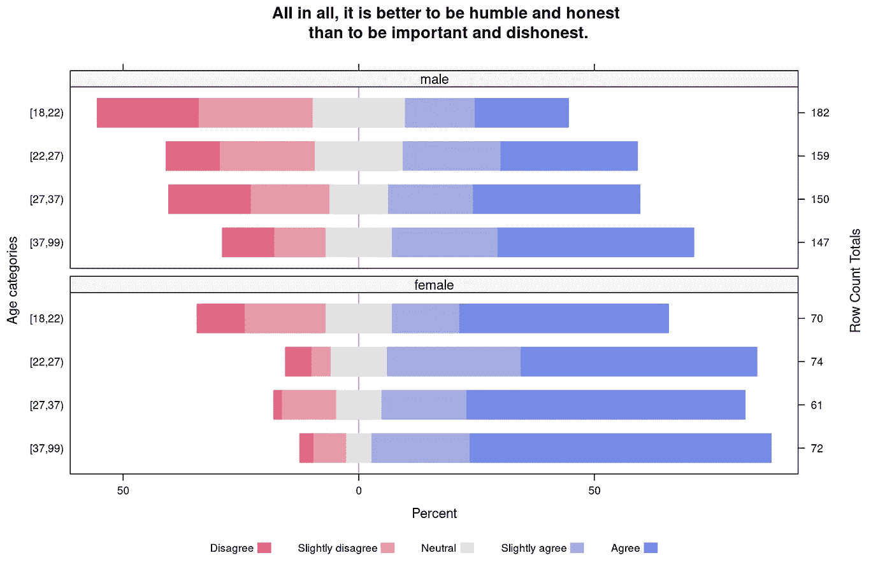
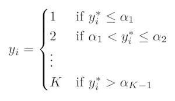
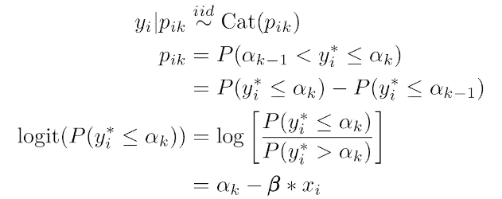
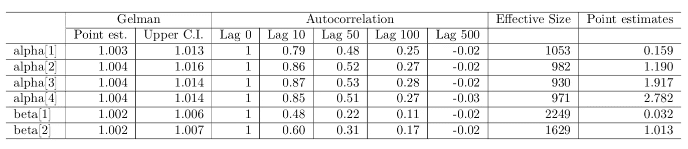
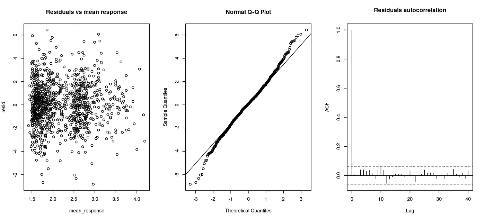
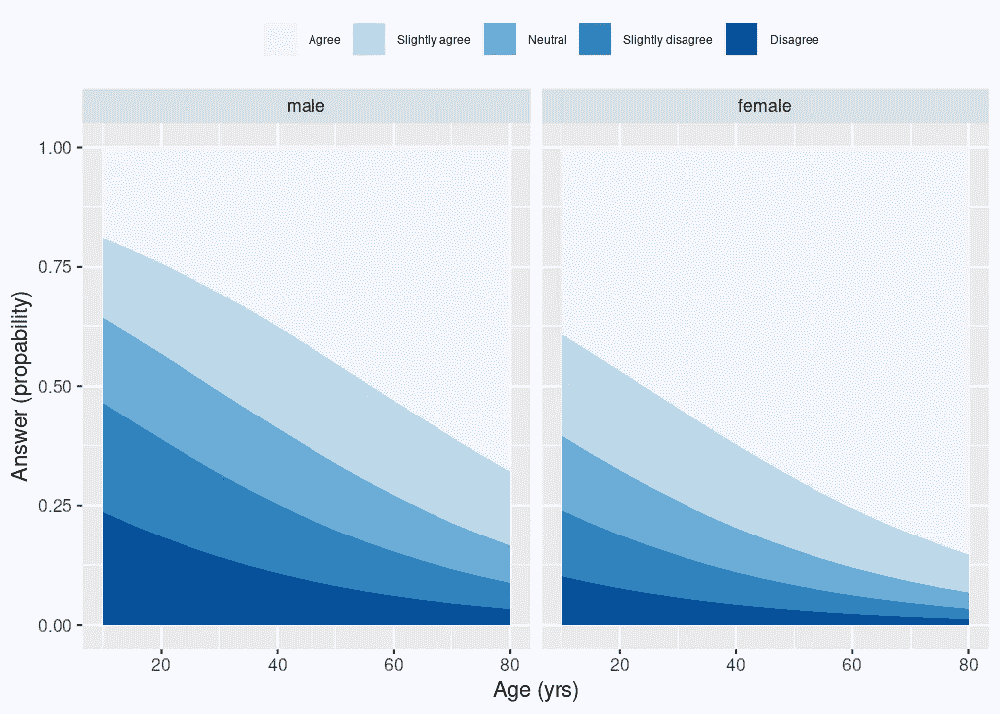
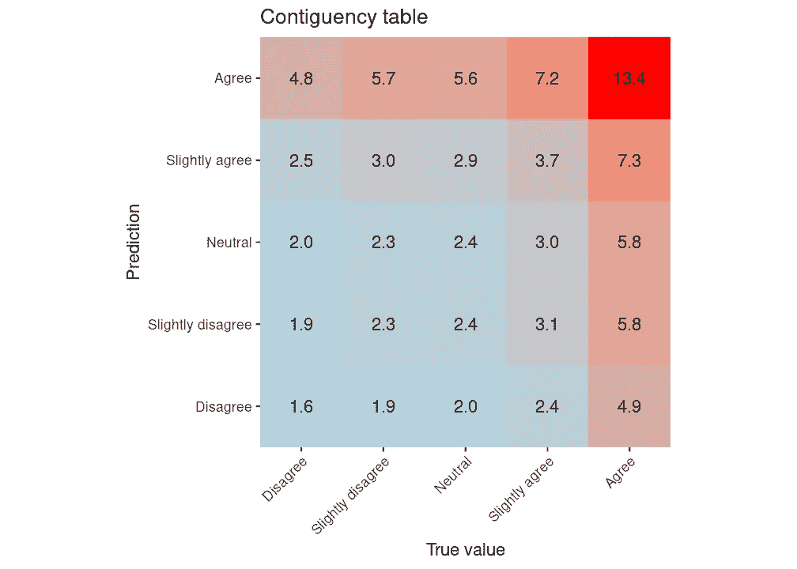
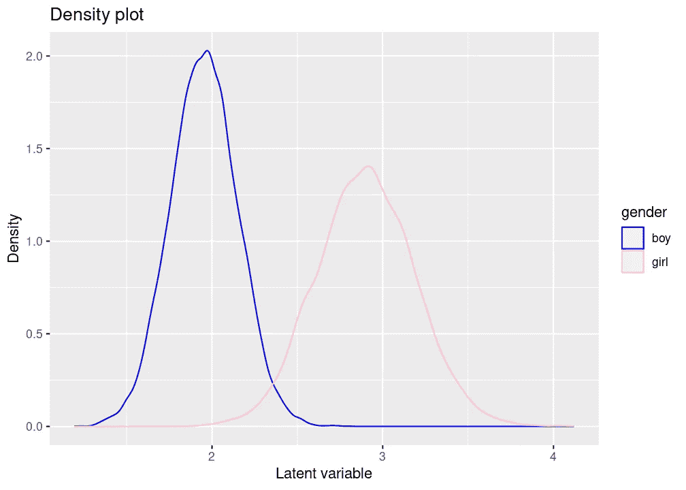

# 一个数据科学家如何去相亲

> 原文：<https://towardsdatascience.com/how-a-data-scientist-goes-on-a-blind-date-b27f365691f9?source=collection_archive---------40----------------------->

## [实践教程](https://towardsdatascience.com/tagged/hands-on-tutorials)

## 贝叶斯框架中的有序回归


照片由 [**波琳娜·坦基列维奇**](https://www.pexels.com/nl-nl/@polina-tankilevitch?utm_content=attributionCopyText&utm_medium=referral&utm_source=pexels) 上 [**像素**](https://www.pexels.com/nl-nl/foto/vakantie-liefde-hart-creatief-3905861/?utm_content=attributionCopyText&utm_medium=referral&utm_source=pexels)

当数据科学家准备相亲时，他/她会情不自禁地思考爱情、存在的孤独和相互信任。嗯…可能不是所有的数据科学家都这么想…但有些可能。无论如何，我想用最后一项，关于相互信任，给大家介绍一个贝叶斯框架中的序数回归这个话题。

因为即将到来的约会将是一次盲目的约会，我们不能确定对方的观点和信念。然而，在心理学中，已经有很多关于描绘性格的研究。标准化的问卷和测试被用来评估心理特征。这种问卷通常由评分表组成。受访者需要从一组离散的有序答案选项中进行选择，如“完全不同意”、“不同意”、“无意见”、“同意”和“完全同意”。这种等级量表被称为[李克特量表。](https://psycnet.apa.org/record/1933-01885-001)在本博客中，我们将利用这样一个问卷的例子来评估特定问题的答案，以及答案如何依赖于性别和年龄等特征。

## 马基雅弗利

这篇博客中的数据来自于[克里斯蒂和](https://www.sciencedirect.com/book/9780121744502/studies-in-machiavellianism)盖修的 MACH-IV 问卷，它提供了一个[马基雅维利主义](https://en.wikipedia.org/wiki/Machiavellianism)的衡量标准。以尼可罗·马基亚维利命名的马基雅维利主义在现代心理学中被用来描述缺乏同情心和道德观，以及对个人利益的强烈关注。MACH-IV 问卷由摘自马基雅维利著作的 20 个陈述组成，受访者按照从“强烈不同意”到“强烈同意”的五分制对他们的同意程度进行评级。数据集可以在[这里](https://openpsychometrics.org/_rawdata/)下载，真的很大；出于本报告的目的，我将仅使用从荷兰网络位置上传的数据。此外，我只关注 20 个问题中的一个:“总而言之，谦虚和诚实比重要和不诚实更好”。下图基于黑伯格和知更鸟，显示了结果与年龄和性别的关系。



发散堆积条形图显示不同性别和年龄类别的所选问题的答案。总行数绘制在右手轴上。在我之前的[博客](https://blog.orikami.nl/behind-the-screens-likert-scale-visualization-368557ad72d1)中可以找到更多关于这类情节的细节。

该图显示，老年人和女性更倾向于同意这种说法。当试图对年龄和性别这两个独立变量的李克特量表的结果进行建模时，最好使用有序回归。因此，我想探讨这种类型的回归，以及如何在这份报告中的贝叶斯框架中进行这种回归。

## 模型

由于我们想要预测的结果是有序的，我们需要在贝叶斯框架中创建一个有序回归模型。可以这样做。答案 *yᵢ={1，。。。，k}* 归入 *K* 有序答案类别为 *i = 1。。。n 个*样本。该模型假设 *yᵢ* 是一个潜在的——未观察到的——连续量 *yᵢ* 的观察实现。此外，该模型定义了截止点 *αₖ* ，使得:



分界点 *αₖ* 根据因变量估算为 *αₖ = β∗xᵢ* 。注意，我们假设 *β* 不依赖于该模型中的 *k* ，因此假设对于每个切割点是相同的。此外，我们定义*α₀=∞*和 *αₖ = ∞* ，这转化为以下描述:



其中 *Cat(pᵢₖ)* 是 *pᵢₖ* ≥ *0* 和∑ *pᵢₖ* = 1 的分类分布。变量 *pᵢₖ* 表示样本 *i* 落入类别*k*的概率，分界点 *αₖ* 和回归变量 *β* 需要从数据中估计。在贝叶斯框架中，我们需要为分界点 *αₖ* 设置正态先验，因为 *k = 1。。。，k1*和回归变量 *β* 。在我们的示例中，我们有 *K = 5* 个答案选项、 *n = 1062* 个回归变量(年龄和性别)。让我们使用 *σ = 1000* 的相当无信息的先验。

这个模型的数字实现可以有许多不同的方式。在这篇博客中，我描述了使用 [rjags 包](https://cran.r-project.org/web/packages/rjags/index.html)在 *R* 中的一个实现。为了对变量进行正确的数值估计，对临界值 *α* 进行分类很重要。为了帮助模型开始，我们还需要提供 *α* 的有序初始值。JAGS 的模型描述如下:

```
```{r model, message=FALSE, cache=TRUE, results='hide'}
jags_model <- " model {
  for(i in 1:length(answer)) {
    answer[i]  ~ dcat(p[i, 1:5])

    logit(Q[i, 1]) <- alpha[1] - mu[i]
    p[i, 1] <- Q[i, 1]
    for (j in 2:4) {
      logit(Q[i, j]) <- alpha[j] - mu[i]
      p[i, j] <- Q[i, j] - Q[i, j-1]
    }
    p[i, 5] <- 1 - Q[i, 4] 

    mu[i] <- beta[1] * age[i] + beta[2] * gender[i] # no intercept
  }

  ## priors over thresholds
  for(j in 1:4) {
    alpha0[j] ~ dnorm(0, 1.0 / 1.0e3)
  }
  alpha <- sort(alpha0)

  # Priors for regression coefficients
  for(j in 1:2) {
    beta[j] ~ dnorm(0, 1.0 / 1.0e3)
  }
} "
```

## 结果

空间不允许在此显示所有诊断数字。相反，下表显示了变量的收敛、自相关、有效大小和点估计。[盖尔曼统计量](https://projecteuclid.org/euclid.ss/1177011136)接近于 1，显示出适当的收敛。即使应用了 10 的稀疏因子，自相关系数也相当高。这种高相关性也反映在低有效样本大小值中。点估计显示有序的 *α* ，与年龄和性别呈正相关:老年人和女性更倾向于同意这种说法。



对于有序回归，定义和解释残差是相当困难的。在刘和张的之后，我们基于潜在变量计算替代残差。下图显示了作为平均响应函数的残差的小模式。qq 图显示了两端与预期直线的偏差，表明了非线性行为。残差中没有自相关，这很好。



通常会创建[效应图](https://data.library.virginia.edu/visualizing-the-effects-of-proportional-odds-logistic-regression/)来可视化有序回归的结果。使用 JAGS 模拟的结果，我们可以重新计算模拟中每个条目的 *pᵢₖ* 。这些值可以根据年龄和性别绘制成下图。该图显示了模拟的预测。从图中可以看出，老年人更倾向于同意这种说法，而且女性也比男性更容易同意。



通过计算数据集中每个条目的 *pᵢₖ* ，可以对数据进行预测。随后，可以从分类分布 *Cat(pᵢₖ)* 中进行抽取。由于这涉及到随机抽取，我们重复这个过程 100 次。结果可用于创建列联表。下表显示性能不怎么样，准确率只有 23%。



## 应用模型

假设一个 30 岁的男孩遇到一个 28 岁的女孩。在这个问题上，他的回答至少和她一样肯定的概率是多少？我们可以分别使用男孩和女孩的特征来计算模拟中每个条目的概率 *pᵢₖ* 。随后，可以从分类分布 *Cat(pᵢₖ)* 中进行抽取。下图显示了潜在变量的分布，它们有很大的不同。对于男孩来说，潜在变量更高的概率只有 0.5%。当查看答案类别时，通过从分类分布中抽取来模拟，我们发现有 55%的可能性，男孩的答案至少和女孩一样肯定。



## 结束语

使用贝叶斯框架的有序回归需要一些努力。所得到的模型受到高度自相关的影响，并且只能稍微预测正确的响应。很可能这个模型中没有考虑的其他因素也有影响。贝叶斯框架确实允许非常容易地估计答案的概率并比较它们。