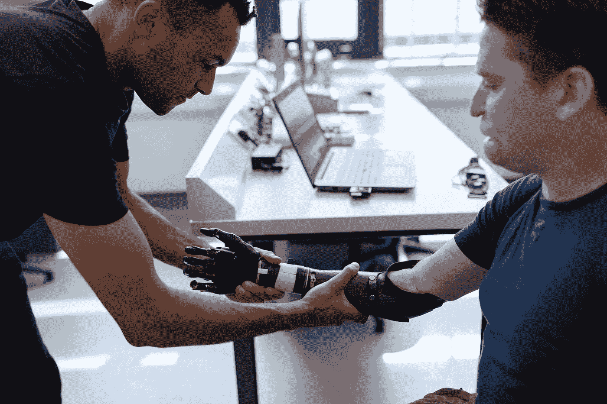

# 人工智能如何赋能辅助技术并减少不平等

> 原文：<https://towardsdatascience.com/how-a-i-can-empower-assistive-technology-and-raise-inclusiveness-abf616e78377?source=collection_archive---------28----------------------->

在 [Unsplash](https://unsplash.com?utm_source=medium&utm_medium=referral) 上拍摄的 [ThisisEngineering RAEng](https://unsplash.com/@thisisengineering?utm_source=medium&utm_medium=referral)

## 关于人工智能如何应用于残疾人辅助技术的快速介绍。

在过去几年中，数字技术已经显示出解决现实生活挑战的巨大能力，有助于改变经济的重要领域，无论是所谓的工业 4.0 还是健康领域。

另一方面，如果我们超越比特和字节，人工智能可以拓宽所有层面的包容性。让我们看看怎么做。

# 对智能辅助技术的探索

辅助技术越来越被认可，是通用架构之外对人工智能适用性较好的领域。

根据《福布斯》杂志发布的一篇文章，结合 Coherent Industry Insights 的数据，2015 年残疾人和老年人的技术市场估计为 140 亿美元，预计到 2024 年将达到 260 亿美元。

在人工智能(A.I .)资源和现代人机界面的帮助下，人类正在学习和掌握新的能力，为最需要的人寻求挑战的解决方案。

有了正确的技术，残疾人将有适当的资源来解决进入就业市场的障碍。

换句话说，使这些资源更容易为每个人所用，是保证残疾人进入传统上无法进入的手术场所的一种手段。

# 人工智能将如何支持这一点？

鉴于人工智能的全部潜力，技术需要让所有领域的人们的生活变得更简单。

全世界只有十分之一的残疾人可以使用辅助设备。因此，这一人口结构对就业数量的影响非常显著。残疾人的失业率是非残疾人的两倍。

2018 年 5 月，该公司首席执行官塞特亚·纳德拉报告了一项为期五年的 2500 万美元(约 9300 万雷亚尔)的承诺，用于残疾人的人工智能计划。

脸书是另一家投资残疾人人工智能项目的互联网巨头。社交网络使用算法为盲人创建即时图片摘要。该功能并非完美无缺，也没有超越人类的定义，但却增加了一个更加开放的世界。

有几种机器学习的技术。但是，他们的共同点是，每个人都希望人们向他们展示如何学习一项具体的工作，做他们想做的事情。例如，在脸书，图像识别系统由观看图像并告诉机器图像内容的人监控。

实时语音处理和人类语言转录是最传统的人工智能工具之一，对患有这种残疾的人来说非常有用。

虽然人工智能资源在智能手机中非常普遍，但仍在努力将这一事实引入物理世界。

由计算机视觉技术驱动的光学字符识别(OCR)也可以包括在内，这是一种将文本从纸质格式翻译成电子版本的方法。这意味着书籍，打印的电子表格，甚至插图和文本图像都可以转换成电子格式，并使用电子语音合成器大声朗读。

人工智能还将帮助盲人或视力低下的人受益于各种辅助技术，从盲文到计算机放大应用程序，机械放大镜和扩展字母键盘。

视障人士仍应依靠光学字符识别(OCR)。扫描仪类型将最初为纸张格式的文本转换为数字格式。然后，它被翻译成音频。报纸、杂志、书籍和图像可以使用电子语音合成器朗读或呈现出来。

物联网已经允许识别更多关于消费者和活动模式的知识。今天，计划以前对许多残疾人来说很难的任务变得很容易，如开关门窗、开灯关灯、更换移动设备、打开风扇、打电话等。它被称为家庭自动化。

在某些情况下，辅助技术使家庭变得智能。例如，残疾居民可以使用预设命令来启用应用程序。令人着迷的是，这种形式的技术还允许自我调整。

因此，根据先前描述的环境和迹象，将会有对太阳、温度、防雨等的调节。，往往旨在更大的独立性和户主的安全。

# 辅助人工智能的一个实例:计算机视觉 PDFReader

我正在开发一个应用程序，可以帮助用户仅通过头部运动来控制 PDF 阅读器。

使用人工智能，在计算机视觉中，web 应用程序使用形状预测器来检测用户面部的特征，以识别感兴趣的关键点和面部图像。有了这些信息，web 应用程序就可以做出控制 pdf 阅读的决定，比如放大和缩小、改变页面以及上下滚动。

许多智能手机应用程序使用摄像头来监控鼠标和键盘；我在这里的目的是提高对人工智能如何增强辅助技术的认识，让身体残疾的人能够执行日常任务。

在这篇[文章](https://jairribeiro.medium.com/a-practical-example-of-assistive-a-i-the-computer-vision-pdfreader-b77b0f6f9bfb?sk=88257d4e84f61414984e83f53fbe2512)中，您可以了解关于这款网络应用的更多细节。

# 结论

人工智能和移动技术的民主化是改善全球融合的一种方式，为残疾人带来越来越多的选择和生活质量。

除了促进日常任务之外，智能设备还可以获得社交社区的机会，并利用文化本身的知识——这是学习和成长过程中的基础。

人工智能应该被构建和应用来减少不平等，并与更具包容性的劳动力市场的建设合作，在这个市场上，智能资本可以让人们更高效、更舒适地执行日常任务。同样，我期待人工智能给每个人越来越公平的条件。

# 还有一件事…

如果你想在学习之旅中走得更远，我为你准备了一份关于人工智能、机器学习、深度学习和数据科学的培训课程清单，你现在就可以免费参加:

*   [**什么是预测分析，你今天如何使用它？**](/what-is-predictive-analytics-dc6db9759936)
*   [**最好学的免费课程是当今的人工智能、ML、数据科学。**](https://jairribeiro.medium.com/my-favorite-free-or-free-to-audit-courses-to-learn-ai-ml-and-data-science-f15f614a84e5)
*   [**60 多门课程，有评分和总结(当然是 A.I .做的)。**](https://jairribeiro.medium.com/my-favorite-free-or-free-to-audit-courses-to-learn-ai-ml-and-data-science-f15f614a84e5)

# 参考

*   美国劳动力政策咨询委员会 9 月 18 日…[https://www . commerce . gov/sites/default/files/2019-09/2019 _ SEPT _ AWPAB _ public comments _ 09132019 _ r . pdf](https://www.commerce.gov/sites/default/files/2019-09/2019_SEPT_AWPAB_PublicComments_09132019_r.pdf)
*   辅助性人工智能实例:计算机视觉 pdf reader—[https://jairribeiro . medium . com/a-practical-example-of-Assistive-a-I-The-Computer-Vision-pdf reader-b 77 b 0 f 6 f 9 bfb？sk = 88257 d4e 84 f 61414984 e 83 f 53 FBE 2512](https://jairribeiro.medium.com/a-practical-example-of-assistive-a-i-the-computer-vision-pdfreader-b77b0f6f9bfb?sk=88257d4e84f61414984e83f53fbe2512)

# 你愿意支持我吗？

为了获得无限的故事，你还可以考虑注册<https://jairribeiro.medium.com/membership>**成为中等会员，只需 5 美元。此外，如果您使用我的链接* [*注册*](https://jairribeiro.medium.com/membership) *，我将收到一小笔佣金(无需您额外付费)。**

*<https://jairribeiro.medium.com/membership> *