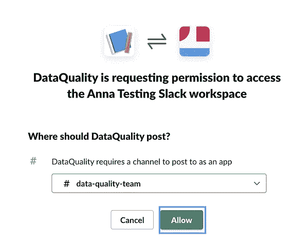

# 共享空闲信道如何提高数据质量

> 原文：<https://towardsdatascience.com/how-a-shared-slack-channel-can-improve-your-data-quality-e62a4c2a0936?source=collection_archive---------37----------------------->

## 通常，最有影响力的变化来自于对我们流程的反思


照片由[创业股票照片](https://www.pexels.com/@startup-stock-photos?utm_content=attributionCopyText&utm_medium=referral&utm_source=pexels)发自 [Pexels](https://www.pexels.com/photo/man-wearing-black-and-white-stripe-shirt-looking-at-white-printer-papers-on-the-wall-212286/?utm_content=attributionCopyText&utm_medium=referral&utm_source=pexels) | [品牌内容披露](https://www.annageller.com/disclosure)

你有没有听过有人说:“我们的数据很棒，我们从来没有任何数据质量问题”？确保数据质量很难。问题的严重性让我们相信，我们需要一些真正重大的行动来取得任何进展。但现实表明，通常最简单、最直观的解决方案会产生难以置信的影响。在本文中，我们将着眼于一个改进数据质量过程的想法，并使其更有价值和可操作性。

**目录**

[取得数据的所有权](#0707)
[使流程更有回报&更容易跟踪](#e612)
[利用自动化来促进流程](#c837)
∘ [关于示例中的检查](#c13d)
[将脚本部署到 AWS](#53d9)
[我们如何进一步改进自动化流程？](#8261)
[提出方法的弊端](#4473)
[结论](#1fb3)

# 获得数据的所有权

无论您的数据团队是如何构建的(*集中式 BI/数据团队与利用数据网格范式的分散式面向领域的团队*)，人们都需要掌握主动权，以做出任何持久而有效的变革。如果没有人觉得有责任解决数据中的问题，我们不应该期望情况会变得更好，不管我们使用什么工具。

我们如何解决这个问题？改善数据所有权的最简单方法是将所有者分配给最关键的数据工件，即数据仓库中的特定表、数据湖数据集和数据科学模型。我们并不是想把数据质量问题归咎于那些人。相反，分配所有者可以更透明地确定谁应该照看特定的数据资产，并尽可能确保这些数据保持干净。然后，该流程可以通过添加自动化和监控仪表板来提高可见性。

简而言之，在考虑任何工具或自动化脚本之前，首先考虑建立数据所有权的过程是有帮助的。

# 让这个过程更有价值，更容易跟踪

一旦定义了所有权，我们就可以通过使质量检查更加有益和自动化来改进过程。添加简单的脚本来执行数据质量检查，并通过共享的 Slack 通道通知数据所有者任何数据质量问题，这对于提高团队对提高数据质量的参与度非常有效。

该过程的重要部分是将这些警报发送到一个松弛通道，该通道在整个数据团队中被共享。作为社会动物，**如果其他人能看到我们付出的努力，我们会更有动力去解决问题**。例如，处理问题的数据所有者可以:

*   发送一个**回复**，解释问题的根本原因以及采取了哪些措施来解决问题，
*   简单地添加一个**勾号**来表明这个问题已经被解决，
*   或者**添加一个票据链接**如果问题变得更加复杂，需要放入待办事项中。


用户参与流程的共享数据质量松弛通道示例—图片由作者提供

所有上述行动增加了可见性，并证明数据质量问题不再被忽视。它展示了获得所有权并使这一过程更具社会回报已经可以产生切实的改善。

# 利用自动化促进流程

让我们假设我们建立了流程并就数据所有权达成了一致。我们如何着手实施这些自动化的数据质量警报？这个过程可能非常简单:

*   构建 SQL 查询**来检查数据中的异常，**
*   编写一个脚本，如果满足警报条件，该脚本将发送**松弛通知**，
*   创建一个**共享 Slack 通道**和一个 webhook 向其发送消息。

首先，创建一个网页挂钩，进入[https://api.slack.com/apps](https://api.slack.com/apps)→创建一个应用程序。


构建一个 Slack 应用程序——作者图片

为您的应用程序添加一个名称，并选择您想要的松弛工作空间。


构建一个 Slack 应用程序——作者图片

选择**incoming Webhook**并为您选择的闲置通道创建一个(“向工作区添加新的 web hook”)。



构建一个 Slack 应用程序——作者图片

一旦所有这些都完成了，你就可以复制你的 Webhook URL 并在你的 Python 脚本中使用它。请注意，您应该像对待 API 密钥或密码一样对待这个 webhook。


构建一个 Slack 应用程序——作者图片

构建警报的脚本非常简单，只需向 webhook 所代表的 Slack API 端点发送一个 POST 请求(下面的要点中的*第 19 行)。*

注意，在第 35 行，Webhook URL 是从 [AWS Secrets Manager](https://aws.amazon.com/secrets-manager/) 中检索的。如果您想采用同样的方法来存储这条机密信息，请确保将其添加到您的机密集:

```
aws secretsmanager create-secret --name slack-webhook --secret-string '{"hook_url": "YOUR_HOOK_URL"}'
```

## 关于示例中的检查

在这个代码示例中，我们检查订单状态和付款类型是否与预期的(*允许的*)值匹配。如果没有，我们应该会收到一条 Slack 消息，通知我们异常值:


数据质量通知-作者提供的图片

显然，这些检查代表了相当人为的例子(*基于* [*这个来自 Kaggle*](https://www.kaggle.com/olistbr/brazilian-ecommerce) 的电子商务数据集)。在现实世界中，您的数据质量检查可能会验证:

*   数据中的特定 KPI 是否达到某个临界值，或者何时超过预期值范围，
*   出现极不可能的值(*B2C-客户购买数百件相同产品*)，
*   某些值(*如营销、支付或物流成本*)是否明显偏离计划值，
*   数据是否是最新的、完整的、无重复的以及没有缺失值，
*   …以及更多。

# 将脚本部署到 AWS

为了使运行这些定期检查更具可伸缩性，我们可以利用 AWS Lambda。为了让之前展示的 Github gist 与 lambda 一起工作，我们需要将我们的主执行代码包装到一个 Lambda 处理程序中(*从第 34 行*开始)。此外，我们需要确保我们的日志程序是以一种符合 AWS Lambda(T21)的方式进行全局定义的。

**完整项目可在** [**本 Github 资源库**](https://github.com/anna-anisienia/data-quality-alerts) **中获得。**

为了将我们的容器映像部署到 AWS，我们构建并推送我们的容器映像到 ECR ( *123456 是* [*AWS 帐户 ID*](https://docs.aws.amazon.com/IAM/latest/UserGuide/console_account-alias.html) 的占位符)。

```
*aws* ecr create-repository --repository-name dq_alerts*docker* build -t dq_alerts .*docker* tag dq_alerts:latest 123456.dkr.ecr.eu-central-1.amazonaws.com/dq_alerts:latest*aws* ecr get-login-password | *docker* login --username AWS --password-stdin 123456.dkr.ecr.eu-central-1.amazonaws.com*docker* push 123456.dkr.ecr.eu-central-1.amazonaws.com/dq_alerts:latest
```

然后，在 Lambda 配置中，我们选择我们想要的容器图像，如下所示。


构建 Lambda 函数—作者图片

由于执行数据库查询可能很耗时，我们需要增加超时设置。此外，将内存大小增加到至少 256 MB 似乎是合理的，因为查询返回的数据会占用大量内存空间。


构建 Lambda 函数—作者图片

确保添加相关的 IAM 策略。对于这个例子，我们需要雅典娜和 S3 权限。


构建 Lambda 函数—作者图片

最后，为了确保我们的检查按计划运行，我们需要添加一个 CloudWatch 计划作为触发器:


构建 Lambda 函数—作者图片


构建 Lambda 函数—作者图片

此外，我们可以使用一个空的 JSON 有效负载来测试该函数:


构建 Lambda 函数—作者图片

# 所提出的方法的缺点

演示方法的第一个缺点是我们需要一些有状态逻辑来确保我们不会过于频繁地通知相同的问题。否则，人们会开始忽略警报，并可能将空闲频道静音。此外，如果消息太多，社交方面可能会丢失。

此外，我们自己编写各种数据质量检查是**不可伸缩的**，并且**甚至可能不可行**如果你处理大量数据的话。正如 [Barr Moses](https://medium.com/u/2818bac48708?source=post_page-----e62a4c2a0936--------------------------------) 指出的，这种质量检查只能覆盖**已知的未知**，即可以预见的问题。一个有趣的想法是将共享松弛通道的社交方面与来自端到端可观察性管道的警报相结合。

</the-new-rules-of-data-quality-5e4fdecb9618>  

# 结论

在这篇文章中，我们看到了简单的过程调整是如何增加团队对提高数据质量的参与和承诺的。通常，最有影响力的变化不需要任何重大决策或投资，而是来自于重新思考我们的流程，增加自动化以增强其执行，并确保整个团队为提高数据质量的共同目标而共同努力。

**感谢您的阅读！**