# 一个简单的图表如何挽救一个人的工作

> 原文：<https://towardsdatascience.com/how-a-simple-graph-saved-someones-job-neo4j-7262c813937f?source=collection_archive---------38----------------------->

## 饮料、非正式的谈话、一些图表帮助人们以新的眼光看待数据。

与人们在博客上发布的内容相比，这张照片并不漂亮，但这张旧纸有一个有趣的故事。

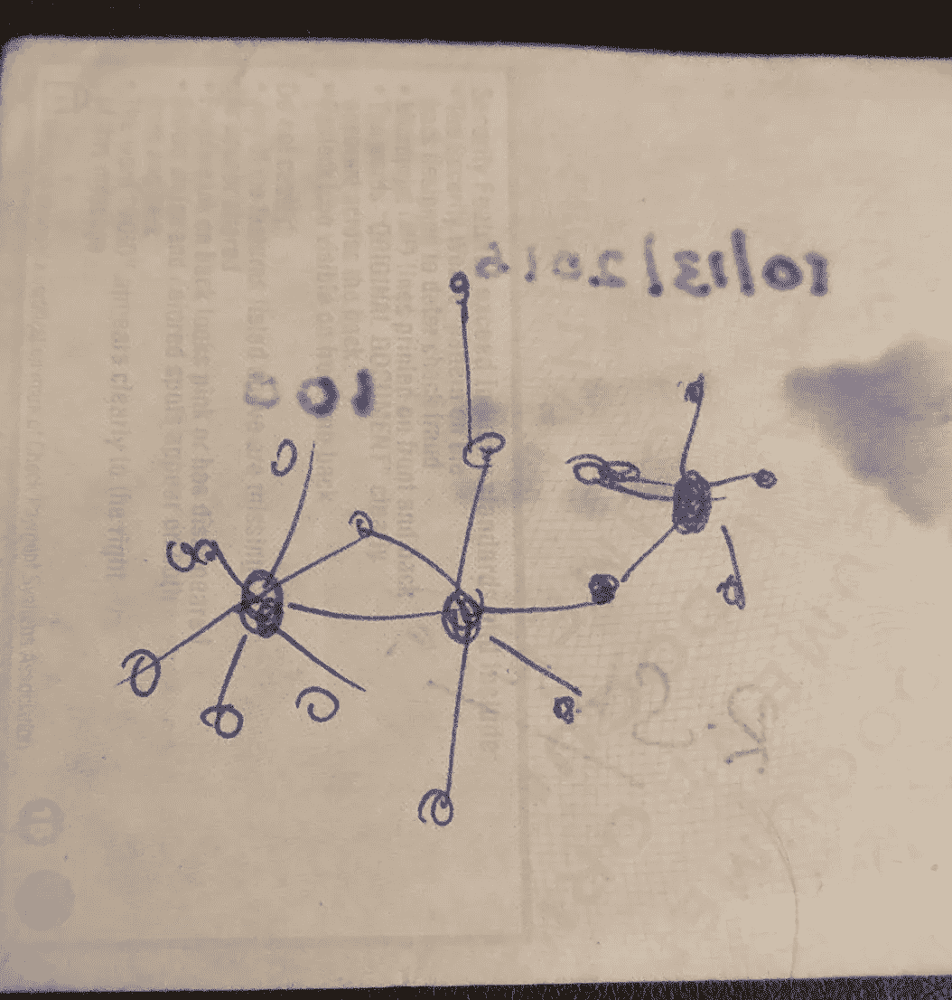

按作者分类的图像(在不同环境下我们如何相互联系的社交图)

几天前，我正在清理我的包，它有太多的夹层——典型的瑞士装备，我发现了一个几年没动过的口袋。一个隐藏的小口袋，可以存放名片、皱巴巴的纸和过去的收据。就在那时，我发现了那张旧的彩色纸，上面有我大约 4 年前草草写下的粗糙草图。

> 空间信息:科罗拉多州丹佛市的一家爱尔兰酒吧
> 
> **热力学信息**:一个异常炎热的夜晚，非常适合喝柑橘饮料
> 
> **时间信息:**下午 6:30 左右

我从东海岸前往丹佛，与一个潜在客户进行销售会议，会议进行得并不像计划的那样顺利。他们最终削减了预算，我的提议被推到了下一个季度。我的返程航班是第二天早上，晚上我和那个客户约好了一起吃饭。好吧，咨询使你成为一种食物和饮料鉴赏家。我和丹决定在去吃晚饭前，先在当地的一家酒吧喝一杯。

因为天气特别热，我们决定延长在酒吧的逗留时间，多喝几杯啤酒(也因为丹佛在啤酒厂方面相当高，所以人们可以品尝许多精酿啤酒)。丹告诉我正在进行的业务重组，这将导致整个组织暂时削减预算。他们的想法是让组织变得精简和灵活，并在技术和分析领域雇佣更多人。

不知何故，话题转移到了创建新部门和在公司内部寻找部门领导上。

我对基于主体的模型进行了初步研究，多亏了托马斯·谢林，我喜欢在对话中表达这一观点，这是一个绝佳的机会。

> 你在宏观层面上看到的可能在微观层面上并不真实

我一定是在上面的一张纸上给他画了图表，向他展示了不同部门的人是如何相互联系的，以及有时部门中拥有最高头衔的人可能不是日常业务运营中的“支点”或最重要的人物。所以，在得出一个艰难的结论之前，先了解一下不同的人在他们的工作岗位上做什么，不要仅仅依赖他们的主管给出的数据或者他们的职位。我给了他一些想法，告诉他如何去做，以及他可以使用哪些工具。

三四个月后，我在一个新项目的启动仪式上再次见到了丹，当时他告诉我，他为组织的一小部分创建了图表，并量化了人在商业环境中的重要性。我会模拟一个他提到的，让他感兴趣的案例。

## **数据**

Employee.csv 包含三个主要列。雇员 _1 和雇员 _2 是本来会相互交流的两个人的组合。权重是两者之间相互作用的量度。这是对雇员 1 和雇员 2 交换电子邮件或出现在同一个会议中的次数的简单计数。观察结果是在过去 3 个月中收集的。

数据是通过读取电子邮件和 SMTP 服务器的元数据收集的，在这个过程中没有人的隐私被侵犯。

## **设置图形数据库**

点击添加数据库，提供一个用户名和密码，你都设置好了。

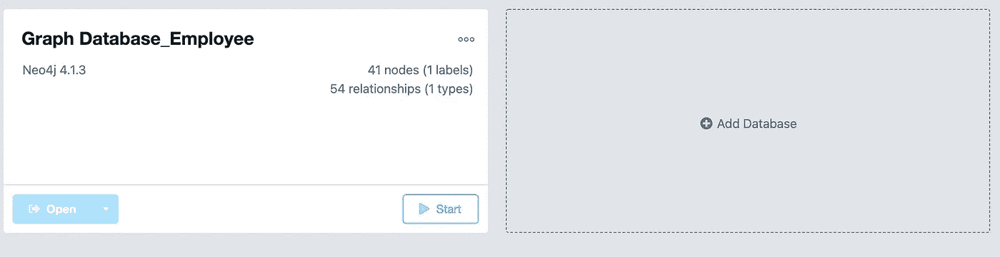

作者图片

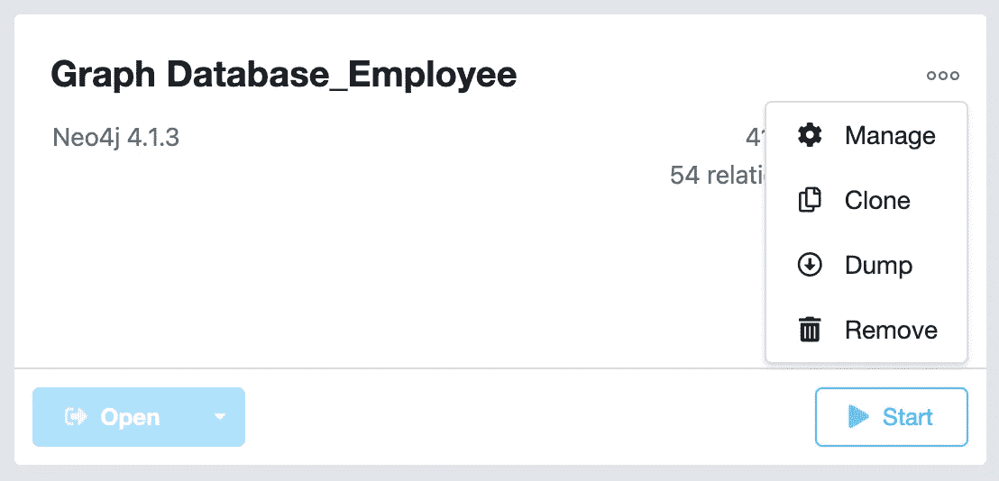

作者图片

一旦你添加了数据库，点击三个水平点，从管理部分你会添加一些插件，你会使你的工作变得更容易。

在插件标签，继续安装 APOC 和图形数据科学库。

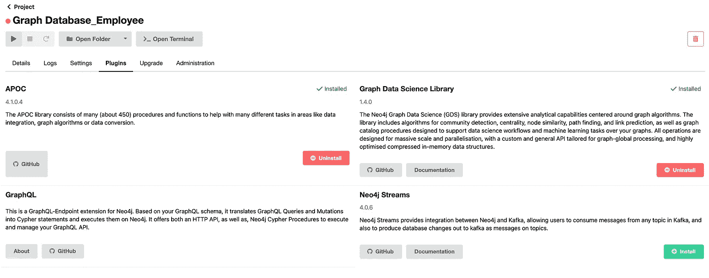

作者图片

继续启动您的数据库，并使用 Neo4j 浏览器打开。(请注意，当您第一次创建数据库时，节点和关系的数量将是 0)

## **数据位置**

如果你用的是 macOS，那么/Users/<your user="" folder="">/Library/Application Support/com。Neo4j.Relate/Data/dbmss/<folder related="" to="" the="" db="">/进口/</folder></your>

把你的。导入文件夹中的 csv 文件。

<folder related="" to="" the="" db="" you="" created="" above="">—如果这是您的第一个项目，那么您在/dbmss 下将只有一个文件夹，所以将您的。csv 在那里漫不经心而大胆地输入。</folder>

(仅适用于 mac 用户:上述文件夹在 Windows 或 Linux 上更容易找到，因为在 macOS 中,/Users/ <your user="" folder="">/Library 是隐藏的，因此您可以在 spotlight search 中键入/Users/ <your user="" folder="">/Library 并找到这些文件夹)</your></your>

## **有趣的东西**

将 CSV 加载到数据库中

```
LOAD CSV WITH HEADERS FROM "file:///employee.csv" AS row
MERGE (emp1:Employee {name: row.Employee_1})
MERGE (emp2:Employee {name: row.Employee_2})
MERGE (emp1)-[r:INTERACTS]->(emp2) ON CREATE SET r.weight = toInteger(row.Weight)
```

让我们看看它看起来怎么样

```
Match(n) return(n)
```

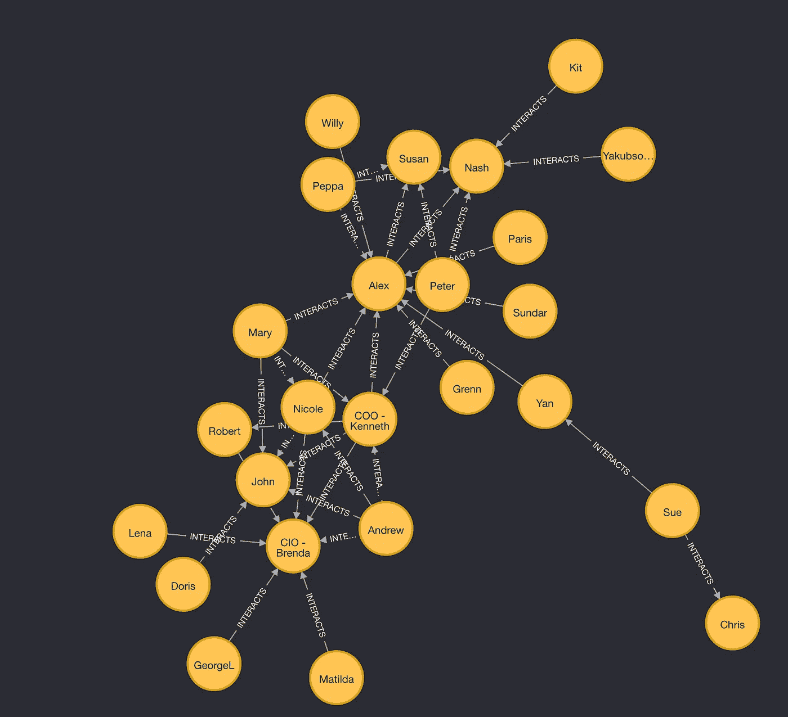

作者图片

嗯，这是一个简单的图表，除了告诉我人们是相互联系的之外，它对我没有太大的作用。

让我们找出每个雇员的程度和加权程度。

**度** —一个员工所连接的员工数。

**加权度** —每个员工关系的权重之和。

```
#Degree
MATCH (c:Employee)
RETURN c.name AS employee, size( (c)-[:INTERACTS]-() ) AS degree
ORDER BY degree#Weighted-Degree
MATCH (c:Employee)-[r:INTERACTS]-()
RETURN c.name AS employee, sum(r.Weight) AS weighteddegree
ORDER BY weighteddegree
```

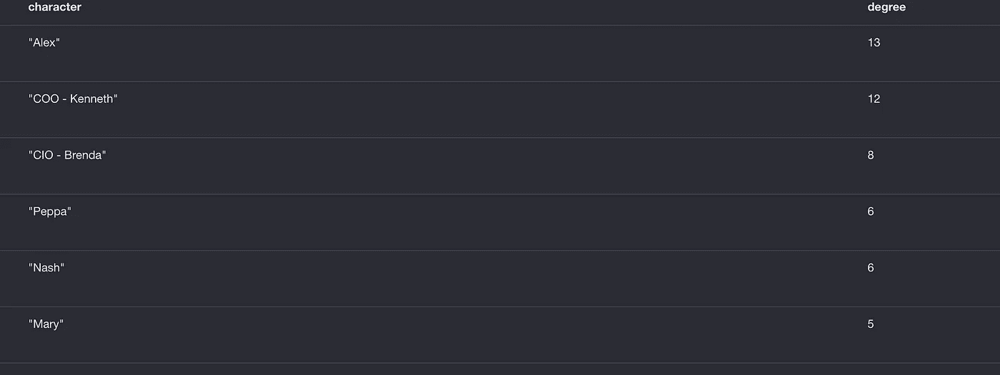

按作者分类的图片(不同员工的学位)

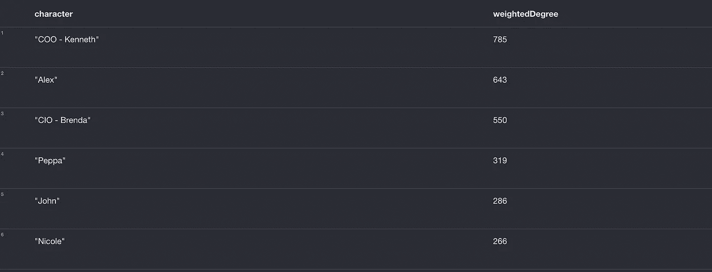

按作者分类的图片(不同员工的加权程度)

程度和加权程度的数字是完全不同的，我们需要一个更好的、更稳健的度量标准。

> 让我们试着找出每个雇员的 PageRank。它更健壮，并在整个图级别捕获员工的状态，而不仅仅是在他们的节点级别。

```
#Create
CALL gds.graph.create('employee-interactions', 'Employee', {INTERACTS: {orientation: 'UNDIRECTED'}}) #Stream
CALL gds.pageRank.stream('employee-interactions') YIELD id, pgscore Return gds.util.asNode(id).name AS name, pgscore ORDER BY pgscore#Write
CALL gds.pageRank.write('employee-interactions', {writeProperty: 'pageRank'})
```

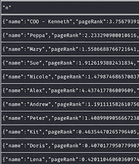

作者图片

Pagerank 似乎更有控制力，不像加权度和度那样分散。这可能是衡量每个节点功率的更好的指标。

我还想对员工进行一些聚类，即他们中的哪些人是图中高度关联的子图。用图形术语来说，我想要完成的是检测社区。

我不知道如何完成它，但快速搜索有所帮助。

```
#Create
CALL gds.graph.create('employee-weighted', 'Employee', {INTERACTS: {orientation: 'UNDIRECTED', properties: 'Weight'}})#Write
CALL gds.labelPropagation.write('employeee-weighted', {writeProperty: 'community', maxIterations: 15, relationshipWeightProperty: 'Weight'})
```

所有的查询都上传到 Github [这里](https://github.com/Prashantmdgl9/Network_Influencer_Neo4j)。

现在我已经有了我需要的一切，我可以使用 Neo4j 的图形数据科学库来可视化数据。

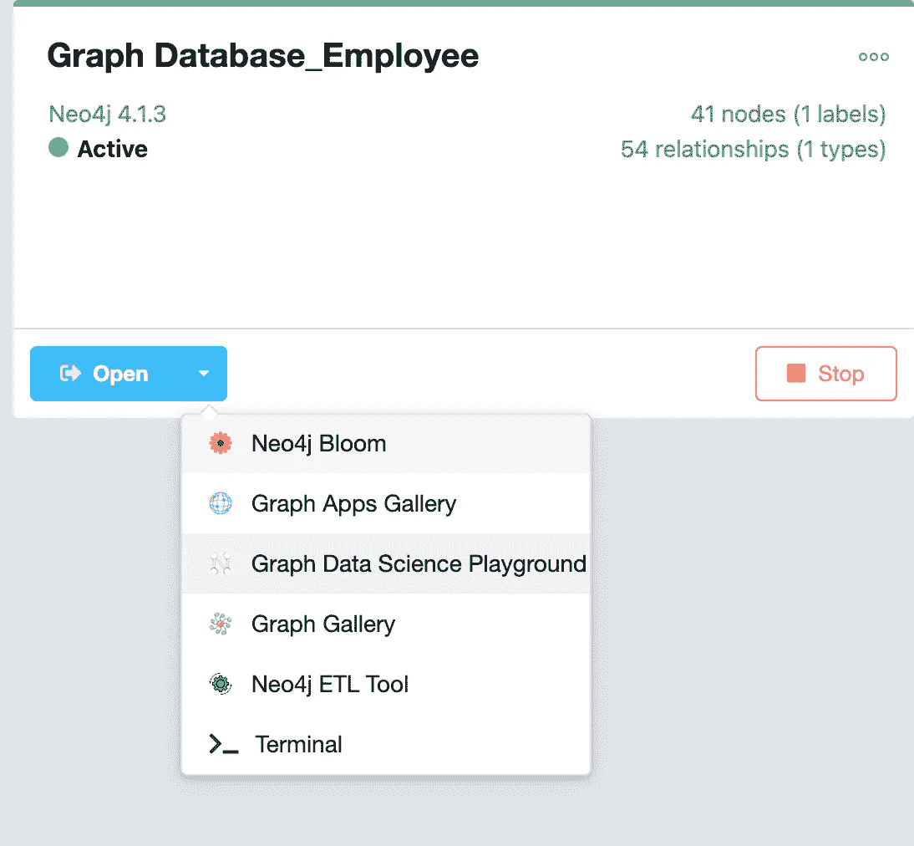

作者图片

它将推出一个 UI，在 Neo4j 的术语中称为 NEuler(Noy-ler)。

一旦你连接，你将不得不选择哪个标签，你想运行你的图表的重量属性。我分别选择了 Employee 和 PageRank。

从下拉列表中选择选项，使您的图表丰富多彩且易于理解。

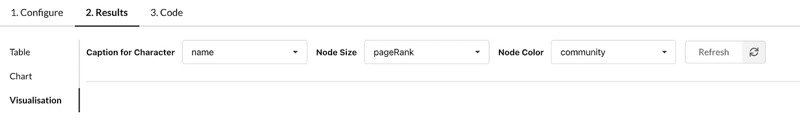

作者图片

这是结果，

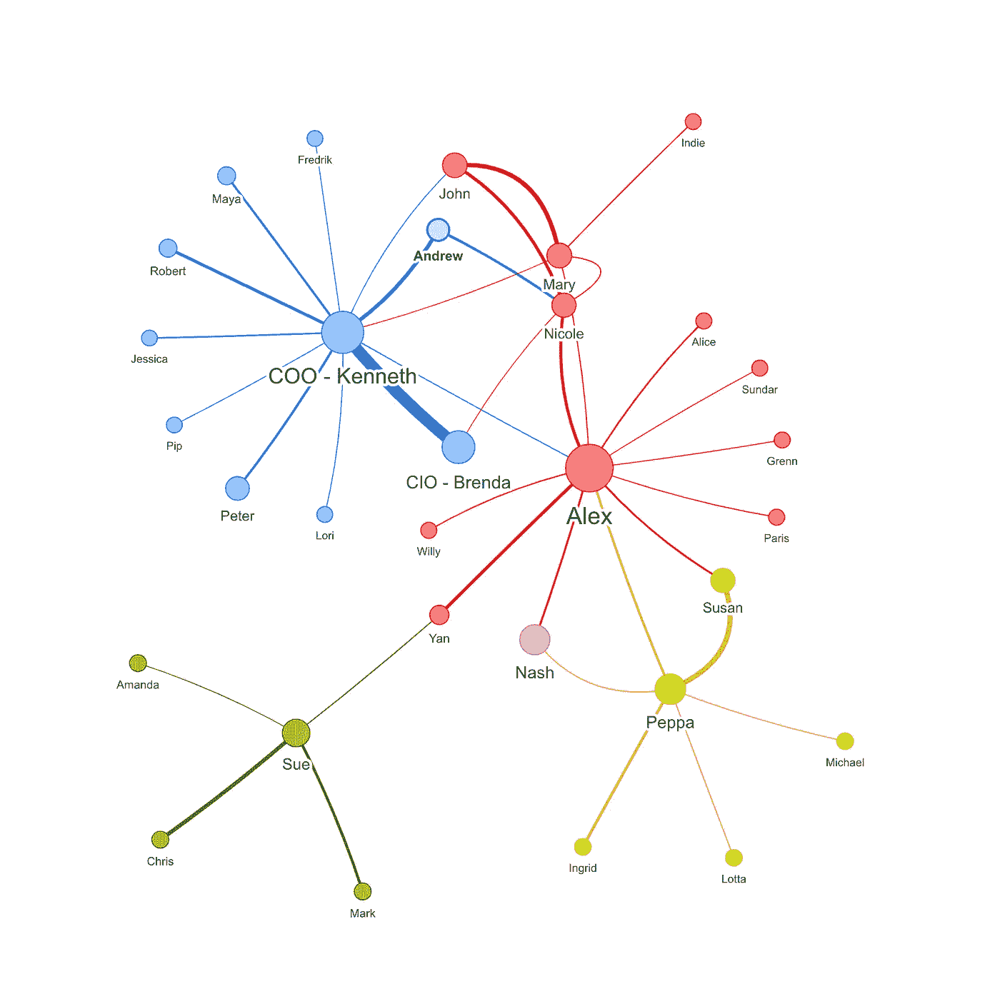

作者图片

该图显示了小型员工群体中存在的联系和各种社区。员工之间的边界越厚，基于页面排名得分的交互就越高。

现在，让我们把注意力集中在丹的有趣观察上。

## 网络影响者分析

Sue、Amanda、Chris、Mark 和 Yan 都在财务部工作，Sue 担任部门主管。你应该看到她和颜之间的缘是相当暗淡的。Yan 和 Alex(主要利益相关者和组织生态系统中的重要人物)之间有很大的差距。不仅如此，严还是连接会计部门和公司其他部门的唯一桥梁。

在丹完成这个练习之前(这个练习一定是我在这里编造的一个类似的版本)，严的名字出现在被他们部门解雇的人的名单上。在她的会计部门，她并不是一个举足轻重的人，但她仍然举足轻重，如果我们只考虑部门反馈，这一点永远不会被意识到。

一个简单的画面显示出**颜在她的组织中是一个有影响力的人**尽管她的部门内得分可能很低，但她的部门间依赖性使她不可或缺。

她不仅没有被解雇，而且在下一个周期，她被亚历克斯的部门给了一个职位。

## 思想

> 如果只从定性的角度来看组织结构，Graph DB 避免了一个错误。值得庆幸的是，严的情况并非如此。
> 
> 这就是以图形方式查看数据的力量，你可以看到原本可能会错过的模式。除此之外，许多人是视觉学习者，给他们一个表格和一个图表，他们通常会伸手去拿图表。

在此之后，我可以说，那天晚上去酒吧是一次富有成果的访问！


蒂姆·马歇尔在 [Unsplash](https://unsplash.com?utm_source=medium&utm_medium=referral) 上的照片

请让我知道你的意见，你可以在这里使用 Github 回购。