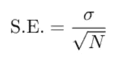
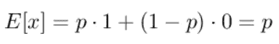
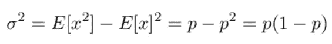
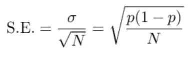
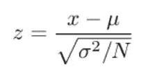
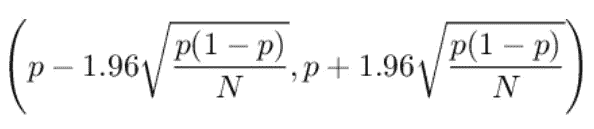
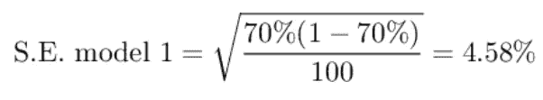
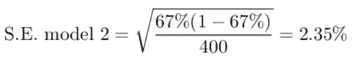
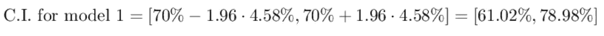
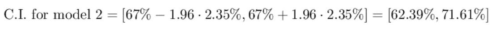

# 你的准确度有多高？

> 原文：<https://towardsdatascience.com/how-accurate-is-your-accuracy-d420f903bbae?source=collection_archive---------43----------------------->

## 比例标准误差概述

*照片由*[*engin akyurt*](https://unsplash.com/@enginakyurt?utm_source=unsplash&utm_medium=referral&utm_content=creditCopyText)*[*Unsplash*](https://unsplash.com/s/photos/accuracy?utm_source=unsplash&utm_medium=referral&utm_content=creditCopyText)*

*在二元分类模型中，我们经常使用比例来计算模型的准确性。例如，我们使用准确度、精确度和召回率。但是我们如何计算这些估计的误差呢？两个准确率 95%的模型其实是等价的吗？*

*答案是否定的。让我们看看为什么。*

# *标准误差*

*任何测量都必须有一个误差估计，它代表了测量的精度。我有一个物理学学位，物理学家总是被讨厌，因为他们通常在每次测量结果后假装有一个误差估计。例如，我可以说我身高 1.93 米，但如果这个数字后面没有对误差的估计，它就不会给出任何信息。如果我说 1.93 米误差 3%，另一个人说 1.93 米误差 30%，你会更相信谁？*

*这就是为什么我们需要估计我们测量的误差，计算所谓的标准误差。*

*一个 *N* 点样本的标准误差定义如下:*

**

*其中，σ是对样本计算的标准偏差。如您所见，样本越大，标准误差越低，我们的测量精度就越准确。这是大数定律的自然结果。*

# *比例的标准误差*

*让我们考虑一个由 *N* 个点组成的数据集，其中 *n* 个点与一个成功的事件相关(即我们的模型的正确预测)。简单来说，整个样本的成功率是:*

*这可以是准确度(其中 *N* 是混淆矩阵的值的总和，并且 *n* 是其迹线)、精确度(其中 *N* 是模型已经用 1 预测的事件的数量，并且 *n* 是真阳性的数量)或者另一个比例。*

*现在，我们要计算标准误差。我们可以使用类似于 [bootstrap](https://www.yourdatateacher.com/2021/04/19/the-bootstrap-the-swiss-army-knife-of-any-data-scientist/) 的算法来计算它，但是对于比例，我们可以使用一个简单的封闭公式。*

*首先，我们需要计算标准差。我们的事件可以建模为一个随机变量 *x* ，其值以概率 *p* 为 1，以概率 *1-p* 为 0。*

*那么，它的期望值是，*

**

*那么，它的方差是:*

**

*因此，标准误差变为:*

**

# *置信区间*

*标准误差可用于计算置信区间，即我们可以预期真实值具有一定置信度的区间。*

*我们如何计算比例的置信区间？*

*让我们首先计算下面的 *z* 变量*

**

*其中μ和σ是我们比例的均值和标准差。可以证明，如果我们使用比例并给定合理高的 *N* 值，这个变量可以近似为一个正态变量(即它是正态分布的)。正态分布的 95%置信区间为(-1.96，1.96)。这是正态分布的一个性质。*

*因此，回到比例，我们可以将 95%的置信区间定义为:*

**

*照例， *N* 的值越高，由于大数定律，间隔越紧。*

*现在让我们看看如何在实践中应用这些概念。*

# *简单的例子*

*假设我们有两个模型。其中一个正在 100 条记录上进行测试，它给了我们 70%的准确率。另一个模型在 400 条记录上进行测试，给出了 67%的准确率。哪款比较好？任何人都会说是前者，因为准确率更高。但是，让我们看看，如果计算两种精度的标准误差，会发生什么情况:*

****

*第二个模型给我们一个更精确的精度估计，因为标准误差较低。如果我们计算置信区间，我们得到:*

****

*可以看到，置信区间下界最高的模型是第二个，而不是第一个。如果我们不得不考虑一种保守的方法，在这种方法中，我们考虑统计上最差的情况，我们会寻找置信区间的下限，在这种情况下，选择第二个模型而不是第一个模型。这就是我们计算标准误差的原因。如果我们不计算误差估计，估计本身是没有用的，正如我们所看到的，较大的样本比较小的样本能给我们更多的信息，所以通过计算标准误差，我们可以做出更好的决策。*

# *结论*

*计算误差估计值经常被忽略，但是如果我们不知道我们的测量有多精确，就会导致错误的结果。对于比例，标准误差和置信区间的计算非常简单，对于从数据集中提取尽可能多的信息非常有用。*

**原载于 2021 年 5 月 31 日 https://www.yourdatateacher.com**[*。*](https://www.yourdatateacher.com/2021/05/31/how-accurate-is-your-accuracy/)**