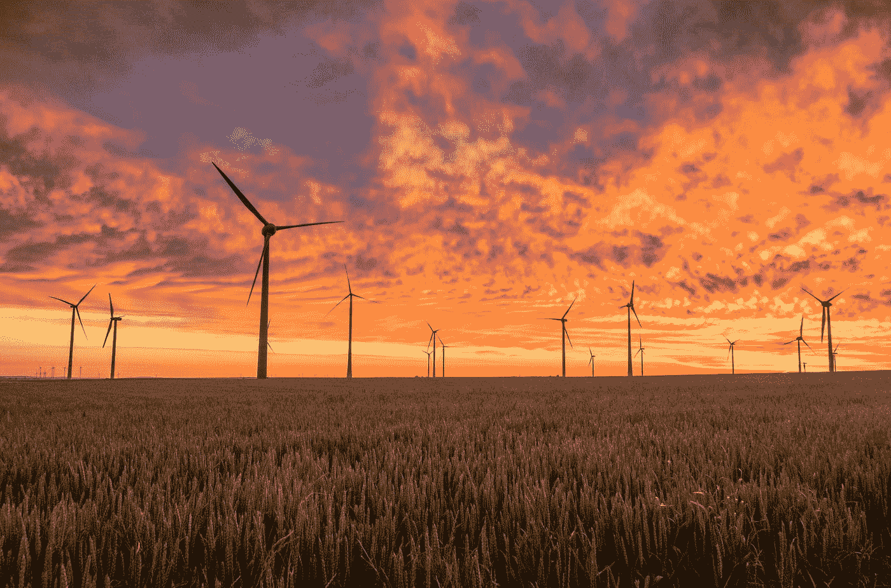
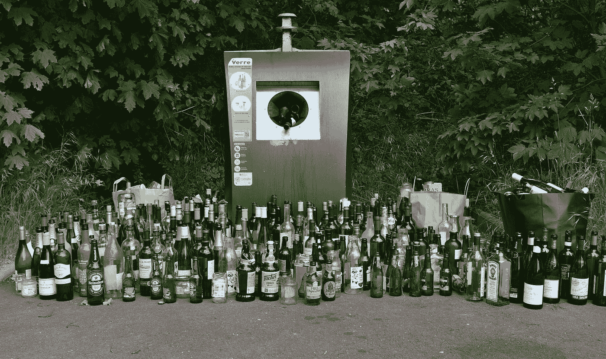

# 人工智能如何帮助应对气候变化

> 原文：<https://towardsdatascience.com/how-ai-can-help-fight-climate-change-c86531d710f0?source=collection_archive---------36----------------------->

## [社区笔记](https://pedram-ataee.medium.com/list/notes-on-community-cc93416f5a13)

## 人工智能有潜力解决这个星球上最大的挑战

照片由[卡斯登·沃思(➡️@卡斯登.伍尔特)](https://unsplash.com/@karsten_wuerth?utm_source=medium&utm_medium=referral)在 [Unsplash](https://unsplash.com?utm_source=medium&utm_medium=referral) 上拍摄

我们星球面临的最大威胁之一是气候变化。然而，什么是气候变化呢？平均条件的变化，如一个地区在很长一段时间内的温度变化，导致剧烈的风暴、野火和干旱。如果我们找不到这个挑战的答案，我们的日常生活肯定会发生巨大的变化。世界上每个地区都经历着不同的气候变化。一个可能面临严重的干旱年，而另一个面临降雪增加。问题是我们如何应对这一挑战，尤其是利用人工智能技术？

当你浏览互联网时，你可能会发现一大堆利用人工智能技术对抗气候变化的方法。但是，**事实是，这些建议中的许多要么在经济上不可行，要么影响力不够**，至少在目前的状况下是如此。我在这里描述了如何评估 AI 解决现实世界中某个问题的可行性[。下面，我分享一个在垃圾管理行业使用 AI 的例子，在这个行业，AI 的影响力还不够。](https://medium.com/swlh/if-you-consider-using-ai-in-your-business-read-this-5e666e6eca23)

我们都知道，更好的废物管理系统可以帮助我们减少碳足迹，应对气候变化。然而，这并不意味着人工智能可以通过进入高度复杂的废物管理链的每一步来产生影响。例如，有一些尝试**使用计算机视觉来建造智能垃圾桶**来指导人们找到他们的垃圾必须使用的确切垃圾桶。

亚历山大·卡迪科夫在 [Unsplash](https://unsplash.com?utm_source=medium&utm_medium=referral) 上的照片

他们的论点是“源头分类废物至关重要”。虽然这种说法是正确的，但他们没有考虑到，例如，*废物收集车队*是否准备好了分类箱，或者*所需的能量*是否确保人工智能系统正常工作而不中断。此外，要了解使用技术应对气候变化的影响，我们必须能够大规模地使用它，即在地球上的每一点。所以，我们应该回答的问题是“我们能在世界的任何地方使用这项技术吗？”**最终，我们必须始终衡量每一美元支出的影响。**

说到这里，我相信如果我们正确使用人工智能，它可以帮助我们大幅应对气候变化。在这篇文章中，我想描述人工智能可以有效应对气候变化的 3 种最重要的方式。

# 提高能源效率

我们不能既储存能量又产生能量。例如，这就是为什么输入电网的电量必须始终等于消耗的电量。在这种设置中，重要的是实时预测**需要多少能量(需求方)**。这将有助于产生所需的能量，仅此而已。此外，我们可以使用人工智能来预测天气状况，包括风的模式，以确定我们可以在风电场(供应方)产生多少能量。例如，谷歌的 Deepmind AI 可以提前 36 小时预测风力模式，从而有可能提前一整天确定电网的承诺量。

 [## 谷歌的 DeepMind 可以提前一天预测风力模式

### 风力发电已经变得越来越受欢迎，但它的成功受到这样一个事实的限制，即风来去自如…

www.engadget.com](https://www.engadget.com/2019-02-26-google-machine-learning-wind-power.html) 

# 提高运输效率

根据 IPCC(政府间气候变化专门委员会)的数据，交通部门约占全球能源相关二氧化碳排放量的四分之一。你可以在这里阅读更多。人工智能可用于优化运输车队的路线，如废物收集或拼车车队。路线优化是一个极其困难的问题，尤其是当问题中加入了许多约束条件时，例如*降低碳足迹*、*避免交通堵塞*、*提高用户满意度*。基于人工智能的路线优化可以让许多商业模式变得可行和绿色。

 [## IPCC -政府间气候变化专门委员会

### 通过评估，IPCC 确定了关于气候变化的知识状况。它确定了哪里有…

www.ipcc.ch](https://www.ipcc.ch/) 

# 提高太阳能电池板效率

为了应对气候变化，我们必须找到以可持续方式生产能源的新方法。利用太阳能发电是我们拥有的最佳选择之一。这就是为什么工程师和科学家不断努力开发更高效的太阳能电池板。太阳能电池板的效率越高，产生的能量输出就越多。

2019 年，发表在《自然》杂志上的一篇[文章](https://www.nature.com/articles/s41586-019-1335-8)介绍了人工智能技术的一种新颖用途，即发现一种具有特定性质的新化学化合物。这篇文章唤起了建造太阳能电池板的希望，这种电池板能够以更高的效率产生能量。在过去，工程师和科学家通过测试数千种材料来找到有效的材料，从而开发出新材料。发表在《自然》杂志上的文章向我们展示了人工智能如何在这个旅程中帮助我们。

# 遗言

在这篇文章中，我分享了那些可以有效应对气候变化的人工智能应用，主要是因为它们的美元影响因子。你肯定可以找到其他我没有在这里列出的对抗气候变化的人工智能应用。最后，我想强调的是，利用人工智能对抗气候变化是一种方式。还有许多其他的方法来帮助我们的工厂。

## 感谢阅读！❤️

如果你喜欢这个帖子，想支持我…

*   *跟我上* [*中*](https://medium.com/@pedram-ataee) *！*
*   *在* [*亚马逊*](https://www.amazon.com/Pedram-Ataee/e/B08D6J3WNW) *上查看我的书！*
*   *成为* [*中的一员*](https://pedram-ataee.medium.com/membership) *！*
*   *连接上*[*Linkedin*](https://www.linkedin.com/in/pedrama/)*！*
*   *关注我的* [*推特*](https://twitter.com/pedram_ataee) *！*

 [## 通过我的推荐链接加入 Medium-Pedram Ataee 博士

### 作为一个媒体会员，你的会员费的一部分会给你阅读的作家，你可以完全接触到每一个故事…

pedram-ataee.medium.com](https://pedram-ataee.medium.com/membership)