# 人工智能如何帮助我们循环利用

> 原文：<https://towardsdatascience.com/how-ai-can-help-us-recycle-c2f82d0d50de?source=collection_archive---------21----------------------->

## [变更数据](https://towardsdatascience.com/tagged/data-for-change)

## 卷积神经网络在垃圾图像分类中的应用

作者:[邓肯·王](https://medium.com/u/6de39228b050?source=post_page-----c2f82d0d50de--------------------------------)，[阿诺·古兹曼-安妮](https://medium.com/u/4ac115d4b44f?source=post_page-----c2f82d0d50de--------------------------------)，[索菲·考特曼斯-马特尔](https://medium.com/u/cb27d9879fcd?source=post_page-----c2f82d0d50de--------------------------------) & [杰克·霍根](https://medium.com/u/f43e9159f39?source=post_page-----c2f82d0d50de--------------------------------)

Pawel Czerwinski 在 [Unsplash](https://unsplash.com?utm_source=medium&utm_medium=referral) 上拍摄的照片

# 回收问题

减少、再利用和回收。这句格言也被称为废物管理的 3r，作为解决日益严重的废物危机的解决方案，已经得到了广泛的推广。在北美，公众环保意识的提高和诸如[自觉消费主义](https://www.nytimes.com/2019/10/01/smarter-living/sustainabile-shopping-conscious-consumer.html)等运动的传播使得减少废物成为社会环境关注的焦点，如今大多数城市都有成熟的回收计划。然而，对于消费者来说，虽然“减少”和“重用”背后的原则通常很简单，但第三个 R 背后的过程仍然很复杂，并且很难理解。

虽然回收看似简单，只需将特定的废物放入一个特殊的垃圾箱，然后运到一个神奇的工厂，变成新的材料，但回收项目的实际结果往往令人沮丧。事实上，美国环境保护署(EPA)估计，虽然 75%的美国垃圾是可回收的，但实际上只有 30%被回收。在加拿大，330 万吨塑料垃圾中只有 9%被成功回收，而在 T2，超过 75%的垃圾最终被填埋。回收结果不佳可归因于生产商、消费者和市政当局之间缺乏协调、管理回收的法规和能力不同以及公众理解程度低。[在加拿大，市政当局根据废物的销售地点、购买者愿意处理的废物，以及回收哪些废物在经济上是合理的，来管理和制定可回收哪些废物的指导方针。因此，支离破碎的回收系统会让消费者感到困惑，最终导致大量潜在的可回收物品最终进入我们的垃圾填埋场。](https://www.nationalobserver.com/2021/03/09/canada-drowning-plastic-waste-recycling-wont-save-us)

# **人工智能如何帮助我们回收利用**

人工智能(AI)的最新进展导致人工智能驱动的解决方案的兴起，以帮助解决社会环境问题，从使用预测预测来平衡电网供电能源的供需，到使用优化来帮助减少制造设施的浪费。在回收方面，[McKinsey&co .最近的一份报告指出，减少消费电子产品浪费的市场机会每年高达 900 亿美元，](https://www.mckinsey.com/business-functions/sustainability/our-insights/artificial-intelligence-and-the-circular-economy-ai-as-a-tool-to-accelerate-the-transition)这些机会来自使用图像识别和机器人技术来自动化回收基础设施等解决方案。

回收利用的一个特殊困难，也是人工智能驱动的解决方案的一个机会领域，是不正确分类的问题。由于废物材料类型的多样性和不同的规定，消费者会发现很难识别废物的成分，并因此不恰当地将物品分类为可回收的或不可回收的。这种可回收和不可回收物品的混合降低了待回收物品的价值，使其难以销售，并增加了最终被填埋的可回收物品的数量。因此，一个潜在的人工智能应用是使用图像分类来识别和帮助消费者识别他们的废物的材料成分和可回收性。

# **目标**

**本指南的目的是介绍我们如何使用** [**卷积神经网络(CNN**](http://tensorflow.org/tutorials/images/cnn)**)和 Python 中的**[**Keras API**](https://keras.io/)**来识别常见废物并将其正确分类到相关的材料组中。**CNN 是深度学习中使用的一类流行的神经网络架构，常用于执行图像分类。在对通过相关材料类型标记的废物项目的图像进行训练之后，我们的目标是使 CNN 能够获取用户提交的废物项目的未分类图像，并生成表示项目材料成分的预测。虽然本质上很简单，但这种工具可以用来帮助用户做出决策，以减少不正确分类的废物数量，这样每个人都可以在改善回收过程中发挥作用。

复制项目所需的完整代码可以在 [**这里**找到。](https://github.com/hoganj15/Waste_Image_Classifier)

# 目录

*   [**CNN 架构介绍**](https://medium.com/p/c2f82d0d50de#0500)
*   [**数据准备**](https://medium.com/p/c2f82d0d50de#83d7)
*   [**建立 CNN 模型**](https://medium.com/p/c2f82d0d50de#720a)
*   [**生成废物类别预测**](https://medium.com/p/c2f82d0d50de#9879)
*   [**最终想法**](https://medium.com/p/c2f82d0d50de#d156)

# CNN 架构的简明介绍

[卷积神经网络(CNN)或 ConvNets](https://cs231n.github.io/convolutional-networks/) ，是一种广泛用于图像识别和分类任务的神经网络。神经网络如何做到这一点的基本思想是通过模拟互连层的网络来模仿人脑如何做出决定，每一层都由“神经元”组成，即用于合成输入特征的数学函数。因此，神经网络能够识别大量数据之间隐藏的关系，这些关系可能是人眼看不到的。

为了能够检测和分类图像，CNN 模型将把已经被转换成表示数字像素的 3D 阵列的彩色图像作为输入。然后，它将通过一系列卷积层、池层和全连接层传递该输入，每个层执行不同的任务。然后，CNN 的最后一层应用一个名为 softmax 的函数，该函数输出图像属于特定类别的概率(0-1)——在我们的例子中，是废弃物的材料成分。

不赘述，CNN 中的隐藏层一般是卷积层和池层。在**卷积层**中，一个预定义大小的滤镜在图像上移动，以执行卷积运算——滤镜值和图像像素之间的元素矩阵乘法。所得值的总和将形成特征图，其中每个特征图提取原始图像的独特特征或质量。

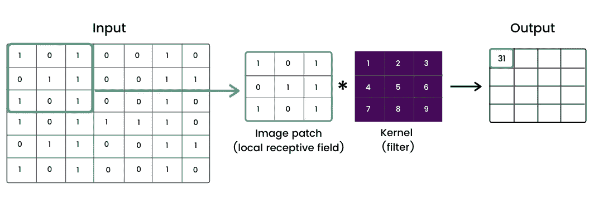

创建卷积层的步骤。作者提供的数字。

然后，我们有了**池层**。这些用于通过减少训练网络所需的参数来对特征图进行下采样，从而减少所需的计算量。这也有助于“概括”输入，这有助于防止网络基于训练图像过度拟合。

创建池层的步骤。作者提供的数字。

在一系列卷积层和池层之后，我们到达 CNN 架构中存在的第三种类型的层:**全连接(FC)层**，这种类型的层也通常出现在常规神经网络中。FC 层构成了网络中的最后几层，并将从最终的池化或卷积层获得扁平化的输出。使用 **softmax 激活函数**，网络的最后一层将输出概率分类。

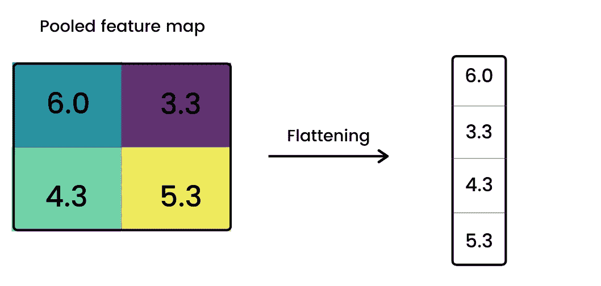

合并的要素地图的展平。作者提供的数字。

既然我们已经简要介绍了 CNN 的架构，让我们从数据开始，进入我们如何建立我们的模型。

# 准备数据

我们将使用的数据包含 2，532 张由纸板、玻璃、金属、纸张、塑料制成的可回收物品以及不可回收物品(垃圾)的图像。数据源在此处[可用。](https://www.kaggle.com/asdasdasasdas/garbage-classification)

为了将一组可以被消化的图像输入到我们的模型中，第一步是将数据集的每张图片转换为 3D 像素阵列:

对于我们的图像，结果数组的形状是(384，512，3)，其中数组中的第一个和第二个元素表示像素尺寸，第三个元素表示红、绿、蓝(RGB)三个颜色通道。

## **数据增强**

接下来，我们随机裁剪和翻转一些图像，以便通过引入一些随机性来增加数据。[增加可变性有助于降低过度拟合的风险，从而提高模型识别未来未知图像的能力。](https://arxiv.org/pdf/1811.09030.pdf)

这里，我们通过应用随机裁剪或中心裁剪来人为引入可变性:

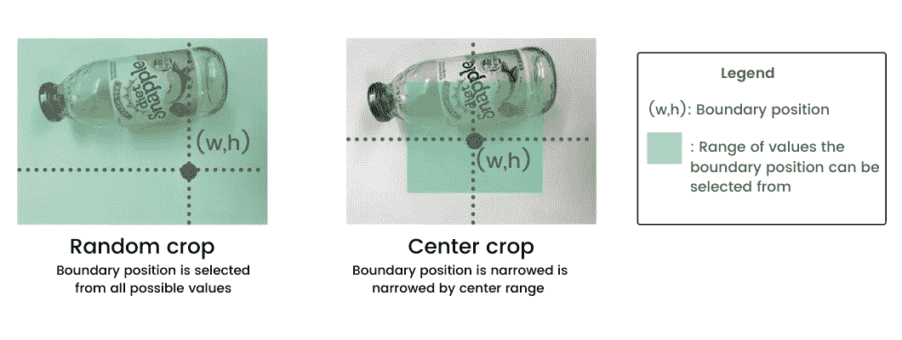

随机作物与中心作物。请注意，随机裁剪的位置每次都可能不同。作者提供的数字。

下面来看看我们是如何做到的。请注意，下面的每个裁剪函数都包含了前面的代码片段，用于在裁剪之前将每个图像转换为 3D 数组。然后，我们将裁剪函数合并到一个新函数中，该函数随机地以 50%的概率对图像应用随机裁剪或中心裁剪，并翻转大约 50%的图像。

让我们看看这些数据增强技术如何修改样本图像:

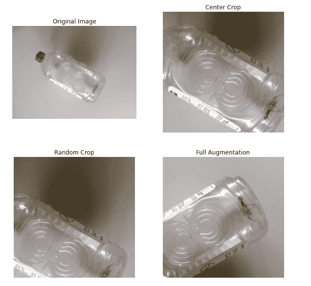

**注意:**原始图像和增强图像的形状不同，因为原始图像的形状是(384，512，3)，但在裁剪过程中被缩小到(224，224，3)。完全增强的图像应用了随机裁剪和图像翻转。作者提供的数字。

为了处理图像，我们将每个图像通过增强函数，并缩放得到的数组，使得像素值位于-1 和 1 之间，这是输入到 CNN 模型所需要的:

## 数据探索

为了更好地理解我们正在处理的数据，让我们按类别来看一下废品的分布。除了垃圾之外，其他的职业似乎相对平衡。现在，我们将让数据保持原样，但是如果我们想要创建更平衡的类，我们可以获取额外的样本或进一步扩充现有的垃圾照片以产生新的表示。

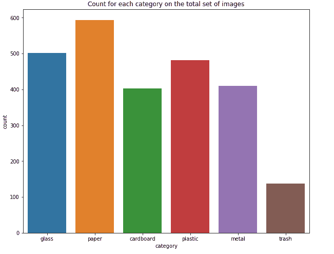

作者提供的数字。

让我们来看一下目前每个类别中的图片示例:

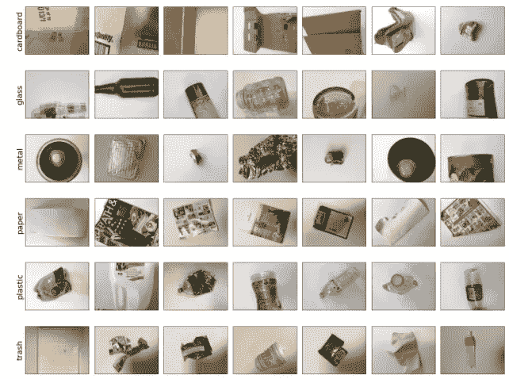

按类别分类的各种垃圾图像样本。

## **准备模型输入**

为了准备模型输入，我们首先将六种废品物料类型分解为数字格式，因为 CNN 模型不能直接解释单词标签类别:

*   0:纸板
*   1:玻璃
*   2:金属
*   3:纸张
*   4:塑料
*   5:垃圾

由于图像是按类别顺序加载的，因此我们还对数据进行了混排，以便在分割后，每个数据集不会包含比例极不均衡的特定废物类型的图像。

最后，我们将数据分成三组:训练、验证和测试。由此产生的分割创建了用于拟合模型的 **1750 训练**观察值、 **518 验证**观察值，用于在训练阶段调整我们的模型参数时提供模型拟合的无偏评估，以及 **259 测试**观察值，这将允许我们评估我们的模型在完全构建和训练后的表现。

准备好模型输入后，现在是构建模型的时候了。

# **建立 CNN 模型**

为了构建 CNN 分类器，我们首先利用外部预训练模型作为网络的基础模型。这种想法被称为 [*转移学习*](https://www.image-net.org/download.php) ，它允许我们使用已经在另一个模型上训练过的层来帮助构建我们的模型，这样废物项目分类器就不必从头开始学习。因为我们没有预先训练好的垃圾分类器，所以我们使用 [**ImageNet**](https://www.image-net.org/) 模型来代替，该模型在各种物品的大量图像集合上进行训练，并且对于识别垃圾物品也是有用的。

简而言之，迁移学习允许我们做三件关键的事情:

1.  实例化一个基础模型，并在其上加载预训练的权重
2.  冻结基础模型中的所有层，并在顶部创建一个新模型
3.  在我们的数据集上训练新模型。

这里，我们定义基本 ImageNet 模型并提取其训练权重:

我们最初将冻结整个卷积基，以便我们仅使用其输出来馈入我们的分类器，而无需重新训练 ImageNet 模型。

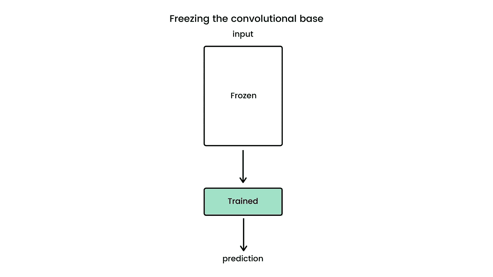

冻结卷积基础模型。作者提供的数字。

我们现在可以为定制的分类器构建层:

下面是我们图层的快速浏览:

1.  **池化层:**池化层用于将数据准备为将被推入密集或完全连接层的输入。
2.  **批量规范化层:**实施一种重新集中和重新调整网络的规范化技术，以稳定学习过程并加速训练。这固定了每层输入的均值和方差，因此可以添加到神经网络中的任何位置以提高性能。
3.  **丢弃层:**丢弃在每个历元临时停用网络中 20%的节点，以重新分配权重并帮助网络专注于弱特征。这有助于防止对训练数据集的过度拟合。
4.  **展平层:**展平层将我们的数据转换成一维数组，这将是我们的全连接/密集层的输入。
5.  **预测层:**在我们的最后一层，softmax 激活将网络的输出归一化为 6 个可能输出类别上的概率分布。

下面是我们模型的总结:

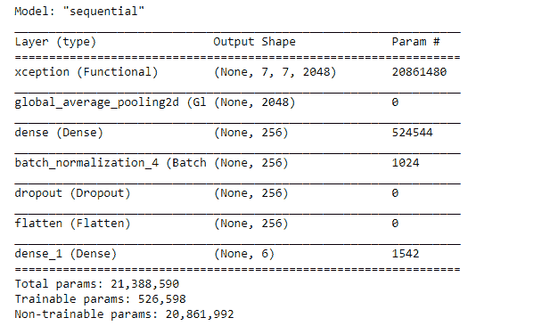

现在，让我们编译我们的模型。我们指定稀疏分类交叉熵，用于多类分类任务，并使用分类精度评估其性能。

## 回调函数

接下来，我们实现几个**回调**函数，在训练模型时使用。回调是可以在训练过程的给定阶段执行特定动作的对象，它允许我们定制模型的行为。

第一个回调创建一个自定义函数，如果训练数据的精度超过 0.999，该函数将停止训练，以防止过度拟合。第二个回调使用 tensor board visualization toolkit 记录模型统计数据，我们可以使用它在训练期间跟踪模型的度量。

## **训练模型**

我们首先在基本模型层冻结的情况下训练模型 40 个时期(或者直到我们的自定义回调停止或者 keras *EarlyStopping* 回调被激活)。

在模型收敛到新数据后，我们可以解冻基础 ImageNet 模型，并通过指定*base _ model . trainiable = True，使用解冻的基础模型层进行重新训练。*注意，这是一个重要的步骤，假设如果随机初始化的可训练层与来自基础模型的具有预训练特征的可训练层混合，则随机初始化的层将在训练期间导致非常大的梯度更新，这将破坏来自基础模型的预训练特征。

完成初始训练后，我们现在可以以相同的方式再次重新训练模型，但使用未冻结的基础层。

下面来看看我们的模型在主动基础层上的训练表现。我们可以看到，在回调函数被激活之前，模型完成了 5 个训练历元，表明训练准确率超过 99.9%。在训练完成时，我们可以看到在验证集上的分类准确率为: **79.54%。**

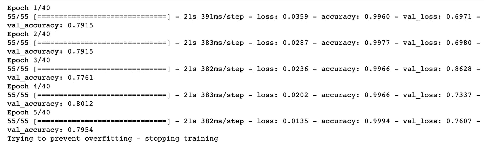

TensorBoard 回调函数还允许我们查看与训练过程相关的各种指标并与之交互。在这里，我们可以跟踪在每个训练时期精度如何增加和损失如何减少:

# 预测废物类别

在训练模型之后，我们可以用“看不见的”数据来评估它的性能:我们的 259 个图像的测试数据集。这里，我们可以生成一个数组，其中包含测试数据集中每个垃圾图像的预测类(0–5)。

为了解释这些结果，我们可以将每个标签分配回其材料类型。我们还可以绘制预测的废物项目类型和测试数据集中的实际废物项目类型之间的比较:

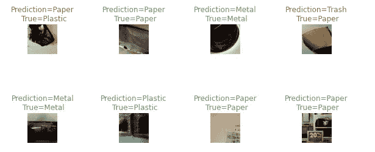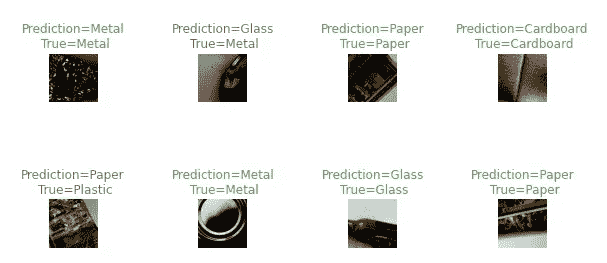

正确与错误分类的废物样本。作者提供的数字。

## **评估性能**

我们可以使用混淆矩阵来分析图像分类模型的预测。这使我们能够比较预测的和实际的材料类型，以评估每种废物类型的正确和错误分类的数量。

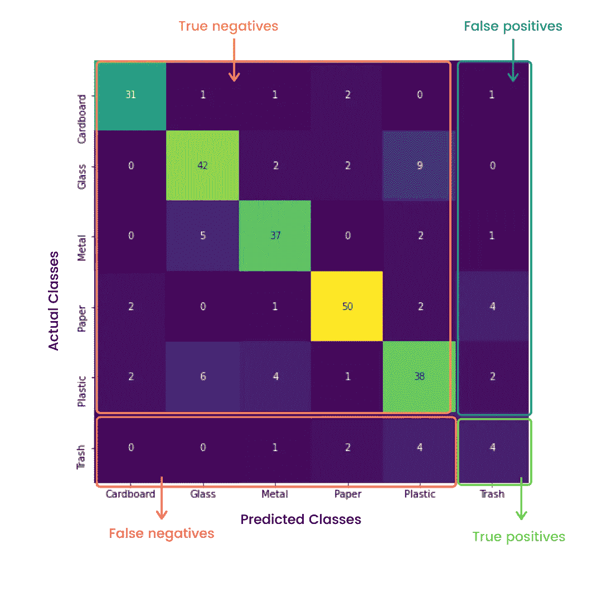

预测与实际废物类别的混淆矩阵。出于演示目的，垃圾类的预测细分已突出显示。作者提供的数字。

我们看到，总的来说，259 幅图像中有 202 幅(78%)预测正确。虽然预测的准确性还不错，但模型识别垃圾的能力对我们来说是最重要的，因为我们希望确保分类器能够将垃圾从可回收物品中分离出来。

如果我们检查**垃圾**，我们有以下结果:

*   真阳性率: **4 例(33.3%)**
*   真实否定(率)**:****【240(96.8%)】**
*   假阳性率: **8 例(3.2%)**
*   假阴性率: **7 例(63.6%)**

对于垃圾，总体预测准确率为 94.2%，代表正确分类的垃圾或非垃圾预测的总数。如果我们看一下误报率，我们还会看到非常低比例的非垃圾项目被错误地识别为垃圾。虽然准确率很高，误报率很低，但这主要是因为大多数项目首先就不是垃圾。

然而，我们看到假阴性错误率相当高，这表明垃圾项目经常被错误地分类为非垃圾项目。出于回收的目的，这并不理想，因为假阴性的成本很高。换句话说，为了避免待回收物品的污染，将非垃圾物品错误地归类为垃圾并扔掉并不重要，但更重要的是垃圾物品不要与可回收物品混在一起。由于我们的数据集中的垃圾项目总体上较少，因此我们建议用额外的垃圾图像进一步扩充数据集，以提高预测的假阴性错误率。

## 生成新的预测

我们现在已经看到了使用现有数据集时模型的表现。让我们来看看它对新数据的反应。在这最后一步中，我们创建一个新的函数，它获取一个新的图像，对其进行处理，并将其输入到训练好的 CNN 模型中。

在这里，我们上传了自己的照片，照片上是一张有些破损的便利贴，上面还有一些彩色的文字。我们可以在下面看到，我们的模型正确地将其材料分类为**纸**。成功！

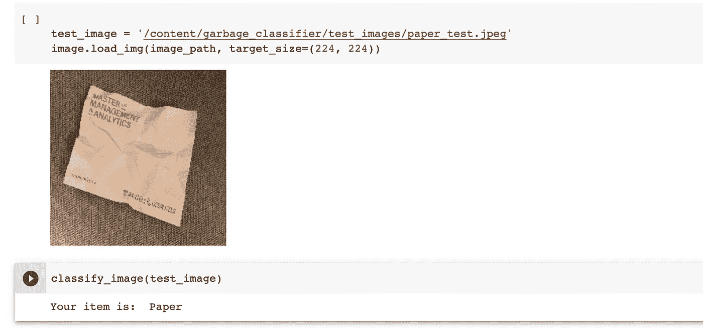

# **最后的想法**

这个项目的总体目标是研究我们如何建立一个人工智能驱动的模型，并将其应用于当前的废物危机。通过探索卷积神经网络(CNN)背后的直觉和建立一个卷积神经网络的步骤，我们能够成功地训练一个流行的深度学习框架，对来自五个可回收组的废物图像进行分类，并将它们与不可回收的垃圾项目区分开来。

虽然对常见的垃圾物品进行分类看起来是一项微不足道的任务，但在大规模应用时，CNN 的应用可能会非常强大。由于北美产生了全球 14%的垃圾，CNN 驱动的算法可以扩展到自动化垃圾分类的工业解决方案中，并提高现代回收系统的效率。如果设计得当，CNN 驱动的解决方案有可能帮助消除基于人类判断的错误，有助于降低总体分拣成本，并可以重新定义 21 世纪绿色环保的含义。

## 资源

*   [**Github 库**](https://github.com/duncan-wang/Waste_Image_Classifier)
*   [**浪费数据**](https://www.kaggle.com/asdasdasasdas/garbage-classification)

如果您想分享任何想法，请随时在 Linkedin 上联系我们。

## 关于我们的更多信息:

<https://www.linkedin.com/in/james-hogan9/>  <https://www.linkedin.com/in/sophie-courtemanche-martel/>  <https://www.linkedin.com/in/duncan-w/>  <https://www.linkedin.com/in/arnaud-guzman-ann%C3%A8s/> 