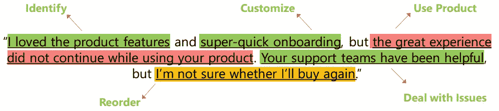
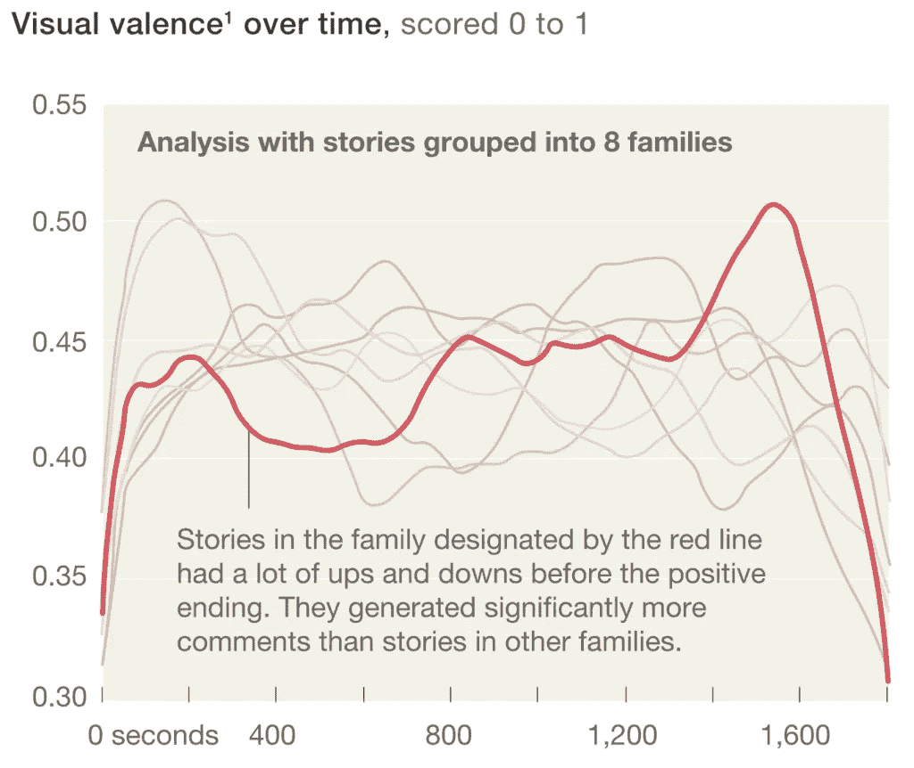

# 人工智能如何把你变成一个讲故事的大师

> 原文：<https://towardsdatascience.com/how-ai-can-transform-you-into-a-master-storyteller-a6e8a3c55dcb?source=collection_archive---------46----------------------->

Teemu Paananen 在 [Unsplash](https://unsplash.com/?utm_source=unsplash&utm_medium=referral&utm_content=creditCopyText) 上拍摄的照片

## 实现数据通信转型的三个步骤

2012 年，迪士尼投资 3.5 亿美元拍摄了一部似乎具备票房成功所有要素的电影。这是一部动作片，有着惊人的视觉效果。它是由一位明星作家和《海底总动员》的导演执导的。

当事情看起来非常乐观时，他们邀请了英国人工智能(AI)公司黑天鹅(Black Swan)来预测这部电影是否会受到欢迎。该公司的人工智能算法警告说，《T4》这部电影将会失败。迪士尼没有理会，继续他们的发行计划。

电影《异星战场》票房惨淡，估计亏损 8000 万至 1.2 亿美元。

今天，许多电影工作室正在转向数据和人工智能，以提高电影制作等艺术领域的科学商数。例如，华纳兄弟公司使用了 [Cynelitic engine](https://www.cinelytic.com/) ，这是一种人工智能驱动的解决方案，可以建议对剧本进行改进，预测电影收入，并分享电影如果在线播放将会如何表现。

当艺术最终转向人工智能时，企业难道不应该也采用人工智能驱动的讲故事来改善他们的业务沟通并激发他们的内部和外部利益相关者吗？

# 有效沟通的关键是什么？

[Juliana romo](https://unsplash.com/@roomajus?utm_source=unsplash&utm_medium=referral&utm_content=creditCopyText)在 [Unsplash](https://unsplash.com/s/photos/megaphone?utm_source=unsplash&utm_medium=referral&utm_content=creditCopyText) 上拍摄的照片

根据一项对 400 家全球企业的调查，沟通不畅给企业造成了高达 370 亿美元的损失。同一份报告发现，如果公司的领导者具备有效的沟通技巧，五年后公司股东的回报率会提高 47%。

那么，如何改善商务沟通呢？你需要故事。它们是感性的、难忘的、可操作的。讲故事是有效商业沟通的关键。根据心理学家杰罗姆·布鲁纳的说法，“以故事形式传递的信息比事实更令人难忘 22 倍。”

对于擅长讲故事的商务沟通专家来说，他们必须关注三点:

*   了解观众真正想要什么
*   呈现激动人心的内容
*   拼凑一个引人入胜的故事

今天，人工智能可以帮助您解决这些挑战。借助例子，让我们看看如何利用人工智能的力量来讲述伟大的商业故事。

# 1.深入了解你的受众

每一个伟大的故事都始于对观众的深刻理解。你必须了解客户的动机是什么，以及他们是如何做出决定的。有三种方法[倾听你的听众](https://insidebigdata.com/2019/03/20/how-ai-can-transform-customer-experience-by-listening-better-to-the-voice-of-customers/)。第一种是通过顾客之声(VoC)调查和直接访谈来获得直接反馈。假设您的客户对您的 VoC 调查作出了这样的反馈:*“我喜欢产品的功能和超级快速的入门，但在使用您的产品时，这种良好的体验没有继续下去。您的支持团队很有帮助，但我不确定是否会再次购买。”*

乍一看，这似乎是一个高于平均水平的混合反馈。然而，人工智能算法可以提取更深层次的信号。他们可以识别客户谈论的是哪个阶段，是“需求识别”阶段还是“处理产品问题”AI 然后可以识别旅程步骤的情绪，并推荐具体的改进领域，如下图所示。

图:在客户反馈中确定旅程步骤([格拉米纳](https://gramener.com/))

*人工智能解决方案将客户反馈分为五个客户旅程步骤，每个步骤都有相应的情绪(绿色表示积极，橙色表示中性，红色表示消极)。*

另外两种了解受众的方式是间接反馈(第三方网站或社交媒体帖子上的评论)和推断反馈(网页互动和点击流数据)。例如，一家下一代汽车租赁公司使用其汽车旅行数据库的高级分析来推断客户并将其分成 10 个原型[。](https://www.mckinsey.com/business-functions/marketing-and-sales/our-insights/new-insights-for-new-growth-what-it-takes-to-understand-your-customers-today)

这家汽车公司使用通过间接方式收集的数据来构建他们的客户原型。通过推出量身定制的产品和宣传，在一年内，该公司的客户群增长了 10%以上，收入增长了近 20%。

不是所有的故事都能吸引每个人。这就是为什么在你构思你的故事之前，首先了解你在迎合谁是至关重要的。

# 2.瞬间创造令人兴奋的内容

[斯凯工作室](https://unsplash.com/@skyestudios?utm_source=unsplash&utm_medium=referral&utm_content=creditCopyText)在 [Unsplash](https://unsplash.com/s/photos/creative?utm_source=unsplash&utm_medium=referral&utm_content=creditCopyText) 拍摄的照片

一旦你了解了受众，下一个挑战就是为他们量身打造令人兴奋的内容。没有“放之四海而皆准”的方法。内容需要根据购买者角色和他们在旅程中所处的阶段为您的受众定制。

假设你正在策划一场营销活动。AI 可以帮你写初稿吗？

《卫报》的编辑们在*试验了一款来自 OpenAI 的最新人工智能工具，名为 GPT-3。他们用一组指令提示人工智能，要求它“专注于为什么人类没有什么好害怕人工智能的。”人工智能在八篇不同的文章中提出了引人入胜的论点。*

这些文章被编辑成一篇专栏文章，并以“一个机器人写了整篇文章”的标题[发表](https://www.theguardian.com/commentisfree/2020/sep/08/robot-wrote-this-article-gpt-3)。你害怕了吗，人类？”编辑们说，编辑 GPT-3 的专栏与编辑人类的专栏没有什么不同，只是花费的时间少得多。

人工智能领域每天都在取得惊人的进步。今天，算法可以写[文章](http://ai-writer.com/)，创建[图片](https://generated.photos/)，合成[视频](https://www.synthesia.io/)，混搭[内容](https://deepdreamgenerator.com/)，甚至生成[交替现实](https://moondisaster.org/)。

对于你的营销活动，AI 不只是起草第一份文案，它可以通过让你选择 AI 生成的“演员”来创建视频。然后它可以合成人类的语言，并帮助你把它们打包在一起。

# 3.构思一个引人注目的故事

一旦你为你的目标受众准备了令人兴奋的内容，接下来你应该做什么来构建一个伟大的叙事？确保你的故事不平淡。

每个故事都必须有一个情感弧线。情感弧线也被称为“故事的形状”正是这一系列的情绪起伏，像坐过山车一样，一直勾着观众直到最后。

我们能证明情感弧线与观众参与度的相关性吗？麻省理工学院的社交机器实验室和麦肯锡消费者技术团队[研究了数千个 Vimeo 视频](https://www.mckinsey.com/industries/technology-media-and-telecommunications/our-insights/ai-in-storytelling)来调查情感弧线是如何支撑故事的。

使用计算机视觉和音频分析的算法每秒钟为每个场景打分。在勾勒出每个故事的情感弧线后，他们使用机器学习将它们分成八个家庭。

*图:* [*麦肯锡*](https://www.mckinsey.com/industries/technology-media-and-telecommunications/our-insights/ai-in-storytelling) *，“情感弧线如何提高观众参与度？”*

该分析的最后一部分是引入结果——用户参与度指标，如“喜欢”和“评论”研究人员发现，由人工智能算法生成的故事情感弧线可以预测观众是否会喜欢它。

现在我们有了证据，你如何在你的商业故事中编织情感弧线呢？

假设你正在展示你的季度收益。你可以从一个稍微消极的基调开始，提出历史挑战。然后，转移到一些小的成功，比如上个季度做得不错的事情。现在，介绍一个挫折，比如一个成功的竞争对手夺走了你的部分市场份额。最后，介绍你采取的恢复行动，并为你的胜利打分。

在上面的叙述中，我们有冲突。当竞争对手夺走市场份额时，我们会有情绪。最后，冲突通过你的行动得到了解决，给观众留下了积极的热情。

你的故事并不总是需要戏剧性的挫折或壮观的胜利。每种情况都有积极和消极的一面。将它们在右边的弧线上进行对比，并以一种引发情感和行动的方式将它们分层。

# 你将如何在你的下一个交流项目中使用人工智能？

Volodymyr Hryshchenko 在 [Unsplash](https://unsplash.com/s/photos/communication?utm_source=unsplash&utm_medium=referral&utm_content=creditCopyText) 上的照片

你可能会用幻灯片向投资者推销，在你的网站上发布新产品，或者通过电子邮件向你的员工发布重大公告。

无论受众是谁，无论沟通模式是什么，以上几点都适用于每一个场景。首先分析你的受众是谁，他们真正想要什么。利用这些工具来创建令人兴奋的内容，并将其制作成在情感上吸引人的叙述。

在你经历这个过程的时候，把 AI 想象成一个助手，帮助你简化事情，帮助你加速活动。当一个人参与到循环中，不断地提供输入，并审查结果时，人工智能会产生最佳效果。这被称为[增强智能](https://www.forbes.com/sites/ganeskesari/2020/10/19/go-beyond-artificial-intelligence-why-your-business-needs-augmented-intelligence/)，它帮助你最大限度地利用人工智能。

在你的下一次商务交流中创造性地运用这些原则。

*这篇文章最初是* [*发表的*](https://catalyst.iabc.com/Articles/TitleLink/How-AI-Can-Transform-You-Into-a-Master-Storyteller) *关于 IABC 的催化剂。增加了插图。*