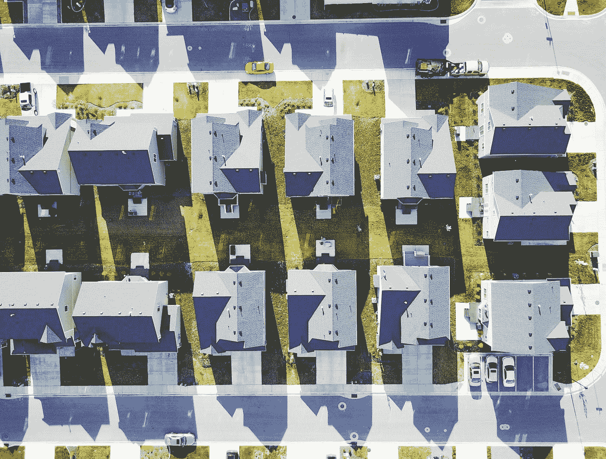

# 人工智能如何影响保险行业？

> 原文：<https://towardsdatascience.com/how-ai-is-impacting-the-insurance-industry-f90402493764?source=collection_archive---------30----------------------->

## 今天，大多数财产保险公司仍然依靠一个带着梯子和摄像机的人来进行物理检查


照片由 [Unsplash](https://unsplash.com?utm_source=medium&utm_medium=referral) 上的 [h heyerlein](https://unsplash.com/@heyerlein?utm_source=medium&utm_medium=referral) 拍摄

如今，大多数财产保险公司仍然依赖一个带着梯子和相机的人来进行实地检查和风险评估。但智能保险公司正在寻求人工智能研究人员的帮助，这些研究人员开发了一种平台，可以评估网络上数以千计的公开图像和其他数据点，在几秒钟内提供风险评估。

> “我们确保保险公司可以非常、非常快速地访问这些数据，尤其是在报价引擎中使用这些数据的情况下，”深度学习公司 Cape Analytics 的首席执行官 Ryan Kottenstette 说，该公司为保险、贷款、拥有或管理房地产的公司提供预测风险分析。
> 
> 他补充说，在不到两秒钟的时间内，保险公司就会得到一系列特征，如树木伸出的程度或屋顶状况(按五分制评分)。


斯科特·韦伯在 [Unsplash](https://unsplash.com?utm_source=medium&utm_medium=referral) 上拍摄的照片

迟来的保险公司应该记得柯达，曾经是世界领先的摄影公司，当它犹豫要不要数字化时，它就变得无关紧要了。

# 我们要去哪里？


照片由[马修·施瓦茨](https://unsplash.com/@cadop?utm_source=medium&utm_medium=referral)在 [Unsplash](https://unsplash.com?utm_source=medium&utm_medium=referral) 拍摄

全球保险商市场伦敦劳埃德在其 2018 年新兴风险报告中预测，随着远程信息处理、可穿戴设备和智能家居传感器的发展，物联网将在未来几年改变保险业。目前，人工智能的影响主要在于改善索赔处理。但是，它已经开始实时识别、评估和承保新出现的风险。

总部位于科罗拉多州的初创公司 Parsyl 帮助保险公司跟踪易腐产品在供应链中的质量。从 Progressive 到 Geico，汽车保险公司正在使用远程信息技术从车辆上收集实时驾驶数据，以折扣奖励安全的司机，并帮助重现事故。健身追踪器和心率监测器等可穿戴设备最终可能会帮助健康保险公司追踪和奖励定期锻炼等健康习惯。

这些新的风险评估服务是机器学习进步的结果，机器学习允许对数百万张图像进行训练的算法在眨眼之间发现各种类型的风险，从悬挂的树木到游泳池。这并没有使物理检查员过时，但它可以让保险公司立即了解对某一特定财产可能提出的潜在索赔类型。对于更大的工作，该系统可以评估开发的总体风险，甚至以惊人的准确性评估社区。

# 改变行业



布莱克·惠勒在 [Unsplash](https://unsplash.com?utm_source=medium&utm_medium=referral) 上拍摄的照片

但是，看看幕后，这些新的风险评估服务的真正工作是标记用于训练人工智能系统的海量数据。就像一个孩子通过被告知来学习识别一棵树是一棵树一样，计算机视觉算法必须经过训练，才能在一个称为监督学习的过程中识别一棵树是一棵树。

工作团队煞费苦心地手工注释了数百万个数据点，这些数据又被输入到算法中。可用于训练算法的注释数据越多，机器学习分析就越准确。区别点被标记为训练数据。

> “训练数据是这场人工智能革命的生命线，”另一家公司 [Arturo](https://arturo.ai/) 的首席执行官 JC Clark 说，该公司利用人工智能从空中图像的大规模跳跃中释放价值。

自 2012 年以来，计算机视觉一直在改变着各个行业，当时人工神经元网络的突破首次使其用途足够精确，可以用于商业应用。从那时起，从杂草探测到自动驾驶汽车，用例出现了爆炸式增长。

与此同时，由于越来越便宜的图像传感器和过多的小型化卫星(有些只有鞋盒那么小)，地球轨道上出现了大量的地理空间图像。例如，初创公司 [Planet Labs](https://www.planet.com/) 拥有 130 多颗卫星，每天以 3 至 5 米的分辨率拍摄地球上几乎所有地方的照片。


美国宇航局在 [Unsplash](https://unsplash.com?utm_source=medium&utm_medium=referral) 拍摄的照片

# 标记数百万张图片

越来越精确的计算机视觉算法和丰富的地理空间图像的融合，使得像 [Cape Analytics](https://capeanalytics.com/) 和 [Arturo](https://www.arturo.ai/) 这样的公司能够为目标市场上的每一处房产列出潜在的保险风险。客户可以在这些系统中输入一个地址，然后得到一份关于潜在风险的完整报告，从悬垂的树木到损坏的屋顶瓦片。

但是对于一个系统来说，仅仅扫描图像是不够的，它需要知道在这些图像中寻找什么。为了教会计算机如何解释图像中的特征，计算机需要接受大量带标签的图像的训练:悬垂的树木必须画出轮廓并贴上标签，损坏的屋顶瓦片必须画出轮廓并贴上标签，游泳池、灌木林、溪流和池塘都需要画出轮廓并贴上标签，主要是手工绘制，在计算机算法有足够的能力自己发现这些特征之前，需要成千上万、甚至上百万的图像。

很难精确地标注出使模型在商业上可行所必需的数量。随着公司建立越来越多的精确标记的数据，这成为他们最有价值的知识产权。

> “我们有自己专有的标签数据集，”Cape Analytics 的 Kottenstette 先生说。他的公司专注于房地产分析，因为它涉及很多行业，从保险到房地产投资。

[Cape Analytics](https://capeanalytics.com/) 用自己的特征定义和分类法做自己的标注。对于美国的许多地址，该公司有预先计算的属性特征，可以在两秒钟内为客户提供分析。保险公司会得到一个特征列表，比如树木伸出的程度或屋顶状况的五分制。

[Cape Analytics](https://capeanalytics.com/) 维护着一个由客户提供的历史索赔数据库，这些索赔来自全国各地数百万个保单年度，并匹配与每个保单的时间范围相对应的图像。然后，它会查看这些属性中的哪些最终会有索赔，以及是否有任何属性特征与更高的索赔频率或更高的索赔严重性相关联。

> “你需要高质量的基础设施，可以扩展到数百万个家庭，”科特斯坦特先生说。
> 
> 他说 [Cape Analytics](https://capeanalytics.com/) 流程从定义一个“黄金标准数据集”开始，由一组内部注释专家明确定义并记录他们寻求识别的特征。他说，这个黄金标准然后被用来培训外包标签公司的员工，然后这些公司扩大数据集。
> 
> “一旦我们对被标记的数据的质量和数量感到满意，我们就用它来训练我们的内部模型，然后进行额外的迭代和测试，以尽可能提高模型的性能，”科特斯坦特说。

好事达保险公司使用专门的飞机或无人机记录图像，用于更快地为客户撰写保单，或在灾难发生后更快地查看损失。它的汽车保险客户可以发送事故现场的照片，由人工智能模型进行分析，并加快索赔。Orbital Insight 和 Flyreel 是另外两家使用人工智能和图像来评估保险风险的公司。

# 结论


照片由 [visualsofdana](https://unsplash.com/@visualsofdana?utm_source=medium&utm_medium=referral) 在 [Unsplash](https://unsplash.com?utm_source=medium&utm_medium=referral) 上拍摄

所有这些公司都使用一个名为 [Labelbox](https://labelbox.com/) 的平台来管理标注过程。“它可以被托管在云中，但如果你想把它安装在你的手机上，如果你想把它放在你自己的物理硬件上，你也可以这么做，”克拉克说。

这些公司说，通过使用一个平台，而不是“黑箱服务提供商”，他们获取数据并贴上标签返回，他们保留了对其最重要的知识产权的控制。克拉克先生说，他的公司在确定软件解决方案之前尝试了服务公司，并补充说，服务公司背后的“肮脏的小秘密”是，大量的时间和金钱被浪费在正确的标签上。

> “你告诉贴标机你需要他们做什么，当他们回来时，他们所做的 80%都是错的，”他说。"你重新开始，然后你错了 60%，然后又错了 40% . "他说，在选择 Labelbox 之前，他的公司与其他几家公司合作过，label box 现在是他们唯一的工具。他说，结果是比服务公司“立即节省 15%到 25%”。
> 
> “我们在印度、菲律宾和世界其他地方有成千上万的人代表我们使用 Labelbox 来创建这些训练数据集，”他说，并补充说该平台还简化了管理分散的远程团队的工作。
> 
> “ [*Labelbox*](https://labelbox.com/) 让我们的工作变得更加轻松，并使我们能够扩大产品开发规模，因为我们花在管理流程和管理贴标机上的时间更少，而花在创建优秀示例和审核即将推出的产品并准备用于培训的时间更多，”他补充道。

与 [Cape Analytics](https://capeanalytics.com/) 、 [Arturo](https://www.arturo.ai/) 一样，它使用来自其客户的专有内部索赔数据进行预测分析，根据可识别的风险因素计算索赔的概率和规模——例如，根据历史数据，某个市场中 30%的树木威胁与 30%的 2 万美元索赔机会相关。

> “随着时间的推移，能够创建高质量的培训数据将成为任何财富 1000 强企业的需求，这将是每个首席信息官都需要在他们的供应商集工具，”克拉克先生说。

# 在你走之前

```
- [AI in Education [Video]](https://youtu.be/Ny9-GrUIl4g)- [Free skill tests for Data Scientists & Machine Learning Engineers](https://aigents.co/skills)- [Data Science for Business Leaders](https://imp.i115008.net/c/2402645/880006/11298) [Course]- [Intro to Machine Learning with PyTorch](https://imp.i115008.net/c/2402645/788201/11298) [Course]- [Become a Growth Product Manager](https://imp.i115008.net/c/2402645/803127/11298) [Course]- [Labeling and Data Engineering for Conversational AI and Analytics](https://www.humanfirst.ai/)
```

*上面的一些链接是附属链接，如果你通过它们进行购买，我会赚取佣金。请记住，我链接课程是因为它们的质量，而不是因为我从你的购买中获得的佣金。*

在 [Twitter](https://twitter.com/romanorac) 上关注我，在那里我定期[发布关于数据科学和机器学习的](https://twitter.com/romanorac/status/1328952374447267843)消息。


照片由[Courtney hedge](https://unsplash.com/@cmhedger?utm_source=medium&utm_medium=referral)在 [Unsplash](https://unsplash.com/?utm_source=medium&utm_medium=referral) 拍摄