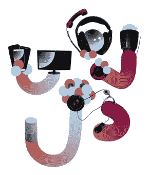
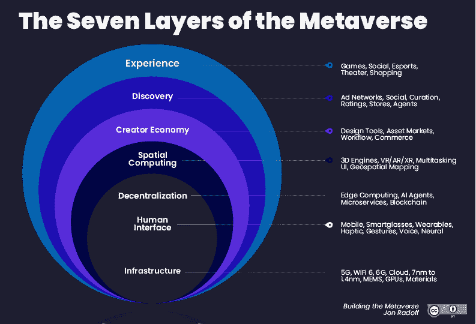
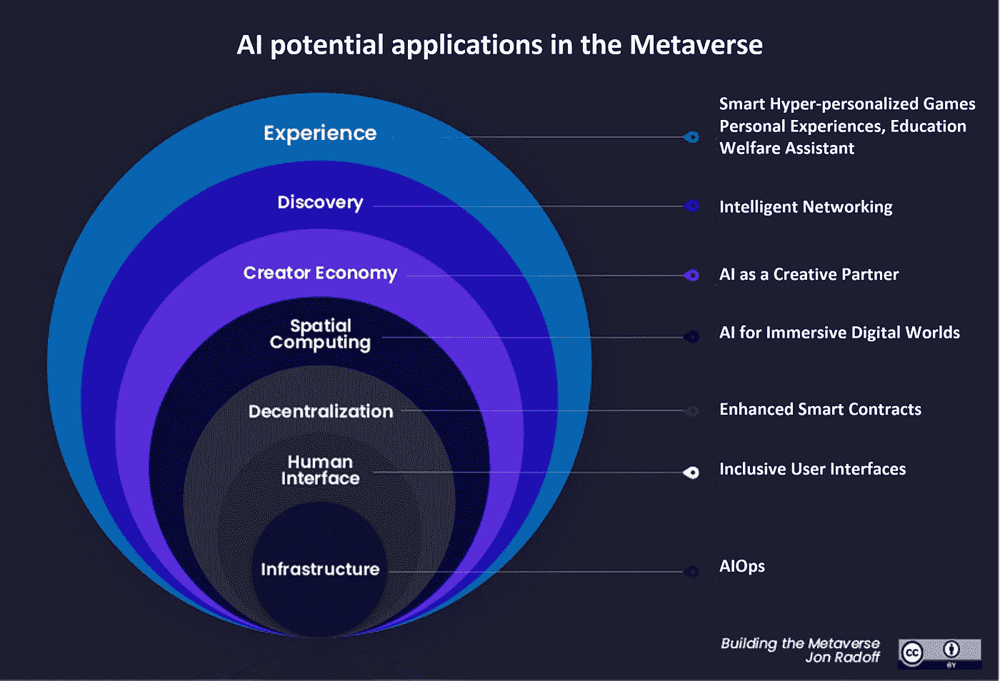

# 人工智能将如何塑造元宇宙

> 原文：<https://towardsdatascience.com/how-ai-will-shape-the-metaverse-4ea7ae20c99?source=collection_archive---------1----------------------->

## 随着被称为元宇宙的未来数字世界的不同愿景的出现，人工智能将在其中扮演什么角色？它会提高包容性，还是有助于创造一个更加歧视的数字世界？

Anton Grabolle /更好的人工智能图像/人-人工智能协作/ CC-BY 4.0

元宇宙已经成为最热门的技术和社会经济话题之一。结合不同的技术，如虚拟现实、三维动画、区块链和许多其他技术，许多公司已经开始致力于为这个新的数字世界创造服务。甚至科技巨头脸书也将其名称改为 [Meta](https://about.fb.com/news/2021/10/facebook-company-is-now-meta/) ，这表明元宇宙真正的目标是成为下一个主流科技。

关于在《元宇宙》中的角色已经说了很多，这部分要归功于对和的大肆宣传，但我想知道关于和艾的交集又说了些什么。但首先，让我们试着回答这个问题“什么是元宇宙？”或者至少，试着指出几个关于它的观点。

# 元宇宙和网络简介 3

关于元宇宙的最新观点之一是由[比特币基地](https://blog.coinbase.com/how-coinbase-thinks-about-the-metaverse-16d8070f4841)发表的，它借用了风险投资家和作家马修·鲍尔的定义:

> 互联网的未来:一个大规模的、持久的、交互式的、可互操作的实时平台，由**个互联的虚拟世界组成，人们可以在其中社交、工作、交易、娱乐和创造**。
> 
> **元宇宙是 Web3** 的遥远演变。在其最完整的形式中，它将是一系列分散的、相互联系的虚拟世界，具有全功能的经济，在那里人们可以做他们在现实世界中可以做的任何事情。

关于互联网及其未来已经说了很多，但正如比特币基地在文章中指出的，明确区分元宇宙和 Web3 的概念是很重要的。Chris Dixon 的这篇 twitter 帖子是理解 Web3 的好材料:

根据 Chris 的说法，Web3 是关于提供先进的数字服务，但这些服务不是像 Web2 那样由大型技术公司控制，而是由社区创建和管理，回归到 Web1 的精神，即互联网的价值是由网络边缘的用户产生的，但主要是以写入模式产生的。

要符合比特币基地元宇宙定义，平台应包括以下要素/特征:

*   虚拟世界
*   巨大的可扩展性
*   持续
*   始终开启和同步
*   构建平台
*   充分运行的经济
*   开放和权力下放
*   互用性

我发现元宇宙的另一个有趣的观点是由[乔恩·拉多夫](https://jradoff.medium.com/?source=post_page-----577343895411-----------------------------------)撰写的这篇真正有趣的[文章](https://medium.com/building-the-metaverse/the-metaverse-and-artificial-intelligence-ai-577343895411)中的观点，它也介绍了元宇宙价值链的概念，如下所示:

《元宇宙的七层》,作者乔恩·拉多夫，由 CC 授权。

乔恩将元宇宙定义为“[实时的、基于活动的互联网](https://medium.com/building-the-metaverse/what-is-the-metaverse-a170108458e8)此外，他指出，在这个新的互联网元宇宙中，Web3 是实现应用程序之间价值交换的基础。

# 艾在元宇宙

利用 Jon 的这一层架构，我试图将人工智能在元宇宙未来可以发挥相关作用的一些领域整合在一起，不仅从产品角度，还考虑了人工智能如何使元宇宙更具包容性。

人工智能在元宇宙的潜在应用，基于 Jon Radoff 的“建造元宇宙”,由 CC 授权

让我们从基础设施开始，我们将继续向上，直到到达体验层。

## AIOps

请记住，根据比特币基地的说法，支持元宇宙所需的平台必须永远在线，并且具有大规模可伸缩性。在这种要求很高的情况下，AIOps 将发挥重要作用，管理所有必要的基础设施，包括硬件、基础软件和通信。但是什么是 AIOps 呢？Gartner 将其定义为“大数据和机器学习的结合，以自动化 it 运营流程，包括事件关联、异常检测和因果关系确定。”这些功能的可用性不仅对于确保元宇宙基础设施的健壮性至关重要，而且对于提供与上层相关的活动洞察也至关重要。

## 包容性用户界面

元宇宙潜在成功的关键之一是高度沉浸式体验的承诺。虽然这可以改善一些人的社交互动，但也可能成为残疾人进入未来数字世界的巨大障碍。不仅如此，数字能力水平较低的人可能会发现自己脱离了这种新的社会经济和体验。这就是为什么 [AI for accessibility](https://www.inclusivecitymaker.com/artificial-intelligence-accessibility-examples-technology-serves-people-disabilities/) 应该在保证每个人都能进入元宇宙方面发挥重要作用，不管他们的能力如何。这一领域的一些相关技术可能是:

*   视觉障碍者的图像识别
*   自动翻译
*   智能外骨骼与数字世界互动
*   最脆弱人群的脑机接口(如[认知](https://one.cognixion.com/)

虽然有点老了，但我觉得肖恩·凯恩的这个讲座非常有见地，因为它让我们意识到了我们的数字界面对残疾人的所有限制。

面向残障人士的基于手势的移动用户界面

Web3 通常被称为 Web2 的大众化版本。要做到这一点，我们不应该让任何人落后(这也适用于社会和经济的局限性)。

## 增强型智能合同

遵循民主化的理念，元宇宙(及其去中心化层)承诺允许创作者和用户轻松交换数字资产和权利，保护所有权并确保大型技术公司的非中介化。但是这个承诺会实现吗？例如，阿迪达斯最近推出了第一款 NFT。尽管每人只能购买 2 个，但不到一秒钟的时间就销售一空，一个人在一次交易中可以购买 330 个。这真的是互联网民主化的未来吗？是的，权力可能会从大公司手中转移，但似乎不会回到人民手中，而只会回到少数人手中，在这种情况下，是拥有软件技能的人。

先是阿迪达斯 NFT 不到一秒就卖光了。这是网络 3 民主化的未来吗？

在这种情况下，包含人工智能的增强型智能合同可以帮助识别这种场景。正如前面在 AIOps 一节中提到的，与交易相关的基础设施信息可用于跟踪这种“反民主”活动，尽管一旦区块链交易完成，这不足以阻止它们。

## 沉浸式数字世界的人工智能

这组技术的一个最好的例子是 NVIDIA 的 Omniverse。这个平台提供的用于创建数字世界和模拟真实世界的组件令人印象深刻。从大规模的世界构建和模拟到测试自主机器人/人工智能的虚拟环境，再到人工智能语音技术，NVIDIA technologies 是一个很好的例子，说明人工智能将如何在创建元宇宙社交互动的数字空间中发挥关键作用。

NVIDIA 的 Omniverse 功能

## 作为创意伙伴的人工智能

最新的自然语言处理(NLP)模型(例如 GPT-3 和其他模型)已经打开了使用人工智能作为创意伙伴的大门，基于用户输入生成创意写作(你可以在这里阅读我关于 [GPT-3](/gpt-3-101-a-brief-introduction-5c9d773a2354) ，启动和提示工程的完整文章)。

但是，人工智能不仅可以生成创造性的写作，还可以从文本描述甚至非常简单的绘图中生成逼真的图像。OpenAI 的 [DALL-E](/openais-dall-e-and-clip-101-a-brief-introduction-3a4367280d4e) 或 NVIDIA 的 GauGAN2 等技术就是如此。

NVIDIA 的 GauGAN2 演示

我们已经有了基于这种算法的社区自治艺术家的第一个例子。这就是 [Botto](https://botto.com/) 的情况，在写这篇文章的时候，最新的艺术作品刚刚在 twitter 上分享:

基于人工智能、由社区管理的自治艺术家的例子

## 智能网络

元宇宙的主要目标之一是通过增强数字自我和数字个性化来改善社交网络的体验。虽然这将使每个用户在数字世界中的体验像在现实世界中一样独一无二，但这也将在包容性和安全方面给少数民族和儿童带来挑战。人工智能如何改善元宇宙的社交网络？

《福布斯》的这篇文章指出，一些努力已经到位，为社交网络中的少数群体创造更包容和安全的体验。根据 ShareChat 和 Arize 在印度的经验，重点介绍了哪些良好的实践/技术应该得到加强:

*   防止虐待和仇恨言论
*   针对少数群体(如语言、地理等)的内容相关性计算。)
*   避免偏差的特征选择
*   ML 可观测性

## 智能超个性化游戏、体验、教育和福利

我们终于得到了元宇宙的最后一层，体验层。基于本文中介绍的每一层，并利用人工智能提供的功能，目标是为元宇宙的每个用户创造独特的数字体验。我们当然可以为每个提议的场景添加额外的功能，如下所示:

*   根据玩家的灵巧度，智能调整游戏难度模式。
*   基于特定用户残疾的虚拟感官体验的个性化。
*   调整学习路径，根据学生的进步推荐额外的培训。
*   基于健康参数实时分析的个性化运动计划，通过物联网个人设备消费。

这些只是一些关于人工智能如何在元宇宙建立差异化和包容性体验的想法。我们只是触及了表面，我们将在未来看到许多创造性的用例。在我最近与我的 twitter 粉丝分享的一项民意调查中，只有十分之二的人认为 Web3 将比 Web2 更具包容性。我们应该通过让下一个网络成为一个对每个人都更安全、更包容的空间来证明其他 8 个错误。

*如果你喜欢阅读这篇文章，请* [*考虑成为会员*](https://dpereirapaz.medium.com/membership) *，在支持我和其他作者的同时，获得媒体上每个故事的完整访问权限。*