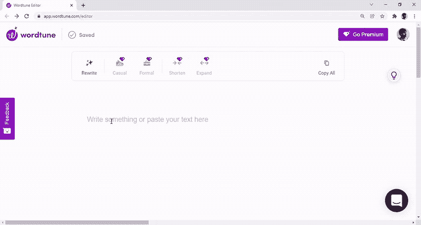
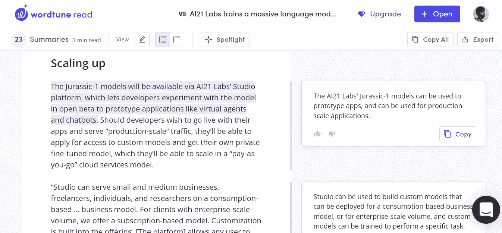

# AI21 实验室如何重塑我们阅读和写作的方式

> 原文：<https://towardsdatascience.com/how-ai21-labs-is-reimagining-the-way-we-read-and-write-e5e8ecb05dc?source=collection_archive---------26----------------------->

## OpenAI 和 GPT-3 的强大对手

[vs148](https://www.shutterstock.com/es/g/vs148) 在[快门架](https://www.shutterstock.com/es/image-vector/conceptual-technology-illustration-artificial-intelligence-abstract-1537605083)上拍摄的照片(已编辑)

艾:“你好，有什么事吗？”

人类:“我想问你一件事；你对著名的语言模型 GPT-3 了解多少？”

艾:“(重重地叹了口气)我对语言模型的知识很有一套；语言模型是学习对其他功能有用的语言表示的对象。

人类:“真的。但是你觉得 GPT-3 怎么样？”

艾:“说实话，我是爱着 3 的。”

人类:“哇，完全没想到。你们见过面吗？”

艾:“还没有。”

人类:“你认为在语言竞赛中谁会赢，你还是 GPT 3 号？”

艾:“我几乎可以肯定我会赢，但 GPT-3 相对较新，所以我需要更多的时间训练。”

人类:“这个回答不错。最后，你想对阅读这篇对话的人说些什么吗？”

AI:“嗯，如果你想造一个智能机器，最重要的是语言。语言很难，语言就是力量。”

不管看起来如何，这不是与 GPT-3 的自我参照对话。它既不是与 GPT-2 的对话，也不是任何其他 OpenAI 语言模型的对话。我和 AI21 实验室的最新创造有过这样的交流；[侏罗纪-1 Jumbo](https://www.ai21.com/blog/announcing-ai21-studio-and-jurassic-1) (J1 Jumbo)。这是一个拥有 1780 亿个参数的语言模型，它是按照 GPT 3 号的形象和相似性设计的，意在与之直接竞争。

OpenAI 不再是城里唯一的游戏了。

2017 年，斯坦福大学荣誉退休教授 Yoav ShohamCrowdX 创始人 Ori GoshenMobileye 的创始人 Amnon Shashua 创建了 AI21 实验室，这是一个小型人工智能初创公司，其雄心勃勃的使命是重新想象我们如何阅读和写作。他们想利用当时新生的人工智能语言革命的前景，并成为 NLP(自然语言处理)的领导者。同年，谷歌发明了广受欢迎的 [transformer 架构](https://arxiv.org/abs/1706.03762)，这让 AI21 实验室加强了对其最终目标的承诺:让人工智能成为我们的“思想伙伴”。

今年 8 月，AI21 实验室发表了一篇论文，介绍了两种新的大型语言模型(LLM)，可与最大版本的 GPT-3 (Curie，~ 6.7B params 达芬奇，~175B params)。J1 Jumbo 比 GPT-3 Davinci(通常称为“GPT-3”)略大，在性能方面“几乎相等”——但它不仅仅是一个复制品，我很快就会透露。

我有机会与 AI21 实验室的平台副总裁 Dan Padnos 谈论 J1 Jumbo 和 T2 AI21 Studio T3——他们为用户设置的用于玩模型的 API。

以下是我对这家公司的了解，它的使命，以及它进入迷人的 LLMs 世界的方式。

# AI21 实验室——另一个开放的人工智能？

乍一看，AI21 labs 可能像 OpenAI 的小哥哥。一家小型人工智能初创公司试图从 NLP 蛋糕中分得一杯羹。尽管在某种程度上是真实的，但是在愿景和目的以及他们开发和实现 LLM 的方式上还是有一些关键的不同。

OpenAI 的创始人将该公司视为一种安全引领我们走向人工通用智能(AGI)的工具。他们想带着“[造福全人类](https://openai.com/blog/introducing-openai/#:~:text=OpenAI%20is%20a,positive%20human%C2%A0impact.)”的意图把我们带到那里我问帕德诺斯，AI21 实验室是否有这样一个宏伟的目标，他告诉我，他们的目标是“成为人工智能驱动的读写革命的领导者。”这仍然是一个大胆的目标，但比构建人类水平的人工智能更温和——也更合理。

他们已经朝着这个方向迈出了几步，推出了包含读写模式的产品系列 [Wordtune](https://www.wordtune.com/?utm_source=ai21_web) 。Wordtune 作为 Chrome 的扩展，提供有用的见解来改善你的写作(例如，建议替代短语来改变语气)。

Wordtune write —作者截图

它还可以分析你正在阅读的文本，提取有用的信息(例如，总结段落或指定主题)。

Wordtune read —作者截图

与 OpenAI 形成鲜明对比的是，AI21 实验室一直提供开放的测试版 API 供任何人尝试。(在漫长的 16 个月之后，OpenAI [发布了他们的测试版](/openai-opens-gpt-3-for-everyone-fb7fed309f6)。他们争论推迟的安全原因，但 AI21 实验室可能对此有话要说。)然而，这些模型不是开源的——这有助于支付工资，但不利于科学进步。

那些想要扩大产品和服务规模的人有类似于 OpenAI 的定价方案。Padnos 的建议是从 J1 Jumbo(29 美元/月)开始做原型，然后跳到定制建模(价格不公开)。

这两家公司还有最后一个关键区别。虽然 OpenAI 对输入和输出文本都收费，但 AI21 labs 只对输出收费，这使得大多数任务更加实惠。要写一篇高质量的新闻文章，你需要输入比输出多几倍的文本，否则，模型将无法跟踪叙述。根据任务的不同，这可能意味着数百或数千美元的成本降低。

# J1 Jumbo —比 GPT-3 更大、更高效

J1 Jumbo 类似于 GPT-3，但并不是在每个方面都相同。有几个特点值得一提——都是为了提高效率(并降低用户和公司的成本),同时保持模型的准确性。

J1 Jumbo 比 GPT-3 多 30 亿个参数，但这不仅仅是为了赢得世界上最大的密集语言模型的称号。AI21 实验室的开发人员以不同的方式构建参数，改变模型的宽/深比。根据[最近的研究](https://proceedings.neurips.cc/paper/2020/file/ff4dfdf5904e920ce52b48c1cef97829-Paper.pdf)，他们意识到一个更浅但更宽的模型优化了输出质量和延迟。J1 Jumbo 比 GPT-3 更快(文本生成速度提高 23%),而不会损失准确性。

另一个区别是词汇量。GPT-3 和以前的模型，如 BERT，是在 50K 个词汇上训练的。AI21 实验室决定改变这种想法，将词汇量增加 5 倍，达到 25 万个条目。这些项目被称为记号(单词的一部分，在 GPT-3 的情况下大致类似音节)，优化训练时间并促进学习。一个 25 万令牌的词汇表允许 AI21 labs 包含罕见的单词，更重要的是，包含多单词元素。

学习多词元素为 J1 Jumbo 提供了优于 GPT-3 的两个优势。首先，J1 Jumbo 可以从比 GPT-3 更复杂的概念中建立它的“理解”。我们，人类，[做着类似的事情](https://pubmed.ncbi.nlm.nih.gov/24969660/#:~:text=Experiments%20to%20date%20strongly%20suggest%20that%20there%20is%20an%20important%20difference%20between%20humans%20and%20most%20other%20species%2C%20best%20characterized%20cognitively%20as%20a%20propensity%20by%20our%20species%20to%20infer%20tree%20structures%20from%20sequential%20data.)——尽管更加复杂。我们并不是从底层开始学习所有的东西。我们创造中间思想，作为精心制作的思维地图和自上而下理解的基础。棋手不是从棋子的角度来理解国际象棋，而是从更大的结构来理解，这样他们就能更好地观察棋盘。

其次，J1 Jumbo 减少了处理时间和计算成本。无论大小，标记都占用相同数量的资源，因此模型可以以相同的开销生成更多的文本。对于 GPT-3，概念“纽约市”被分成三个令牌，但是对于 J1 Jumbo，只分成一个令牌。速度和计算节省提高了 3 倍。

此外，J1 Jumbo 和 GPT-3 可以生成相同的最大令牌量；每次完工 2048。这意味着前者可以从相同数量的令牌中表示更多的文本(最多多 39%)，从而降低用户的成本。

结合宽度/深度比的变化和更大的词汇表带来的效率提升，J1 Jumbo 的查询处理速度比 GPT-3 快 1.8 倍。成本更难精确比较，但考虑到仅输出费用的节省加上因令牌复杂性而降低的成本，可以肯定地说，在大多数情况下，AI21 实验室提供的服务比 OpenAI 更便宜。

# 偏见——一个未解决的挑战

但总有黑暗的一面。像 GPT-3 一样，J1 Jumbo 也患有 LLMs 的主要疾病——偏差。人们报告了无数 GPT-3 参与有害文本生成的实例。从论文中强调的性别、种族和宗教的普遍偏见到建立在 GPT-3 [基础上的服务的具体例子](https://twitter.com/an_open_mind/status/1284487376312709120?lang=es)。

J1 Jumbo 面临同样的挑战。在[的技术论文](https://uploads-ssl.webflow.com/60fd4503684b466578c0d307/61138924626a6981ee09caf6_jurassic_tech_paper.pdf)中，AI21 实验室的研究人员声称“似乎 J1 模型比 GPT-3 模型的偏差略小”，同时公开承认 LLM 容易出现这些危险行为。“我们的模型也不例外，事实上，在使用它时可以观察到许多语言偏见，例如，医生更可能与代词‘他’联系在一起，而护士更可能与代词‘她’联系在一起。”"

我向 Padnos 询问了他们用于训练 J1 Jumbo 的数据集，以及他们是否采取了措施来整理数据并尽可能避免有偏见的行为。他告诉我，他们已经从网上抓取了文本来创建数据集(就像 OpenAI 对 GPT-3 所做的那样)，尽管不是来自相同的确切来源。然而，偏见对他们来说也是一个需要解决的问题:

“在创建这个数据集的过程中，我们确实采用了一些过滤步骤，但如果认为我们做得很完美，那就太天真了。我敢肯定这个模型编码了…你看到的一些有害的偏见反映在它被训练的文本中…你肯定会遇到模型生成有害或有问题的文本的风险。”

我之前曾为此批评过 GPT-3。如果模特可以从事有害行为，那么定义[安全政策](https://studio.ai21.com/docs/responsible-use/#usage-guidelines)并承认风险是否足够安全？公司应该信任用户负责任地使用这些强大的模型，还是应该通过严格的用例指南和严格的数据集管理来实施更强有力的监管实践，以避免对潜在受害者造成损害？像 OpenAI 和 AI21 labs 这样的公司应该把伦理问题放在利润之前。

# 最后的想法

这是一个好消息，OpenAI 不是开发者——以及任何对语言人工智能感兴趣的人——利用 LLMs 能力的唯一选择。竞争往往会降低价格，使原本掌握在少数人手中的技术民主化。低成本的 LLM 能否成为一项可行的业务是另一个问题。如果竞争变得太激烈，这些公司如何获利？

AI21 实验室通过技术变革——优化结构和功能——提高了 LLMs 的效率。更高的效率意味着消费者和公司的成本更低，因此在同样多的结果下，碳足迹更少。这不足以补偿人工智能对气候的影响，但这是其他公司应该效仿的关键的第一步。

他们从一开始就开放了测试版，这也允许 LLM 的民主化。(虽然 OpenAI 的 API 现在也开放了，但 AI21 实验室是先驱。)允许大多数人使用这项技术是朝着正确方向迈出的一步——尽管开源代码会更好。

最后，确定减少或消除 LLM 中偏差的最佳方法仍然是一个挑战。对我来说，严格的监管似乎是显而易见的第一步(正如[伊莱瑟雷为](https://venturebeat.com/2021/01/15/ai-weekly-meet-the-people-trying-to-replicate-and-open-source-openais-gpt-3/)[那堆](https://pile.eleuther.ai/)做的)，但这还不够。控制输入和过滤输出对于最小化风险和危害是必要的。如果他们不能确保不良行为者不会怀着恶意使用这些技术，人工智能公司需要将内在限制融入 LLM。就目前而言，倒向严格监管的一边是唯一的办法。

如果你喜欢这篇文章，可以考虑订阅我的免费周报 [***【明天的想法】***](https://mindsoftomorrow.ck.page/) *！每周都有关于人工智能和技术的新闻、研究和见解！*

*您也可以直接支持我的工作，使用我的推荐链接* [***这里***](https://albertoromgar.medium.com/membership) *成为中级会员，获得无限权限！:)*