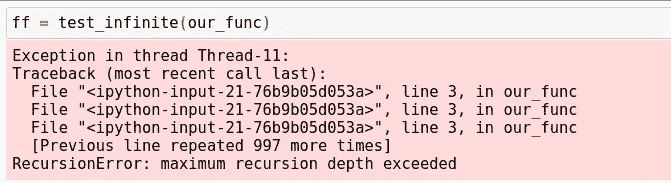

# 艾伦·图灵如何证明计算机不能解决一切

> 原文：<https://towardsdatascience.com/how-alan-turing-proved-computers-cannot-solve-everything-a9f83a5b776f?source=collection_archive---------18----------------------->

## 解释艾伦·图灵如何用 Python 代码证明计算机不是万能的。


(src =[https://pixabay.com/images/id-2591910/](https://pixabay.com/images/id-2591910/)

# 介绍

电脑已经成为当今社会的支柱，以至于我们越来越难以想象没有电脑的生活。随着机器学习的兴起，计算机和软件解决问题的天然能力已经越来越无与伦比。随着本世纪技术的奇妙崛起，似乎没有现代技术解决不了的问题，但事实真的是这样吗？

如果你花时间研究和学习现代计算机和现代计算机科学的历史，你很可能听说过艾伦·图灵。艾伦·图灵是一位计算机天才，他走在了时代的前面，负责创造现代计算机的机械版本。不仅那项科学成就归功于他，而且许多更了不起的科学成就也归功于他。

艾伦·图灵完成了一项了不起的科学成就，其中一个突出的例子是证明计算机不能解决人类必须提供给它的每一个问题。

# entsheidung 问题

1928 年，一位名叫戴维·希尔伯特的数学家提出了 Entscheidungsproblem 假说。这个假设的名字在英语中从德语翻译成决策问题，所以从现在开始我将把这个公式称为决策问题。此外，如果你对这个疯狂的德语单词的发音感到好奇，可以参考这个视频:

他提出的问题是

> “有没有一种[算法](https://simple.wikipedia.org/wiki/Algorithm)，它将采用一种[形式语言](https://simple.wikipedia.org/wiki/Formal_language)，以及该语言中的一个逻辑语句，并根据该语句的真值输出‘真’或‘假’？”
> 来源:[维基百科](https://simple.wikipedia.org/wiki/Entscheidungsproblem#:~:text=The%20Entscheidungsproblem%20(German%2C%20%22decision,truth%20value%20of%20the%20statement%3F)

对此的假设版本是:

> 如果有一个[算法](https://simple.wikipedia.org/wiki/Algorithm)将采用一种[形式语言](https://simple.wikipedia.org/wiki/Formal_language)，以及该语言中的一个逻辑语句，那么它应该输出‘真’或‘假’，这取决于该语句的真值。

这意味着，任何计算算法，只要有一组特定的符号，并且是逻辑的，那么它总是会输出真或假。换句话说，只要一个算法遵循内聚逻辑，它总是会有一个输出，从而解决任何放入其中的问题。我们现在知道形式语言是编程语言，算法是现代计算机编程中的函数，所以将这些计算描述的遗留版本(更像是前遗留版本)放入一个更现代的描述中无疑是有帮助的。考虑到这一点，我将最后一次重新阐述这个问题，以便使它现代化，便于普通程序员阅读。

> 如果有一个函数有逻辑语法，那么它应该能够根据语句的真值输出真或假。

理论上，从许多方面来看，这似乎是真的。如果我们要用我们最喜欢的编程语言编写一个函数，它有精确的逻辑和正确的语法，那么它能够解决我们扔给它的任何问题——只要它打算这样做。考虑你写的每一个函数来做决定，你可以想象它服从这个假设的界限。然而，艾伦·图灵对这个公式有不同的想法，要理解他是如何证明它是错误的，我们需要理解他的逻辑悖论。

# 艾伦·图灵的逻辑悖论

1936 年，艾伦·图灵证明了这个问题不可能有答案。换句话说，他的同行审查显示，这个公式是无效的。现在，为了将他如何着手做这件事浓缩成一篇不需要花六天时间阅读或给你一个计算机科学学位的文章，我将极大地简化这些想法——并提供 Python 中的现代高级代码作为例子。还要注意的是，这里的大部分代码都是理论性的，只是为了展示艾伦·图灵的逻辑悖论和现代编程语言中缺乏解决方案的想法。我还将这段代码复制到一个笔记本中，这样任何想要查看它的人都可以轻松地查看它。你可以在这里看到这个笔记本:

> [笔记本](https://github.com/emmettgb/Emmetts-DS-NoteBooks/blob/master/Python3/Disprove%20Entscheidungsproblem.ipynb)

考虑以下递归函数:

```
def our_func(x):
    x += 1
    our_func(x)
```

这个函数将永远循环下去，永远不会停止，直到中断或超时。使用这个例子，我们可以想象一个独立的函数，它告诉我们这个函数是否会永远循环下去。当然，作为一名计算机程序员，这本身对我来说是不可行的。即使在汇编程序的层次上，我们也可以认为，为了让我们的计算机发现它是否会永远循环下去，需要运行一个程序段。然而，当然有方法可以编写这样一个函数，虽然这个 Pythonic 示例不一定能够判断某个东西是否无限循环，但它可以告诉您循环是否在 100 秒内完成:

```
import threading
import time
def test_infinite(func):
    t = threading.Thread(target = func, args = ([1]))
    t.start()
    time.sleep(100)
    infinite = None
    if t.is_alive():
        print("huh")
        t.stop()
        infinite = True
    else:
        infinite = False
    return(infinite)
```

现在考虑另一个不是无穷大的函数:

```
def second_func(x):
    r = 0
    for z in range(-50, x):
        r += z
```

我们将测试这个理论代码的无限循环，如下所示:

```
sf = test_infinite(second_func)
ff = test_infinite(our_func)
```

然而，Python 解释器足够聪明，不会让你做如此愚蠢的事情，所以如果你试图这样做，它将返回一个 RecursionError 抛出。



(图片由作者提供)

现在我们需要考虑一个新的函数，我们简单地称之为对立函数。它接受一个布尔运算，并把它变成它自身的对立面。

```
def invtest_infinite(infinite):
    return(not infinite)
```

然后考虑如果我们被传递一组指令会发生什么，这些指令的返回将通过这两个函数。一个看起来有点像这样的方法:

```
def inftests(func):
    infinite = test_infinite(func)
    infinite = invtest_infinite(infinite)
```

对于创建 paradox 的最后一步，我们需要将函数包装在它自己的内部。这在 Python 示例中没有多大意义，因为我们只是在需要函数的地方简单地递归传递一个 bool 类型，但是考虑一下如果我们可以在 Python 中这样做会发生什么。如果我们这样做，我们将会看到计算机不能做出决定，因为调用它自己的函数颠倒了自己，从而使我们的函数处于一个非真非假的无限悖论中。

# 结论

在我看来，这一历史性发现背后的计算机科学非常迷人，艾伦·图灵是提出这一发现的疯狂天才。尽管这是艾伦·图灵解释的简化版本，但它确实表达了决策问题没有答案的观点。这个故事真正吸引我的是，在第一台计算机被创造出来的十年前，它就已经被一台理论计算机证明了。艾伦·图灵实际上发明了现代计算机的理论机械版本来反驳它！这台机器被称为图灵机，这是计算机发明的重要一步，所有需要添加的就是微电子！非常感谢您的阅读，我希望这一点计算机历史是一个有趣的阅读！