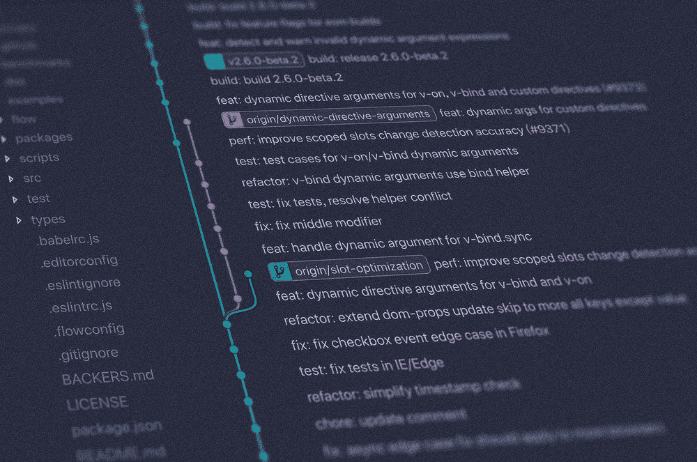

# 如何以及为什么共享科学代码

> 原文：<https://towardsdatascience.com/how-and-why-to-share-scientific-code-64fbd385a67?source=collection_archive---------16----------------------->

## *无需成为软件工程师即可进行可重复研究的简单指南*

来自 [Unsplash](https://unsplash.com/photos/842ofHC6MaI) 。

当你做实验时，无论是在实验室还是在电脑上，你都会产生需要分析的数据。如果您的分析涉及到新的方法、算法或模拟，您可能已经编写了一些代码。科学代码被设计成可以快速编写，易于作者使用，并且在项目完成后再也不会被查看(也许*设计的*是一个很强的词)。

对于许多科学家来说，打包他们的代码需要大量的工作，而且没有报酬。我想分享一些明显的好处和一些不太明显的好处。之后，我会给出一些技巧，告诉你如何尽可能轻松地分享你的代码，而不至于走弯路成为一名软件工程师。如果你想要一个成品看起来像什么的简单例子，请查看我关于 [Python 拓扑材料](https://github.com/ncfrey/pytopomat)或 P [正面和未标记材料机器学习](https://github.com/ncfrey/pumml)的回复。

**分享科学代码的好处**

1.  鼓励[再现性](https://www.nature.com/news/why-scientists-must-share-their-research-code-1.20504)一旦一种方法有多个步骤(单击红色大按钮)，或者数据分析管道比“我们将所有数字除以这个数字”更复杂，其他科学家就不太可能真正探索你做了什么。如果你开发了一套指令来处理或生成你的数据，你就写了一个程序，不管你是否用代码写下来。分享这个程序比只在你的论文中写下你做了什么要自然得多。
2.  期刊越来越多地要求将代码共享作为审核过程的一部分。已经完成的工作打开了许多可能性，像《自然》杂志和《自然》系列杂志，在你的论文准备好提交后不需要额外的工作。
3.  你会学到很多东西。如果你遵循我下面的快速简单的指南，你将学习基本的技能(版本控制)，有机会学习许多其他有用的东西(包管理，测试)，并开发一些在你的研究中其他地方可能不会出现的思维模式(以用户为中心的设计，敏捷开发)。一旦你开始组织你的代码，你甚至会发现你的代码中有一些地方需要修正或改进。
4.  延长你研究的半衰期。你努力完成了一个项目，这个项目将作为一个静态的 PDF 文档在某个地方流芳百世。您的代码允许其他人以一种全新的方式发现您的工作并与之交互。其他科学家不仅可以利用你论文中的观点和结论，他们还可以直接使用你建立的工具和方法。
5.  更有就业能力。教育机构不再是博士的最大雇主。虽然个人代码基础在你寻找教师职位时可能并不重要，但如果你去了私营部门甚至国家实验室，你的雇主和同事会欣赏你的技能和经验。你可以向数据科学家和软件工程师展示和讲述你的研究，他们不是你所在科学领域的专家。

**如何分享代码而不成为软件工程师**

好了，现在你已经决定在你的下一个项目中，分享你编写的脚本来处理和绘制你的数据。你如何在不中断研究的情况下学习一套完全不相关的技能呢？我们的目标是以最小的努力和最大的回报分享我们的代码，而不是开发下一个占主导地位的数据分析或机器学习框架。下面是尽可能轻松地做到这一点的步骤——没有命令行，没有教科书，只有你的网络浏览器。

0.第 0 步是寻求帮助！做好你的功课，阅读这个指南，然后找一个人来回答你的问题。在你的团队或部门中找一个以前做过这件事的人。如果不能，在 [GitHub](https://github.com/) 上找一个你喜欢的项目，或者更好的，你在研究中用过的东西，联系开发者。请那个人对您的计划给出反馈，为您指出进一步的资源，并检查您的代码。

1.从 [GitHub](https://guides.github.com/activities/hello-world/) 开始。按照本[指南](https://guides.github.com/activities/hello-world/)学习版本控制的基础知识。我保证，如果你能用 Python 或者 Matlab 分析数据，你就能学会使用 GitHub。他们的工程团队做了大量的工作，使得开发和共享您的项目变得非常容易。你甚至不需要离开网络浏览器。如果你想要更多的控制，我推荐 [GitHub 桌面](https://desktop.github.com/)。

2.不要多此一举。有[科学 Python 项目](https://github.com/NSLS-II/scientific-python-cookiecutter)、[可复制研究](https://github.com/gchure/reproducible_research)、[撰写出版物](https://github.com/AndrewGYork/publication_template)，甚至制作[web app](https://github.com/danielhomola/science_flask)分享你的科学代码的模板。找到一个你喜欢的模板，你就有 80%的机会完成一个漂亮简单的项目。

3.写一个[设计文档](https://blog.bit.ai/software-design-document/)。不一定要花俏。从高层次描述你的项目——用户应该能用它做什么？弄清楚它将包括什么——一些打算直接运行的脚本、函数、类(如果你懂面向对象编程的话)。

4.使用正确的工具。为了让你的代码 1000%可读，你可以做两个非常简单的事情，一个是使用像 [flake8](https://flake8.pycqa.org/en/latest/) 这样的“linter”来确保你的代码遵循公认的“风格”惯例，另一个是使用像 [yapf](https://github.com/google/yapf) 或 [Python black](https://github.com/psf/black) 这样的格式化程序，它会自动格式化你的代码。

5.组装您的项目。这可能很简单，只需将您的脚本复制到 GitHub 存储库中，然后编辑自述文件来描述如何使用它们。遵循 [Google](https://google.github.io/styleguide/pyguide.html#s3.8-comments-and-docstrings) 或 [Numpy](https://numpydoc.readthedocs.io/en/latest/format.html) 风格指南来记录你的代码。如果你想让别人更容易使用你的代码，写一个简短的 [Jupyter 笔记本](https://jupyter.org/try)或 [Deepnote](https://deepnote.com/) 并附上一些例子。

5+.想加多少“软件工程糖”就加多少。如果你按照[这个模板](https://github.com/NSLS-II/scientific-python-cookiecutter)，你的项目已经组织得相当好了，附带的[指南](https://nsls-ii.github.io/scientific-python-cookiecutter/index.html)将带你完成你能做的许多事情，使你的项目更像“软件”，而不像“我尽快写的一堆乱七八糟的脚本”你可以自动生成一个记录你的项目的[网站](https://nsls-ii.github.io/scientific-python-cookiecutter/writing-docs.html)，添加[持续集成](https://nsls-ii.github.io/scientific-python-cookiecutter/ci.html)在你修改代码的任何时候测试你的代码，并且[发布你的项目的官方版本](https://nsls-ii.github.io/scientific-python-cookiecutter/publishing-releases.html)以方便其他人安装。

不要让完美成为好的敌人

不要让步骤 5+阻止你分享你的代码。如果你共享文档化的代码，你已经为任何试图理解你所做的事情的人提供了巨大的价值。即使你觉得你的分析或者你的方法真的很简单，也值得分享。许多最好的项目都是简单的方法，易于使用和理解。把自己放在一个从未在你的领域工作过的学生的位置上，或者一个从未写过 Python 脚本的科学家的位置上。你花了几个月(或者几年！)在这个项目中，虽然其中一部分可能是“我在 Mathematica 中设置并解决了它”或“我用 Matlab 制作了这些图”，但这可能是那些没有时间弄清楚并重新实现你所做的事情的苦恼的本科生或研究生研究员的路的尽头。

最后，如果你在执行上面的第 0 步时遇到困难，因为你是一个人在做，[联系我](https://ncfrey.github.io/contact/)。我很乐意提供额外的帮助或咨询。

**取得联系**

如果你喜欢这篇文章或者有任何问题，请随时通过[电子邮件](mailto:n.frey@seas.upenn.edu)联系我，或者通过 [LinkedIn](https://www.linkedin.com/in/ncfrey) 和 [Twitter](https://twitter.com/nc_frey) 联系我。

你可以在我的网站上找到更多关于我的项目和出版物的信息，或者阅读更多关于我的 T2 信息。