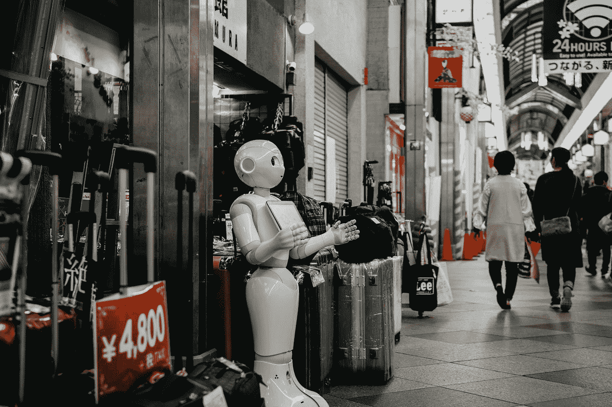

# 这就是世界前五大公司对人工智能的定义。

> 原文：<https://towardsdatascience.com/how-are-the-top-5-companies-in-the-world-redefining-a-i-c009f7e73f5a?source=collection_archive---------38----------------------->

由 [Lukas](https://unsplash.com/@hauntedeyes?utm_source=medium&utm_medium=referral) 在 [Unsplash](https://unsplash.com?utm_source=medium&utm_medium=referral) 拍摄的照片

## 概述世界上最具影响力的公司如何在其业务中重新定义(和应用)人工智能

《T4 大英百科全书》将人工智能定义为“数字计算机或计算机控制的机器人执行通常与智能生物相关的任务的能力”智慧生物是那些能够适应不断变化的环境的生物。

最具前瞻性的公司正在投资人工智能，因为他们已经意识到人工智能在商业中的重要性，以及人工智能将产生的影响，同时随着数字破坏的加剧，人工智能正在成为组织战略的关键组成部分。

我今天在这里分享根据《财富 2020》排名的世界前五大公司的概况，以及这些公司如何利用人工智能来增强业务的一些例子。

照片由 [Unsplash](https://unsplash.com?utm_source=medium&utm_medium=referral) 上的[复杂探索者](https://unsplash.com/@intricateexplorer?utm_source=medium&utm_medium=referral)拍摄

# [沃尔玛](https://fortune.com/company/walmart/fortune500/)

沃尔玛自 20 世纪 60 年代以来一直在经营，但该公司仍在开发变革零售业务和加强客户服务的方法。创新和新零售技术与沃尔玛作为世界第二大在线零售商的成长是一致的。

经过多年对技术和商店的投资，沃尔玛无疑已经成为亚马逊在美国电子商务领域的第二大公司，去年销售额增长了 37%。

全球最大的实体零售连锁店之一沃尔玛(Walmart)正计划将其货架扫描机器人的测试扩展到另外 50 家商店，包括一些来自其故乡阿肯色州的商店。

凭借人工智能摄像头、交互式显示器和大型数据中心，这家商店展示了一个看起来像科幻小说一样的零售未来。

被认为是货架扫描未来的机器将在过道中移动，检查所有因素，包括定价、放错位置的商品和库存水平，以评估商店的库存水平。

这不仅将节省人员自己检查这些琐碎细节的所有困难，而且还意味着他们可以专注于其他更重要的细节。

这些机器需要技术人员在现场处理技术缺陷的情况。尽管如此，机器人目前完全自主执行任务。

这些机器人将使用 3D 成像概念在过道中漫游，避开障碍物，并记录下它们道路上的障碍。

“我们认为这是我们的同事会感到兴奋的事情。该技术旨在改善员工的工作，让他们的工作更有趣，帮助他们减轻一些日常任务。人工智能可以在不断变化的世界中提高他们的技能。迈克·汉拉汉，沃尔玛新的智能零售实验室的首席执行官。

沃尔玛还试图通过使用传感器、计算机视觉技术和机器学习，通过“扫描即走”购物来改善客户体验。

[西蒙·贝克](https://unsplash.com/@simon_bak?utm_source=medium&utm_medium=referral)在 [Unsplash](https://unsplash.com?utm_source=medium&utm_medium=referral) 上的照片

# [亚马逊](https://fortune.com/company/amazon-com/fortune500/)

亚马逊在 2019 年的收入增长了 21%，达到 2810 亿美元，这是西雅图将财富 500 强跃升至第 2 位的原因。

它现在仅排在它最大的竞争对手和世界上最大的零售商沃尔玛之后。

除了人工智能在亚马逊网络服务中的明显相关性之外，让我们专注于在亚马逊作为零售商使用人工智能。

在亚马逊，人工智能和机器学习技术并不局限于单一的业务领域。这项技术在任何地方都有使用，包括支持 Alexa 声控设备套件的团队、 [Amazon Go 商店](https://feedvisor.com/resources/industry-news/what-is-the-amazon-go-app/)和[推荐引擎](https://feedvisor.com/resources/amazon-trends/amazon-expert-briefing-what-powers-purchase-decisions-from-2000-u-s-consumers/)，后者会产生“经常一起购买”或“购买该商品的客户也购买了”的购买建议。

虽然深度学习和人工智能是亚马逊业务的重要组成部分，但交付完全依赖于高效的仓库运营。

亚马逊的人工智能能力为顾客提供建议。根据一份[报告](https://apiumhub.com/tech-blog-barcelona/artificial-intelligence-ecommerce/)，亚马逊的推荐引擎驱动了其总销售额的 35%。

亚马逊不断应用人工智能来更好地理解他们的客户搜索查询和他们搜索的目的。当电子商务公司向客户推荐相关产品时，他们需要知道客户在寻找什么以及为什么。

理解上下文可能有助于零售商向他们的客户推荐额外的商品，亚马逊打算通过应用人工智能来做到这一点

[Justin C](https://unsplash.com/@justincphoto?utm_source=medium&utm_medium=referral) 在 [Unsplash](https://unsplash.com?utm_source=medium&utm_medium=referral) 上拍照

# [埃克森美孚](https://fortune.com/company/exxon-mobil/fortune500/)

在不断削减运营成本的过程中，大型石油公司正在寻求人工智能来帮助实现自动化功能，预测设备问题并增加石油和天然气产量。

美国最大的上市石油公司埃克森美孚在 2019 年面临挑战。首席执行官达伦·伍兹将问题归咎于低油价。该公司收入 143 亿美元，利润同比下降 31%，因为债务水平上升了 24%；与此同时，该公司的投资进入了整个供应链中供应过剩的市场。

埃克森美孚使用先进的数据分析、增强的连接性和最先进的计算技术来改善和革新公司在各个层面的工作方式。

从提高我们炼油厂效率的[物联网(IoT)](https://azure.microsoft.com/en-us/overview/internet-of-things-iot/what-is-the-internet-of-things/) 项目，到帮助[支持生产的最先进的数字工具](https://corporate.exxonmobil.com/News/Newsroom/News-releases/2019/0222_ExxonMobil-to-increase-Permian-profitability-through-digital-partnership-with-Microsoft)和从我们的运营中检测甲烷排放的[项目，埃克森美孚正在利用我们的全球规模将数据转化为推动提高可靠性和性能的独特见解。](https://energyfactor.exxonmobil.com/news/reducing-methane-by-terabytes/)

通过提高我们炼油厂效率的[物联网(IoT)](https://azure.microsoft.com/en-us/overview/internet-of-things-iot/what-is-the-internet-of-things/) 项目，埃克森美孚正在全球范围内将数据转化为独特的见解，使[支持生产](https://corporate.exxonmobil.com/News/Newsroom/News-releases/2019/0222_ExxonMobil-to-increase-Permian-profitability-through-digital-partnership-with-Microsoft)和[检测甲烷排放](https://energyfactor.exxonmobil.com/news/reducing-methane-by-terabytes/)，提供可靠性和性能。

为了帮助应对现代能源挑战，该公司与一些领先的数字组织建立了新的合作，如[微软](https://corporate.exxonmobil.com/News/Newsroom/News-releases/2019/0222_ExxonMobil-to-increase-Permian-profitability-through-digital-partnership-with-Microsoft)、 [IBM](https://corporate.exxonmobil.com/News/Newsroom/News-releases/2019/0108_ExxonMobil-and-IBM-to-Advance-Energy-Sector-Application-of-Quantum-Computing) 和[英特尔](https://www.techrepublic.com/article/exxonmobil-and-intel-collaborate-on-open-industry-standards-technologies/)，作为自动化闭环流程的第一步，人工智能和机器学习被用于允许系统在没有人工干预的情况下识别和响应事件。

例如，启动一个项目，通过使用 IBM 的人工智能来执行地震绘图和额外的构造和历史数据研究，以确定新油气田的潜在收益

由 20 个不同角色组成的整个团队继续与 IBM 数据科学家一起工作，将所有数据整合到一个小型钻井规划练习的良好工作流中。考虑到数据类型可以跨越地理、地质、地球物理、岩石特性和经济分析，这是一个不小的成就。

2019 年，埃克森与微软合作，在德克萨斯州西部的二叠纪盆地实施人工智能计划。此外，这家石油巨头最近实施了一项人工智能计划，从监控全球炼油厂的数百万个传感器中获取洞察力。

micha Kubalczyk 在 [Unsplash](https://unsplash.com?utm_source=medium&utm_medium=referral) 上拍摄的照片

# [苹果](https://fortune.com/company/apple/fortune500/)

去年，苹果的销量和排名双双下滑，跌至第四位。

制造企业创造利润的能力缓冲了下跌。苹果赚了 550 亿美元。

但说到人工智能，苹果在公司投资组合的任何地方都使用它。

有大量使用机器学习的新体验。作为总结，我将谈论语音到文本的翻译，或设备上的听写，甚至关于健康的新功能，如睡眠和洗手。

现代智能手机的摄像头和预测引擎(比如应用程序)利用了许多机器学习。

苹果的照片应用程序可以自动将图片分类到预先制作的图库中，或者在应用程序的搜索栏中输入朋友的名字时，准确地给你朋友的照片。

机器学习有助于苹果开发和实施增强现实功能，在其软件和设备的最新版本中广泛使用了机器学习。

机器学习被用来帮助 iPad 的软件区分用苹果铅笔画画时手掌的意外敲击和故意输入。

人工智能还优化了设备的电池寿命和充电，以改善用户充电之间的时间，保护电池的长期生存能力。用来推荐 app。

每个 iPhone 用户都会立即感知为人工智能的一个东西是 Siri。机器学习有助于语音识别，也有助于 Siri 给出的响应。

在其他情况下，机器学习对大多数用户来说是不可见的。例如，当你按下快门按钮时，iPhone 会抓拍几张照片。ML 训练的算法分析每幅图像，并从图像的最佳部分合成单个结果。

由[杰克·科恩](https://unsplash.com/@jackcohen?utm_source=medium&utm_medium=referral)在 [Unsplash](https://unsplash.com?utm_source=medium&utm_medium=referral) 上拍摄

# [CVS 健康](https://fortune.com/company/cvs-health/fortune500/)

这家连锁药店兼医疗保健巨头在今年的财富 500 强(Fortune 500)中跃升三位，并筹集了 620 亿美元的收入，因为它在 2018 年以 690 亿美元收购了保险巨头安泰(Aetna)。

同年，CVS Health 开始了通过在 Microsoft Azure Databricks 平台上进行机器学习来个性化客户和患者体验的旅程，使第一个机器学习模型在六个月内在一个令人印象深刻的快速市场中推出，使用 Apache Spark 进行了数十亿次交易。

该平台提供了关键的商业价值，包括在动态医疗保健环境中使用机器学习，对 CVS 客户定制内容进行测试和学习实验。

“人工智能在医疗和保险领域的潜力是巨大的。研究表明，人工智能可以在更快更准确地诊断疾病时增强人类的智力。Aetna 使用数据和高级分析来推动早期干预，从而在降低医疗成本的同时保持人们的健康。”—CVS Health 医疗保险留存分析主管 Shiv Misra

当被问及 CSV Health 对未来几年的人工智能技术有什么期待时，Shiv Misra 提到了认知分析的未来。大型数据集可以完美结合，先进的人工智能模型可以让机器大大改善人类生活。

2019 年，CVS 阐述了其数字化转型努力，并概述了四个关键优先事项:

1.  发展卓越的数据和机器人中心
2.  迁移到混合云环境，以降低成本并显著减少构建和部署新功能的时间
3.  简化整个企业中使用的应用程序数量
4.  部署人工智能、自然语言处理和机器人技术来优化呼叫中心运营
5.  高级数据和分析，利用增强的劳动力管理工具来改进调度

CVS 渴望建立一种技术支持的医疗保健体验，将人工智能、虚拟护理服务和连接设备与实体诊所相结合。

CVS Health 建立了一个大规模定制环境，不仅可以根据过去的购物行为提供个性化的营销优惠，还可以提醒患者何时需要补充药物，让他们知道他们的处方何时可以领取，甚至可以帮助患者识别他们可能遇到的任何副作用。

例如，CVS 的[转变糖尿病护理](https://www.marketbeat.com/originals/cvs-health-nyse-cvs-stock-is-an-early-gift-at-these-levels/)计划使用先进的数据分析技术，结合临床、实体和数字资产，合成和分析大量的药房和生物特征数据，为糖尿病患者提供个性化的医疗治疗，其中一半未受控制的糖尿病患者重新获得了控制。

这些体验可以是虚拟医生出诊，使用人工智能聊天机器人，或通过连接设备向医生发送健康数据。

照片由[克里斯多夫·伯恩斯](https://unsplash.com/@christopher__burns?utm_source=medium&utm_medium=referral)在 [Unsplash](https://unsplash.com?utm_source=medium&utm_medium=referral) 拍摄

# 结论

公司越来越依赖人工智能来提高效率和生产力。换句话说，人工智能已经对这个行业产生了影响。

技术对社会的影响不容忽视。根据普华永道的数据，到 2030 年，投资人工智能(A.I .)的公司可以为全球经济注入约 15.7 万亿美元。约 6.6 万亿美元反映了与服务完全自动化相关的生产率提高。

一旦公司看到人工智能变化的后果，他们将更好地获得利益，也许还能处理问题。你准备好了吗？你已经在研究人工智能了吗？

照片由[思想目录](https://unsplash.com/@thoughtcatalog?utm_source=medium&utm_medium=referral)在 [Unsplash](https://unsplash.com?utm_source=medium&utm_medium=referral) 上拍摄

# 阅读更多相关信息和参考资料。

1.  人工智能|定义、例子和…[https://www . Britannica . com/technology/人工智能](https://www.britannica.com/technology/artificial-intelligence)
2.  沃尔玛(WMT)公司简介，新闻，排名…[https://fortune.com/company/walmart/](https://fortune.com/company/walmart/)
3.  财富 500 强—[https://fortune.com/fortune500/](https://fortune.com/fortune500/)
4.  沃尔玛新的智能零售实验室展示了对零售未来的一瞥，IRL—[https://corporate . Walmart . com/news room/2019/04/25/walmarts-New-Intelligent-Retail-Lab-Shows—一瞥未来的零售 irl](https://corporate.walmart.com/newsroom/2019/04/25/walmarts-new-intelligent-retail-lab-shows-a-glimpse-into-the-future-of-retail-irl)
5.  大盒子零售中的机器学习。[https://emerj . com/ai-sector-overviews/机器学习-big-box-retail/](https://emerj.com/ai-sector-overviews/machine-learning-big-box-retail/)
6.  亚马逊如何利用人工智能优化交付—[https://feed visor . com/resources/Amazon-shipping-FBA/how-Amazon-Leverages-Artificial-Intelligence-to-Optimize-Delivery/](https://feedvisor.com/resources/amazon-shipping-fba/how-amazon-leverages-artificial-intelligence-to-optimize-delivery/)
7.  亚马逊如何使用人工智能来更好地理解客户搜索查询—[https://analyticsindiamag . com/how-Amazon-Is-use-ai-Better-Understand-Customer-Search-Queries/](https://analyticsindiamag.com/how-amazon-is-using-ai-to-better-understand-customer-search-queries/)
8.  应用数字技术推动能源创新—[https://corporate . Exxon Mobil . com/Energy-and-innovation/Digital-technologies](https://corporate.exxonmobil.com/Energy-and-innovation/Digital-technologies)
9.  提取埃克森美孚人工智能的命脉—[https://www . IBM . com/blogs/journey-to-ai/2019/09/extracting-the-havine-of-ai-at-Exxon Mobil/](https://www.ibm.com/blogs/journey-to-ai/2019/09/extracting-the-lifeblood-of-ai-at-exxonmobil/)
10.  石油和天然气公司转向人工智能以削减成本—[https://www . wsj . com/articles/oil-and-Gas-Companies-Turn-to-ai-to-Cut-Costs-11571018460](https://www.wsj.com/articles/oil-and-gas-companies-turn-to-ai-to-cut-costs-11571018460)
11.  苹果几乎在所有事情上都使用机器学习，隐私优先的方法实际上更好—[https://9 to 5 MAC . com/2020/08/06/apple-using-machine-learning/](https://9to5mac.com/2020/08/06/apple-using-machine-learning/)
12.  这就是为什么苹果认为自己是人工智能的领导者——也是为什么它说批评者完全错了——[https://ars technica . com/gadgets/2020/08/Apple-explains-how-it-uses-macos-learning-cross-IOs and-soon-MAC OS/](https://arstechnica.com/gadgets/2020/08/apple-explains-how-it-uses-machine-learning-across-ios-and-soon-macos/)
13.  人工智能、医疗保险和数据协调:采访 Shiv Misra，CVS Health—[https://www . Forbes . com/sites/cognitive world/2020/10/24/ai-Health-Insurance-And-Data-Harmonization-Interview-With-Shiv-Misra-CVS-Health/？sh=19986c7526d3](https://www.forbes.com/sites/cognitiveworld/2020/10/24/ai-health-insurance-and-data-harmonization-interview-with-shiv-misra-cvs-health/?sh=19986c7526d3)
14.  CVS Health exec:零售巨头希望创造类似网飞的医疗保健体验—[https://www . fierce Health care . com/tech/CVS-Health-s-digital-executive-we-want-to-create-a-Health-experience-as-easy-use—和](https://www.fiercehealthcare.com/tech/cvs-health-s-digital-executive-we-want-to-create-a-healthcare-experience-as-easy-to-use-and)
15.  Azure 和 Databricks 如何为 CVS Health 的客户和患者提供个性化体验—[https://data bricks . com/session _ na20/how-Azure-and-data bricks-Enabled-a-Personalized-Experience-for-Customers-and-Patients-at-CVS-Health](https://databricks.com/session_na20/how-azure-and-databricks-enabled-a-personalized-experience-for-customers-and-patients-at-cvs-health)
16.  在大流行和混乱的时代，CVS Health 会成为医疗保健的网飞吗？—[https://www . aidata analytics . network/data-monetization/articles/is-CVS-health-being-of-care-in-age-of-pandemics-and-disruption](https://www.aidataanalytics.network/data-monetization/articles/is-cvs-health-becoming-the-netflix-of-healthcare-in-the-age-of-pandemics-and-disruption)
17.  普华永道全球人工智能研究:利用人工智能革命—[https://www . PwC . com/GX/en/issues/data-and-analytics/publications/Artificial-Intelligence-Study . html](https://www.pwc.com/gx/en/issues/data-and-analytics/publications/artificial-intelligence-study.html)

# 还有一件事…

如果你想在学习之旅中走得更远，我为你准备了一份令人惊叹的清单，其中包含 60 多门关于人工智能、机器学习、深度学习和数据科学的培训课程，你现在就可以免费参加:

*   [**什么是预测分析，你今天如何使用它？**](/what-is-predictive-analytics-dc6db9759936)
*   [**今天学习 AI、ML、数据科学的最佳免费课程。**](https://jairribeiro.medium.com/my-favorite-free-or-free-to-audit-courses-to-learn-ai-ml-and-data-science-f15f614a84e5)
*   [**60 多门课程，有评分，有总结(当然是 AI 做的)。**](https://jairribeiro.medium.com/my-favorite-free-or-free-to-audit-courses-to-learn-ai-ml-and-data-science-f15f614a84e5)
*   [**是不是我们所知道的作品的终结？**](https://medium.com/predict/is-it-the-end-of-the-work-as-we-know-it-bf2f9a64e89a)[**世界经济论坛《2020 年的就业前景》报告简析**](https://medium.com/predict/is-it-the-end-of-the-work-as-we-know-it-bf2f9a64e89a)

如果你想继续发现新的资源并了解人工智能，在我的电子书(下方的[链接)中，我正在分享关于人工智能、机器学习、深度学习、数据科学、商业智能、分析和其他方面的最佳文章、网站和免费在线培训课程，以帮助你开始学习和发展职业生涯。](https://www.amazon.com/dp/B08WJ59G2V)

> [***学习 AI 在线:200 多个资源在线开始学习 AI***](https://www.amazon.com/dp/B08WJ59G2V)

此外，我刚刚在亚马逊上发布了其他有趣的[电子书，我相信其中一些可能会让你感兴趣……让我们保持联系，关注我，让我们一起做吧。](https://www.amazon.com/dp/B08RSJRNSN/)

*   [**人工智能、机器人技术和编码(给父母):模拟父母和数字孩子的实用指南**](https://www.amazon.com/gp/product/B08SLGQR5C/)
*   [**终结者悖论:神经科学如何帮助我们理解移情和对人工智能的恐惧**](https://www.amazon.com/gp/product/B08STRHZ46)
*   [**人工智能从 A 到 Z:揭秘 AI 的本质概念**](https://www.amazon.com/gp/product/B08WZ3VDHB)
*   [**A . I . 2020 年:写关于人工智能的一年**](https://www.amazon.com/gp/product/B08RSJRNSN)

# 订阅我的每周时事通讯，保持更新

如果你对人工智能、机器学习、数据科学和自动驾驶汽车的话题感兴趣，以及这些创新将如何扰乱世界各地的每一个企业，这份时事通讯肯定会让你保持更新。

# 点击下面的链接订阅人工智能新闻！

> 