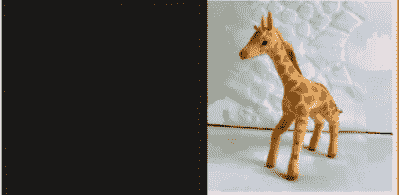

# 人工智能如何不分白天黑夜地学习

> 原文：<https://towardsdatascience.com/how-artificial-intelligence-learns-regardless-of-day-or-night-e9badcc1b649?source=collection_archive---------35----------------------->

## 领域适应的解释

[附身摄影](https://unsplash.com/@possessedphotography?utm_source=medium&utm_medium=referral)在 [Unsplash](https://unsplash.com?utm_source=medium&utm_medium=referral) 上拍照

你有没有想过，当你只在明亮的白天见过某样东西时，你怎么能在晚上认出它？当有大量的雾或蒸汽存在时，我们如何看到和识别事物？当然，其中一些是上下文相关的，但我们的大脑也知道如何适应不断变化的条件。当我们需要相机同样智能时，挑战就来了。

这就是人工智能之神给我们领域适配的地方。它做到了它所说的:它帮助理解一个域(白天)在另一个域(夜晚)的数据。

让我们把自己的电脑当成一个透过摄像头看的孩子。但这个孩子只在明亮的日光下见过世面。所以现在它能识别一天中所有的玩具。但在一个晴朗的夜晚，它希望惹恼父母，玩而不是睡觉。他有生以来第一次在黑暗中看到自己的玩具。这个孩子如何找到他最喜欢的长颈鹿呢？这是我将教孩子适应他的领域的地方…

首先，我教孩子识别他所看到的一切事物中对背景不变的特征。所以现在它知道长颈鹿有长长的脖子和遍布全身的深褐色斑点。所以在月光下，这个孩子实际上可以找到它的长颈鹿。

“玩具长颈鹿”由 M.P.N .德克萨斯人[授权](https://creativecommons.org/licenses/by-nc/2.0/)

但是现在它喜欢晚上吃糖果(我知道…淘气的孩子)。它找到了装糖果的盒子，想要找到星形的糖果。然后，他想起了我教他的话:当试图挑选一颗星形糖果时，颜色是没有用的。所以他开始数糖果的角和边，以了解它的形状。从此以后，这个小孩和他最喜欢的糖果快乐地生活在一起！

抛开类比，我的意思是说，我有一段代码，可以在白天准确的检测到物体。但我也希望这段代码能适用于夜晚的图像。现在我有许多这些物体在夜间的图像，但它们没有被标记。这就是领域自适应的用武之地，它有助于使用白天的知识来应用于夜晚的数据库。这有助于我们训练代码，而不必再次经历给每个图像加标签的繁琐过程。

为了完全利用上帝给我们的东西，如果该算法在不同的域中获得相似的标记数据，它可以潜在地用于标记这个世界上存在的所有类型的数据。这对于图像分类来说很棒，虽然对于物体检测来说很棘手，但是[这里](https://medium.com/@AnveeNaik/understanding-domain-adaptation-5baa723ac71f)我们已经详细解释过了。

另一个有趣的应用是在医学领域，分割图像并从中发现肿瘤。这个特定的子领域被称为跨模态无监督域适应。当我们有一个肺部肿瘤的标记数据库时，它会有所帮助，但我们希望使用这些结果来分割心脏图像并检查肿瘤。这尤其有用，因为标记医学图像是一项非常繁琐、耗时且昂贵的任务，只能由专业人员来完成。

领域适配也可以用在很多领域，即使不涉及相机。请继续关注我们的频道，了解更多信息！

*成为* [*介质会员*](https://medium.com/@AnveeNaik/membership) *解锁并阅读介质上的许多其他故事。关注我们的*[*Medium*](https://medium.com/@AnveeNaik)*阅读更多此类博文*。