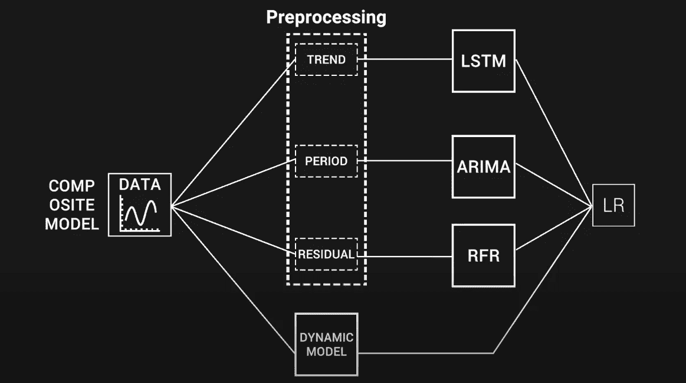
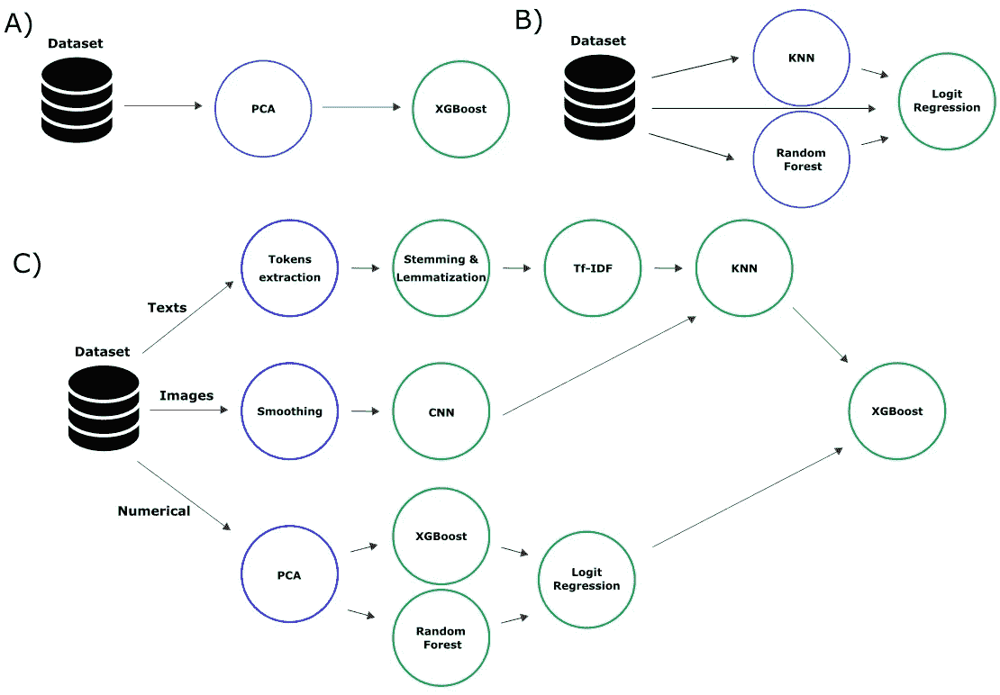
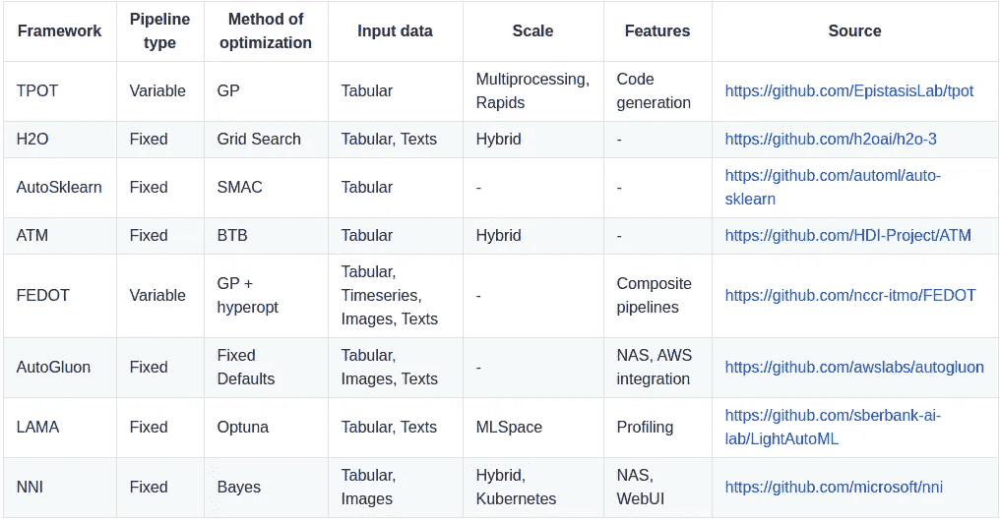
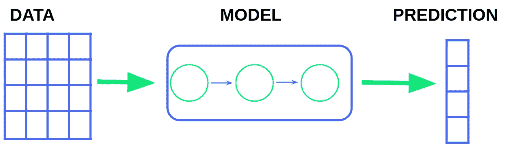
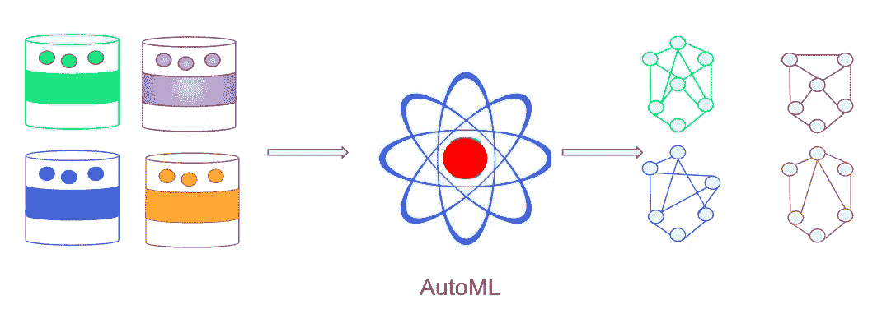

# AutoML 如何帮助创建复合人工智能？

> 原文：<https://towardsdatascience.com/how-automl-helps-to-create-composite-ai-f09e05287563?source=collection_archive---------12----------------------->

## [思想和理论](https://towardsdatascience.com/tagged/thoughts-and-theory)

## AutoML 的主要趋势和挑战，复合人工智能实现背后的思想，以及开源框架 FEDOT。



代表复合人工智能模型的管道(作者的*图片)*

如今，自动机器学习(AutoML)、复合人工智能(AI)和结构学习是非常流行和广泛讨论的概念。自动化、多模态和可控性的思想为改进现有的数据驱动建模方法提供了一个有希望的方向。在本文中，我们将讨论 AutoML 的主要趋势和挑战，复合人工智能实现背后的主要思想，以及复合管道结构学习的开源框架— [FEDOT](https://github.com/nccr-itmo/FEDOT) 继承了这些思想。

**一点理论和一些关于 AutoML 框架的话**

通常，数据科学家必须执行许多步骤来使用机器学习(ML)技术获得现实世界问题的解决方案:数据清理和数据集准备，选择最具信息性的特征，转换特征空间，选择 ML 模型并调整其超参数。这个序列通常被表示为 ML 流水线。



不同类型的 ML 管道(*图片作者*)

然而，即使是简单的线性管道(上图中的 A)的手动处理以及其结构和参数的选择也需要数据科学家花费数天甚至数周的时间。对于复杂的任务，管道结构可能会变得更加复杂——如上图中的情况 B 和 C 所示。案例 B 显示了采用集成方法(叠加)组合多个模型的分支管道；案例 C 显示了连接初始数据集不同部分的不同预处理方法和模型的分支管道。

实际上，使用多个 ML 模型的管道可以被视为整个复合模型，因为从计算的角度来看，它们之间没有太多的差异。因此,( B)和(с)中的管道结构实际上变成了复合的，因为它们结合了不同的 ML 算法。例如，可以将 NLP 模型和卷积网络相结合，以使用多模态数据来获得预测。可以使用 AutoML 方法和技术来处理复合模型和 ML 管道。

**自动化流水线创建**主要是一个组合优化问题，旨在寻找可能构建模块的最佳组合。为了方便起见，流水线可以描述为有向无环图(DAG ),它可以很容易地转换成计算图。优化的效率由目标函数决定，该目标函数允许估计最终管线的质量、复杂性、鲁棒性和其他属性。

解决优化任务的最直接的方法是随机搜索适当的块组合。但是更好的选择是元启发式优化算法:群体和进化(遗传)算法。但在进化算法的情况下，人们应该记住，它们应该有专门设计的交叉、变异和选择算子。这种特殊操作符对于处理由 DAG 描述的个体是重要的，它们还提供了考虑多个目标函数的可能性，并且包括创建稳定流水线和避免过度复制的附加过程。

交叉算子可以使用子树交叉方案来实现。在这种情况下，选择两个亲代个体并交换他们图形的随机部分。但这不是唯一可能的实现方式，可能有更复杂的语义变体(例如，单点交叉)。变异算子的实现可以包括图的随机节点中模型(或计算块)的随机改变、随机节点的移除或子树的随机添加。


管道的遗传操作符的不同实现(作者的*图片，t* his 和其他插图可在我们在 Procedia Computer Science 的[论文](https://www.sciencedirect.com/science/article/pii/S1877050920324224)中找到。)

在理想的情况下，AutoML 应该给我们一个机会，从构建 ML 解决方案的整个过程中排除一个人。然而，很难完全实现这一点，因为大多数 AutoML 框架支持独立步骤的自动化(超参数调优、特性选择等)。)用于固定管道，并且仅用于特定类型的数据。下表列出了几种最先进的管道 AutoML 框架及其特性。当然，这种比较并不完全——它是基于对公开文档和示例的分析。然而，AutoML 的状态可能会迅速改变。



最先进的 AutoML 框架的主要特性(*图片由作者*提供)

可以看出，尽管有各种各样的完善的解决方案，但是现有的解决方案都是针对相对狭窄的任务或使用方式。例如，TPOT 框架仅为表格数据自动创建分类(包括多类分类)和回归模型，获得的管道的结构通常由两个级别之一组成。自动增长非常灵活，但它主要基于预定义的管道。还有许多特定于任务的 AutoML 框架——例如，AutoTS 框架只能用于时间序列预测。

然而，可以看出，缺乏用于自动建模的更复杂和多用途的方法，该方法可以适用于不同的任务和数据类型，而无需对核心算法进行复杂的修改。这个问题把我们带到了下一个问题——情况有可能改善吗？

**缺少什么，我们想提出什么**

典型的 AutoML 应用场景如下:AutoML 框架使用可用的数据集来优化流水线的结构和其中包含的块的超参数。然而，在实践中，适用于基准测试问题的实现在“真实世界”的数据集上并不那么好。因此，越来越多的新的 AutoML 解决方案出现，如 H2O，AutoGluon，LAMA，NNI，等等。它们在功能上有所不同(例如，工业解决方案具有先进的基础设施功能)，但通常不适合大范围的建模任务。虽然大多数框架允许解决分类和回归问题，但它们通常不支持时间序列预测。



常见汽车案例(*图片作者*

ML 管道可以包含不同任务的模型。例如，基于回归生成一个新的有用的特征，然后在分类中使用它是很有用的。目前，AutoML 框架不允许以方便的方式解决这样的任务。然而，对于 ML 工程师来说，面对多模态和异构的数据并不罕见，这些数据必须被集成以进行进一步的建模。

直到最近，还没有具备这一系列特性的现成工具。在 ITMO 大学的[自然系统模拟实验室](https://itmo-nss-team.github.io/)，我们研究和开发汽车领域的先进解决方案。因此，我们决定开发自己的解决方案，避免上述问题。我们称之为 FEDOT。它是一个开源框架，可以自动创建和优化 ML 管道及其元素。FEDOT 使得以紧凑和高效的方式解决各种数据驱动的建模问题成为可能。


多模态 AutoML case ( *图片作者*)

下面是一个基于 FEDOT 的分类问题解决方案的示例(用 Python 编写):

```
**# new instance to be used as AutoML tool with time limit equal to 10 minutes****auto_model = Fedot(problem='classification', learning_time=10)****#run of the AutoML-based model generation****pipeline = auto_model.fit(features=train_data_path, target='target')****prediction = auto_model.predict(features=test_data_path)****auto_metrics = auto_model.get_metrics()**
```

该框架的主要焦点是管理管道的计算块之间的交互。Tho 流水线设计从结构学习阶段开始——FEDOT 结合几个 ML 模型来实现更好的目标函数值。在该框架中，我们以有向图的形式描述复合模型，该有向图定义了预处理和建模块之间的关系。节点用 ML 模型表示，数据预处理和转换操作也用 ML 模型表示。该图的结构以及每个节点的参数都可以优化。

适用于特定任务的结构是自动设计的。为此，我们使用了进化优化算法 GPComp，它创建了几个 ML 管道的群体，并通过应用进化方法(变异和交叉)来搜索最佳解决方案。为了避免不希望的过度复杂的管道结构，我们应用了正则化过程和多目标方法。

以下是阐释这一概念的框架的预告片:

FEDOT 简介(*视频作者*)

FEDOT 是用 Python 实现的，可以在 BSD-3 开放许可证下获得。有几个关键特征:

*   FEDOT 架构高度灵活；该框架可用于自动创建不同任务(分类、回归、预测)、数据类型(表格、时间序列、文本、图像)和模型的 ML 解决方案；
*   FEDOT 支持流行的 ML 库(sci-kit-learn、Keras、statsmodels 等。)，但也允许在需要时集成其他工具；
*   管道优化算法不受数据类型或任务的限制。然而，特定任务类或数据类型(时间序列预测、NLP、表格数据等)的专用模板。)都可以用；
*   该框架不限于机器学习。特定于域的模型也可以被构建到流水线中(例如，ODE 或 PDE 中的模型)；
*   除了已经支持的方法之外，超参数调整的定制方法也可以集成到 FEDOT 中；
*   FEDOT 支持任何时间的操作模式(在任何时间点，可以停止算法并获得结果)；
*   最终管道可以以 JSON 格式导出，以实现实验的可重复性。

因此，与其他框架相比，FEDOT 不局限于一类问题，而是声称具有通用性和可扩展性。它允许您使用不同性质的输入数据来构建模型。此外， [this](https://news.itmo.ru/en/university_live/achievements/news/10409/) news 中描述了 FEDOT 申请黑客马拉松比赛的前景。

**汽车前景**

在 AutoML 解决方案中(除了上面列出的工具之外),还有 EvalML、TransmogrifAI、Lale 和许多其他解决方案。都是大型企业 IT 公司开发的。在某些情况下，框架的主要焦点是技术特性，比如对可伸缩性和分布式计算的支持，或者与 Kubernetes 和 MLOps 工具的集成。在其他情况下，它是关于概念问题，如新的优化算法或它们的可解释性。然而，有几个领域和前景的发展，汽车是较少涵盖的社区。

**灵活控制搜索复杂度**

根据要求和允许的预算，ML 工程师可以选择不同的模型:具有优化超参数的单一梯度增强模型、深度神经网络或结合几种建模方法的非线性管道。在这两种情况下，他将被迫发现可用的 AutoML 框架的可能性，并进行实验研究，以找出什么工作得更好或更差。但是，具有连续搜索复杂度的所谓“开关”将是非常方便的，利用该开关，可以将搜索空间的维度从简单的解决方案调整到复杂但有效的流水线。

**模型工厂**

除了质量度量的允许值之外，在 ML 任务中还可能出现其他的决策标准。例如，可解释性、在生产环境中维护所需的计算资源和内存量、预测的超前性等等。这将是一个有用的界面，用于指定可以考虑的几个目标。在某些情况下，不可能同时最小化所有标准，因为存在决策的帕累托前沿。例如，随着神经网络体系结构的复杂性增加，精确度增加，但也需要更多的计算资源。

我们的团队[进行了](https://arxiv.org/abs/2103.01301)实验研究，我们试图在 FEDOT 内应用进化多目标优化算法来优化机器学习管道。我们不仅选择精度，还选择管线的复杂性(节点数量和计算图深度)作为优化标准。在实验过程中，我们发现将 Pareto-front 解决方案整合到搜索过程中增加了群体的多样性，并且还允许我们找到具有更高准确性的解决方案。

DataRobot 公司的塞维多夫·古斯在他的报告《自动化机器学习》中表达了 AutoML 模型工厂的想法。他用 OOP 模式工厂做了一个类比，在 OOP 模式工厂中，AutoML 可以根据给定的条件向用户提供不同的解决方案:数据集的类型、预测间隔、模型的生命周期等。

可以为不同的数据集导出模型:随机样本、时间范围内的数据。还可以基于当前数据切片获得“短期”模型。



AutoML 作为模型工厂(*图片作者*

总的来说，自动机器学习是一个很有前途的领域。如果你在数据科学领域工作，关注汽车世界的新闻是很有价值的。我们选择了几个来源进行深入研究:

*   [FEDOT 仓库](https://github.com/nccr-itmo/FEDOT)
*   [框架 web 接口的存储库](https://github.com/nccr-itmo/FEDOT.WEB)—FEDOT。网
*   [包含 AutoML 教程的 YouTube 频道](https://www.youtube.com/channel/UC4K9QWaEUpT_p3R4FeDp5jA)
*   [一套开源的 AutoML 工具](https://awesomeopensource.com/projects/automl)
*   [一套针对 AutoML 的性能指标评测](https://github.com/openml/automlbenchmark)

作者:尼古拉·尼基丁，安娜·卡柳那亚，帕维尔·维楚查宁