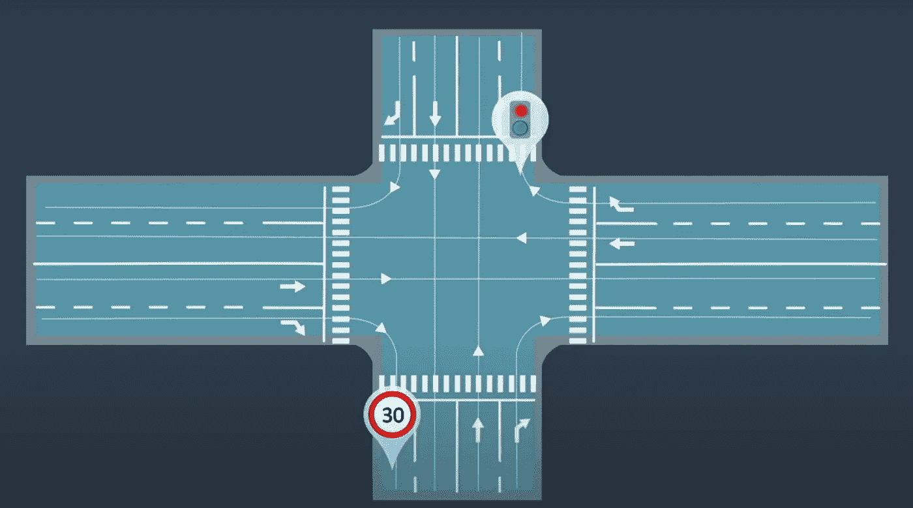
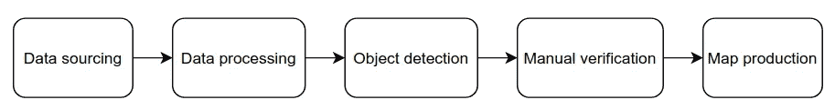
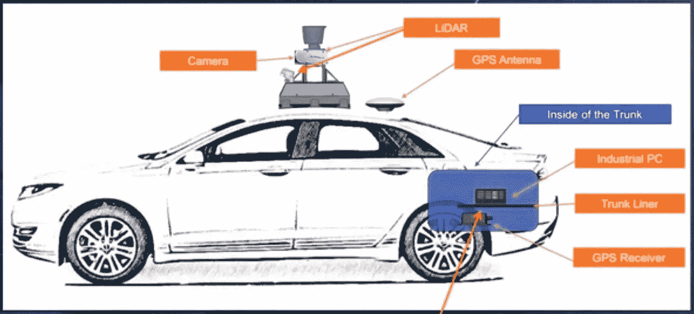

# 百度 Apollo 如何为自动驾驶汽车构建高清地图

> 原文：<https://towardsdatascience.com/how-baidu-apollo-builds-hd-high-definition-maps-for-autonomous-vehicles-167af3a3fea3?source=collection_archive---------17----------------------->

## 5 步构建流程，高清地图元素，OpenDRIVE 格式

高清地图(HD map)是自动驾驶中使用的高度精确的地图。高清地图在包括感知、模拟、定位和路径规划在内的自动驾驶模块中发挥着重要作用。作为地图制作者，百度 Apollo 是中国领先的自动驾驶平台。在这篇博客中，我们将介绍百度 Apollo 如何为自动驾驶构建高清地图。

高清地图[1]

1.  **百度 Apollo 是什么？**

百度 Apollo 是一个自动驾驶的开放平台。代码可以在 [github](https://github.com/apolloauto) 上公开获得。最初在 2017 年公布，从 v1.0，v1.5，v2.0，…，一直迭代到今天的 v6.0。作为一个完整的自动驾驶平台，它包含以下模块:

*   [**精准感知**](https://apollo.auto/platform/perception.html) :利用激光雷达、雷达、摄像头探测障碍物和红绿灯。
*   [**模拟**](https://apollo.auto/platform/simulation.html) :用真实世界交通和自动驾驶数据虚拟驾驶数百万公里。
*   **高清地图**:将传感器和深度学习应用于地图制作。
*   **定位**:利用包括 GPS、IMU、高清地图和各种传感器输入在内的全面解决方案，实现厘米级精度。
*   **规划**:适应实时交通状况，产生既安全又舒适的精确轨迹。
*   **智能控制**:处理不同路况、速度、车型和 canbus 协议，控制精度约 10 cm。
*   [**阿波罗数据集**](https://apollo.auto/southbay.html) :包含时间戳激光雷达扫描、相机图像和后处理 GPS 轨迹。

**2。百度 Apollo 如何搭建高清地图？**

**2.1 构建流程**

阿波罗通过 5 个步骤构建高清地图。

阿波罗高清地图的构建过程(图片由作者提供)

**数据来源:**百度 Apollo 有一支勘测车队行驶在道路上。调查车使用不同的传感器，包括激光雷达、GPS、IMU、天线和相机来收集数据。阿波罗定义了一个硬件框架，将这些传感器集成到一个单一的自治系统中。调查车以正常速度(~60 km/h)行驶在道路上。

百度阿波罗 Survery 汽车(图片来源[2])

**数据处理**:采集的数据包括点云数据和图像数据。Apollo 对收集到的数据进行整理、分类、清洗，得到一个没有语义信息和标注的初始地图模板。

**物体检测** : Apollo 将深度学习和计算机视觉技术应用于点云和图像，例如，点云分割和分类，以及交通标志/灯、车道线/标志和电线杆的物体检测。

**手动验证**:该步骤是手动纠正之前自动过程中出现的错误标注。例如，车道标志、车道边界、交通灯/标志可能在之前的步骤中被错误地检测到。此外，一些逻辑关系需要手动识别。例如，在交叉路口，可能有多个交通灯。每条车道都需要与正确的交通灯手动关联。

**地图制作**:高清地图准备在这一步发布。除了高清地图，Apollo 还发布了相应的俯视图本地化地图、3D 点云地图、路径规划地图、仿真地图。

由于施工、交通事故等原因，道路状况每天都在发生变化。因此，地图发布后需要经常更新。Apollo 使用众包和云技术来实现它。**首先**，Apollo 按照上面的 5 个步骤，由测量船队建立一个所谓的“底图”。**然后**，Apollo 向公众发布其数据源工具，让公众可以参与高清地图的制作任务。**第三个**，关于道路的更新通过智能手机、普通汽车中的车载智能设备、智能互联汽车，甚至智能自主汽车，传回云端的阿波罗地图制作平台。

**阿波罗地图中的 2.2 元素**

**道路要素**:道路边界、车道左右边界、车道限速、车道类型、车道拓扑、车道线型、车道方向信息、车道转向类型、车道长度

**交叉口要素**:交叉口边界、交叉口虚拟车道

**交通信号要素**:交通灯、其他道路标志

**逻辑关系元素**:映射逻辑关系

**其他元素**:人行横道、禁止停车区、停止线、路面箭头、路面文字、围栏、路灯、龙门架、建筑物、减速带

**2.3 阿波罗 OpenDRIVE 地图格式**

OpenDRIVE 代表车辆环境的开放式动态道路信息。这是一种为描述道路网络提供通用语法的格式，文件扩展名为 xodr 或 xodrz。它将逻辑道路描述标准化，以促进开发和验证 adAS 和 AD 功能的不同驾驶模拟器之间的数据交换。

百度 Apollo 用的是 OpenDRIVE 格式的修改版。区别如下。

*   Apollo OpenDRIVE 使用纬度经度点的简单列表来定义道路边界，而在标准 OpenDRIVE 中，道路边界是使用五种不同类型的函数通过参考线和偏差来定义的。
*   阿波罗 OpenDRIVE 扩展了元素，包括禁止停车区、人行横道和减速区。
*   Apollo OpenDRIVE 增加了车道中心线到道路边界的距离，以及车道和红绿灯之间的逻辑关系。
*   车道:标准的 OpenDRIVE 只允许指定车道的宽度。然而，Apollo OpenDRIVE 需要点来描述车道边界。此外，Apollo OpenDRIVE 需要每个车道的中心点和道路的边界。
*   交叉点:Apollo OpenDRIVE 使用交叉点的简化版本，忽略了交叉点组、交叉点优先级和交叉点控制器等概念。
*   对象和信号:Apollo OpenDRIVE 使用数量减少的属性，并且只支持有限数量的对象类型。

**2.4 坐标系**

百度 Apollo 使用两种坐标系:通用横轴墨卡托(UTM)系统和世界大地测量系统(WGS84)。

UTM 是一种地图投影系统，用于指定地球表面位置的坐标。它把地球分成 60 个区域，每个区域的宽度为 6 经度。要引用一个位置，您需要一个 *x* 和 *y* 坐标以及它们所在的区域。

WGS 是用于制图、大地测量和卫星导航(包括 GPS)的标准。WGS84 的坐标原点应该位于地球的质心。它基于描述地球大小、形状、重力和地磁场的一组一致的常数和模型参数。

**参考文献:**

【1】uda city 免费课程:[自动驾驶汽车基础:特色阿波罗](https://classroom.udacity.com/courses/ud0419)

【2】[百度阿波罗免费课程](https://www.bilibili.com/video/BV1wq4y1W7mZ?spm_id_from=333.999.0.0)

[3][https://apollo.auto/developer.html](https://apollo.auto/developer.html)

[4] [硕士论文:自动驾驶中的高清地图](https://www.ntnu.edu/documents/1284037699/1285579906/Gran-ChristofferWilhelm_2019_Master_NAP_HDMaps.pdf/79ef2eec-c9e2-454b-bf14-08d585cf8826)

[5] [将自动驾驶商业化](https://on-demand.gputechconf.com/gtc/2018/presentation/s8902-the-latest-of-project-apollo-and-centralized-in-car-computing-platform-for-autonomous-driving.pdf)