# 贝叶斯统计如何说服我多睡觉

> 原文：<https://towardsdatascience.com/how-bayesian-statistics-convinced-me-to-sleep-more-f75957781f8b?source=collection_archive---------14----------------------->

照片由 [Cris Saur](https://unsplash.com/@crisaur?utm_source=medium&utm_medium=referral) 在 [Unsplash](https://unsplash.com?utm_source=medium&utm_medium=referral) 上拍摄

## Python 中的贝叶斯线性回归来量化我的睡眠时间

这些年来，我听到我的许多朋友评论——你曾经睡觉吗？嗯，我不会怪他们。通常，我是第一个起床的人，即使是在深夜，尽管随着时间的推移，这种情况已经发生了变化。在我 20 岁出头的时候，我通常睡 5 到 5.5 个小时(我们会看一场深夜电影，凌晨 2 点到家，8 点到达办公室，然后开始工作)，但现在是 6 到 6.5 个小时。当然，有时候我会在床上躺更长时间，因为随着年龄的增长，精力会逐渐消失。用钱德勒·宾的话说，“我想坐在舒适的椅子上，在合理的时间上床睡觉。”

资料来源:Giphy.com

在 2020 年，我试图跟踪我生活中的一些事情，如我房间里一天中最安静的时间，应用程序显示的空气质量指数，每天的耗电量等。**我追踪的一个变量是我睡了多少小时以及之后我感觉有多累。**动力来自 [Kaggle 研究](https://www.kaggle.com/mlomuscio/sleepstudypilot)，我补充了我的观察。我并不勤奋，但是每当我记起的时候，我都会把我的数据添加到现有的研究中。

本质上有两个感兴趣的变量:

1.  我睡觉的小时数(小时)
2.  醒来后我感觉有多累(满分 5 分，1 分最不累，5 分最累)

# **背景**

虽然我已经毕业，每天睡 6 到 6.5 个小时，但我的能量水平每天都在变化；有几天精力充沛，但其他时间有点沮丧。鉴于这种状态，我有两个问题要问自己:

1.  我应该增加睡眠时间吗？
2.  我是否正确地估计了我的能量水平，即我过去睡 5 个小时感觉很好，现在当我睡 6 个小时时，我的估计偏向于较低的疲劳度？

> 假设:6.5 小时的睡眠对我来说足够了，因为我估计我的疲劳程度在大多数时候是 2 级。

该调查了！洛斯盖兹！

**免责声明**:我不认为我理解贝叶斯分析的每一个方面，但我想通过这篇文章将我的想法具体化，因此，我将尽可能地避开数学(只有方程)和代码，并尝试用一种我可能受益的语言来解释它。

我没有在文章中包含代码，但是数据和其他文件可以在 [GitHub repo](https://github.com/Prashantmdgl9/Bayesian_linear_regression) 上找到。

**假设**:请注意，所有其他外部因素，如锻炼、含咖啡因的饮料等都被假设为无效。这项研究的假设是睡眠时间和疲劳程度之间有直接联系。

# 为贝叶斯过程建立直觉

首先，我们为贝叶斯分析建立一个直觉。我相信你可能曾经被卷入频繁主义和贝叶斯主义的争论中。有很多文献可以解释这两种统计推断方法之间的区别。

简而言之， ***频数主义*** 是从数据中学习的常用方法，用 p 值来衡量变量的显著性。频率主义方法是关于点估计的。如果我的线性方程是:

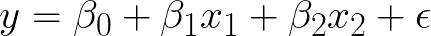

y 是响应变量，x₁、x₂是自变量。β₁和β₂是需要估计的系数。β₀是截距项；如果 x₁改变 1 个单位，那么 y 将受到β₁单位的影响，例如，如果 x₁是 1，β₁是 2，那么 y 将受到 2 个单位的影响。常见的线性材料。这里需要注意的是，回归方程基于最小化误差平方和(最佳拟合线)来估计各种β的值，这最好地解释了手头的数据，并且估计值是奇点，即β₀、β₁和β₂各有一个值，依此类推。β的估计值被称为β的**最大似然估计值**，因为它是给定输入 x 和输出 y 时最有可能的值。

***贝叶斯*** 与频率主义方法的不同之处在于，除了数据之外，它还考虑了数据的先验知识。这就是这两个群体之间的分歧所在。频繁主义者将数据视为福音，而贝叶斯主义者则认为总有一些我们知道的关于系统的东西，为什么不用它来估计参数。

数据和先验知识一起被用来估计所谓的后验概率，它不是一个单一的值，而是一个分布。贝叶斯方法估计模型参数的后验分布，而不是像 frequentist 方法那样的单一最佳值。

我们为模型参数选择的先验不是单一值，而是分布，它们可以是正态分布、柯西分布、二项式分布、贝塔分布或根据我们的猜测认为合适的任何其他分布。

我希望你知道贝叶斯定理的术语和脚本:

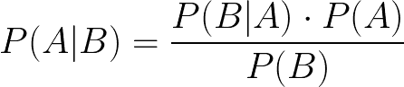

P(A|B)是指给定 B 已经发生的概率。

顺便说一下，托马斯·贝叶斯没有提出上面的方程，是拉普拉斯提出的。Bayes 写了一篇关于他的思想实验的论文“一篇解决机会主义中一个问题的文章”。贝氏去世后，他的朋友理查德·普莱斯发现了这份报纸，在他编辑了几版后，这份报纸在伦敦皇家学会被阅读。

对于贝叶斯推断:

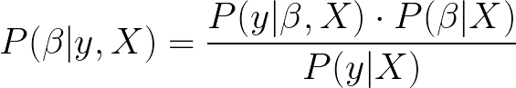

P(β|y，X)是给定输入 X 和输出 y 的模型参数的后验分布。P(y|β，X)是数据的似然性，乘以参数 P(β|X)的*先验概率*，再除以 P(y|X)，P(y | X)被称为归一化常数。

简而言之，我们使用关于模型参数和数据的先验信息来估计后验。

## 一个例子

让我们用一些简单的例子来建立我们的直觉，看看我们是否能理解我们在上面学到的东西。

让我们掷硬币 20 次，1 是正面，0 是反面。以下是掷硬币的结果:

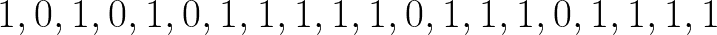

这个数据平均值是 0.75；换句话说，有 75%的机会是正面即 1，而不是反面即 0

顺便说一下，任何通常只有两个结果 0 或 1 的过程被称为**伯努利过程**。

从频率主义者的角度来看，硬币似乎是有偏向的，即如果我们再扔一次，那么根据频率主义者的估计，硬币更有可能(75%的情况下)正面朝上，即 1。

尽管如此，大多数硬币是没有偏向的，得到 1 或 0 的概率应该是 50%。根据中心极限定理，如果我们投掷硬币无限次，那么正面和反面的概率都是 0.5。现实生活与定理大相径庭，没有人会把一枚硬币扔无限次；我们必须根据现有的数据做出决定。

这就是贝叶斯方法有用的地方。这给了我们包含先验(我们最初的信念)的自由，这就是我们将对抛硬币数据所做的。如果我们没有关于先验的任何信息，那么我们可以使用完全无信息的均匀分布——在实践中，均匀分布的结果将与频率主义方法相同，因为我们告诉我们的模型每种可能性都是同等可能的。

> 非贝叶斯=具有统一先验的贝叶斯

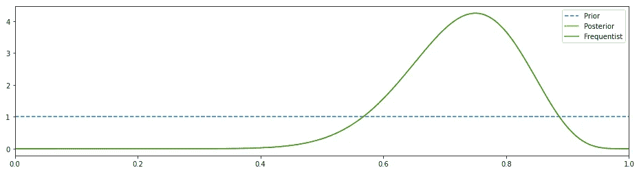

不提供信息的先验给出了与频繁主义者方法相同的结果(图片由作者提供)

在上图中，后验结果和频率主义结果一致，峰值在 0.75 左右(就像频率主义方法一样)。先验是一条直线，因为我们假设是均匀分布。

我相信我们可以做得更好。让我们改变我们的先验知识，也许是一个 beta 分布，然后观察结果。

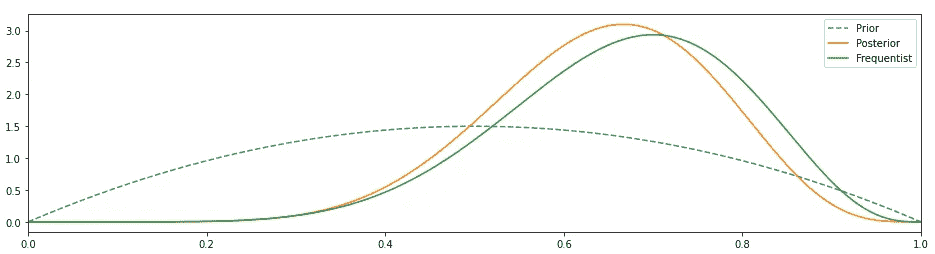

之前改为测试版，我们看到它比 frequentist 做得更好

这似乎更好。我们的先验已经改变，因此后验概率向左移动，它不在 0.5 附近，但它至少与频率主义者的 0.75 不一致。

我们可以通过调整先前发行版的几个参数来进一步改进它，使它变得更加自以为是。

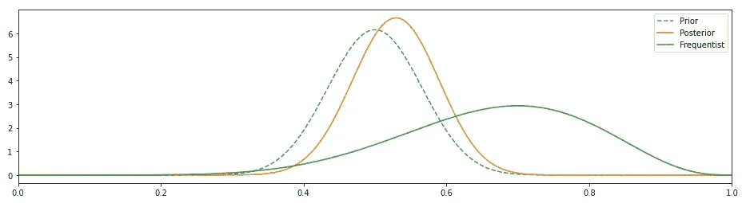

与 frequentist 相比，固执己见的先验使贝叶斯方法的结果模拟了真实世界(图片由作者提供)

这看起来好多了，后验概率已经改变了，因为我们已经改变了先验概率，这也更加符合这样一个事实，即一个没有偏见的硬币会有 50%的机会正面朝上，其余的时间则是反面朝上。

> 我们现有的关于硬币的知识对结果有重大影响，这是有意义的。这与频率主义者的方法截然相反，在频率主义者的方法中，我们假设我们对硬币一无所知，这 20 个观察结果就是福音。

我并没有要求你改变立场，但上面的例子应该会让你对贝叶斯方法产生一些信念，有了这个信念，让我们继续把它用在睡眠数据上。

# 实施贝叶斯线性回归

我正在使用的软件包:

1.  贝叶斯的 PyMC3
2.  用于可视化的 Arviz 和 Matplotlib

贝叶斯回归中的情况是，一旦您为模型参数定义了一个先验，就会估计一个后验，并从该后验中提取样本以生成一个更好、更准确的后验。这是一个高度计算密集型和组合爆炸性的任务。因此，我们需要找到一种方法，通过这种方法，我们可以在合理的时间内找到后路，而不需要使用太多的资源。

让我们从后验分布中进行这种复杂采样的算法称为 MCMC(马尔可夫链蒙特卡罗)。有许多相同的实现，如 Metropolis-Hastings、Hamiltonian、Gibbs 采样。我们将使用大都会黑斯廷斯。

如果我试图在这里解释 MCMC，那就有点矫枉过正了。也许是我，但找到一个后验概率，然后从这个后验概率中取样，以逼近一个更好的后验概率，目前似乎不是一个直观和简单的任务。该算法的一个快速和肮脏的纲要是:

1.  估计先后路。随机或从你的前任身上取一个样本。叫它θ₀吧
2.  定义一个与步骤 1 中选择的值相近的值。叫它θ₁吧
3.  计算比率 r，这是在θ₀和θ₁.评估后的比率
4.  如果 r >1，则接受θ₁，将其设为新的θ₀，并找到新的θ₁.如果 r <1 then repeat step 1, 2, and 3 till r > 1
5.  重复这些步骤进行特定次数的迭代，以获得后验分布。

说得太多了，让我们开始工作吧！

让我们首先检查数据的轮廓。请按照 [Github repo](https://github.com/Prashantmdgl9/Bayesian_linear_regression) 获取代码。

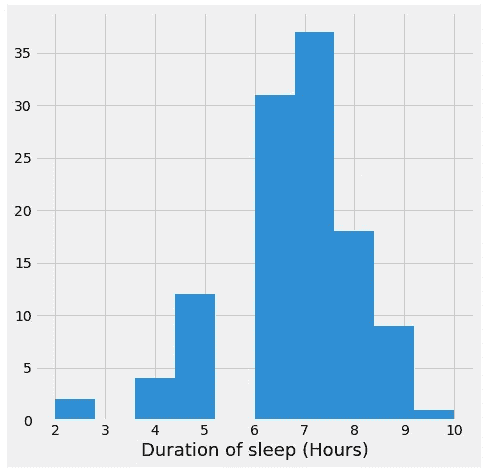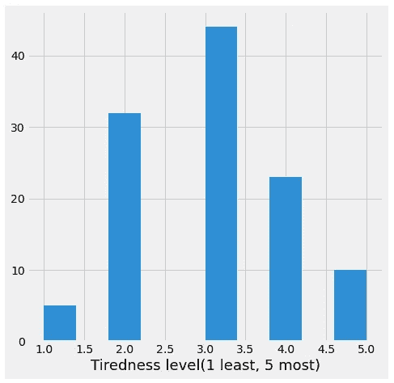

睡眠和疲劳水平直方图(图片由作者提供)

大多数人睡眠时间在 6 到 8 小时之间。原始数据只有很少数量的 6 小时观测值，大部分的 6 小时都来自我的数据。疲劳水平遵循正常曲线，峰值在 3。

疲劳和睡眠持续时间之间的散点图不能提供太多信息。我想知道什么样的回归线会符合这一点。即使睡了 9 个小时，人们也会感到 5 级疲劳。

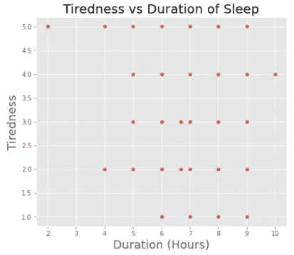

作者图片

# 模型

我们指定截距、斜率和σ的先验。我们的回归方程:

在这种情况下，我将斜率设置为以 2 为中心。

***. pm . sample(1000)***是触发 MCMC 的地方。这条语句的作用是通过查看数据，估计截距、斜率和产生数据的 sigma。将从后验分布中抽取 1000 个样本，每个样本将为截距、斜率和 sigma 生成一个单独的(1000 个)分布。

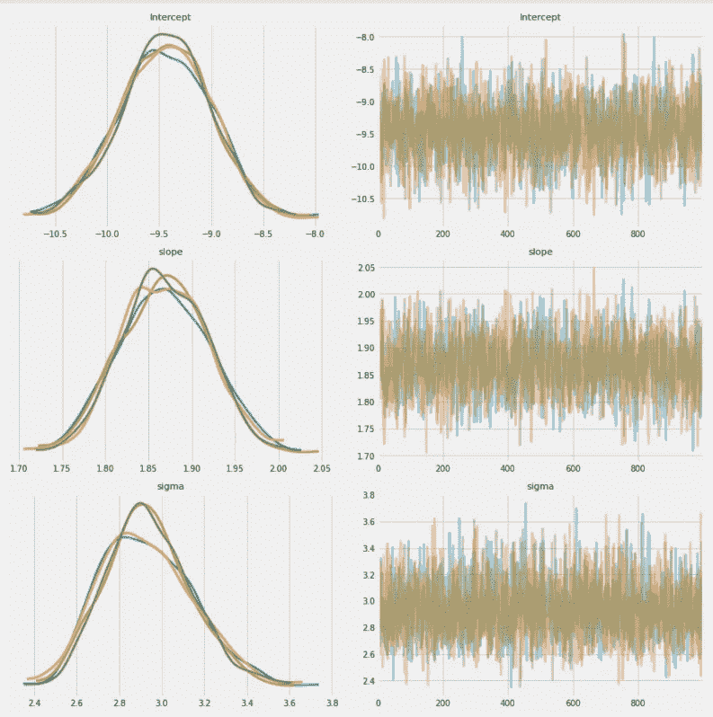

作者图片

以上是截距、斜率和 sigma 的轨迹分布。我们将斜率集中在 2，在结果中它并不是很远。

后验分布提供了三个模型参数的更清晰的图像。

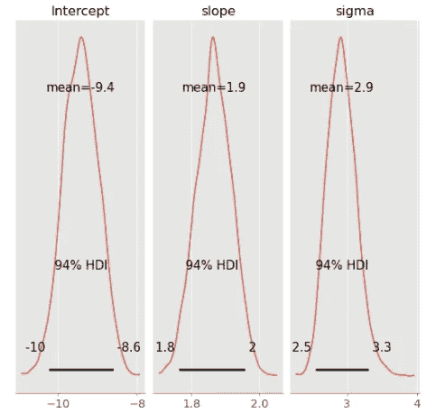

作者图片

所有参数的范围都很窄，如果数据点的数量很少，上面曲线的宽度会大得多。

# 斗牛中的最后一剑

让我们看看贝叶斯模型如何预测我 6.5 小时睡眠的疲劳程度

请记住，贝叶斯模型不给出点估计，而是提供概率分布，所以我们在这里也将得到分布。

预测的平均值将达到 2.70。

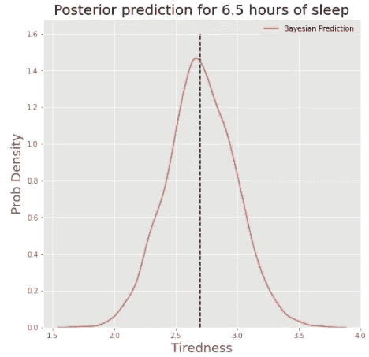

作者图片

> 对于 6.5 小时，我估计我的疲劳水平在 2 到 2.5 之间，但模型显示是 2.71。这意味着我需要多睡一会儿来减轻疲劳。

# 线性回归

在总结之前，我想运行一个线性回归并估计结果。

在直方图中，我们看到疲劳指数的主导值是 3，我怀疑线性回归会给出类似的结果。

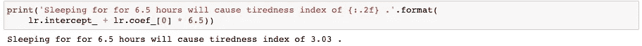

线性回归的结果，不出所料！！

对于 6.5 小时的睡眠，线性回归估计疲劳指数为 3.03，这比贝叶斯得出的结果要高。

这并不是说我讨厌睡觉，而是我不想依赖线性回归，这种回归会把我放在平均疲劳水平的队列中，并且可能会不必要地增加半小时的睡眠时间。

# 结论

1.  有强有力的证据表明，我需要我对 6.5 小时睡眠后的疲劳水平的估计有点低。

> 贝叶斯统计要求我多睡 6.5 小时来减少疲劳。线性回归做着同样的事情，但是估计我的疲劳值要高得多。我愿意相信贝叶斯统计，毕竟，如果不是拉普拉斯和贝叶斯，你还能相信谁呢？

2.贝叶斯方法结合了先验信息，当我们的数据有限时，这可能是一个可靠的工具。

3.贝叶斯方法看起来很直观——估计你的解决方案是什么，并在收集更多数据时改进这个估计。

> 这并不意味着贝叶斯是解决所有数据科学问题的最佳方法；这只是其中的一种方法，学习贝叶斯和频率主义的方法比在这些思想流派之间进行战斗更有成效。

# 我学到了什么？

上面的练习是关于量化你对某事的信念，而不是确定它。这是关于拥抱不确定性，但量化它。这就是为什么你产生一个概率分布，而不是点估计。

**趣闻:** *顺便说一句，很多贝叶斯派的思想家都把英格玛之谜的解决归功于艾伦·图灵。是的，他的确建立了概率模型，但是波兰数学家帮助了他。早在战争之前，波兰数学家已经用数学方法解决了这个谜，而英国人还在试图用语言来解决它。万岁*<https://en.wikipedia.org/wiki/Marian_Rejewski>**！**

*好了，我真的要睡觉了。*

*来源:Giphy.com*

*该睡觉了，但首先我必须关灯。*

## *参考资料:*

1.  *[https://OCW . MIT . edu/courses/mathematics/18-05-introduction-to-probability and-statistics-spring-2014/readings/MIT 18 _ 05s 14 _ reading 20 . pdf](https://ocw.mit.edu/courses/mathematics/18-05-introduction-to-probability-and-statistics-spring-2014/readings/MIT18_05S14_Reading20.pdf)*
2.  *[https://docs.pymc.io/nb_examples/index.html](https://docs.pymc.io/nb_examples/index.html)*
3.  *[https://2018 . za . pycon . org/talks/5-Bayesian-analysis-in-python-a-starter-kit/](https://2018.za.pycon.org/talks/5-bayesian-analysis-in-python-a-starter-kit/)*