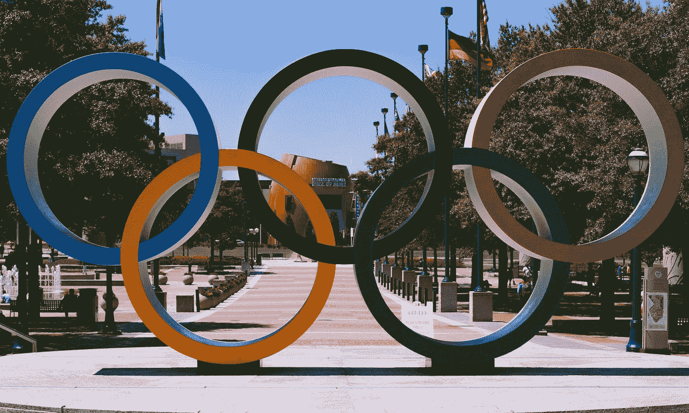
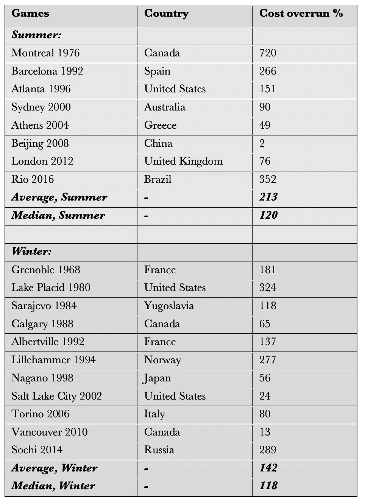
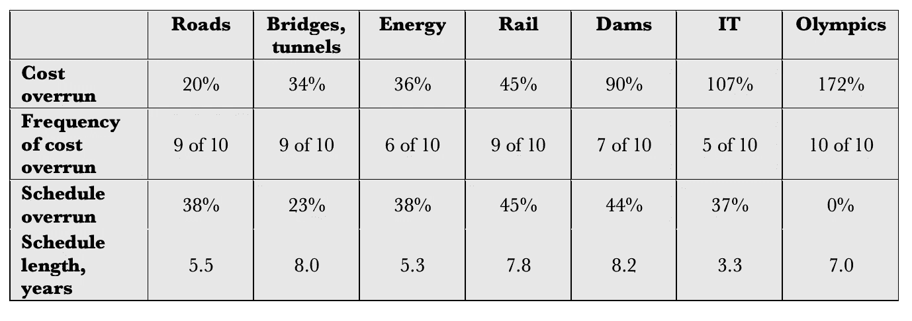

# 奥运会的超支有多大？

> 原文：<https://towardsdatascience.com/how-big-is-cost-overrun-for-the-olympics-46e803cbf7d5?source=collection_archive---------31----------------------->

## 所有游戏，无一例外，都有过成本超支。因为没有其他类型的大型项目是这种情况。

*亚历山大·布齐尔和丹尼尔·伦恩*

由[布莱恩·特纳](https://unsplash.com/@bt_optics?utm_source=medium&utm_medium=referral)在 [Unsplash](https://unsplash.com?utm_source=medium&utm_medium=referral) 上拍摄的照片

下表显示了 1960-2016 年奥运会的实际超支百分比。在 1960 年至 2016 年的 30 场比赛中，有 19 场比赛的成本超支数据可用。投标预算和最终成本之间的差异的统计测试表明，这种差异在统计上具有压倒性的显著性。也就是说，从统计数据来看，奥运会的成本超支非常明显。应该提到的是，如果按名义价值(包括通货膨胀)计算成本超支，那么成本超支会大得多。从这个意义上说，显示的数字是保守的。*我们发现实际成本超支的平均值和中位数如下:

*   所有游戏:平均成本超支为 172%(中位数为 118%)。
*   夏季奥运会:平均超支为 213%(中位数为 120%)。
*   冬季奥运会:平均超支 142%(中位数 118%)。

来源:[https://bit.ly/376vMo6](https://bit.ly/376vMo6)

> 在所有大型项目中，奥运会的平均成本超支最高，实际超支 172%。

尽管夏季奥运会和冬季奥运会的平均成本超支之间的差异相对较大，为 71 个百分点，但这两种类型的奥运会在成本超支方面的差异在统计上并不显著。因此，从统计学的角度来看，夏季奥运会和冬季奥运会的成本超支没有区别，可以将这些数据汇集起来进行统计分析，例如，对未来奥运会的预算进行更准确的参考类预测。

我们进一步看到:

*   19 款游戏中有 15 款(79%)的成本超支超过 50%。
*   19 款游戏中有 9 款(47%)的成本超支超过 100%。

> 警惕的读者可能会怀疑，所有比赛中最低的超支是北京 2008 年奥运会的 2%

从这些统计数据来看，很明显，奥运会存在着巨大的成本超支风险。

对于夏季奥运会，超支最多的是 1976 年蒙特利尔奥运会，超支 720%，其次是 1992 年巴塞罗那奥运会，超支 266%。2008 年北京奥运会超支最小，为 2%，其次是 2004 年雅典奥运会，为 49%。对于冬季奥运会，最大的成本超支是 1980 年普莱西德湖奥运会的 324%，其次是 2014 年索契冬奥会的 289%。2010 年温哥华冬奥会超支最小，为 13%，其次是 2002 年盐湖城冬奥会，为 24%。

警惕的读者可能会怀疑，所有比赛中最低的超支是北京 2008 年奥运会的百分之二。众所周知，中国的经济报道缺乏可靠性。然而，北京 2008 年奥运会 68 亿美元的总成本和每位运动员 622，000 美元的成本都高于大多数其他夏季奥运会。因此，报告的费用被认为是足够举办北京奥运会的，我们没有看到官方数字被操纵的直接证据，因此应该拒绝接受。因此，像其他观察中国经济数据的人一样，我们也包括了这些数据，并警告说，鉴于中国篡改数据的历史，这些数据可能不如其他国家的数据可靠。同样，这意味着我们在奥运会中的平均超支费用是保守的。

> 奥运会的高平均超支成本，加上离群值的存在，应该成为任何考虑举办奥运会的人，尤其是小型或脆弱经济体的谨慎理由

来源:https://bit.ly/376vMo6

根据上述数据，我们进一步观察了奥运会的成本超支情况:

1.  *所有游戏，无一例外都有成本超支*。没有其他类型的大型项目是这种情况。对于其他项目类型，通常有 10-20%的项目符合或低于预算。对于奥运会来说是零。这一点值得仔细考虑。预算通常被确定为在项目上花费的最大值，或者说是期望值。然而，在奥运会中，预算更像是一个持续超支的虚构的最小值。此外，与其他大型项目相比，每项预算都有法律要求，要求主办城市和国家政府保证支付奥运会的超支费用。我们的数据表明，这种担保类似于为该活动开一张空白支票，肯定费用会比报价高。实际上，投标预算与其说是预算，不如说是首期付款，以后还会分期付款。
2.  奥运会的平均成本超支**是所有大型项目*中最高的，按实际价值计算高达 172%。相比之下，Flyvbjerg 等人(2002 年)发现，大型交通项目的平均成本超支为公路 20%，大型桥梁和隧道 34%，铁路 45%；Ansar 等人(2014 年)发现巨型大坝的超限率为 90 %;Budzier 和 Flyvbjerg (2011)对大型 IT 项目的预测是 107 %,所有的预测都是真实的。奥运会的高额超支可能与项目交付的固定期限有关:开幕日期不可更改。因此，当出现问题时，不能像其他大型项目那样，在进度和成本之间进行权衡。在奥运会上，经理们所能做的就是投入更多的钱来解决问题，这就是所发生的事情。从这个意义上说，举办奥运会就像开一张空白支票。*
3.  *奥运会的平均超支额很高，再加上离群值的存在，应该成为任何考虑主办奥运会的人，尤其是那些几乎没有能力吸收不断上涨的成本和相关债务的小型或脆弱经济体保持谨慎的原因。数十亿美元项目成本超支 50%以上的小风险也应该引起政府官员和纳税人的关注，因为这种超支可能会对未来几十年产生财政影响，就像蒙特利尔在 1976 年夏季奥运会上花了 30 年才还清 720%成本超支所产生的债务一样(Vigor，Mean，和 Tims 2004: 18)，雅典在 2004 年奥运会上，奥运成本超支和相关债务加剧了 2007-16 年的金融和经济危机。*

*_____________*

**)有关完整的故事，包括参考资料和注释，请参见 Flyvbjerg、Bent、Alexander Budzier 和 Daniel Lunn，2021 年，“回归尾部:为什么奥运会会失败”，*环境与规划 A:经济与空间*，第 53 卷，第 2 期，2021 年 3 月，第 233-260 页。这里有免费的 pdf:[https://papers.ssrn.com/sol3/papers.cfm?abstract_id=3686009](https://papers.ssrn.com/sol3/papers.cfm?abstract_id=3686009)*