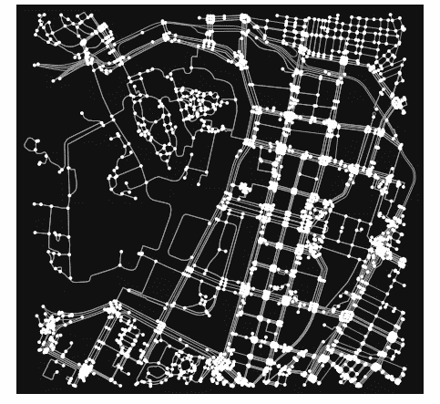
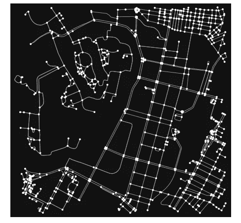
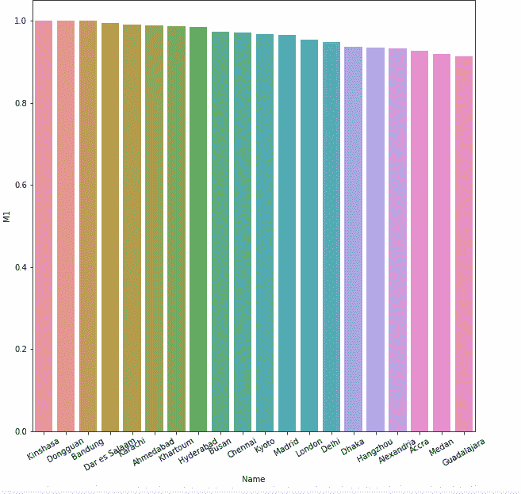
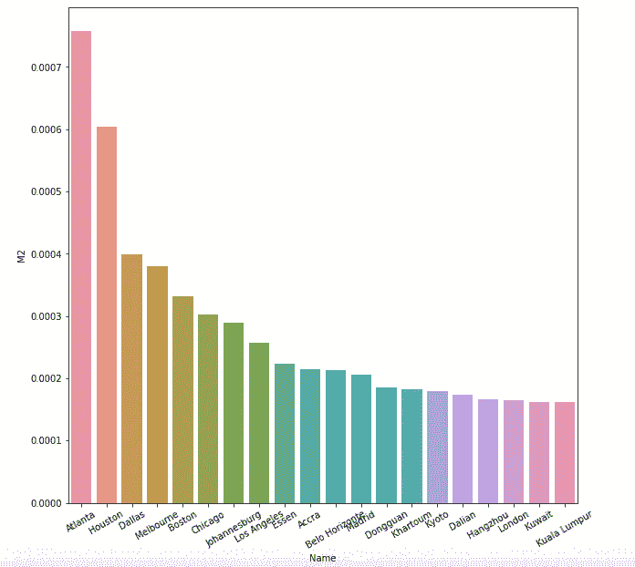
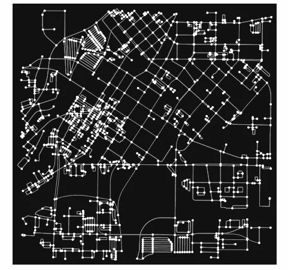
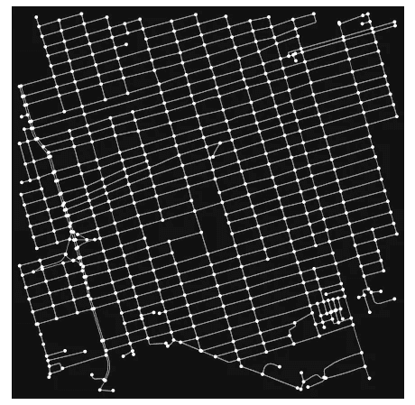
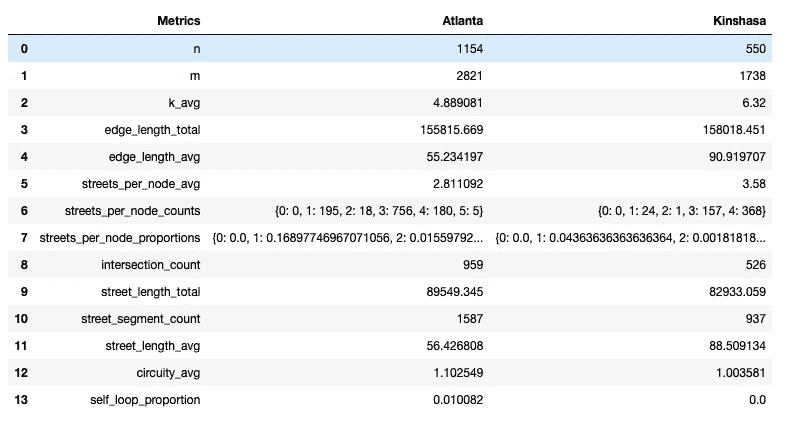

# 你最喜欢的城市有多适合骑自行车？

> 原文：<https://towardsdatascience.com/how-bike-able-is-your-favorite-city-886332b9a94c?source=collection_archive---------34----------------------->

## 使用数据科学测量城市中骑车人的友好程度。

穆里略·德·保拉在 [Unsplash](https://unsplash.com?utm_source=medium&utm_medium=referral) 上的照片

无论你是职业自行车还是业余爱好，你可能都知道骑自行车有多大好处。从山路到穿越城市，自行车可以让你探索新的地方，锻炼身体，并在途中进行社交。在这个小故事中，我们将从数据科学的角度来看骑自行车的最佳城市。首先，让我们看看我们将要使用的一些工具。

## 工具和数据:

*   Jupyter 笔记本
*   OSMnx
*   网络 x
*   海生的
*   和 Python
*   数据:世界主要城市及其人口数据集(链接:【https://data.un.org/Data.aspx?d=POP】T4&f = tableCode % 3a 240)

## 标准:

什么使得城市对自行车友好？首先，它应该有专门的自行车路线和车道。让我们把它定义为自行车路线长度与总路线长度之比**。这个比例越高，城市就越适合自行车。为了计算这一点，我们应该为一个特定的城市(比如东京)生成自行车和整个街道网络，如下所示:**

****

**以下是包括东京自行车道在内的道路:**

****

**现在，让我们计算 100 个城市的自行车道与总道路的比率，并查看使用 OSMnx 街道长度函数得出的结果:**

**这是使用 Seaborn 生成的自行车路线比例最高的前 20 个城市的条形图:**

****

**在这项指标中，排名最高的城市是刚果民主共和国的金沙萨，得分为 1.0，这意味着所有街道都可以骑自行车，其次是中国的东莞和印度尼西亚的万隆。**

**接下来，我们可以看看每个人口有多少骑行路线。因此，我们可以定义另一个指标:**每个城市的自行车道长度除以人口密度**。较大的值意味着城市居民可以使用更多的自行车道，因此对自行车更加友好。另一方面，较小的数值意味着更多的人使用较少的自行车道。让我们看一下代码，然后看看 20 个最大值的条形图:**

****

**这里的数据显示了与我们的第一个指标不同的故事，美国的亚特兰大、休斯顿和达拉斯得分最高。**

**那么，让我们看看这些城市的一些街道网络，即亚特兰大和金沙萨。首先，这是每个城市的网络图:**

****

**亚特兰大**

****

**金沙萨**

**他们看起来当然彼此不同，有些视觉上的差异。亚特兰大的网络在某些地区看起来稍微更“集中”，而金沙萨的网络看起来非常对称和均匀分布。我们可以使用 OSMnx 量化这些差异:**

**OSMnx 提供了一个名为“基本统计”的功能，我们可以使用它来查看关于城市街道网络的各种指标。以下是我们将在熊猫数据框架中使用的变量:**

****

**首先，“n”和“m”分别代表图中节点和边的数量。如你所见，亚特兰大两者兼而有之。那么 k_avg 代表平均节点度，意味着从图中的节点出现或进入的道路的平均数量。在这种情况下，金沙萨的这一指标值较高。**

**对于其他指标，您可以看到亚特兰大在十字路口数和街道总长度方面得分较高，但金沙萨的平均街道长度较高，这有助于理解我们上面看到的图表。**

**总之，在这个小故事中，我们分析了一些指标，看看世界上哪些城市对自行车更友好，然后我们看了看排名前两位的城市，以了解是什么使它们如此友好。我希望你喜欢这个故事，如果你想看看代码，你可以在这里找到它:[https://github . com/DeaBardhoshi/Data-Science-Projects/blob/main/bike ability % 20 pipeline . ipynb](https://github.com/DeaBardhoshi/Data-Science-Projects/blob/main/Bikeability%20Pipeline.ipynb)**