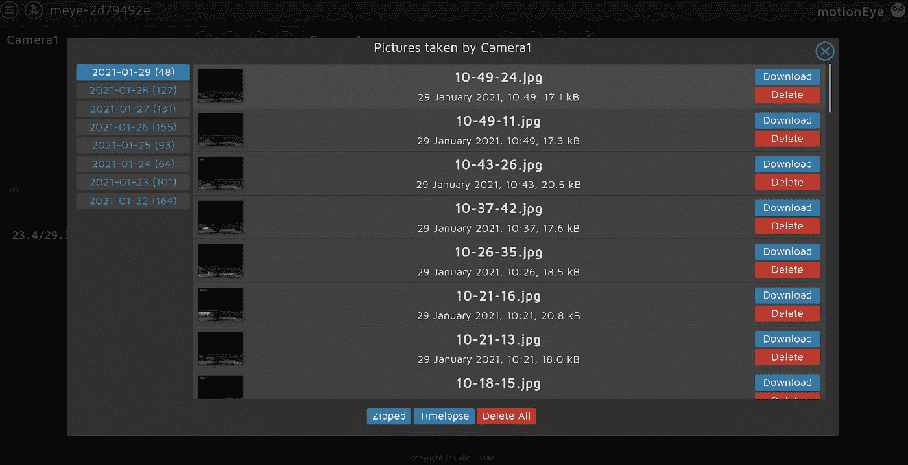
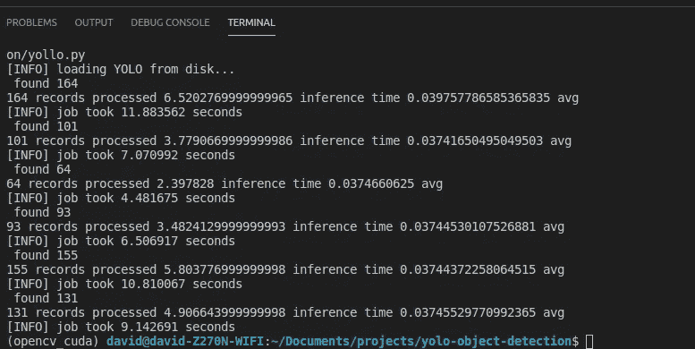
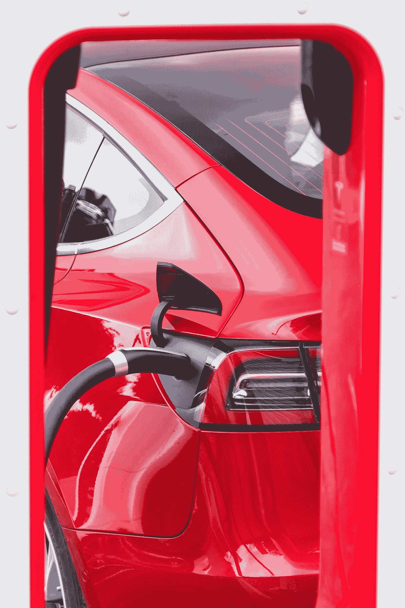
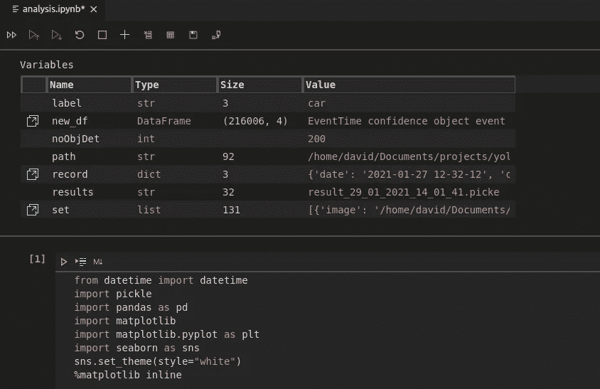
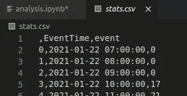
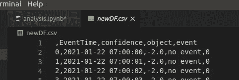
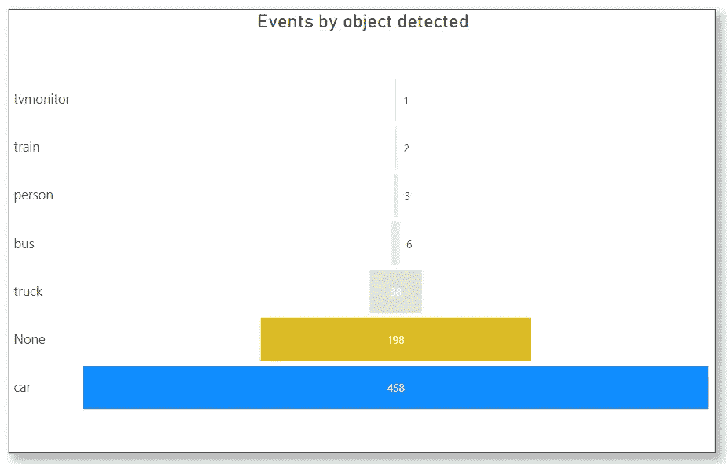
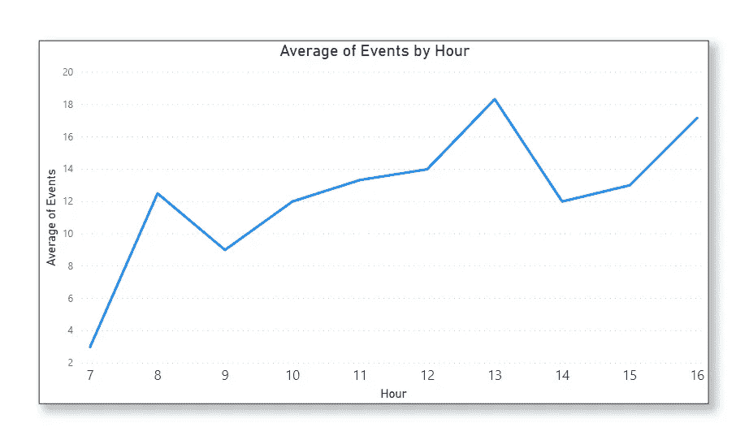

# 外面的马路有多热闹？

> 原文：<https://towardsdatascience.com/how-busy-is-the-road-outside-de8e9b1b3cc3?source=collection_archive---------35----------------------->

## [从零开始逐个任务地进行数据科学](https://towardsdatascience.com/tagged/dofromscratch)

## 我们正在自动计算过往车辆


照片由 [CHUTTERSNAP](https://unsplash.com/@chuttersnap?utm_source=medium&utm_medium=referral) 在 [Unsplash](https://unsplash.com?utm_source=medium&utm_medium=referral) 上拍摄

如果我有像上面这样的好照片，我计算过往车辆的项目会容易得多。相反，我只能处理低质量的模糊图像。这篇[文章是我个人在 ***一个计算机视觉&深度学习涅槃*** 之旅的延续](https://towardsdatascience.com/tagged/dofromscratch)。很多时候，它看起来更像克里斯·雷亚的《地狱之路》。 ***《在你穿越旷野从沙漠到井的旅途上》*** 。我的领域似乎是计算机科学、深度学习和计算机视觉。沙漠代表了我对井的求知欲，也许是指我经常饮用的书籍、教程和文章。如果都是这样，那么我邀请你到 ***喝我井里的水，欣赏我系列的下一篇文章*** 。和我一起去数过往的车辆。

如果你加入了 mid quest，你可以在这里了解整个系列。之前，我制作摄像机，部署运动眼，并定位摄像机以记录运动，同时保护道路使用者的隐私和安全。最后，我砍出了相当多的代码。现在，我有了整整一周的数据，并渴望更新你们所有人的练习。

## 检索图像

一旦设计并调好数据收集器，数据检索就是或者应该看起来是自动的。至少在我项目的这个阶段，我是这样的。下面的图 1 显示了一个 Motion Eye 操作系统(摄像机 1)的屏幕截图。每一天都显示在左侧，我可以检索任何一天的所有图像的“压缩”文件。



图 1 来自 Motion Eye OS 的屏幕截图—相机 1 —作者提供的图片。

从 1 月 22 日**到 1 月 28 日**有一整套数据。1 月 29 日被抓获时正在进行中。该系统在**每天从格林威治时间早上 7 点到下午 5 点**工作。在早上 7 点**之前和下午 5 点**之后，是黑暗的，设备不记录活动。每一天都是一个单独的文件夹，每个图像文件都被命名为 hour-minute-second.jpg，10–49–24.jpg 代表上午 10:49:24 的检测触发。

检索只需要登录到运动眼设备，每天下载一个 ZIP 文件。由于 Motion Eye 是基于网络的服务，我可以直接从我的**数据科学工作站**登录。我确实创建了一个 UPS 支持的 Raspberry Pi 文件服务器，但是我们需要保持简单。下载并解压缩目标文件夹中的 zip 文件后，我们的数据检索就完成了。但是，下载几百张照片不算数据！对吗？我们需要像石油公司一样提炼图像，将原油运到炼油厂生产天然气。

## 数据精炼厂

我想，就像那些在野外钻探石油的野人一样，我们也在这里发现了石油。代替**桶稠厚的原油，**我们有**文件夹的模糊图像**来提炼。将原油转化成为社会提供动力的产品被证明是一大笔钱。数据科学，机器学习和深度学习，在我看来，是石油工人移动工具，和原油到炼油厂的应用。


照片由 [Zbynek Burival](https://unsplash.com/@zburival?utm_source=medium&utm_medium=referral) 在 [Unsplash](https://unsplash.com?utm_source=medium&utm_medium=referral) 上拍摄

谢天谢地，杂乱的数据比一桶原油干净多了。我把我的提炼步骤添加到一个要点中，让我们讨论一下要点。[之前](/counting-passing-traffic-46850e4f5bd0)，我讨论了我创建的 myYolo 类，我提到代码的来源是来自[www.pyimagesearch.com。](http://www.pyimagesearch.com.)

第 5 行和第 6 行帮助描述那些桶原油，图像的文件夹，被存储在哪里。第 14 行创建了 myYolo 类的一个实例，因为我用 GPU 配置了[我的工作站，所以我们可以将目标设备设置为‘GPU’。第 16 到 21 行提供了一个助手函数，允许我将任何给定的对象持久化到磁盘上。第 24 到 29 行是实际的精炼过程。第 27 行调用实例上的 setter 方法，实际上只设置了**目标文件夹或原油桶**。第 28 行通过 YOLO 网络发送整个文件夹，第 33 行**将数据溢出**到磁盘。](/upgrading-and-rebuilding-the-host-6dd4efb347d2)



图 2 精炼步骤的最终输出。

上面的图 2 为您提供了终端输出的屏幕截图。我正在使用可视化代码，你可以看到我有一个名为“opencv_cuda”的虚拟环境。用 Cuda 构建 [OpenCV 二进制文件对我来说是一个巨大的痛苦。每个文件夹都经过了处理，我们可以看到每个图像花了 0.037 秒穿越 Yolo 网络。](/pulling-an-all-nighter-e27b18ad96c7)

因此，现在我们有了数据，但我们仍然处于中游阶段，我们将数百张照片处理成一个数据对象，现在需要将产品交付给最终消费者。

## 消费数据

你是否曾希望你能把你的大脑接入数据管道，直接消耗掉它？我曾经和年轻人开玩笑，问他们的大脑中是否有一个“USB 端口”？如果是这样，他们可以插入我的大脑，下载和上传我的数据！明明看了所有的[矩阵片](https://www.imdb.com/title/tt0133093/)。



由 [Vlad Tchompalov](https://unsplash.com/@tchompalov?utm_source=medium&utm_medium=referral) 在 [Unsplash](https://unsplash.com?utm_source=medium&utm_medium=referral) 拍摄的照片

原始数据包含字典列表。

```
[{'image': '/home/david/Documents/projects/yolo-object-detection/images/2021-01-22/13-30-33.jpg', 'result': ['car: 0.8965'], 'timing': '[INFO] YOLO took 0.391402 seconds'}
..
]
```

每个字典都有一组有限的键。这些是:-

*   **图像:**提供原始图像文件和完整路径；
*   **结果:**图像中检测到的物体的 python 列表。可能有一个或多个对象。
*   **计时:**包含一个文本，记录图像穿越 YOLO 网络所用的时间。可能没用。

我第一次使用可视代码作为我的笔记本环境。很难说我对视觉代码和网页浏览器的感觉，因为感觉很奇怪。视觉代码可能是一个更好的笔记本环境。图 3 展示了一个很棒的特性——可变查看器。



图 3:可视化代码 Jupyter 笔记本扩展——使用变量查看器。作者图片

我将笔记本导出为 PDF 格式，并添加到 [GITHUB](https://github.com/CognitiveDave/CountingTraffic/blob/main/analysis.pdf) 中。大部分代码都是真正标准的，只提供了几个 CSV 文件，我可以做进一步的工作。图 4 显示了数据。图 4(左)显示了每小时通过的交通流量。图 4(右)显示了单个事件和检测到的对象。为了制作一些图表，我决定使用 Power BI



图 CSV 文件的图示。图片由作者提供。

## 采用 Power BI 的视觉效果

使用 Power BI，我做了一些进一步的操作，然后生成了一些图表。下面包括图 5 和图 6，展示了我创建的一些图像。



图 5:作者展示 YOLO 探测到的物体的图片

Yolo 模型在 198 张照片中没有检测到任何东西(图 5)。汽车是最常经过的交通工具，但我们也有“火车”，这是不太可能的。Yolo 模型当然需要训练，以检测爱尔兰当地的车辆。



图 6:作者提供的图片显示了外部平均交通流量的折线图

# 外面的马路有多热闹？

图 6 给出了研究问题的答案。鉴于全球疫情，该数据不太可能代表典型模式。从早上 7 点开始，到 17 点停 7 天，我们看到的都是一般的过往车辆。早上 7 点这条路很安静。一般来说，白天外面的街道上每小时至少有 12 辆车通过。

外面的路很忙吗？我猜有些道路每秒有 12 辆车，所以这真的归结为透视。 ***我将继续我的个人旅程，踏上我寻求的那个计算机视觉&深度学习的涅槃之路。*** 更多时候，似乎更像是[克里斯·雷亚](https://www.youtube.com/watch?v=f_Kc8TG9_3s)的《地狱之路》。我们会看到的！