# 你如何利用人工智能来防止网络欺凌？

> 原文：<https://towardsdatascience.com/how-can-ai-help-to-prevent-cyberbullying-f630073da478?source=collection_archive---------27----------------------->

## [变更数据](https://towardsdatascience.com/tagged/data-for-change)

## 让我们通过例子来学习，用 PyTorch 训练一个能够在在线对话中识别毒性的神经网络


由[奥斯丁·帕切科](https://unsplash.com/@austin_pacheco?utm_source=medium&utm_medium=referral)在 [Unsplash](https://unsplash.com?utm_source=medium&utm_medium=referral) 上拍摄

网络欺凌是一种利用电子手段进行欺凌的形式。随着数字领域的扩大和技术的进步，这种现象变得越来越普遍，尤其是在青少年中。

三年前，[有毒评论分类挑战](https://www.kaggle.com/c/jigsaw-toxic-comment-classification-challenge/overview)发表在 Kaggle 上。竞赛的主要目的是开发有助于改善在线对话的工具:

> 讨论你关心的事情可能会很困难。网上辱骂和骚扰的威胁意味着许多人停止表达自己，放弃寻求不同意见。平台努力有效地促进对话，导致许多社区限制或完全关闭用户评论。

本文从理论部分开始，您将学习使用神经网络进行文本处理的基本概念。然后，它继续一个例子，如何训练一个卷积神经网络，检测有毒的评论。

**通过阅读理论部分，你会学到:**

*   什么是 NLP？
*   伯特是什么？
*   什么是卷积神经网络(CNN)？
*   如何将文本转换为嵌入？
*   什么是 KimCNN？

**通过阅读实用部分，你将学到:**

*   如何加载数据
*   如何定义训练、验证和测试集
*   如何用 PyTorch 训练卷积神经网络
*   如何测试模型

在文章的最后，我还分享了所有代码的链接，以便您可以自己运行它。

# 让我们从理论开始


照片由[叶戈尔·迈兹尼克](https://unsplash.com/@vonshnauzer?utm_source=medium&utm_medium=referral)在 [Unsplash](https://unsplash.com?utm_source=medium&utm_medium=referral) 上拍摄

## 什么是 NLP？


照片由[蒂姆·莫斯霍尔德](https://unsplash.com/@timmossholder?utm_source=medium&utm_medium=referral)在 [Unsplash](https://unsplash.com?utm_source=medium&utm_medium=referral) 拍摄

自然语言处理(NLP)是语言学、计算机科学、信息工程和人工智能的一个分支，涉及计算机和人类语言之间的交互，特别是如何编写计算机程序来处理和分析大量自然语言数据。自然语言处理中的挑战通常涉及语音识别、自然语言理解和自然语言生成。

## 伯特是什么？


由 [Rajeshwar Bachu](https://unsplash.com/@rajeshwerbatchu7?utm_source=medium&utm_medium=referral) 在 [Unsplash](https://unsplash.com?utm_source=medium&utm_medium=referral) 上拍摄的照片

来自变压器的双向编码器表示(BERT)是一种语言模型，由谷歌的 Jacob Devlin 和 Ming-Wei Chang 于 2018 年创建并发布[3]。BERT 用一种更快的基于注意力的方法取代了递归神经网络的顺序性质。BERT 使用 Transformer，这是一种学习文本中单词(或子单词)之间上下文关系的注意力机制。一般来说，Transformer 包括两个独立的机制——一个读取文本输入的编码器和一个为任务生成预测的解码器。

BERT 在各种 NLP 任务中取得了最先进的结果。由于 BERT 的目标是生成一个语言模型，所以只有编码器机制是必要的。要了解关于 BERT 的更多信息，请阅读 Rani Horev 的文章 [BERT 解释:NLP 的艺术语言模型](/bert-explained-state-of-the-art-language-model-for-nlp-f8b21a9b6270)。

在本文中，我们将使用 BERT 作为编码器，使用单独的 CNN 作为解码器，为任务产生预测。

我们可以直接使用 BERT 来完成这项任务(如[使用 BERT 的多标签文本分类—强大的转换器](https://medium.com/huggingface/multi-label-text-classification-using-bert-the-mighty-transformer-69714fa3fb3d)中所述)，但我们需要在转换器上重新训练多标签分类层，以便它能够识别仇恨言论。

## 卷积神经网络


照片由 [Alina Grubnyak](https://unsplash.com/@alinnnaaaa?utm_source=medium&utm_medium=referral) 在 [Unsplash](https://unsplash.com?utm_source=medium&utm_medium=referral) 上拍摄

在深度学习中，卷积神经网络是一类神经网络，已被证明在图像识别和分类等领域非常有效。除了为机器人和自动驾驶汽车的视觉提供动力之外，CNN 还成功地识别了人脸、物体和交通标志。

由于这些成功，许多研究人员试图将它们应用于其他问题，如 NLP。

要了解更多关于 CNN 的信息，请阅读这篇关于 CNN 的文章:[卷积神经网络的直观解释](https://ujjwalkarn.me/2016/08/11/intuitive-explanation-convnets/)。

## 如何将文本转换为嵌入？


[Max 陈](https://unsplash.com/@maxchen2k?utm_source=medium&utm_medium=referral)在 [Unsplash](https://unsplash.com?utm_source=medium&utm_medium=referral) 上拍照

为了让卷积神经网络处理文本数据，我们需要将评论的每个单词转换成一个向量。

Huggingface 开发了一个名为 [transformers](https://github.com/huggingface/transformers) 的自然语言处理(NLP)库，可以将单词转换为矢量(以及许多其他东西)。它还支持多种先进的自然语言处理语言模型，比如 BERT。

使用 BERT，评论中的每个单词都被转换成一个大小为`[1 x 768]`的向量(768 是 BERT 嵌入的长度)。

一条评论由多个单词组成，所以我们得到一个矩阵`[n x 768]`，其中 n 是一条评论中的单词数。由于伯特在第一句话的开头插入了[CLS]标记，并在每句话的结尾插入了[SEP]标记，因此实际上有超过`n`的单词。

在本文中，我们将使用一个更小的 BERT 语言模型，它有 12 个注意层，使用 30522 个单词的词汇量。

BERT 使用一个标记器将输入文本分割成词汇表中可用的标记列表。它还通过将单词拆分为子单词来学习词汇表中没有的单词。

## 什么是 KimCNN？


照片由[莫里茨·金德勒](https://unsplash.com/@moritz_photography?utm_source=medium&utm_medium=referral)在 [Unsplash](https://unsplash.com?utm_source=medium&utm_medium=referral) 上拍摄

KimCNN [1]是由纽约大学的 Yoon Kim 在 2014 年的一篇论文《用于句子分类的卷积神经网络》中引入的。当时，它提高了多个 NLP 任务的准确性。KimCNN 使用与用于分析视觉图像的网络类似的架构。

KimCNN [2]的步骤:

1.  取一个单词嵌入在输入`[n x m]`上，其中 n 代表一个句子中的最大单词数，m 代表嵌入的长度。
2.  对嵌入应用卷积运算。它使用不同大小的多个卷积`[2 x m]`、`[3 x m]`和`[4 x m]`。这背后的直觉是模拟 2 个单词、3 个单词等的组合。注意，卷积宽度是`m` -嵌入的大小。这不同于 CNN 对图像的处理，因为他们使用像`[5 x 5]`这样的平方卷积。这是因为`[1 x m]`代表一个完整的单词，用较小的内核大小运行卷积是没有意义的(例如，在单词的一半上进行卷积)。
3.  应用校正线性单元(ReLU)来增加模拟非线性问题的能力。
4.  应用 1-max 池对输入表示进行下采样，并帮助防止过拟合。更少的参数也降低了计算成本。
5.  将前面操作中的向量连接成一个向量。
6.  添加一个脱层来处理过度拟合。
7.  应用 softmax 函数在类之间分配概率。我们的网络在这里有所不同，因为我们正在处理一个多标签分类问题——每个评论可以有多个标签(或者没有标签)。我们使用一个 sigmoid 函数，它为每个类在 0 和 1 之间调整 logits。这意味着可以同时预测多个类别。

# 让我们继续实际的部分


照片由[布雷特·乔丹](https://unsplash.com/@brett_jordan?utm_source=medium&utm_medium=referral)在 [Unsplash](https://unsplash.com?utm_source=medium&utm_medium=referral) 上拍摄

## 初始化库

在我们开始之前，我们需要导入我们将要用来开发 AI 模型的所有库。

如果您的计算机上缺少任何库，您可以使用以下软件进行安装:

```
pip install library_name
```

让我们导入库:

```
**%**matplotlib inlineimport logging
import time
from platform import python_versionimport matplotlib
import matplotlib.pyplot **as** plt
import numpy **as** np
import pandas **as** pd
import sklearn
import torch
import torch.nn **as** nn
import torch.nn.functional **as** F
import transformers
from sklearn.metrics import roc_auc_score
from torch.autograd import Variable
```

## 加载数据


[毒性评论分类挑战](https://www.kaggle.com/c/jigsaw-toxic-comment-classification-challenge/overview) —图片来自 [lamamatropicana](https://lamamatropicana.com/daily-blog/2018/2/20/i8n5phts2y0tmuvrxu6tov6mio7cml)

前往[有毒评论分类挑战](https://www.kaggle.com/c/jigsaw-toxic-comment-classification-challenge/overview)下载数据(解压后将文件夹重命名为`data`)。

我们将使用`train.csv`来训练和测试模型，因为`test.csv`中的条目没有标签，并且用于 Kaggle 提交。

让我们加载数据。

```
df **=** pd**.**read_csv('data/train.csv')
```

我们设置随机种子，使实验可重复，并打乱数据集。

```
np**.**random**.**seed(42)
```

改组数据的目的是减少方差，并确保模型不会过度适应训练集中的样本序列。

```
df **=** df**.**sample(frac**=**1)
df **=** df**.**reset_index(drop**=**True)
```

数据集由评论和不同类型的毒性组成，如**威胁、淫秽和侮辱**。这个问题属于**多标签分类**的范畴，因为每个评论都可以被打上多个侮辱标签(或者没有)。

```
df**.**head()
```

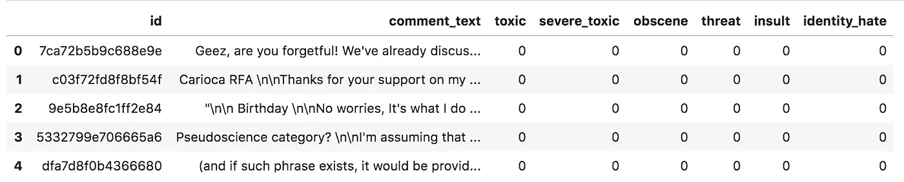

数据集中的前几个样本

让我们展示第一条评论——别担心，这不是毒性威胁:)

```
df**.**comment_text[0]
```

> 天啊，你是不是健忘！我们已经讨论过为什么马克思不是无政府主义者，也就是说，他想用一个国家来塑造他的“社会主义者”因此，他是一个国家主义者——与无政府主义者相反。我认识一个人，他说，当他老了，牙齿掉光了，他就不吃肉了。你会说他是素食主义者吗？

例如，id 为 103 的评论被标记为**有毒、严重 _ 有毒、淫秽、侮辱**(评论 _ 文本被有意隐藏)。该模型应该能够像这样标记评论。

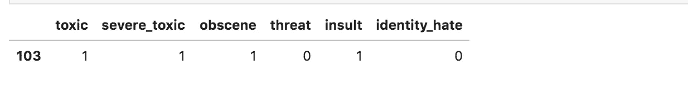

数据集中第 103 个样本的目标

## 定义数据集


照片由[米卡·鲍梅斯特](https://unsplash.com/@mbaumi?utm_source=medium&utm_medium=referral)在 [Unsplash](https://unsplash.com?utm_source=medium&utm_medium=referral) 上拍摄

当我们在 CPU 上训练神经网络(NN)时，我们将训练集的大小限制为 10.000 条评论。

验证集(1.000 注释)用于测量训练期间模型的准确性，测试集(2.000 注释)用于测量模型训练后的准确性。

让我们加载 BERT 模型、Bert Tokenizer 和 bert-base-uncased 预训练权重。

我们将每个评论转换成 2D 矩阵。矩阵有一个预定义的大小，但是有些注释比其他注释有更多的单词。要将注释转换为矩阵，我们需要:

*   将评论的长度限制在 100 字以内(100 是任意数字)，
*   用少于 100 个单词填充注释(在末尾添加 0 个向量)。

BERT 不像一些上下文无关的预训练语言模型(Word2Vec、FastText 或 GloVe)那样，简单地将每个单词映射到一个嵌入。为了计算上下文，我们需要将注释输入到 BERT 模型。

在下面的代码中，我们将注释标记化、填充并转换为 PyTorch 张量。然后，我们使用 BERT 将文本转换为嵌入。这个过程需要一些时间，所以要有耐心。

这是第一个用 BERT 转换成单词嵌入的评论。它有一个`[100 x 768]`形状。

```
x_train[0]
```

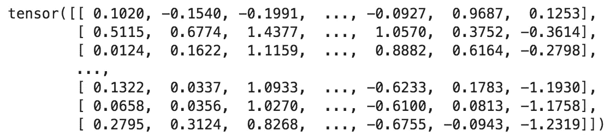

第一个评论没有毒性，只有 0 值。

```
y_train[0]
```

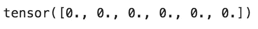

## 用 PyTorch 训练模型


马库斯·温克勒在 [Unsplash](https://unsplash.com?utm_source=medium&utm_medium=referral) 上的照片

下面的代码用 PyTorch 库定义了 KimCCN。

让我们设置模型的参数:

*   **embed_num** 表示评论中的最大字数(本例中为 100)。
*   **embed_dim** 表示 BERT 嵌入的大小(768)。
*   **class_num** 是要预测的毒性威胁的数量(6)。
*   **kernel_num** 是每个卷积运算的滤波器数量(例如，`[2 x m]`卷积的 3 个滤波器)。
*   **卷积的内核大小**。看两个单词、三个单词等的组合。
*   **dropout** 是训练阶段每次更新时随机设置隐藏单元为 0 的百分比。**提示:确保在测试/验证阶段禁用丢失，以获得确定性输出。**
*   **静态**参数 True 表示我们不计算嵌入的梯度，它们保持静态。如果我们将其设置为 False，将会增加模型需要学习的参数数量，并且可能会过拟合。

```
embed_num **=** x_train**.**shape[1]
embed_dim **=** x_train**.**shape[2]
class_num **=** y_train**.**shape[1]
kernel_num **=** 3
kernel_sizes **=** [2, 3, 4]
dropout **=** 0.5
static **=** Truemodel **=** KimCNN(
    embed_num**=**embed_num,
    embed_dim**=**embed_dim,
    class_num**=**class_num,
    kernel_num**=**kernel_num,
    kernel_sizes**=**kernel_sizes,
    dropout**=**dropout,
    static**=**static,
)
```

我们将模型训练 10 个时期，批大小设置为 10，学习率设置为 0.001。我们使用带有 BCE 损失函数(二进制交叉熵)的 Adam 优化器。二元交叉熵损失允许我们的模型为标签分配独立的概率，这对于多标签分类问题是必要的。

```
n_epochs **=** 10
batch_size **=** 10
lr **=** 0.001
optimizer **=** torch**.**optim**.**Adam(model**.**parameters(), lr**=**lr)
loss_fn **=** nn**.**BCELoss()
```

下面的代码为训练生成批量数据。

让我们训练模型。

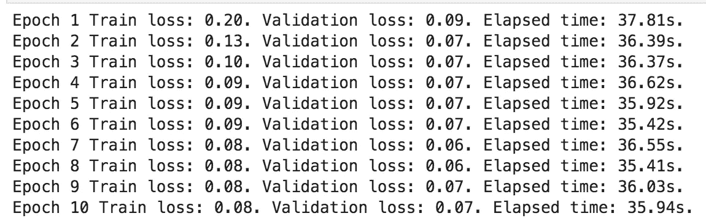

在多个时期训练模型

在下图中，我们可以观察到训练和验证损失在 10 个时期后收敛。

```
plt**.**plot(train_losses, label**=**"Training loss")
plt**.**plot(val_losses, label**=**"Validation loss")
plt**.**legend()
plt**.**title("Losses")
```

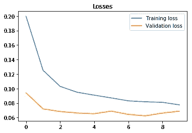

培训和验证损失

## 测试模型


JESHOOTS.COM 在 [Unsplash](https://unsplash.com?utm_source=medium&utm_medium=referral) 上[的照片](https://unsplash.com/@jeshoots?utm_source=medium&utm_medium=referral)

模型被训练。我们使用测试集上的受试者操作特征曲线下面积(ROC AUC)来评估模型性能。scikit-learn 的 AUC 实现支持二进制和多标记指标格式。

让我们使用模型来预测测试集的标签。

```
model**.**eval() *# disable dropout for deterministic output***with** torch**.**no_grad(): *# deactivate autograd engine to reduce memory usage and speed up computations*
    y_preds **=** []
    batch **=** 0
    **for** x_batch, y_batch, batch **in** generate_batch_data(x_test, y_test, batch_size):
        y_pred **=** model(x_batch)
        y_preds**.**extend(y_pred**.**cpu()**.**numpy()**.**tolist())
    y_preds_np **=** np**.**array(y_preds)
```

对于每个评论，该模型输出 0 到 1 之间 6 个值(每个毒性威胁一个)。我们可以使用 0.5 作为阈值，将所有大于 0.5 的值转换为毒性威胁，但让我们先计算 AUC。

```
y_preds_np
```

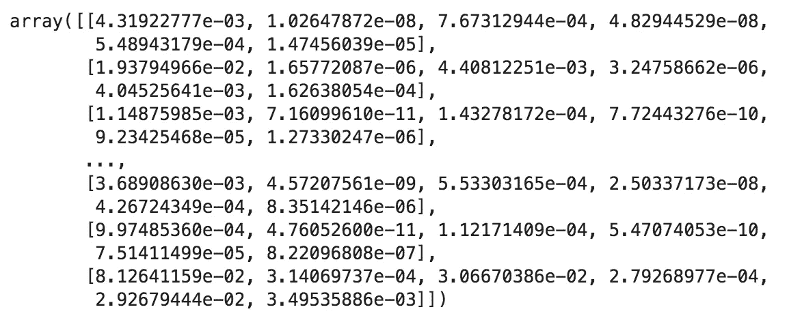

我们为测试集提取毒性威胁的真实标签。真正的标签是二进制值。

```
y_test_np **=** df_test[target_columns]**.**valuesy_test_np[1000:]
```

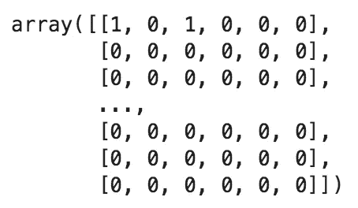

一个模型的 AUC 等于该模型将随机选择的正面例子排序高于随机选择的负面例子的概率。AUC 越高越好(虽然没那么简单，我们下面会看到)。当 AUC 接近 0.5 时，意味着该模型无论如何都没有标记分离能力。当 AUC 接近 0 时，这意味着我们需要反演预测，它应该工作得很好:)

让我们计算每个标签的 AUC。

```
auc_scores **=** roc_auc_score(y_test_np, y_preds_np, average**=**None)
df_accuracy **=** pd**.**DataFrame({"label": target_columns, "auc": auc_scores})
df_accuracy**.**sort_values('auc')[::**-**1]
```

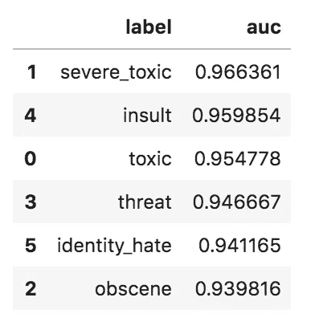

在上表中，我们可以观察到该模型对每个标签都实现了高 AUC。**注意，在处理不平衡数据集时，AUC 可能是一个误导性的指标。**

## 数据集不平衡吗？


照片由[阿齐兹·阿查基](https://unsplash.com/@acharki95?utm_source=medium&utm_medium=referral)在 [Unsplash](https://unsplash.com?utm_source=medium&utm_medium=referral) 上拍摄

当 50%的标签属于每个类时，我们说数据集是平衡的。当这个比率接近 90%到 10%时，数据集是不平衡的。在不平衡数据集上训练的模型的已知问题是它们报告的精确度很高。如果模型预测值总是 0，那么它可以达到 90%的准确率。

让我们检查一下是否有不平衡的数据集。

```
positive_labels **=** df_train[target_columns]**.**sum()**.**sum()
positive_labels# Output:
2201all_labels **=** df_train[target_columns]**.**count()**.**sum()
all_labels# Output:
60000positive_labels**/**all_labels# Output:
0.03668333333333333
```

60000 个标签中只有 2201 个是阳性的。数据集是不平衡的，所以上面报道的准确性不应该太认真。

## 健全性检查


照片由 [Antoine Dautry](https://unsplash.com/@antoine1003?utm_source=medium&utm_medium=referral) 在 [Unsplash](https://unsplash.com?utm_source=medium&utm_medium=referral) 拍摄

让我们做一个健全性检查，看看模型是否预测所有评论为 0 毒性威胁。

```
df_test_targets **=** df_test[target_columns]
df_pred_targets **=** pd**.**DataFrame(y_preds_np**.**round(), columns**=**target_columns, dtype**=**int)
df_sanity **=** df_test_targets**.**join(df_pred_targets, how**=**'inner', rsuffix**=**'_pred')
```

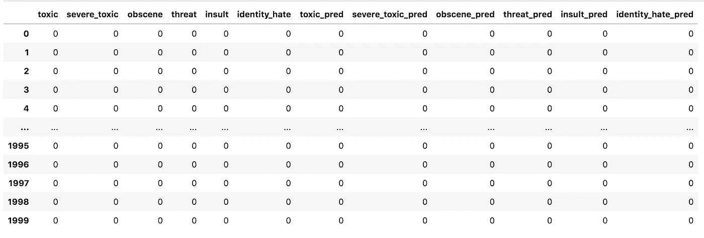

```
df_test_targets**.**sum()
```

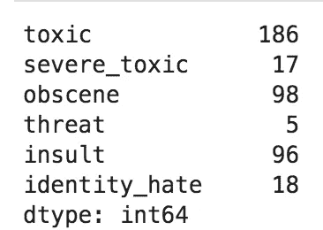

```
df_pred_targets**.**sum()
```

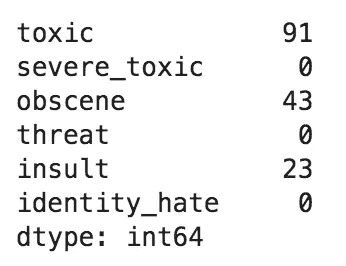

我们可以观察到，该模型预测了 3 种毒性威胁:有毒、淫秽和侮辱，但它从未预测到严重毒性、威胁和认同仇恨。这似乎并不伟大，但至少它没有把所有的评论都标上零。

```
df_sanity[df_sanity**.**toxic **>** 0][['toxic', 'toxic_pred']]
```

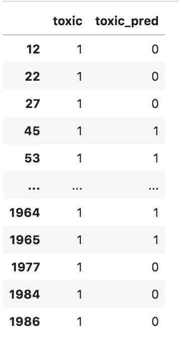

我们看到这个模型正确地预测了一些有毒的评论。

# 结论


照片由[Dawid za wia](https://unsplash.com/@davealmine?utm_source=medium&utm_medium=referral)在 [Unsplash](https://unsplash.com?utm_source=medium&utm_medium=referral) 上拍摄

我们用 BERT 嵌入训练了一个 CNN 来识别仇恨言论。我们使用相对较小的数据集来加快计算速度。代替 BERT，我们可以使用 Word2Vec，这将加速从单词到嵌入的转换。我们没有花时间优化模型，因为这不是这篇文章的目的。所以报道的准确性不应该太认真。更重要的是概述了不平衡数据集、AUC 和漏失层的缺陷。

我们可以用 TD-IDF 和逻辑回归来代替像 BERT 这样的新工具。你想读一篇关于它的文章吗？请在下面的评论中告诉我。

要在你的机器上运行代码，下载这个 [Jupyter 笔记本](https://romanorac.github.io/assets/notebooks/2019-12-02-identifying-hate-speech-with-bert-and-cnn.ipynb)。

# 在你走之前

```
- [50% Off All AI Nanodegree Programs!](https://imp.i115008.net/c/2402645/998478/11298) [Course]- [Data Science for Business Leaders](https://imp.i115008.net/c/2402645/880006/11298) [Course]- [Free skill tests for Data Scientists & Machine Learning Engineers](https://aigents.co/skills)- [Labeling and Data Engineering for Conversational AI and Analytics](https://www.humanfirst.ai/)
```

*上面的一些链接是附属链接，如果你通过它们进行购买，我会赚取佣金。请记住，我链接课程是因为它们的质量，而不是因为我从你的购买中获得的佣金。*

在[推特](https://twitter.com/romanorac)上关注我，在那里我定期[发关于数据科学和机器学习的](https://twitter.com/romanorac/status/1328952374447267843)推特。


# 参考

[1]尹金，卷积神经网络用于句子分类(2014)，[https://arxiv.org/pdf/1408.5882.pdf](https://arxiv.org/pdf/1408.5882.pdf)

[2]https://arxiv.org/pdf/1510.03820.pdf[【卷积神经网络用于句子分类的敏感性分析(及从业者指南)】张烨(2016)](https://arxiv.org/pdf/1510.03820.pdf)

[3] Jacob Devlin，BERT:面向语言理解的深度双向转换器预训练(2018)[https://arxiv.org/abs/1810.04805](https://arxiv.org/abs/1810.04805)