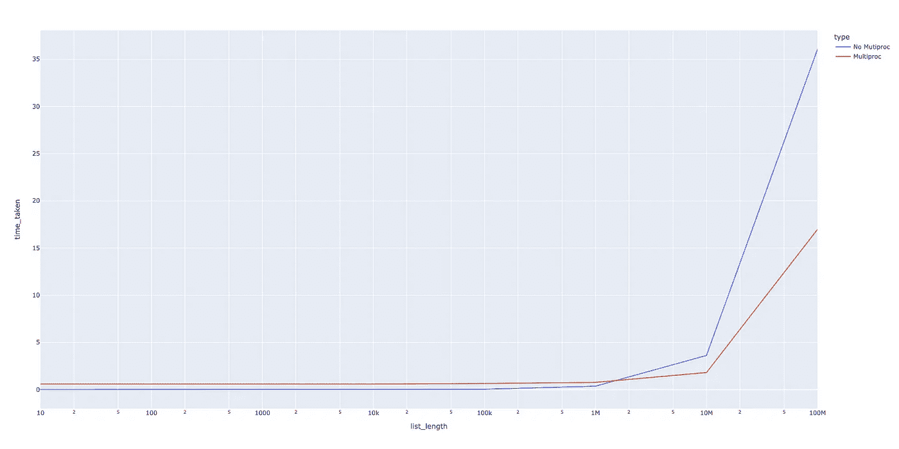
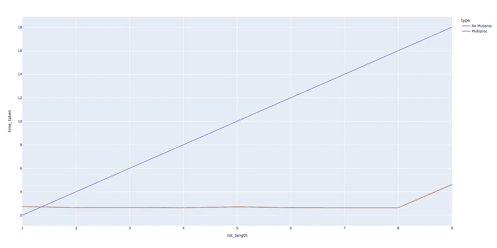
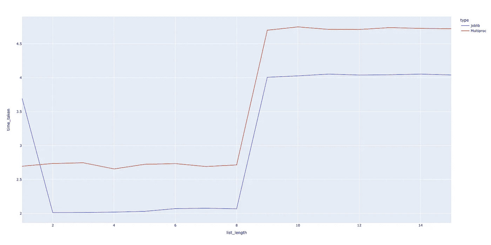

# 数据科学家如何使用并行处理？

> 原文：<https://towardsdatascience.com/how-can-data-scientists-use-parallel-processing-17194fffc6d0?source=collection_archive---------13----------------------->


由[马克-奥利维尔·乔多因](https://unsplash.com/@marcojodoin?utm_source=medium&utm_medium=referral)在 [Unsplash](https://unsplash.com?utm_source=medium&utm_medium=referral) 上拍摄的照片

## 使用多重处理和 Joblib 的 Python 并行处理

终于，我的程序运行了！我应该去买杯咖啡吗？

我们数据科学家有强大的笔记本电脑。采用四核或八核处理器和睿频加速技术的笔记本电脑。我们通常使用具有更多内核和计算能力的服务器。但是我们真的使用了我们手头的原始力量吗？

我们没有充分利用我们的资源，而是常常无所事事，等待耗时的过程结束。有时我们会等上几个小时，即使紧急的交付项目已经快到截止日期了。我们能做得更好吗？

在这篇文章中，我将解释如何使用多重处理和 Joblib 来使你的代码并行，并从你的大机器中获得一些额外的工作。

# 1.使用单参数功能的多重处理:

为了激发多重处理，我将从一个问题开始，我们有一个大的列表，我们希望对列表中的每个元素应用一个函数。

我们为什么要这么做？这可能看起来是一个微不足道的问题，但这尤其是我们在数据科学中每天都在做的事情。例如:我们有一个模型，我们用不同的超参数运行模型的多次迭代。或者，我们在一个大的数据帧中创建新的特征，并使用`apply` 关键字对数据帧逐行应用函数。到本文结束时，您将能够使用这个简单的结构并行化您在数据科学中面临的大多数用例。

所以，回到我们的玩具问题，假设我们想对列表中的所有元素应用 square 函数。

```
def square(num):
    return x**2
```

当然，我们可以使用简单的 python 在列表的所有元素上运行上述函数。

```
result = [f(x) for x in list(range(100000))]
```

但是，上面的代码是按顺序运行的。下面是我们如何使用多重处理将这个函数应用到一个给定列表`list(range(100000))`的所有元素，使用我们强大的计算机中的 8 个内核并行执行。

```
from multiprocessing import Pool
pool = Pool(8)
result = pool.map(f,list(range(100000)))
pool.close()
```

上面的代码行创建了一个包含 8 个工作线程的多处理池，我们可以使用这个包含 8 个工作线程的池来将我们需要的函数映射到这个列表。

让我们来看看这段代码是如何执行的:

```
Size of List:10
Without multiprocessing we ran the function in 0.0000 seconds
With multiprocessing we ran the function in 0.5960 seconds
Size of List:100
Without multiprocessing we ran the function in 0.0001 seconds
With multiprocessing we ran the function in 0.6028 seconds
Size of List:1000
Without multiprocessing we ran the function in 0.0006 seconds
With multiprocessing we ran the function in 0.6052 seconds
Size of List:10000
Without multiprocessing we ran the function in 0.0046 seconds
With multiprocessing we ran the function in 0.5956 seconds
Size of List:100000
Without multiprocessing we ran the function in 0.0389 seconds
With multiprocessing we ran the function in 0.6486 seconds
Size of List:1000000
Without multiprocessing we ran the function in 0.3654 seconds
With multiprocessing we ran the function in 0.7684 seconds
Size of List:10000000
Without multiprocessing we ran the function in 3.6297 seconds
With multiprocessing we ran the function in 1.8084 seconds
Size of List:100000000
Without multiprocessing we ran the function in 36.0620 seconds
With multiprocessing we ran the function in 16.9765 seconds
```



作者图片

正如我们所看到的，当列表长度达到一定程度时，多重处理的运行时间会有所增加，但不会像非多重处理函数在列表长度较大时运行时间增加的那样快。这告诉我们，使用多重处理有一定的开销，对于耗时很短的计算没有太大意义。

实际上，我们不会对几毫秒内完成的函数使用多重处理，而是对可能需要几秒甚至几小时的大得多的计算使用多重处理。因此，让我们尝试一个更复杂的计算，这将花费超过 2 秒钟。我在这里使用`time.sleep`作为计算的代理。

```
Size of List:1
Without multiprocessing we ran the function in 2.0012 seconds
With multiprocessing we ran the function in 2.7370 seconds
Size of List:2
Without multiprocessing we ran the function in 4.0039 seconds
With multiprocessing we ran the function in 2.6518 seconds
Size of List:3
Without multiprocessing we ran the function in 6.0074 seconds
With multiprocessing we ran the function in 2.6580 seconds
Size of List:4
Without multiprocessing we ran the function in 8.0127 seconds
With multiprocessing we ran the function in 2.6421 seconds
Size of List:5
Without multiprocessing we ran the function in 10.0173 seconds
With multiprocessing we ran the function in 2.7109 seconds
Size of List:6
Without multiprocessing we ran the function in 12.0039 seconds
With multiprocessing we ran the function in 2.6438 seconds
Size of List:7
Without multiprocessing we ran the function in 14.0240 seconds
With multiprocessing we ran the function in 2.6375 seconds
Size of List:8
Without multiprocessing we ran the function in 16.0216 seconds
With multiprocessing we ran the function in 2.6376 seconds
Size of List:9
Without multiprocessing we ran the function in 18.0183 seconds
With multiprocessing we ran the function in 4.6141 seconds
```



作者图片

如您所见，这种情况下的差异更加明显，与使用多重处理相比，不使用多重处理的函数会花费更多的时间。同样，这非常有意义，因为当我们启动多重处理 8 时，工作人员开始并行处理任务，而当我们不使用多重处理时，任务以顺序方式发生，每个任务花费 2 秒钟。

# 2.多参数函数的多重处理:

对上述代码的一个扩展是，当我们必须运行一个带有多个参数的函数时。对于一个用例，假设您必须使用多个超参数来优化一个特定的模型。您可以这样做:

```
import random
def model_runner(n_estimators, max_depth):
    # Some code that runs and fits our model here using the   
    # hyperparams in the argument.
    # Proxy for this code with sleep.
    time.sleep(random.choice([1,2,3])
    # Return some model evaluation score
    return random.choice([1,2,3])
```

你如何运行这样一个函数？有两种方法可以做到这一点。

**a)使用 Pool.map 和* magic**

```
def multi_run_wrapper(args):
   return model_runner(*args)pool = Pool(4)
hyperparams = [[100,4],[150,5],[200,6],[300,4]]results = pool.map(multi_run_wrapper,hyperparams)
pool.close()
```

在上面的代码中，我们使用

**b)使用 pool.starmap**

从 Python3.3 开始，我们可以使用`starmap`方法更容易地实现我们上面所做的事情。

```
pool = Pool(4)
hyperparams = [[100,4],[150,5],[200,6],[300,4]]results = pool.starmap(model_runner,hyperparams)
pool.close()
```

# 3.将 Joblib 与单参数函数一起使用:

Joblib 是另一个库，它提供了一个简单的助手类来为使用多重处理的循环编写令人尴尬的并行程序，我发现它比多重处理模块更容易使用。运行并行流程就像用`Parallel`和`delayed`关键字写一行一样简单:

```
from joblib import Parallel, delayed
import timedef f(x):
    time.sleep(2)
    return x**2results = **Parallel**(n_jobs=8)(**delayed**(f)(i) for i in range(10))
```

让我们使用之前使用的同一个函数来比较 Joblib 并行和多处理模块。



作者图片

我们可以看到运行时非常相似，joblib 代码看起来比多处理代码简洁得多。

# 4.将 Joblib 与多参数函数一起使用:

为一个函数使用多个参数就像使用 Joblib 传递参数一样简单。这里有一个你可以使用的最小的例子。

```
from joblib import Parallel, delayed
import timedef f(x,y):
    time.sleep(2)
    return x**2 + y**2params = [[x,x] for x in range(10)]
results = Parallel(n_jobs=8)(delayed(f)(x,y) for x,y in params)
```

# 结论

多处理是一个很好的概念，每个数据科学家至少应该了解它。它不会解决你所有的问题，你仍然应该致力于优化你的功能。但是拥有它可以节省你等待代码完成的大量时间。

## 继续学习

如果你想了解更多关于 [Python](https://amzn.to/2XPSiiG) 3 的知识，我想从密歇根大学调出一门关于学习[中级 Python](https://bit.ly/2XshreA) 的优秀课程。一定要去看看。

将来我也会写更多初学者友好的帖子。在<http://mlwhiz.medium.com>**关注我或者订阅我的 [**博客**](https://mlwhiz.ck.page/a9b8bda70c) 了解他们。一如既往，我欢迎反馈和建设性的批评，可以通过 Twitter [@mlwhiz](https://twitter.com/MLWhiz) 联系。**

**此外，一个小小的免责声明——这篇文章中可能会有一些相关资源的附属链接，因为分享知识从来都不是一个坏主意。**

**这个故事最初发表在[内置](https://builtin.com/data-science/parallel-processing-data-science)上。**