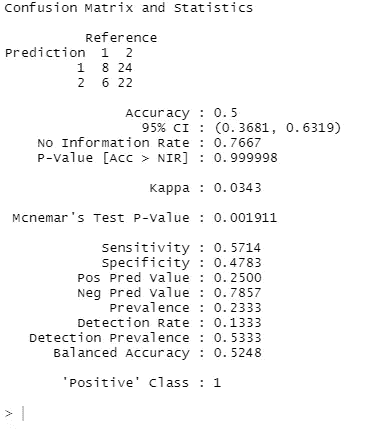
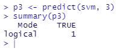

# 5 个步骤:建立一个帮助小企业成长的 SVM 模式

> 原文：<https://towardsdatascience.com/how-can-support-vector-machines-help-grow-a-small-business-8e71561616ea?source=collection_archive---------21----------------------->


斯维特拉娜·古梅罗娃在 [Unsplash](https://unsplash.com?utm_source=medium&utm_medium=referral) 上的照片

[*Github 为此项目。*](https://github.com/sameehaafr/occ-svm)

我们经常在数据科学和机器学习等领域听到“大数据”这个术语，尽管这个术语很常见，并且应用于我们的社会，但数据科学方法也可以在“小数据”方面发挥重要作用。那么，我们在哪里可以看到小数据呢？通常，它是在供应商和小型企业的场景中处理的。与公司或常规规模的企业相比，小型企业的客户和交易数量较少，这使得跟踪和分析客户数据以及了解客户行为变得更加容易。

在 5 个步骤中，我将介绍我创建的一个小型企业场景，以深入了解如何使用数据科学来发现客户行为的趋势，从而帮助企业发展。在我继续这个场景之前，我们应该知道什么是一类分类和支持向量机。

*   **一类分类:**使用正常数据创建和训练分类器模型，以在加入新数据时预测异常值
*   **支持向量机:**假设我们绘制二维数据，我们可以用一条线将这些数据分成两类。支持向量是该线附近的点，这些点设置了适当的边界，有助于将新点分类为离群点/内点。


作者图片

## 方案

我拥有一家花店，我希望人们买更多的向日葵，因为我有很多。所以，我想降低它的成本，但我不想降低太多，我可能会失去潜在的金钱；我希望降价幅度恰到好处，这样可以优化客户数量和我卖向日葵的收入。

## 步骤 1:收集/创建您的数据。

要在你销售的产品和客户反应/行为之间找到洞察力和趋势，第一步你需要数据。如果您想使用 SVM 进行一类分类，请创建随机数据。如果你想在现实生活中应用它，下载你当前的数据到一个. csv 文件中。

回到我的场景:假设我已经在很长一段时间内以不同的价格出售了向日葵，并且我将所有的数据合并成一个数据集。我的自变量(向日葵降价)将是我的向日葵降价的 200 个对象。我的因变量(客户响应)将是 200 个客户响应对象(1 =客户购买了向日葵，2 =客户没有购买向日葵)。

在现实中，小企业主不会知道客户何时会/不会购买产品的确切价格下限，但为了使该数据不完全随机，我设置了它，以便如果向日葵的降价≥ $3，客户会购买向日葵，否则，他们不会。下面是我的数据集的一部分。


作者图片

## 步骤 2:训练和测试集。

为了创建我们的基本 SVM 模型，我们需要将整个数据集分成两部分。训练数据集应该大于测试数据集。我们将使用测试数据集来看看我们的模型在最后有多准确。

对于我的场景，我的原始数据集的 70%用于训练，其余用于测试。我在 r 中使用了 sample.split()函数。

```
#df is my dataframe containing my 2 variables (lowered sunflower prices and customer response)split = sample.split(df$response, SplitRatio = 0.7)
train = subset(df, split == TRUE)
test = subset(df, split == FALSE)
```

## 第三步:创建支持向量机(SVM)模型。

为了建立我们的 SVM 模型，我们需要通过分别输入我们的独立(降低的价格)和非独立(响应)变量*作为数据集来训练模型，这样函数就知道要训练哪两个变量。*

为此，我将我的训练数据集分成 2 个变量，并将它们转化为因子(R 中的 svm()函数只接受因子)。

```
train_x <- train[-2]      #take out the column with response
train_y <- train[2]       #only the response column#turn into factors (below)train_y$response <- as.factor(train_y$response)
train_x$sunflower <- as.factor(train_x$sunflower)
```

现在，我们简单地将我们的训练变量放入 svm()函数，它将告诉我们在模型和参数信息中有多少个支持向量。

```
svm <- svm(data=train, train_x, train_y, type='one-classification', nu=0.10, scale=FALSE)summary(svm)
```


作者图片

理解 gamma、nu 和 kernel 值有点复杂，在实现最基本的 SVM 模型时没有必要。这些值可以帮助您在以后使 SVM 模型更加准确。

## 第四步:预测。

随着我们的 SVM 模型全部建立，我们现在可以通过输入训练数据集来测试我们的 SVM 模型有多强。

如果我输入我的训练数据集，R 中的 predict()函数将预测客户对数据集中给出的每一个较低价格的反应。我们应该只包括自变量(降低的价格)作为输入，这样 SVM 模型可以预测客户的反应。在此之后，我们将使用混淆矩阵来比较预测的客户响应和实际的客户响应，以了解我们的模型结果有多准确。

```
p <- predict(svm, test_x)      #predicting test responses using the test independent variables (x)summary(p)
```


作者图片

上图中，TRUE 表示预测客户*不会*购买向日葵，FALSE 表示预测客户*会*购买向日葵。

## 第五步:混淆矩阵。让我们看看我们的 SVM 模型有多强！

这一步相当简单。我们需要将模型在上一步中做出的预测编译成数据集，并将预测和实际响应都转换成因子。我们还必须使响应类型相同，这样混淆矩阵就可以区分真/假和“1”/“2”，因为它们是不同的输出。

```
p <- as.data.frame(p)test_y$response <- as.factor(test_y$response)
p$p <- as.factor(p$p)levels(p$p) <- list("1"="FALSE", "2"="TRUE")  #levels have to match the test data levelsconfusionMatrix(test_y$response, p$p)
```



作者图片

以上是我的混淆矩阵的结果，我的 SVM 模型的准确率约为 50%。这意味着我的 SVM 模型在 50%的时间里预测了正确的客户反应。即使看起来不多，许多小企业在开始时也会有较低的准确率。随着时间的推移，企业将为每种产品收集越来越多的数据，该模型将在预测客户反应方面变得更好。

此外，如果我将向日葵的价格降低了 3 美元，并想知道客户是否会购买我的向日葵，我可以使用 SVM 模型来*预测单个值*，这在我没有训练集的情况下会很有帮助。

```
p3 <- predict(svm, 3)
summary(p3)
```



作者图片

## 设想

我使用 ggplot 来可视化我的数据，但只要您可以选择显示客户反应的差异，任何东西都可以。

```
ggplot(df2, aes(x=X, y=sunflower, color=response)) + geom_point(size=5) + theme_ipsum()
```


作者图片

正如你从上面的图像中看到的，购买向日葵的顾客和没有购买向日葵的顾客之间有明显的差异(3 美元)。如果我把价格降到 3 美元以下，顾客就不会买向日葵，反之亦然。在现实中，这种分裂不会如此明显，但会有一定的模式，你可以用一种常见的方式找到它，如回归线。

## 结论

通过我简短的花店场景，我们学习了如何使用支持向量机(SVM)实现一类分类(OCC ),并创建了一个模型，该模型可以根据我降低向日葵价格的程度来预测客户的反应。任何有产品和客户的小企业场景都适用于这种模型，并且可以揭示关于客户行为的有价值的信息。这种 SVM 模型可以指出所有者需要关注的地方，以及他们需要营销什么来优化他们的业务。

*感谢您的阅读！*